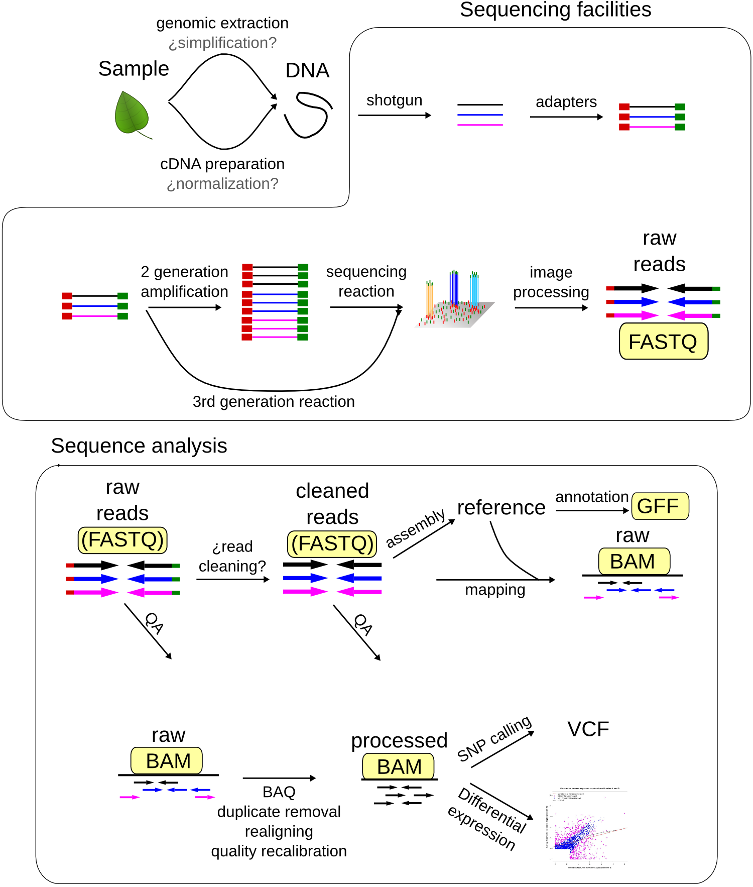

..  _04_DataFilesAndScripts:

Datafiles and Scripting
=========================

Each step of processing and analysis of a genomics pipeline spawns many
new files, of many types. Some filetypes, like GFF are only found in a
single step of the pipeline, and so are relatively easy to keep track
of. However, most are more like FASTQ files, where any given file could
be from many different steps of the pipeline. These are the ones that
cause the most trouble, and need the most careful management.

   FileTypes

First, lets see what data files we have available:

.. code:: bash

    ls

``ls`` stands for list, and if you call it all by itself, it just
returns a list of whatever is inside the folder you're currently looking
at. You should give you a fairly big list of files in alphabetical
order. However, they're hard to understand like this, so lets ask ``ls``
to make the list a little easier to read:

.. code:: bash

    ls -lah

Here we've added modifiers to ls. Computer people usually call these
modifiers 'flags' or 'arguments', and here we've added 3 flags: ``-l``
directs ``ls`` to give us the results in 'long format' so we get more
information ``-a`` tells ``ls`` to show us 'all' of the things in the
folder, even if they're usually hidden ``-h`` makes the output 'human
readable', so you see file sizes in kb or gb instead of bytes

SAM and BAM
^^^^^^^^^^^

SAM files are tab-delimited files that describe how reads align to a
sequence. They generally start with header lines (which always start
with ``@``) before the actual alignments.

BAM files hold all the same information, but in binary format, which
makes them *much* faster for computers to use, but impossible for us to
read. Lets check:

.. code:: bash

    head 12724.bam
    head 12724.sam

The ``.bam`` file just looks like nonsense, but the ``.sam`` file looks
sort of like we expected, except its all headers. So lets look at more
of the SAM file:

.. code:: bash

    head -20 12724.sam

...hmm

.. code:: bash

    head -100 12724.sam

...that's a lot of headers. Rather than try to guess how far the header
goes, lets just look at the other end of the file:

.. code:: bash

    tail -20 12724.sam

``tail`` works just like ``head``, except it counts up from the end of
the file instead of down from the top. So now we can see an example of
the alignment part of the file.The alignments all have at least 11
standard columns (although the values might be zero), but can have lots
of extra ones as well. These are the 11 required columns:

+-------+---------+----------+-----------------------------------------+
| Col   | Field   | Type     | Brief description                       |
+=======+=========+==========+=========================================+
| 1     | QNAME   | String   | Query template NAME                     |
+-------+---------+----------+-----------------------------------------+
| 2     | FLAG    | Int      | bitwise FLAG                            |
+-------+---------+----------+-----------------------------------------+
| 3     | RNAME   | String   | Reference sequence NAME                 |
+-------+---------+----------+-----------------------------------------+
| 4     | POS     | Int      | 1-based leftmost mapping POSition       |
+-------+---------+----------+-----------------------------------------+
| 5     | MAPQ    | Int      | MAPping Quality                         |
+-------+---------+----------+-----------------------------------------+
| 6     | CIGAR   | String   | CIGAR string                            |
+-------+---------+----------+-----------------------------------------+
| 7     | RNEXT   | String   | Ref. name of the mate/next read         |
+-------+---------+----------+-----------------------------------------+
| 8     | PNEXT   | Int      | Position of the mate/next read          |
+-------+---------+----------+-----------------------------------------+
| 9     | TLEN    | Int      | observed Template LENgth                |
+-------+---------+----------+-----------------------------------------+
| 10    | SEQ     | String   | segment SEQuence                        |
+-------+---------+----------+-----------------------------------------+
| 11    | QUAL    | String   | ASCII of Phred-scaled base QUALity+33   |
+-------+---------+----------+-----------------------------------------+

Because SAM files are tab-delimited, they are easy for both people and
computers to read, (just not as quickly as BAM files). For instance, we
can use the program ``cut`` to get the flags from a SAM file:

.. code:: bash

    cut -f 2 12724.sam

``-f`` which 'field' do you want? That was *way* too much stuff to look
at. So lets make our first script! All we're going to do it take the
output from ``tail`` and send it into ``cut`` using a program called
'pipe':

.. code:: bash

    tail -20 12724.sam | cut -f 2 

Now we have just the flags from the last 20 lines. Instead lets get the
flags from the last 20 lines *and* their sequences:

.. code:: bash

    tail -20 12724.sam | cut -f 2,10 

    Exercise 1: Get all of the integer type data from the last 30 lines

    Exercise 2: Get the quality scores from the penultimate 10 lines

FASTA
^^^^^

You're likely already familiar with FASTA files, as this is the most
common way to distribute sequence information. Let's look at one:

.. code:: bash

    head Raphanus.fa

``head`` is another program, and it shows you just the top few lines of
a file. By default, it shows ten, (so five sequences) but we can also
change that behavior with flags:

.. code:: bash

    head -4 Raphanus.fa

Now, you should see the first four lines of the Raphanus.fa file.

	Exercise Try looking at EV813540.fa

FASTA files always have at least one comment line, which almost always
begins with ">", but can start with ";". A given sequence in the file is
allowed to have multiple comment lines, but they usually don't. Extra
comment lines for sequences can break some downstream processes.

After the comment line is the sequence. Usually this is all on one line,
but you can see that this one is formatted so that each sequence line is
only 80 characters wide. This makes it easy to read, but makes it
slightly more difficult to search within the file. For searching, its
nice to have files where all of each sequence is on a single line. For
instance, lets see whether there are any EcoRI sites are in the
Raphanus.fa file:

.. code:: bash

    grep "GAATTC" Raphanus.fa

grep is a program that searches for any string, and by default returns
the entire line that your string is found in. For a file this big, this
isn't very helpful. So lets modify how grep reports it's findings:

.. code:: bash

    grep -B 1 "GAATTC" Raphanus.fa

``-B number`` grep will return the line with your string plus 'number'
lines of 'before context', so here we'll get one previous line...the
comment that tells us the sequence name

Now we know which of the sequences have the restriction site we're
looking for, but there's so many they've overfilled the screen. So lets
redirect the output from the screen into a file:

.. code:: bash

    grep -B 1 "GAATTC" Raphanus.fa > Raphanus_EcoRI.fa

The greater than sign takes everything that happens on this side of it
``>`` and dumps it into the place designated here. So, all of the output
from that ``grep`` command above got saved into a new file called
Raphanus\_EcoRI.fa Since we didn't specify a place to save it, the new
file is just saved in the same folder we're in, and we can see it by
using ``ls`` again:

.. code:: bash

    ls -latr

``-r`` makes the list print to our screen in reverse chronological
order, so the newest files are on the bottom. This makes it easier to
find what we're looking for.

``grep``, ``ls`` and ``head`` all have lots of useful flags, and we can find out what they
are by looking at the manual page:

.. code:: bash
	man grep

This opens the manual in the text viewer ``less``, which we'll talk about more in a few
minutes. For now, the important things to know are that you can scroll line by line
using the arrow keys, or go down one page at a time using the space bar. You can search 
for a keyword by typing ``/`` and text to search for. Let's look at the explanation for 
a flag we already used:

.. code:: bash
	/-B

I actually prefer to look at man pages online, because searching them is easier. 
Try `Googling 'man grep' <http://www.google.com/search?q=man%20grep>`_

	Exercise: How would you change ``grep -B 1 "GAATTC" Raphanus.fa > Raphanus_EcoRI.fa`` 
to add line numbers to the output? Hint: [#]_.

So, now we can make a file that only has sequences with our cut site. Depending on what 
and why you're searching, this might be useful for making markers or primers. But maybe 
we just want to know how many sequences had our cut site:

.. code:: bash

    grep -c "GAATTC" Raphanus.fa

``-c`` grep 'counted' 88 instances of EcoRI

Grep happens to have a built in flag for counting matches, but many other programs don't. 
So there is a separate program just for counting that we could use by invoking a 'pipe':

.. code:: bash

	grep "GAATTC" Raphanus.fa | wc

``wc`` stands for word count, and actually gives us three numbers: number of lines, number
of words and number of characters, in that order. The first two are both 88 because there
are no spaces between the letters of the sequences, so each sequence is interpreted as one
big word.

If we only want one of those numbers, we can use the flags ``-l``, ``-w``, and ``-c`` 
respectively. 

A 'pipe' is a little like holding up a real-world pipe, everything you dump in the top 
comes out the bottom. Here, the answer from ``grep "GAATTC" Raphanus.fa`` goes in and 
becomes input for ``wc``. Notice that we only told the computer which file to use for 
``grep``, each pipe after that (there can be an as many as you want) gets its input from
the previous programs output. Also notice that we got rid of all of the grep flags. Why?

	Exercise: How would you get *just* the *names* of the sequences that match our 
	restriction site? Hint [#]_. And save that list to a file?

What if we want to do a 'fuzzy' search? Say we want to search for `AccI <https://www.neb.com/products/r0161-acci>
which has a recognition sequence of ``GTMKAC`` which means ``GT`` then either an ``A`` 
or a ``C`` then a ``G`` or a ``T``, then ``AC``

Naively, we could search for this cut site by doing a series of greps:

.. code:: bash

	grep "GTAGAC" Raphanus.fa > Raphanus_AccI.fa
	grep "GTCGAC" Raphanus.fa > Raphanus_AccI.fa
	grep "GTATAC" Raphanus.fa > Raphanus_AccI.fa
	grep "GTCTAC" Raphanus.fa > Raphanus_AccI.fa

This has two problems. First, your Raphanus_AccI.fa file will *only* have results from the
fourth grep command, because in each line we've save the results as the same file name. 
That means each time, the previous file is over-written. We can fix that by adding a second
print command like this:

.. code:: bash

	grep "GTAGAC" Raphanus.fa > Raphanus_AccI.fa
	grep "GTCGAC" Raphanus.fa >> Raphanus_AccI.fa
	grep "GTATAC" Raphanus.fa >> Raphanus_AccI.fa
	grep "GTCTAC" Raphanus.fa >> Raphanus_AccI.fa

Here, ``>>`` means append the results to this file. So now our file will have results from
all four commands. However, we still have the second problem, which is that we're using our
brains to remember all the combinations bases that match this cut site, but really we 
should be making the computer do that. Four lines of code might not seem too arduous, but
consider if you want to look for BglI...it's recognition sequence is ``GCCNNNNGGC``, which
would take 24 different lines of code. Instead, we're going to use wildcards. The simplest 
wildcards are just brackets that contain the allowed options:

.. code:: bash

	grep "GT[AC][GT]AC" Raphanus.fa > Raphanus_AccI.fa

This gets all four combinations in a single line.

	Exercise: grep out just the names for sequences that have a BglI site ``GCCNNNNGGC``
	How many hits are there? Hint [#]_.

This particular file has all of the sequences in CAPITAL LETTERS, but as we have seen, 
UNIX is case sensitive. So we get different answers depending on how we phrase our grep:

.. code:: bash

	grep -c "GT[AC][GT]AC" Raphanus.fa
	grep -c "gt[ac][gt]ac" Raphanus.fa

Again, naively, we might try:

.. code:: bash

	grep -c "[Gg][Tt][AaCc][GgTt][Aa][Cc]" Raphanus.fa

But this looks like the sort of problem a programmer has already figured out. If we 
search the grep manual file for 'case' we find that we can just tell grep to ignore case:

.. code:: bash

	grep -ci "gt[ac][gt]ac" Raphanus.fa

Note that we can usually bunch up our flags behind a single ``-`` so that these two are 
exactly the same:

.. code:: bash

	grep -ci "gt[ac][gt]ac" Raphanus.fa
	grep -c -i "gt[ac][gt]ac" Raphanus.fa

Lets say that we really will frequently want to look for AccI on all the files in the 
FASTAS folder. First, lets see whats in there.

.. code:: bash

	cd FASTAS/
	ls
	ls | wc 
	less AT1G01060.1

Do we want to type ``grep -i -B 1 "gt[ac][gt]ac"`` 25 times? No. Instead we're going to use
a loop. 

A loop is a short program that does the same thing over and over. You just tell it what 
action you want it to do, and a list of items it should do that action to.
It has several important parts:

====   ===============
for    starts the loop
in     sets up the list of items
do     sets up the action
done   finishes the loop
====   ===============

Conceptually, we want to tell the computer:
Use the files in FASTAS/, and do ``grep -i -B 1 "gt[ac][gt]ac"`` on each one.

.. code:: bash

	for ATfiles in `ls`; do grep -i -B 1 "gt[ac][gt]ac" ${ATfiles} ; done

Notice that there are 'backticks' around the ``ls``, backticks are like parentheses is math,
they tell the computer to do that action first. 

	Exercise: Why does the ``ls`` have to get done first??
	
This does almost what we want, but we're getting all the sequences, lets just get the name
lines:
	
.. code:: bash

	for ATfiles in `ls`; do grep -i -B 1 "gt[ac][gt]ac" ${ATfiles} | grep ">" ; done
	
This is even better, and if we wanted all the description information, this would be perfect
but maybe we just want the filenames. Because these files are named for the gene location,
we can get most of the way there by just using ``cut`` again.

.. code:: bash

	for ATfiles in `ls`; do grep -i -B 1 "gt[ac][gt]ac" ${ATfiles} | grep ">" | cut -f 1 -d " " ; done

	Exercise: Can you figure out how to get rid of the leading > from this list? 

Hint [#]_.

Okay, so this is great, but it's *so* complicated. If I want to run this next week, or 
even tomorrow, I'm *never* going to remember how we did it. So we're going to save all this
work as a script. Copy that line, then type `nano`.

Nano is a text editor. Like Word, but in the shell. Paste the line in, then type cntl + o
to 'write out' and give this file a name, like REscript.sh <enter> 
It should instantly change colors, that's 'syntax highlighting', the computer has 
highlighted words it knows to make it easier for you to read the script.

Now we can close nano with cntl + x and we can re-run this script over and over.

.. code:: bash

	sh REscript.sh
	
We're doing reproducible science! 

Now lets make it better. Reopen the file in nano:

.. code:: bash

	nano REscript.sh

And replace all of the ';' with <return>s, and put a tab before the 'do'. While we're at
it, lets add a <return> after each pipe as well. What we want is for our script to be 
readable *to us three weeks from now*, so lets also add comments. Those are any text that
starts with '#'. The computer will ignore everything to the right of the '#', and you 
should *fill* your scripts with them, you can never have too many comments. You should end
up with something like this (Ignore the | at the beginning of each line):

.. code:: bash

	|for ATfiles in `ls`
		|do grep -i -B 1 "gt[ac][gt]ac" ${ATfiles} | #search for AccI in a list, get the comment line as well  
		|grep ">" | #Get only the comment lines
		|cut -f 1 -d " " | #Remove the description from the comment lines  
		|cut -f 2 -d ">" #Remove the leading ">" from the comment lines
	|done

Exercise: What would make this script better?
	
	Be able to change search query

	Be able to change file list

	Have the computer prompt you for input

We made *lots* of cool variations on this program:

`Version 1 <https://raw.githubusercontent.com/ACharbonneau/2016-01-18-MSU/gh-pages/Files/01_REscript.sh>`_

`Version2 <https://raw.githubusercontent.com/ACharbonneau/2016-01-18-MSU/gh-pages/Files/02_REscript.sh>`_

`Version3 <https://raw.githubusercontent.com/ACharbonneau/2016-01-18-MSU/gh-pages/Files/03_REscript.sh>`_

`Version4 <https://raw.githubusercontent.com/ACharbonneau/2016-01-18-MSU/gh-pages/Files/04_REscript.sh>`_

`Version5 <https://raw.githubusercontent.com/ACharbonneau/2016-01-18-MSU/gh-pages/Files/05_REscript.sh>`_

`Version6 <https://raw.githubusercontent.com/ACharbonneau/2016-01-18-MSU/gh-pages/Files/06_REscript.sh>`_

`Version7 <https://raw.githubusercontent.com/ACharbonneau/2016-01-18-MSU/gh-pages/Files/07_REscript.sh>`_

`AmandasSplitofMetaData <https://raw.githubusercontent.com/ACharbonneau/2016-01-18-MSU/gh-pages/Files/08_REscriptAmanda.sh>`_

`WillsSplitofMetaData <https://raw.githubusercontent.com/ACharbonneau/2016-01-18-MSU/gh-pages/Files/08_REscriptWill.sh>`_

.. [#] Use a ``-n``
.. [#] You'll need two greps
.. [#] either ``-c`` or ``wc`` should give you the answer to life, the universe and everything
.. [#] cut will let you use anything as a deliminator

:ref:`00_intro_organization`

