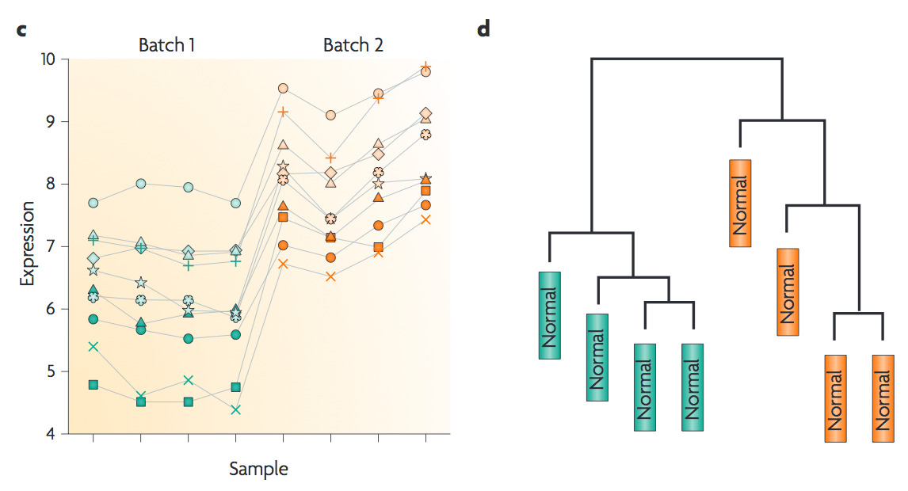
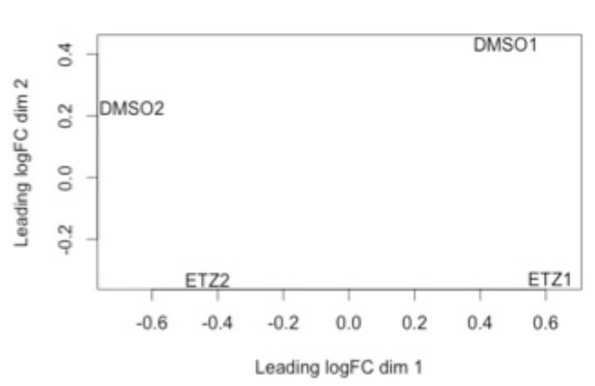

.. _diffexp:

Differential gene expression
============================

So to this point we have QC'd our reads -> aligned them to a reference -> and counted transcript
abundances. Now we are at the point where we can do differential gene expression. At this point
using a statistical language like R where there are several great packages to do differential
gene expression analysis and plotting is the best way to do things. So, we are going to use
one commonly implemented package called edgeR. To do the analysis, we will download and run
a script to produce some diagnostic plots and output we could open in Excel if we wanted.

Download the script::

    cd ../DiffExp
    wget http://s3-us-west-1.amazonaws.com/microgenomicstranscriptomics/diffexpref.R
    
To execute the script::

    R --vanilla --slave < diffexpref.R
    
Several different plots are produced and you can download them from the EC2 server, but I've
linked them below so we can just quickly have a look at the results.

Multi-dimensional scaling plot (MDS plot)

:download:`MDSplot.png <./figures/MDSplot.png>`

Biological coefficient of variation plot (BCV plot)

:download:`gly7vsgly5BCVplot.png <./figures/gly7vsgly5BCVplot.png>`

:download:`gly7vspyr5BCVplot.png <./figures/gly7vspyr5BCVplot.png>`

:download:`pyr7vspyr5BCVplot.png <./figures/pyr7vspyr5BCVplot.png>`

:download:`gly7vspyr7BCVplot.png <./figures/gly7vspyr7BCVplot.png>`

Scatter plots of significantly differentially expressed genes

:download:`gly7vsgly5scatter.png <./figures/gly7vsgly5scatter.png>`

:download:`gly7vspyr5scatter.png <./figures/gly7vspyr5scatter.png>`

:download:`pyr7vspyr5scatter.png <./figures/pyr7vspyr5scatter.png>`

:download:`gly7vspyr7scatter.png <./figures/gly7vspyr7scatter.png>`

There is another neat way to visualize data through an online tool called `Degust <http://vicbioinformatics.com/degust/>`__.
This is an excellent tool that tends to resemble Genespring in terms of producing similar plots.

Using an available workflow that links all of these steps together
------------------------------------------------------------------

Download and install SPARTA::

	cd ~/Desktop
	git clone https://github.com/biobenkj/SPARTA_Linux
	cd SPARTA_Linux
	mv ExampleData ..
	
Edit the configuration file by using the arrows to delete the two lines at the bottom and copy and paste this in::

	Reference_Condition_Files: mapgly7a.sam, mapgly7b.sam
	Experimental_Condition_2_Files:mapgly5a.sam, mapgly5b.sam
	Experimental_Condition_3_Files:mappyr7a.sam, mappyr7b.sam
	Experimental_Condition_4_Files:mappyr5a.sam, mappyr5b.sam

Start SPARTA in non-interactive mode::

	python SPARTA.py --noninteractive

Identifying batch effects
-------------------------

Batch effects can be a source of variation in RNA-seq data that can confound biological conclusions. 
In fact, there have been documented cases of batch effects present in published studies that led
readers to be concerned for the validity of the results.

To quote a previously published paper in `Nature Reviews Genetics <http://www.nature.com/nrg/journal/v11/n10/full/nrg2825.html>`_,
"Batch effects are sub-groups of measurements that have qualitatively different behaviour across conditions and are unrelated
to the biological or scientific variables in a study. For example, batch effects may occur if a subset of experiments was run on 
Monday and another set on Tuesday, if two technicians were responsible for different subsets of the experiments or if two different 
lots of reagents, chips or instruments were used." 

Thus, it is paramount that one address batch effects within their data before drawing biological
conclusions from a specific RNA-seq experiment. To illustrate what a batch effect may look
like within the data, we will utilize several different plots.

This first plot comes from the `Nature Reviews Genetics <http://www.nature.com/nrg/journal/v11/n10/full/nrg2825.html>`_
paper where they examine Affymetrix data from a `published bladder cancer study <http://cancerres.aacrjournals.org/content/64/11/4040.long>`_. 
You can quickly see that panels C and D from Figure 1 show that samples from batch 1 (blue)
cluster together based on gene expression and samples from batch 2 (orange) cluster together.

	
Within RNA-seq data, using SPARTA and the MDS plot generated by edgeR, another example of
batch effects within a study comparing *Mycobacterium tuberculosis* treated with a compound, we can clearly
see that the mock-treated samples (DMSO) and compound-treated samples (ETZ) separate based on batch (A vs B)
instead of by treatment. Ideally, we would have the samples group together based on treatment
as opposed to batch.

From here, you will want to adjust your model to account for the batch effect. Within edgeR, this can be
accomplished through an additive linear model. The documentation for edgeR contains a tutorial on
how to deal with batch effects that can be found `here <http://bioconductor.org/packages/release/bioc/vignettes/edgeR/inst/doc/edgeRUsersGuide.pdf>`_.

Underlying assumptions (worth knowing) of differential gene expression packages (edgeR and DESeq)
-------------------------------------------------------------------------------------------------

When it comes to RNA-seq experiments, replication numbers tend to be small. Further, our
gene counts are not normally distributed so we cannot use methods that were used for microarray
data. Thus, statistical models that work well with low replicates have been developed.

Here is a spectacular discussion by Meeta (https://github.com/ngs-docs/msu_ngs2015/blob/master/hands-on.Rmd)
on how replication number leads to fewer differences (greater power of detection) between
using either edgeR or DESeq to do differential gene expression.

The take home message is that both DESeq and edgeR use a similar model (negative binomial),
but the way the dispersions are estimated are different. In a kind of crazy, yet awesome, study
that utilized `48 replicates! <http://arxiv.org/ftp/arxiv/papers/1505/1505.00588.pdf>`__ they found that the negative binomial model is a good approximation,
6 replicates is best (though not always feasible), and that the method implemented by edgeR 
(one gene is squeezed towards a common dispersion calculated across all genes) performed best.

    