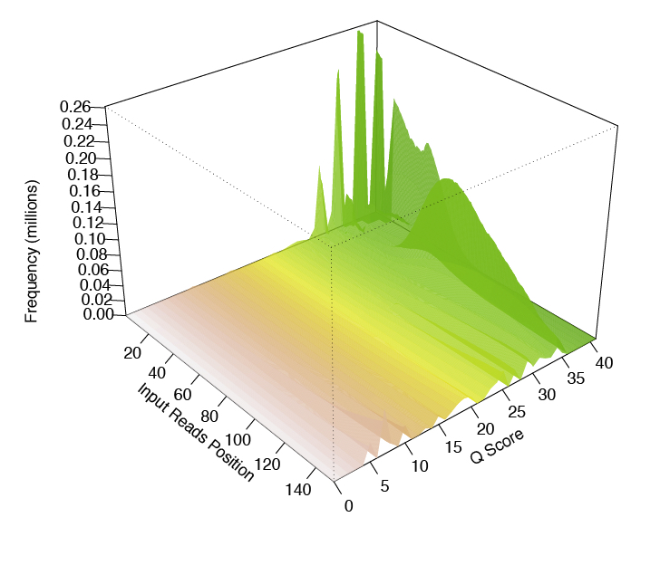

.. _qctrim:

Quality control and trimming of reads
=====================================

For our purposes, let's create a project directory for all of our files for the transcriptomics
component of the workshop

Update the machine and install some software::

	sudo bash
	cd /mnt
	apt-get update
	apt-get install -y git trimmomatic fastqc bowtie bwa build-essential python2.7-dev python-numpy python-htseq default-jre r-base r-base-dev r-bioc-edger

Make sure you're in your home directory and create the folders::

	cd ~
	mkdir TranscriptomicsWorkshop Desktop
	
Great! Now let's change directory into the folder, create a few more folders and the first README::

    cd TranscriptomicsWorkshop
    mkdir RawData QC Alignment TranscriptAbund DiffExp 
    mkdir QC/Trimmomatic QC/FastQC
    nano README.txt
    
You are now in the terminal text editor called "nano". Enter a couple sentences describing
what the project will entail, save (Ctrl + O and then hit Enter/Return), and exit (Ctrl + X).

Download the data::

	wget http://s3-us-west-1.amazonaws.com/microgenomicstranscriptomics/gly7a.fq.gz
	wget http://s3-us-west-1.amazonaws.com/microgenomicstranscriptomics/gly7b.fq.gz
	wget http://s3-us-west-1.amazonaws.com/microgenomicstranscriptomics/gly5a.fq.gz
	wget http://s3-us-west-1.amazonaws.com/microgenomicstranscriptomics/gly5b.fq.gz
	wget http://s3-us-west-1.amazonaws.com/microgenomicstranscriptomics/pyr7a.fq.gz
	wget http://s3-us-west-1.amazonaws.com/microgenomicstranscriptomics/pyr7b.fq.gz
	wget http://s3-us-west-1.amazonaws.com/microgenomicstranscriptomics/pyr5a.fq.gz
	wget http://s3-us-west-1.amazonaws.com/microgenomicstranscriptomics/pyr5b.fq.gz
	
This is a subset of data from `Baker et al. <http://onlinelibrary.wiley.com/doi/10.1111/mmi.12688/abstract;jsessionid=BD049DD06022112AB9F13CF587989C0A.f02t03>`__.
It contains the first 100,000 reads from a study looking at how *M. tuberculosis* changes its metabolism in response to different carbon sources at neutral and acidic pH.

The data are in FASTQ format and look similar to the reads we used yesterday.

Before we move on, let's create another README in the data folder and copy and paste the above lines
describing the data, how we got the data, and include the date. Something like this::

    cd RawData
    nano README.txt
    
Inside the README::

    Date data was downloaded: 9-25-15
    Data description:
    
    This is a subset of data from Baker et al. 2013 Mol. Micro. It contains the first 
    100,000 sequences from a study looking at how M. tuberculosis changes its 
    metabolism in response to different carbon sources at neutral and acidic pH.
    
    Downloading the data:
    
    git clone http://www.github.com/biobenkj/sample_data RawData
    
    Data files:
    
    find *.fq.gz

	gly5a.fq.gz
	gly5b.fq.gz
	gly7a.fq.gz
	gly7b.fq.gz
	pyr5a.fq.gz
	pyr5b.fq.gz
	pyr7a.fq.gz
	pyr7b.fq.gz

Great! Let's move on to quality control and trimming our reads.

Since we covered Trimmomatic and FastQC yesterday, we will move through this section quickly,
but pause for considerations in using FastQC for RNA-seq data.

Trimmomatic
-----------

You should be in the RawData folder currently. If you aren't::

	cd ~/TranscriptomicsWorkshop/RawData
	
Trim the reads by scripting! (What is happening in the first line? What are the parameters to trim? What in the world are we doing in the first place?!)::

	TRIM=/mnt/Trimmomatic-0.33
	for untrimmedreads in *.fq.gz
	do
		#get the file name
		FILENAME=`basename ${untrimmedreads%.*.*}`
		
		#set a prefix to make understanding what has been done to the file easier
		PREFIX=trimmed
		
		#create the new file name (e.g. trimmedgly7a.fq.gz)
		NEWTRIMFILE=${PREFIX}${FILENAME}
		
		#do the trimming
		java -jar $TRIM/trimmomatic-0.33.jar SE $untrimmedreads ../QC/Trimmomatic/$NEWTRIMFILE.fq.gz \
		ILLUMINACLIP:$TRIM/adapters/TruSeq3-SE.fa:2:30:10 \
		LEADING:3 \
		TRAILING:3 \
		SLIDINGWINDOW:4:15 \
		MINLEN:36
	done
	
FastQC
------

Now let's generate the FastQC reports (What does that -o . thing do?)::

	cd ../FastQC
	for trimmedreads in ../Trimmomatic/*.fq.gz
	do
		fastqc -o . $trimmedreads
	done
	
It would be a good idea to make README files here to describe what happened, what script
we used, etc. But for now, in light of time, we will forge ahead. Just wanted to make the
point ;) Let's talk about what this script is doing so we know how we can script the analysis
for all the files.

Look at the FastQC reports:

#. :download:`trimmedgly7a_fastqc.html <./files/trimmedgly7a_fastqc.html>`

#. :download:`trimmedgly7b_fastqc.html <./files/trimmedgly7b_fastqc.html>`

#. :download:`trimmedgly5a_fastqc.html <./files/trimmedgly5a_fastqc.html>`

#. :download:`trimmedgly5b_fastqc.html <./files/trimmedgly5b_fastqc.html>`

#. :download:`trimmedpyr7a_fastqc.html <./files/trimmedpyr7a_fastqc.html>`

#. :download:`trimmedpyr7b_fastqc.html <./files/trimmedpyr7b_fastqc.html>`

#. :download:`trimmedpyr5a_fastqc.html <./files/trimmedpyr5a_fastqc.html>`

#. :download:`trimmedpyr5b_fastqc.html <./files/trimmedpyr5b_fastqc.html>`

How does the data look? Any issues? Have a look at some of the `FastQC documentation <http://www.bioinformatics.babraham.ac.uk/projects/fastqc/Help/3%20Analysis%20Modules/>`__ for the things
that may not look "good" (e.g. orange and red flags for certain metrics) in relation to RNA-seq data.
It's important to remember that FastQC was originally made for genome sequences.

Another tool that produces a pretty neat 3-D plot is called `FaQCs <http://github.com/LANL-Bioinformatics/FaQCs>`__.

This is what it looks like:

	
FaQCs takes a rather long time to run, but produces a nice pdf report when it's done.
    