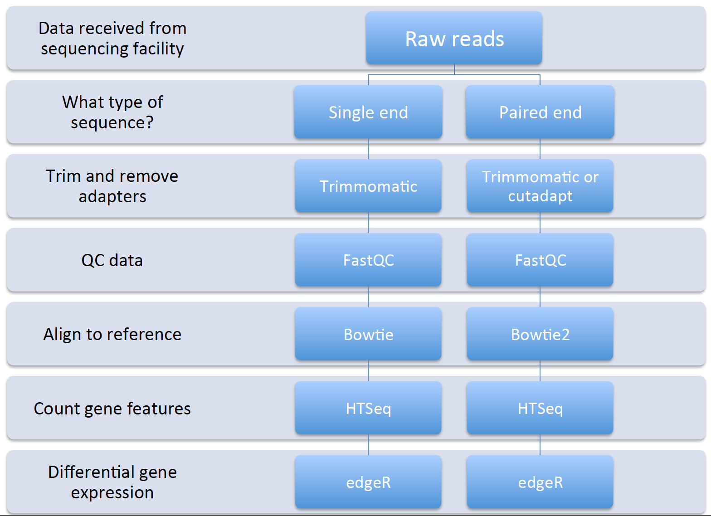
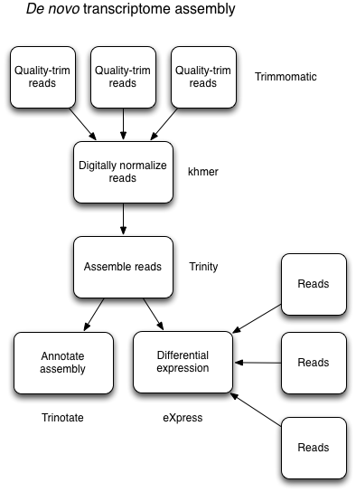

.. _refvsnoref:

Considerations for reference vs reference-free transcriptome analysis
=====================================================================

Whether you work with microbes that have a sequence reference genome or you have one without
a reference, please know that there are *several* reasonably complete workflows that you can
use for both types of analyses. No need to re-invent the wheel.

We will attempt to cover both approaches using available workflows and then point you to
additional resources so that you can choose the one that best fits your needs. 

Reference-based transcriptome analysis
--------------------------------------

The general approach for reference-based (if you already have an available sequenced genome)
is as follows (can use different tools though):

	
Several workflows can be utilized for this type of analysis, including:

	* SPARTA - `<sparta.readthedocs.org>`__
	
	* Rockhopper - `<http://cs.wellesley.edu/~btjaden/Rockhopper/>`__
	
	* Galaxy (drag and drop cloud computing GUI interface for NGS data analysis) - `<https://galaxyproject.org/>`__
	
	* Several others not necessarily mentioned here but a Google search can help
	

Reference-free transcriptome analysis
-------------------------------------

The approach for reference-free (no good reference genome and not enough mRNA-seq data for
assembled transcriptomes) is slightly different and an entirely different animal than reference-based
approaches. The process is related and generally can follow this type of workflow:

	
This is usually an iterative process that may require additional tools and computational time
to work through the data. But it can be done! A `useful presentation from Meg Staton <http://angus.readthedocs.org/en/2014/_static/MegStaton_NGS_KBS_Staton_RNASeq.pdf>`__ on de novo assembly.
	
There are fewer workflows readily available for *de novo* transcriptome assembly:

	* Rockhopper2 - `<http://cs.wellesley.edu/~btjaden/Rockhopper/>`__
	
	* khmer and Trinity - `<http://khmer.readthedocs.org/en/v2.0/>`__ and `<http://trinityrnaseq.github.io/>`__
	
	* Galaxy (drag and drop cloud computing GUI interface for NGS data analysis) - `<https://galaxyproject.org/>`__
	
	* What we will show today as a brief example