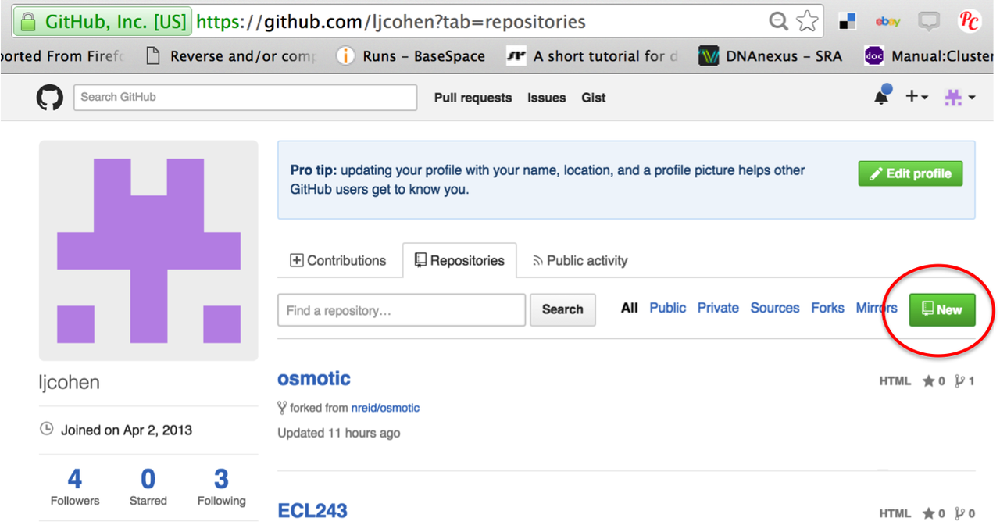
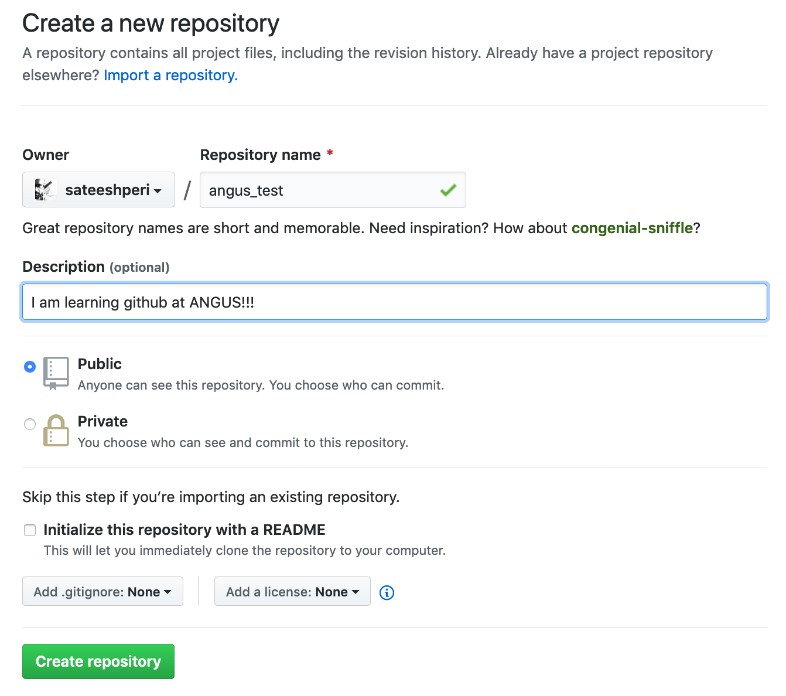
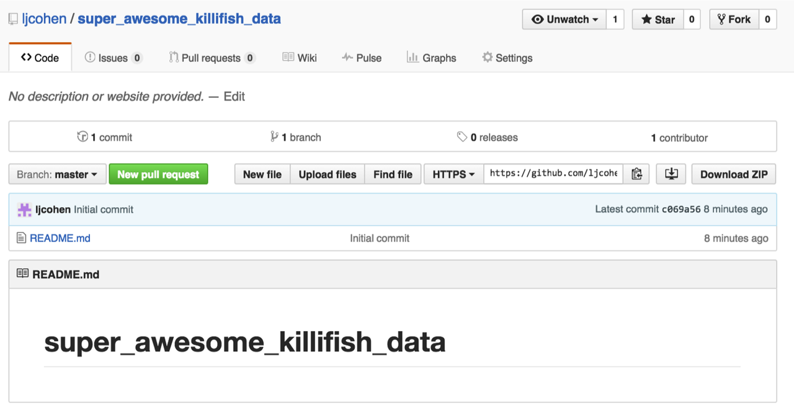
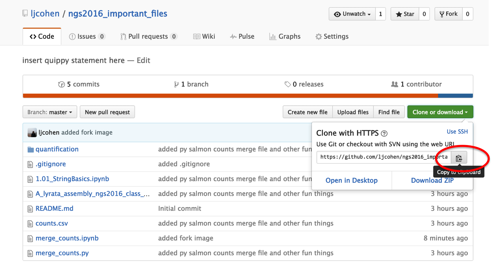
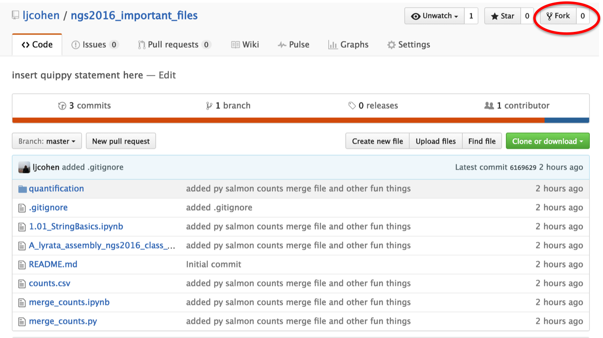
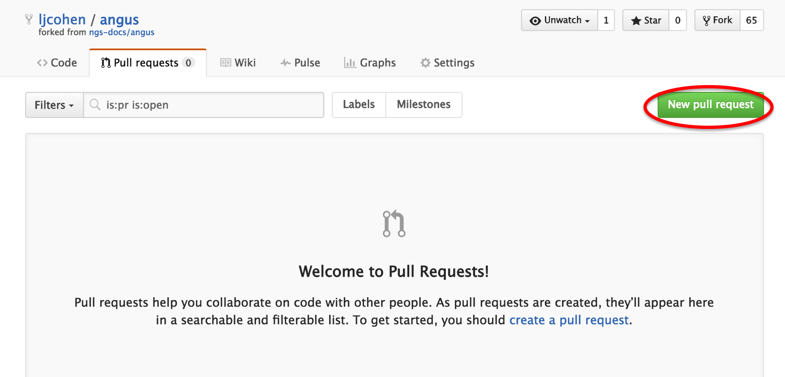
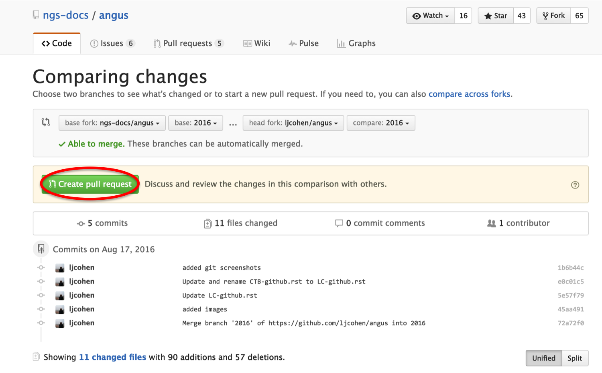
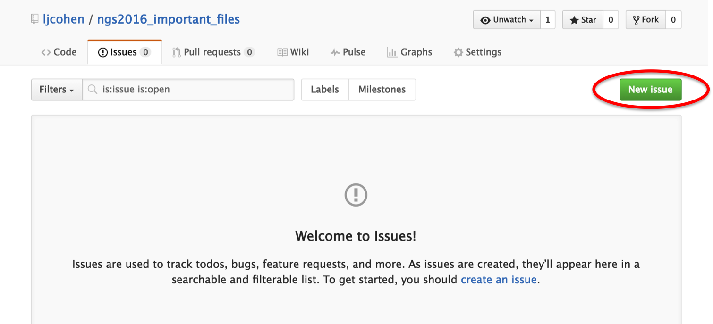

===============================================
Using GitHub repositories to store your scripts
===============================================

By the end of this lesson, you will be able to:

1. Make a new github repo
2. Edit README.md
3. Fork and clone a repo
4. Make changes, commit and push changes
5. Submit a pull request
6. Submit an issue

Create a new repository
==============================

Github has special terms for their parts and workflows, but these are all basically related to storing files and moving them around. A repo (or repository) is just like a folder. Forking, pushing, pulling and cloning are all processes but they are all basically just copying and moving files around.  

Go to `github.com <https://github.com/>`__, sign in (sign up if you haven't already). 
Go to your profile page (e.g. `https://github.com/ljcohen <https://github.com/ljcohen>`__), then select "New repository".

Name can be something like 'super_awesome_killifish_data', whatever is fine!  Be sure to check the
'initialize with Readme' box.

Your repo should look something like this:
   

Edit README.md
================
Click on the pen icon to edit README.md to edit the file. Here is a (`markdown cheat sheet <https://github.com/adam-p/markdown-here/wiki/Markdown-Cheatsheet>`__) 
(`Why README.md is necessary <https://changelog.com/top-ten-reasons-why-i-wont-use-your-open-source-project/>`__)

Add some formatting things, like `hyperlinks <http://whatshouldwecallgradschool.tumblr.com/>`__ and lists:

* apple
* bananas
* llamas

or images:

Clone your repository
============================

Get your GitHub repository url: https://github.com/ljcohen/super_awesome_killifish_data.git is
mine, in this example);

Then, on your local laptop or remote UNIX machine, navigate to a directory where you would like to copy the files. Then type:
::
   git clone https://github.com/ljcohen/super_awesome_killifish_data.git

This will create a new directory named ``super_awesome_killifish_data`` and download the contents to your coputer or machine. In this case, there is only a single file ``README.md``. If you're on your local computer, open up your Finder and navigate to the directory to see the files. Now you can add files and they will be version controlled!

Fork an existing repository
=====================================

Now we will do something else. We've been making some important files during this NGS 2016 course. Let's all collaborate and decide what those files are. I have created a repository of files that I think are important. `Click on this link <https://github.com/ljcohen/ngs2016_important_files>`__ to go to my github repo and fork it.

   
This will fork the repository into your account. Make sure that you can see it listed as a repository on your profile. You have just created a copy of all the files from my repo and brought them into your profile. Now, git clone this new repository by copying the url like you did before and typing.
::
   git clone https://github.com/youraccountname/ngs2016_important_files.git
   
Make changes, commit and push changes
=====================================

Now, locate this ``ngs2016_important_files`` directory on your local computer and make some changes (any changes!). Copy files into or edit existing files here. What are some important files you have from this course that you would like everyone else to have? Perhaps you do not like my ``README.md`` file....

Once you have made these changes, commit and push these changes to your github profile.

In your local terminal, type:
::
   git add --all
   git checkout

You should see a record of the changes you've made. Then type:
::
   git commit -m "this is a special message from Lisa"

This will commit the changes made and get them ready for uploading. Now upload with this command:
::
   git push origin master

Open your profile on the web and you should see the files!

Your repo may get behind other changes I'm making or others are making. We will not make sure your repo is up-to-date. To see the address of the remote repo:
::
   git remote -v

You should see your own url. To add my url, go to my repo and copy the clone url:
::
   git remote add upstream https://github.com/ljcohen/ngs2016_important_files.git
   git remote -v

Now you should see my repo url as upstream and your url as origin. To make your repo up-to-date, type:
::
   git pull upstream master

Files should download if there are any changes. This will not overwrite your files unless there are conflicts.

Submit a pull request
======================

It's great that you have these changed files in your repo, but you want to share these files with your collaborators. We all have the same repo. Go to your version of the repo and click on submit a pull request:

You will see two comparisons between the master and your repo. There shouldn't be an conflicts, so just click on 'Create pull request':

   
This will make a request for your changes to be pulled and merged into the original repo.

Submit an issue
================

Sometimes we have issues with software, find bugs or have questions, and want to be able to communitcate with the authors. Github has this great feature where you can file issues, and makes them public records: https://github.com/nvbn/thefuck/issues/440

Practice by creating an issue with this repo:

   
Storage of Jupyter notebooks to explore data
============================================

Github repos contain static documents. Github suports rendering of ``.ipynb``, ``.pdf``, ``.Rmd``, ``.md``, ``.rst`` files. (and probably many more...) This is a great way to post files and share with your boss, colleagues, or just store documents for yourself. This way, all you have to do is share the url link.

Useful commands
===============
* ``git add script.txt`` will add the file script.txt into your local git
  repository.

* ``git commit -am "some message"`` will save the latest version of the script
  into your local git repository

* ``git push origin`` will send your committed versions to github, where
  they will be safe.

* ``git log`` will show you your history.

* ``git pull`` will update your command-line repository from your
  GitHub account.
  
* ``git status`` will show what files have been changed
  
References
===========

* http://khmer.readthedocs.io/en/latest/dev/getting-started.html
* http://khmer.readthedocs.io/en/latest/dev/getting-started.html
* http://angus.readthedocs.io/en/2016/CTB-github.html
* https://monsterbashseq.wordpress.com/2016/03/08/intro-git-lab-meeting/
* https://education.github.com/guide/private_repos
* https://swcarpentry.github.io/git-novice/
* http://dib-training.readthedocs.io/en/pub/2016-02-05-intro-git.html
* https://classroom.github.com/
* http://stackoverflow.com/questions/19573031/cant-push-to-github-because-of-large-file-which-i-already-deleted
