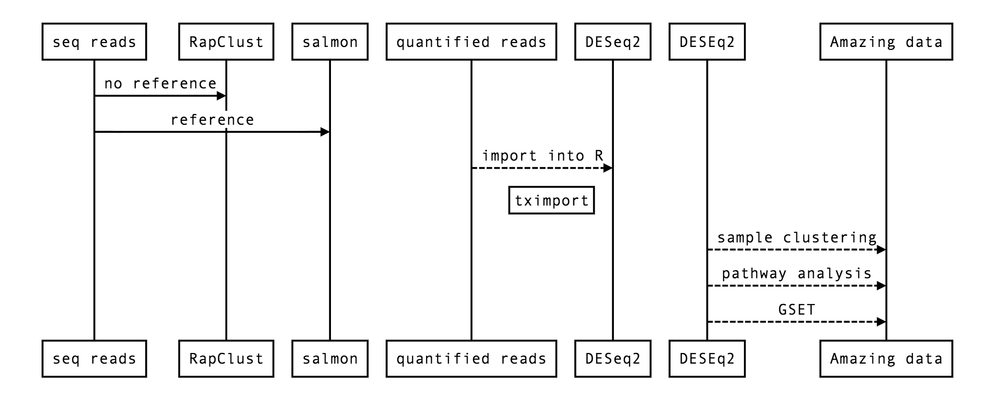

# RNA-seq Analysis

## Some basics 

We are going to first talk about different needs in RNA-seq, from basics in library prep to the last steps of analyses. 
+ **How do you choose your library pipeline?**

| Choice 1 | Choice 2 |
| -------- | -------- |
| More Replicates | Deeper Sequencing|
| RIN values < 7 | RNA values > 7 |
| ERCC | No ERCC| 
| Poly A     | Ribo depletion     |
| Fragment size 1 | Fragment size 2 |
| Stranded | Non-stranded|
| Single end | Paired end |
| Short Read (50) | Medium Read (150)
| Depth 1 | Depth 2|
| RNA-seq | Targeted RNA-seq |

+ **Biological vs Technical replicates**

[Schurch et al., 2016](https://www.ncbi.nlm.nih.gov/pmc/articles/PMC4878611/) "How many biological replicates are needed in an RNA-seq experiment and which differential expression tool should you use?"

+ **How do you choose your bioinformatics pipeline?**

| Choice 1 | Choice 2 |
| -------- | -------- |
| trimmomatic | cutadapt |
| Salmon, kallisto...    | STAR, HISAT2, bowtie2   |  
| DESeq2 | edgeR |
| clustering 1 (corr) | clustering 2 (PCA) |
| Pathway analysis | GSET |
| Visualization 1 | Visualization 100!|
| Upload them before paper submission! | Upload them before paper submission!|

## Installations

We have installed the 'heaviest' packages that you need in this lesson in our [Jetstream](https://use.jetstream-cloud.org/application/) image. For future work, these are the installations that you will need, so that you have all of them together:
```
source("https://bioconductor.org/biocLite.R") # calls the package from the source
biocLite('Biobase') # newer versions of R use 'library()' as function instead of biocLite
install.packages("tidyverse") # we have this in our Image
library(tidyverse)
library(tximport)
library(DESeq2)
install.packages("devtools")
library(devtools)
install.packages('pheatmap')
library(RColorBrewer)
library(pheatmap)
biocLite("GOstats")
biocLite("org.Sc.sgd.db")
library(GOstats)
library(org.Sc.sgd.db) 
```

## Bioconductor
[Bioconductor](https://www.bioconductor.org/packages//2.10/bioc/vignettes/Biobase/inst/doc/Bioconductor.pdf) is a project to develop innovative software tools for use in computational biology. Bioconductor is an 'umbrella package' that includes many packages employed in biological analyses.
[Biobase](https://www.bioconductor.org/packages//2.10/bioc/vignettes/Biobase/inst/doc/ExpressionSetIntroduction.pdf) is part of the Bioconductor project, and is used by many other packages. Biobase contains standardized data structures to represent genomic data. You can find help for Biobase typing:
```
browseVignettes("Biobase")
```

## A simple RNA-seq flow

<center></a></center>

## [DESeq2](http://bioconductor.org/packages/devel/bioc/vignettes/DESeq2/inst/doc/DESeq2.html#tximport)

We are going to follow the lesson by Mike Love at [DESeq2](http://bioconductor.org/packages/devel/bioc/vignettes/DESeq2/inst/doc/DESeq2.html)

This code chunk assumes that you have a count matrix called `cts` and a table of sample information called `coldata`. `design` indicates how to model the samples, here, we want to measure the effect of the *condition*, controlling for *batch* differences. The two factor variables `batch` and `condition` should then be columns of `coldata`.

```
dds <- DESeqDataSetFromMatrix(countData = cts,
                              colData = coldata,
                              design= ~ batch + condition)
dds <- DESeq(dds) # creates a DESeqDataSet
resultsNames(dds) # lists the coefficients
res <- results(dds, name="condition_trt_vs_untrt")
# or to shrink log fold changes association with condition:
res <- lfcShrink(dds, coef="condition_trt_vs_untrt", type="apeglm")
```
### DESeqDataSet

`DESeqDataSet` class extends the `RangedSummarizedExperiment` class of the `SummarizedExperiment` package. *Ranged* referes here to counts associated with genomic ranges (exons) - we can then make use of other Bioconductor packages that explore range-based functionality (e.g. ChIP-seq peaks).

A `DESeqDataSet` must have a `design` formula: the variables that we will fit in the model to create our differential expression. The formula should be a tilde (~) followed by the variables with plus (+) signs between them (it will be coerced into an formula if it is not already). 

Note: To get the most out of the package with default settings, put the variable of interest at the end of the formula and make sure the control level is the first level.
The starting functions are:

+ If you have transcript quantification files, as produced by `Salmon`, `Sailfish`, or `kallisto`, you would use `DESeqDataSetFromTximport`.
+ If you have htseq-count files, the first line would use `DESeqDataSetFromHTSeq`.
+ If you have a `RangedSummarizedExperiment`, the first line would use `DESeqDataSet`.

`DESeq2` internally corrects for library size, so transformed or normalized values such as counts scaled by library size should not be used as input.

Depending on the upstream pipeline, a `DESeqDataSet` can be constructed using:

+ From transcript abundance files and `tximport` - this is the pipeline that we will use in this tutorial
+ From a `count matrix`
+ From `htseq-count` files
+ From a `SummarizedExperiment` object

### Transcript abundance files: tximport

You can import transcript abundance files from `salmon`, `sailfish`, `kallisto` and `RSEM` using `tximport`, which will create gene-level count matrices for use with DESeq2.

Advantages:
+ correction for potential changes in gene length across samples (e.g. from differential isoform usage) (Trapnell et al. 2013);
+ `Salmon`, `Sailfish` and `kallisto` are substantially faster and require less memory and disk usage compared to alignment-based methods that require creation and storage of BAM files;
+ it is possible to avoid discarding fragments that can align to multiple genes with homologous sequence, thus increasing sensitivity (Robert and Watson 2015).

Note: the `tximport-to-DESeq2` approach uses estimated gene counts from the transcript abundance quantifiers, but not normalized counts.

### Organise your directory to work on it!

Log into your Jetstream Instance and lauch R Studio. We will use both the Console (for R) and the Terminal (for bash) there.

We are first going to make a new directory using the Terminal where we will be doing all the analysis, called `rna_seq_r`, where we will create tow other directories called `figures` and `r_script`:

`mkdir rna_seq_r`
`cd rna_seq_r`
`mkdir figures`
`mkdir r_script`

We are going to set our working directory in the R Console so that we can find and store all our analysis there:

`setwd(~/rna_seq_r)`

This is how you start any project in R: set your working directory, where you will find your input files (unless you download them directly as in this lesson) and where you will output all your data (and your RScript!).

## Continue the lesson in RMarkdown

We are now going to download the rest of the lesson and follow it on RMarkdown, which is a great way of making and sharing documents. Type in your Terminal:

`wget https://raw.githubusercontent.com/maggimars/YeastTutorial/master/R_RNA.Rmd`

and let's get started!

## More resources

[*ExpressionSet*](https://www.bioconductor.org/packages//2.10/bioc/vignettes/Biobase/inst/doc/ExpressionSetIntroduction.pdf)  

[salmon](https://combine-lab.github.io/salmon/getting_started/)  

[DESEq2](http://bioconductor.org/packages/devel/bioc/vignettes/DESeq2/inst/doc/DESeq2.html)  

[Data Carpentry R](https://datacarpentry.org/)  

[Software Carpentry R](https://software-carpentry.org/)

###### tags: `RNA-seq` `R` `Bioconductor` `DESeq2`
