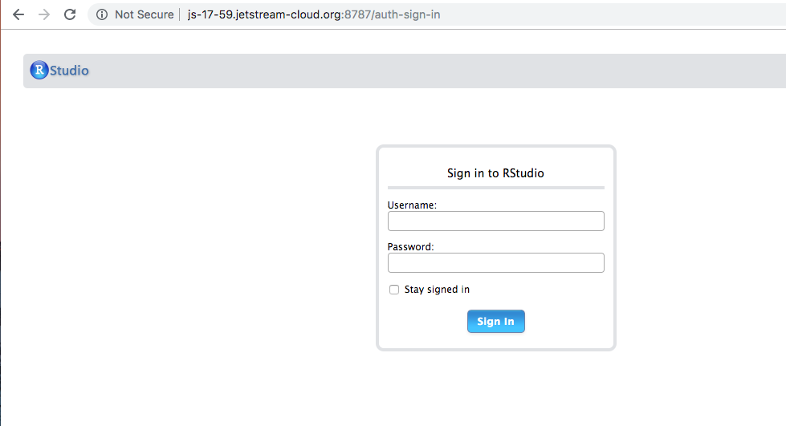
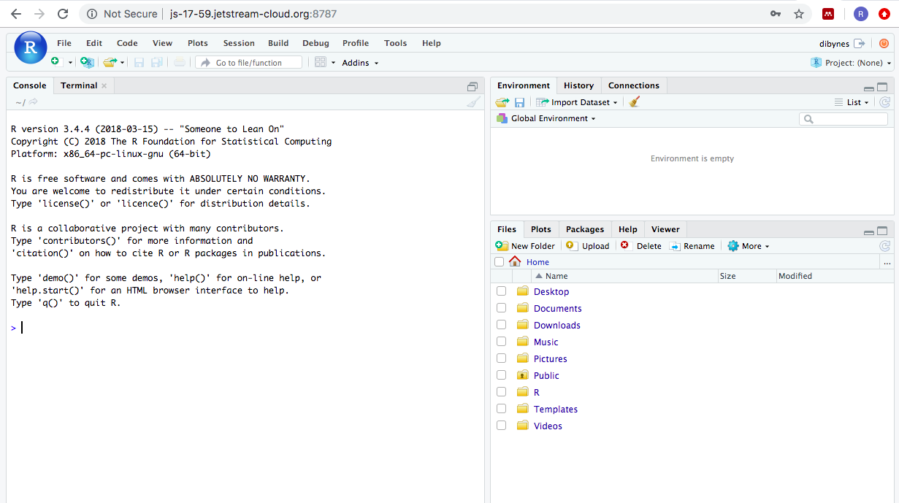
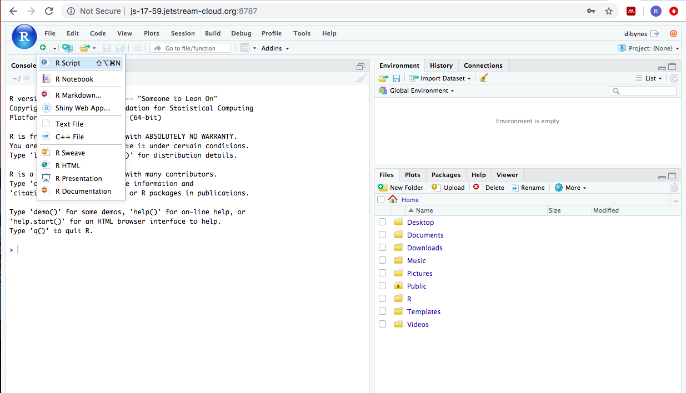
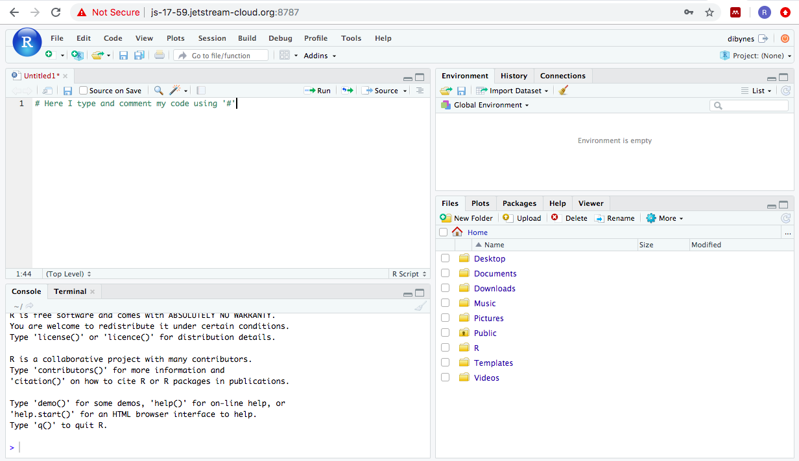
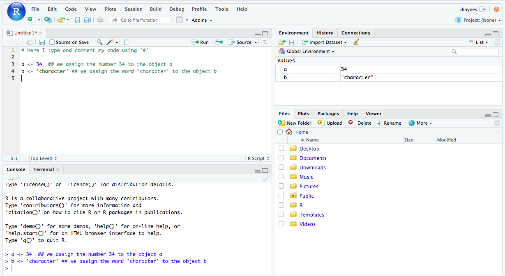
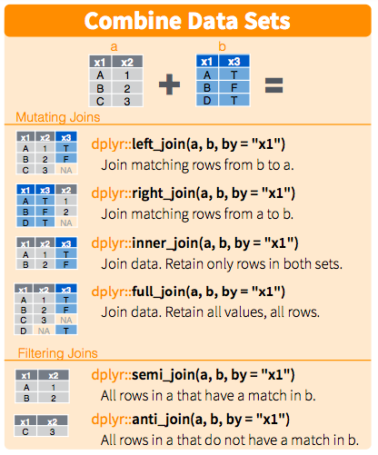

Getting started
===============
------------------------------------------------------------------------

### Using RStudio on Jetstream

We will be using R and RStudio on our cloud instances. We have
pre-installed RStudio on the workshop image. Start up a Jetstream
m1.medium or larger using the ANGUS 2019 image [as per Jetstream startup
instructions](jetstream/boot.html). Connect to your instance.

We will need our instance username to connect to RStudio. To
determine what your username is, run:

``` bash
echo My username is $USER
```

Find the RStudio server interface Web address (by default in
port 8787) by running the following command:

``` bash
echo http://$(hostname):8787/
```

Now go to the web address printed to your terminal in your Web browser
and log in with the username and password we will provide. You should
see something that looks like:



where you type your username and the password that you have set.

### Installing on your own computer:

We will be using R and RStudio in the cloud. To use RStudio on your
computer, you can download R and RStudio. If you do not have R and
RStudio installed:

-   Download R from
    CRAN:<a href="https://cran.r-project.org/" class="uri">https://cran.r-project.org/</a>
-   Go to RStudio download page and install the version that is
    compatible with your operating system:
    <a href="https://www.rstudio.com/products/rstudio/download/#download" class="uri">https://www.rstudio.com/products/rstudio/download/#download</a>
    This [link](https://datacarpentry.org/R-ecology-lesson/) provides
    futher instructions on installing and setting up R and RStudio on
    your computer.

Introduction to R and RStudio
-----------------------------

R is a programming language and free software environment for
statistical computing and graphics. Many bioinformatics programs are
implemented in R. RStudio is a graphical integrated development
environment (IDE) that displays and organizes more information about R.
R is the underlying programming language. Once you start RStudio, you
see this layout (it will be similar either on your instance or on your
computer):



Scripts are like a digital lab book. They record everything your run, as
well as notes to yourself about how and why you ran it. To start a new
script you can click on the icon that looks like a page with a ‘+’
underneath File and select –&gt;R script. This generates a `.R` file.
`.R` files are plain text files that use the file extension `.R` so that
humans can remember that the file contains R code.



Although scripts are a record of our code, they also include comments
about our code. These comments are very important as they remind your
future self (and whoever you pass your script) why you did what you did.
Think of comments like the notes you take in your lab book when you do
experiments.



When you execute a line of your script, it is sent to the console. While
the script is a permanent record of everything you ran, the console is
the engine that runs those things. You can run code from a script or the
console, but it is only recorded in scripts.

There are two additional panes in RStudio:

1.  **Environment/History/Connections pane**
    -   **Environment Pane**: This pane records the objects that are
        currently loaded in our RStudio environment. This includes any
        data object that we created and the basic information about
        them.
    -   **History Pane**: This has output similar to the `history`
        command that we used in the shell. It records all of the
        commands that we have executed in the R console.
2.  **Files/Plots/Packages/Help/Viewer** pane provides a space for us to
    interact with plots and files we create and with built-in help files
    in R.
    -   **Packages Pane**: A place to organize the packages within
        RStudio. Allows easy installation or loading (`library()`) of
        the packages we have.

And now we’re ready to start the fun part!

Basic concepts
--------------

### Objects

An R object is something that you create and assign a value or function
to. You do this using the *assignment operator* which is `<-` (NOTE:
shortcut Alt + -). For example you can assign a *numeric* value to an
object by typing in your script (remember to comment what you are
doing):

``` r
a <- 34  # assign the number 34 to the object a
```

You can also assign a *character* value to an object:

``` r
b <- 'mouse' # assign the word 'character' to the object b
```

To run a line of code, put your cursor on the line that you want to run
and press `Enter+Cmd` or `Enter+Ctrl`. Or select the line and click the
button that says `Run` on the right top corner of your script.



Now check your Console and Environment tabs, you will see that the
commands have run and that you have created new objects!

You can do all sorts of stuff with your objects: operations,
combinations, use them in functions. Below we show how to perform
multiplication using an object. Because `a` stores the value `34`, we
can multiply it by 2:

``` r
a2 <- a*2 # multiply a by 2
```

### Functions and Arguments

Functions are “canned scripts” that automate more complicated sets of
commands including operations assignments, etc. Many functions are
predefined, or can be made available by importing R packages (more on
that later). A function usually takes one or more inputs called
arguments. Functions often (but not always) return a value. A typical
example would be the function `sqrt()`. The input (the argument) must be
a number, and the return value (in fact, the output) is the square root
of that number. Executing a function (‘running it’) is called calling
the function. An example of a function call is:

``` r
sqrt(a) ## calculate the square root of a
```

Here, the value of a is given to the `sqrt()` function, the `sqrt()`
function calculates the square root, and returns the value which is then
assigned to the object `b`. This function is very simple, because it
takes just one argument.

The return ‘value’ of a function need not be numerical (like that of
`sqrt()`), and it also does not need to be a single item: it can be a
set of things, or even a dataset. We’ll see that when we read data files
into R.

Arguments can be anything, not only numbers or filenames, but also other
objects. Exactly what each argument means differs per function, and must
be looked up in the documentation (see below). Some functions take
arguments which may either be specified by the user, or, if left out,
take on a default value: these are called options. Options are typically
used to alter the way the function operates, such as whether it ignores
‘bad values’, or what symbol to use in a plot. However, if you want
something specific, you can specify a value of your choice which will be
used instead of the default.

Let’s try a function that can take multiple arguments: round().

``` r
round(3.141592) ## round number
```

Arguments are the ‘conditions’ of a function. For example, the function
`round()` has an argument to determine the number of decimals, and its
default in R is 0. Here, we’ve called round() with just one argument,
3.14159, and it has returned the value 3. That’s because the default is
to round to the nearest whole number. If we want more digits we can see
how to do that by getting information about the round function. We can
use args(round) to find what arguments it takes, or look at the help for
this function using ?round.

``` r
args(round) ## show the arguments of the function 'round'
?round ## shows the information about 'round'
```

We can change this to two decimals by changing the `digits` argument:

``` r
round(3.141592, digits = 2)
```

Note that we do not need to specify the name of the argument as R
detects this by the position within the function:

``` r
round(3.141592, 2)
```

But you can change the order of the arguments if the arguments are
named:

``` r
round(digits = 2, x= 3.141592)
```

It’s best practice to put the non-optional arguments (the data that you
want the function to work on) first, and then specify the names of all
optional arguments. This helps other to interpret your code more easily.

### Vectors

A vector is the most common and basic data type in R, and is pretty much
the workhorse of R. A vector is composed by a series of values, which
can be either numbers or characters. We can assign a series of values to
a vector using the c() function.

``` r
yeast_strain <- c('WT','snf2') 
concentration <- c(43.903, 47.871)
```

There are many functions to inspect a vector and get information about
its contents:

``` r
length(yeast_strain) # number of elements in a vector
class(concentration) # type of object b
str(yeast_strain) # inspect the structure of a
```

**Challenge**:

We’ve seen that atomic vectors can be of type character, numeric (or
double), integer, and logical. But what happens if we try to mix these
types in a single vector?

``` r
yeast_strain_concentration <- c(yeast_strain, concentration) # combine two vectors
```

Solution: All indices are “coerced” to the same “type”, e.g. character.

### Data types

An **atomic vector** is the simplest R data type, and it is a vector of
a single type. The 6 main atomic vector types that R uses are:

**`'character'`** letters or words **`'numeric'`** (or `double`) for
numbers **`'logical'`** for `TRUE` and `FALSE` (booleans)
**`'integer'`** for integer numbers (e.g., `2L`, the `L` indicates to R
that it’s an integer) **`'complex'`** to represent complex numbers with
real and imaginary parts, for example `2 + 4i` **`'raw'`** for
bitstreams that we will not use or discuss further **`factor`**
represents categorical data (more below!)

You can check the type of vecor you are using with the `typeof()`
function.

``` r
typeof(concentration)
```

As we saw in our challenge problem, objects of different types get
converted into a single type. This is called **coercion** and it follows
a hierarchy:

logical → numeric → character ← logical

R uses many **data structures**, the main ones are:

**`vector`** contain elements of the same type in one dimension
**`list`** can contain elements of different types and multiple data
structures **`data.frame`** contains rows and columns. Columns can
contain different types from other columns. **`matrix`** with rows and
columns that are of the same type **`array`** stores data in more than 2
dimensions

We will use `vectors`, `matrices`, `data.frames`, and `factors` today.

### Subsetting

We can extract values from a vector based on position or conditions:
this is called **subsetting**. One way to subset in R is to use `[]`.
Indices start at 1.

``` r
strains <-  c('WT', 'snf2', 'snf1', 'snf1_snf2') 
strains[2] # subsets the second element
strains[c(2,3)] # subsets the second and third elements
more_strains <- strains[c(1, 2, 3, 1, 4, 3)] # to create an object with more elements than tha original one
more_strains
```

#### Conditional subsetting

We can also subset based on **conditions**, using a logical vector with
`TRUE` and `FALSE` or with *operators*:

``` r
strains[c(TRUE, FALSE, FALSE, TRUE)] 
concentration >= 43
concentration > 40
concentration < 47
concentration <= 47
concentration[ concentration < 45 | concentration > 47] # | is OR
concentration[ concentration < 45 & concentration == 47] # & is AND , == is mathematical 'equal'
more_strains[more_strains %in% strains]
```

### Missing data

As R was designed to analyze datasets, it includes the concept of
missing data (which is uncommon in other programming languages). Missing
data are represented in vectors as NA.

There are in-built functions and arguments to deal with missing data.
For example, this vector contains missing data:

``` r
concentration <- c(43.903, 47.871, NA, 48.456, 53.435)
```

We can use the following functions to remove or ignore it:

``` r
mean(concentration, na.rm = TRUE) # mean of concentration removing your NA
concentration[!is.na(concentration)] # extract all elements that are NOT NA
na.omit(concentration) # returns a 'numeric' atomic vector with incomplete cases removed
concentration[complete.cases(concentration)] # returns a 'numeric' atomic vector with elements that are complete cases
```

Note, if your data includes missing values, you can code them as blanks
("“), or as”NA" before reading them into R.

### Factors

Factors represent categorical data. They are stored as integers
associated with labels and they can be ordered or unordered. While
factors look (and often behave) like character vectors, they are
actually treated as integer vectors by R. So you need to be very careful
when treating them as strings.

``` r
strains <-  factor(c('WT', 'snf2', 'snf1', 'snf1_snf2')) # We make our strains object a factor
class(strains)
nlevels(strains)
strains # R orders alphabetically
```

Once created, factors can only contain a pre-defined set of values,
known as levels. By default, R always sorts `levels` in alphabetical
order. We can reorder them using the `levels` argument.

``` r
strains <- factor(strains, levels = c('WT', 'snf1', 'snf2', 'snf1_snf2')) # we reorder them as we want them
strains 
```

We convert objects using `as.XXX` functions:

``` r
strains <- as.character(strains)
class(strains)
strains <- as.factor(strains)
class(strains)
```

And we can also **rename factors** based on position:

``` r
levels(strains)[4] <- 'wild_type'
```

Starting with tabular data
--------------------------

This tutorial is a continuation from our *Salmon* lesson – we are using
sequencing data European Nucleotide Archive dataset PRJEB5348. This is
an RNA-seq experiment using comparing two yeast strains, *SFF2* and WT.
Although we’re only working with 6 samples, this was a much larger
study. They sequenced 96 samples in 7 different lanes, with 45 wt and 45
mut strains. Thus, there are 45 biological replicates and 7 technical
replicates present, with a total of 672 samples! The datasets were
compared to test the underlying statistical distribution of read counts
in RNA-seq data, and to test which differential expression programs work
best.

We will get the information about the RNA quality and quantity that the
authors measured for all of their samples, and we will explore how the
authors made their data avaialble and ‘linkable’ between technical and
biological replicates.

We are going to explore those datasets using RStudio, combining a both
base R and an umbrella package called *tidyverse*.

``` r
library('tidyverse')
```

First we are going to read the files from a url and assign that to
experiment\_info, using `read_tsv()`:

``` r
experiment_info <- read_tsv(file = 'https://osf.io/pzs7g/download/')
```

Let’s investigate your new data using some exploratory functions:

``` r
class(experiment_info) # type of object that sample_details is
dim(experiment_info) # dimensions
summary(experiment_info) # summary stats
head(experiment_info) # shows the first 6 rows and all columns
tail(experiment_info) # last 6 rows and all columns
str(experiment_info) # structure
```

What do you notice? The last 4 columns are empty! We can get rid of them
by subsetting, and having a look that we have done things correctly:

``` r
sum(is.na(experiment_info$X10)) # checks how many NAs the column X10 has so that you know all your rows are NAs (or not!)
experiment_info <- experiment_info[ , 1:9] # subset all rows and columns 1 to 9
```

**Challenge** Check how many columns are in the data frame now.

``` r
dim(experiment_info) # dimensions
```

The 9th column has no name, but we can change this using `rename()`:

``` r
experiment_info <- rename(experiment_info, units = X9)
```

### Manipulating data with **dplyr**

We can now explore this table and reshape it using `dplyr`. We will
cover in this lesson:

`%>%`: pipes, they allow ‘concatenating’ functions  
`select()`: subsets columns  
`filter()`: subsets rows on conditions  
`mutate()`: create new columns using information from other columns  
`group_by()` and `summarize()`: create summary statistics on grouped
data  
`arrange()`: sort results  
`count()`: counts discrete values

### Selecting columns and filtering rows

We have now a table with many columns – but what if we don’t need all of
the columns? We can select columns using `select`, which requires as
*arguments* the names of the colums that you want to keep:

``` r
select(experiment_info, Sample, Yeast Strain, Nucleic Acid Conc., Sample, 260/280, Total RNA)
```

What happened? R cannot parse the spaces in the column names properly.
Also, it gets a little confused when column names start with a number.
We can add back commas around the `name of the column`. These tell R
that `these words belong together`:

``` r
select(experiment_info, Sample, `Yeast Strain`, `Nucleic Acid Conc.`, `260/280`, `Total RNA`)
```

So let’s store that in `experiment_info`:

``` r
experiment_info <- select(experiment_info, Sample, `Yeast Strain`, `Nucleic Acid Conc.`, A260, A280, `260/280`, `Total RNA`)
```

**NOTE**: When choosing names from columns, make sure that you choose
something simple, all lowercase, all uppercase, or CamelCase. Having
spaces in column makes it hard for R to deal with, and can lead to
unexpected results.

We select all columns *except for* by using ‘-’ before the name of the
columns we do not want to include, for example all columns except for
A260 and A280:

``` r
select(experiment_info, -A260, -A280)
```

We can also `filter` rows based on conditions in a column:

``` r
filter(experiment_info, `Nucleic Acid Conc.` > 1500)
```

### Exercise 1

> Select the columns Sample, Yeast Strain, A260 and A280 and assign that
> to a new object called experiment\_data.

<details>
<summary><strong><font color="#6B33FF">Solution
\#1</font></strong></summary>

``` r
experiment_data <-  select(experiment_info, Sample, `Yeast Strain`, A260, A280)
head(experiment_data)
```

    ## # A tibble: 6 x 4
    ##   Sample `Yeast Strain`  A260  A280
    ##    <dbl> <chr>          <dbl> <dbl>
    ## 1      1 snf2            43.9  19.9
    ## 2      2 snf2            47.9  22.1
    ## 3      3 snf2            34.5  15.6
    ## 4      4 snf2            34.0  15.4
    ## 5      5 snf2            28.1  12.7
    ## 6      6 snf2            48.2  22.1

</details>
### Exercise 2

> Filter rows for only WT strains that had more than 1500 ng/uL
> concentration and make a new tibble called wild\_type.

<details>
<summary><strong><font color="#6B33FF">Solution
\#2</font></strong></summary>

``` r
wild_type <- filter(experiment_info, `Yeast Strain` %in% 'WT' & `Nucleic Acid Conc.` > 1500)
head(wild_type)
```

    ## # A tibble: 6 x 7
    ##   Sample `Yeast Strain` `Nucleic Acid Co…  A260  A280 `260/280` `Total RNA`
    ##    <dbl> <chr>                      <dbl> <dbl> <dbl>     <dbl>       <dbl>
    ## 1     49 WT                         2052.  51.3  23.6      2.17        61.6
    ## 2     50 WT                         1884.  47.1  21.6      2.18        56.5
    ## 3     51 WT                         2692.  67.3  30.6      2.2         80.8
    ## 4     52 WT                         3022   75.5  34.3      2.2         90.7
    ## 5     53 WT                         3235   80.9  36.9      2.19        97.0
    ## 6     54 WT                         3735.  93.4  43.2      2.16       112.

</details>
### Pipes

What if we want to `select` and `filter` at the same time? We use %&gt;%
(pipes) for that. Pipes are available via the `magrittr` package,
installed automatically with `dplyr`. If you use RStudio, you can type
the pipe with `Ctrl + Shift + M` if you have a PC or `Cmd + Shift + M`
if you have a Mac as a shortcut to get to produce a pipe.

We can combine the two subsetting activities from Exercise 1 and 2 using
pipes `%>%` :

``` r
experiment_info_wt <- experiment_info %>% 
  filter(`Yeast Strain` %in% 'WT' & `Nucleic Acid Conc.` > 1500) %>% 
  select(Sample, `Yeast Strain`, A260, A280)
```

### Exercise 3

> Using pipes, subset experiment\_info to include all the samples that
> had a concentration less than 1500 and where total RNA was more or
> equal than 40 ug and retain only the columns that tell you the sample,
> yeast strain, nucleic acid concentration and total RNA. Assign that to
> a new table called samples\_sequenced.

<details>
<summary><strong><font color="#6B33FF">Solution
\#3</font></strong></summary>

``` r
samples_sequenced <- experiment_info %>% 
  filter(`Nucleic Acid Conc.` < 1500 & `Total RNA` >= 40) %>% 
  select(Sample, `Yeast Strain`,`Nucleic Acid Conc.`,`Total RNA`)  

samples_sequenced
```

    ## # A tibble: 5 x 4
    ##   Sample `Yeast Strain` `Nucleic Acid Conc.` `Total RNA`
    ##    <dbl> <chr>                         <dbl>       <dbl>
    ## 1      3 snf2                          1379.        41.4
    ## 2      4 snf2                          1359.        40.8
    ## 3     22 snf2                          1428.        42.8
    ## 4     24 snf2                          1386.        41.6
    ## 5     90 WT                            1422.        42.7

</details>
### Mutate

What if I want to create a new column? I use the function `mutate` for
this. Let’s convert our units into micrograms/microliter:

``` r
experiment_info %>% 
  mutate(concentration_ug_uL = `Nucleic Acid Conc.` / 1000)
```

Or create more than one column! And pipe that into head so that we have
a peep:

``` r
experiment_info %>% 
  mutate(concentration_ug_uL = `Nucleic Acid Conc.` / 1000,
          half_concentration = concentration_ug_uL / 1000) %>% 
  head()
```

### Exercise 4

> Create a new table called library\_start that includes the columns
> sample, yeast strain and two new columns called RNA\_100 with the
> calculation of microliters to have 100ng of RNA and another column
> called water that says how many microliters of water we need to add to
> that to reach 50uL.

<details>
<summary><strong><font color="#6B33FF">Solution
\#4</font></strong></summary>

``` r
library_start <- experiment_info %>% 
  mutate(RNA_100 = 100/ `Nucleic Acid Conc.`,
          water = 50 - RNA_100) %>% 
  select(Sample, `Yeast Strain`, RNA_100, water)  

head(library_start)
```

    ## # A tibble: 6 x 4
    ##   Sample `Yeast Strain` RNA_100 water
    ##    <dbl> <chr>            <dbl> <dbl>
    ## 1      1 snf2            0.0569  49.9
    ## 2      2 snf2            0.0522  49.9
    ## 3      3 snf2            0.0725  49.9
    ## 4      4 snf2            0.0736  49.9
    ## 5      5 snf2            0.0891  49.9
    ## 6      6 snf2            0.0519  49.9

</details>
### Exercise 5

> Pretty difficult to pipette! Can redo the table considering a 1:10
> dilution of your samples? Include the columns of A260 and A280 values
> in addition to sample, yeast strain, RNA\_100 and water.

<details>
<summary><strong><font color="#6B33FF">Solution
\#5</font></strong></summary>

``` r
library_start_diluted <-  experiment_info %>% 
  mutate(diluted_RNA = 10/ `Nucleic Acid Conc.`,
          water = 50 - diluted_RNA) %>% 
  select(Sample, `Yeast Strain`, `A260`, `A280`, diluted_RNA, water)  

head(library_start_diluted)
```

    ## # A tibble: 6 x 6
    ##   Sample `Yeast Strain`  A260  A280 diluted_RNA water
    ##    <dbl> <chr>          <dbl> <dbl>       <dbl> <dbl>
    ## 1      1 snf2            43.9  19.9     0.00569  50.0
    ## 2      2 snf2            47.9  22.1     0.00522  50.0
    ## 3      3 snf2            34.5  15.6     0.00725  50.0
    ## 4      4 snf2            34.0  15.4     0.00736  50.0
    ## 5      5 snf2            28.1  12.7     0.00891  50.0
    ## 6      6 snf2            48.2  22.1     0.00519  50.0

</details>
### Exercise 6

> Based on the tibble library\_start\_diluted, create a new tibble
> called `seq_samples` that includes only samples with a A260/A280 ratio
> of 2.2 or more and that only contains the columns for sample, yeast
> strain, A260280 ratio, diluted RNA and water.

<details>
<summary><strong><font color="#6B33FF">Solution
\#6</font></strong></summary>

``` r
seq_samples <- library_start_diluted %>%
  mutate(A260_A280 = `A260`/`A280`) %>% 
  filter(A260_A280 >= 2.2) %>% 
  select(Sample, `Yeast Strain`, A260_A280, diluted_RNA, water)

head(seq_samples)
```

    ## # A tibble: 6 x 5
    ##   Sample `Yeast Strain` A260_A280 diluted_RNA water
    ##    <dbl> <chr>              <dbl>       <dbl> <dbl>
    ## 1      1 snf2                2.21     0.00569  50.0
    ## 2      3 snf2                2.21     0.00725  50.0
    ## 3      4 snf2                2.21     0.00736  50.0
    ## 4      5 snf2                2.22     0.00891  50.0
    ## 5      7 snf2                2.21     0.00991  50.0
    ## 6     11 snf2                2.20     0.00963  50.0

</details>
### Split-apply-combine

The approach of split-apply-combine allows you to *split* the data into
groups, *apply* a function/analysis and then *combine* the results. We
can do this usign `group_by()` and `summarize()`.

`group_by()` takes as *argument* the column names that contain
categorical variables that we want to calculate summary stats for. For
example, to determine the average RNA concetration per strain:

``` r
experiment_info %>% 
  group_by(`Yeast Strain`) %>% 
  summarize(mean_concentration = mean(`Nucleic Acid Conc.`))
```

or summarize using more than one column:

``` r
experiment_info %>% 
  group_by(`Yeast Strain`) %>% 
  summarize(mean_concentration = mean(`Nucleic Acid Conc.`),
            mean_total_RNA = mean(`Total RNA`))
```

**NOTE**: Our table does not have missing values. However, we have
built-in functions in R that can deal with this. We can filter values
that are *not* NA:

``` r
experiment_info %>% 
  group_by(`Yeast Strain`) %>% 
  summarize(mean_concentration = mean(`Nucleic Acid Conc.`, na.rm = TRUE), # remove NA values 
            mean_total_RNA = mean(`Total RNA`))

experiment_info %>%  
  filter(!is.na(`Nucleic Acid Conc.`)) %>%   # filter out the values that are not NAs
  group_by(`Yeast Strain`) %>%  
  summarize(mean_concentration = mean(`Nucleic Acid Conc.`),
            mean_total_RNA = mean(`Total RNA`))
```

We can now arrange the data in ascending order (default of `arrange()`)
or descending using `desc()`:

``` r
experiment_info %>% 
  filter(!is.na(`Nucleic Acid Conc.`)) %>%  # filter out the values that are not NAs 
  group_by(`Yeast Strain`) %>% 
  summarize(mean_concentration = mean(`Nucleic Acid Conc.`),
            mean_total_RNA = mean(`Total RNA`)) %>% 
  arrange(mean_concentration) # arrange new table in ascending mean concentrations

experiment_info %>% 
  filter(!is.na(`Nucleic Acid Conc.`)) %>%  # filter out the values that are not NAs
  group_by(`Yeast Strain`) %>% 
  summarize(mean_concentration = mean(`Nucleic Acid Conc.`),
            mean_total_RNA = mean(`Total RNA`)) %>% 
  arrange(desc(mean_concentration) # arrange new table in descending mean concentrations
```

Another useful function is `count()` to count categorical values:

``` r
experiment_info %>% 
  count(`Yeast Strain`)
```

### Combining Datasets using `join`

On many ocassions we will have more than one table that we need to
extract information from. We can easily do this in R using the family of
`join` functions.

We are going to first download extra information about the samples that
we are are investigating and assigning them to an object called
*ena\_info*:

``` r
ena_info <- read_tsv(file = 'https://osf.io/6s4cv/download')
sample_mapping <- read_tsv(file = 'https://osf.io/uva3r/download')
```

### Exercise 7

> Explore your new dataset ena\_info and sample\_mapping. What commands
> can you use?

<details>
<summary><strong><font color="#6B33FF">Solution
\#7</font></strong></summary>

``` r
head(ena_info)
```

    ## # A tibble: 6 x 14
    ##   study_accession run_accession tax_id scientific_name instrument_model
    ##   <chr>           <chr>          <dbl> <chr>           <chr>           
    ## 1 PRJEB5348       ERR458493       4932 Saccharomyces … Illumina HiSeq …
    ## 2 PRJEB5348       ERR458494       4932 Saccharomyces … Illumina HiSeq …
    ## 3 PRJEB5348       ERR458495       4932 Saccharomyces … Illumina HiSeq …
    ## 4 PRJEB5348       ERR458496       4932 Saccharomyces … Illumina HiSeq …
    ## 5 PRJEB5348       ERR458497       4932 Saccharomyces … Illumina HiSeq …
    ## 6 PRJEB5348       ERR458498       4932 Saccharomyces … Illumina HiSeq …
    ## # … with 9 more variables: library_layout <chr>, read_count <dbl>,
    ## #   experiment_alias <chr>, fastq_bytes <dbl>, fastq_md5 <chr>,
    ## #   fastq_ftp <chr>, submitted_ftp <chr>, sample_alias <chr>,
    ## #   sample_title <chr>

``` r
tail(ena_info)
```

    ## # A tibble: 6 x 14
    ##   study_accession run_accession tax_id scientific_name instrument_model
    ##   <chr>           <chr>          <dbl> <chr>           <chr>           
    ## 1 PRJEB5348       ERR459201       4932 Saccharomyces … Illumina HiSeq …
    ## 2 PRJEB5348       ERR459202       4932 Saccharomyces … Illumina HiSeq …
    ## 3 PRJEB5348       ERR459203       4932 Saccharomyces … Illumina HiSeq …
    ## 4 PRJEB5348       ERR459204       4932 Saccharomyces … Illumina HiSeq …
    ## 5 PRJEB5348       ERR459205       4932 Saccharomyces … Illumina HiSeq …
    ## 6 PRJEB5348       ERR459206       4932 Saccharomyces … Illumina HiSeq …
    ## # … with 9 more variables: library_layout <chr>, read_count <dbl>,
    ## #   experiment_alias <chr>, fastq_bytes <dbl>, fastq_md5 <chr>,
    ## #   fastq_ftp <chr>, submitted_ftp <chr>, sample_alias <chr>,
    ## #   sample_title <chr>

``` r
str(ena_info)
```

    ## Classes 'spec_tbl_df', 'tbl_df', 'tbl' and 'data.frame': 672 obs. of  14 variables:
    ##  $ study_accession : chr  "PRJEB5348" "PRJEB5348" "PRJEB5348" "PRJEB5348" ...
    ##  $ run_accession   : chr  "ERR458493" "ERR458494" "ERR458495" "ERR458496" ...
    ##  $ tax_id          : num  4932 4932 4932 4932 4932 ...
    ##  $ scientific_name : chr  "Saccharomyces cerevisiae" "Saccharomyces cerevisiae" "Saccharomyces cerevisiae" "Saccharomyces cerevisiae" ...
    ##  $ instrument_model: chr  "Illumina HiSeq 2000" "Illumina HiSeq 2000" "Illumina HiSeq 2000" "Illumina HiSeq 2000" ...
    ##  $ library_layout  : chr  "SINGLE" "SINGLE" "SINGLE" "SINGLE" ...
    ##  $ read_count      : num  1093957 1078049 1066501 985619 846040 ...
    ##  $ experiment_alias: chr  "ena-EXPERIMENT-DUNDEE-14-03-2014-09:53:55:631-1" "ena-EXPERIMENT-DUNDEE-14-03-2014-09:53:55:631-2" "ena-EXPERIMENT-DUNDEE-14-03-2014-09:53:55:631-3" "ena-EXPERIMENT-DUNDEE-14-03-2014-09:53:55:631-4" ...
    ##  $ fastq_bytes     : num  59532325 58566854 58114810 53510113 46181127 ...
    ##  $ fastq_md5       : chr  "2b8c708cce1fd88e7ddecd51e5ae2154" "36072a519edad4fdc0aeaa67e9afc73b" "7a06e938a99d527f95bafee77c498549" "fa059eab6996118828878c30bd9a2b9d" ...
    ##  $ fastq_ftp       : chr  "ftp.sra.ebi.ac.uk/vol1/fastq/ERR458/ERR458493/ERR458493.fastq.gz" "ftp.sra.ebi.ac.uk/vol1/fastq/ERR458/ERR458494/ERR458494.fastq.gz" "ftp.sra.ebi.ac.uk/vol1/fastq/ERR458/ERR458495/ERR458495.fastq.gz" "ftp.sra.ebi.ac.uk/vol1/fastq/ERR458/ERR458496/ERR458496.fastq.gz" ...
    ##  $ submitted_ftp   : chr  "ftp.sra.ebi.ac.uk/vol1/run/ERR458/ERR458493/120903_0219_D0PT7ACXX_1_SA-PE-039.sanfastq.gz" "ftp.sra.ebi.ac.uk/vol1/run/ERR458/ERR458494/120903_0219_D0PT7ACXX_2_SA-PE-039.sanfastq.gz" "ftp.sra.ebi.ac.uk/vol1/run/ERR458/ERR458495/120903_0219_D0PT7ACXX_3_SA-PE-039.sanfastq.gz" "ftp.sra.ebi.ac.uk/vol1/run/ERR458/ERR458496/120903_0219_D0PT7ACXX_4_SA-PE-039.sanfastq.gz" ...
    ##  $ sample_alias    : chr  "wt_sample1" "wt_sample2" "wt_sample3" "wt_sample3" ...
    ##  $ sample_title    : chr  "great RNA experiment data" "great RNA experiment data" "great RNA experiment data" "great RNA experiment data" ...
    ##  - attr(*, "spec")=
    ##   .. cols(
    ##   ..   study_accession = col_character(),
    ##   ..   run_accession = col_character(),
    ##   ..   tax_id = col_double(),
    ##   ..   scientific_name = col_character(),
    ##   ..   instrument_model = col_character(),
    ##   ..   library_layout = col_character(),
    ##   ..   read_count = col_double(),
    ##   ..   experiment_alias = col_character(),
    ##   ..   fastq_bytes = col_double(),
    ##   ..   fastq_md5 = col_character(),
    ##   ..   fastq_ftp = col_character(),
    ##   ..   submitted_ftp = col_character(),
    ##   ..   sample_alias = col_character(),
    ##   ..   sample_title = col_character()
    ##   .. )

``` r
class(ena_info)
```

    ## [1] "spec_tbl_df" "tbl_df"      "tbl"         "data.frame"

``` r
dim(ena_info)
```

    ## [1] 672  14

``` r
summary(ena_info)
```

    ##  study_accession    run_accession          tax_id     scientific_name   
    ##  Length:672         Length:672         Min.   :4932   Length:672        
    ##  Class :character   Class :character   1st Qu.:4932   Class :character  
    ##  Mode  :character   Mode  :character   Median :4932   Mode  :character  
    ##                                        Mean   :4932                     
    ##                                        3rd Qu.:4932                     
    ##                                        Max.   :4932                     
    ##  instrument_model   library_layout       read_count     
    ##  Length:672         Length:672         Min.   : 821888  
    ##  Class :character   Class :character   1st Qu.:1252120  
    ##  Mode  :character   Mode  :character   Median :1457518  
    ##                                        Mean   :1499348  
    ##                                        3rd Qu.:1656280  
    ##                                        Max.   :2804885  
    ##  experiment_alias    fastq_bytes         fastq_md5        
    ##  Length:672         Min.   : 44752808   Length:672        
    ##  Class :character   1st Qu.: 68068787   Class :character  
    ##  Mode  :character   Median : 78775952   Mode  :character  
    ##                     Mean   : 81343477                     
    ##                     3rd Qu.: 89792915                     
    ##                     Max.   :151800385                     
    ##   fastq_ftp         submitted_ftp      sample_alias      
    ##  Length:672         Length:672         Length:672        
    ##  Class :character   Class :character   Class :character  
    ##  Mode  :character   Mode  :character   Mode  :character  
    ##                                                          
    ##                                                          
    ##                                                          
    ##  sample_title      
    ##  Length:672        
    ##  Class :character  
    ##  Mode  :character  
    ##                    
    ##                    
    ## 

``` r
# and the same with sample_mapping!
```

</details>
The `join` functions allow you to merge tables on columns/rows
characteristics, so that you can do cool stuff such as (taken from R
cheatsheets!):



We have run accession numbers in both our tibbles `sample_mapping` and
`ena_info`. We want to merge both datasets to link the information
present in both tables in one big table that contains everything. We
need a column that has the same name in both tables.

**Challenge**: which function would you use if the column names where
not the same?

``` r
sample_mapping <- rename(sample_mapping, run_accession = RunAccession) # would rename a column called Sample into sample_number to match with the column sample_number in ena_info
yeast_metadata_right <- right_join(ena_info, sample_mapping, by = "run_accession") # this will join both tables matching rows from experiment_info in ena_info
```

That is a big table!

### Exercise 8

> How would you merge both tables so that only the rows that are common
> between both tables are preserved?

<details>
<summary><strong><font color="#6B33FF">Solution
\#8</font></strong></summary>

``` r
yeast_metadata_inner <- inner_join(ena_info, sample_mapping, by = "run_accession")
head(yeast_metadata_inner)
```

    ## # A tibble: 6 x 17
    ##   study_accession run_accession tax_id scientific_name instrument_model
    ##   <chr>           <chr>          <dbl> <chr>           <chr>           
    ## 1 PRJEB5348       ERR458493       4932 Saccharomyces … Illumina HiSeq …
    ## 2 PRJEB5348       ERR458494       4932 Saccharomyces … Illumina HiSeq …
    ## 3 PRJEB5348       ERR458495       4932 Saccharomyces … Illumina HiSeq …
    ## 4 PRJEB5348       ERR458496       4932 Saccharomyces … Illumina HiSeq …
    ## 5 PRJEB5348       ERR458497       4932 Saccharomyces … Illumina HiSeq …
    ## 6 PRJEB5348       ERR458498       4932 Saccharomyces … Illumina HiSeq …
    ## # … with 12 more variables: library_layout <chr>, read_count <dbl>,
    ## #   experiment_alias <chr>, fastq_bytes <dbl>, fastq_md5 <chr>,
    ## #   fastq_ftp <chr>, submitted_ftp <chr>, sample_alias <chr>,
    ## #   sample_title <chr>, Lane <dbl>, Sample <chr>, BiolRep <dbl>

``` r
yeast_metadata_left <- left_join(ena_info, sample_mapping, by = "run_accession") 
head(yeast_metadata_left)
```

    ## # A tibble: 6 x 17
    ##   study_accession run_accession tax_id scientific_name instrument_model
    ##   <chr>           <chr>          <dbl> <chr>           <chr>           
    ## 1 PRJEB5348       ERR458493       4932 Saccharomyces … Illumina HiSeq …
    ## 2 PRJEB5348       ERR458494       4932 Saccharomyces … Illumina HiSeq …
    ## 3 PRJEB5348       ERR458495       4932 Saccharomyces … Illumina HiSeq …
    ## 4 PRJEB5348       ERR458496       4932 Saccharomyces … Illumina HiSeq …
    ## 5 PRJEB5348       ERR458497       4932 Saccharomyces … Illumina HiSeq …
    ## 6 PRJEB5348       ERR458498       4932 Saccharomyces … Illumina HiSeq …
    ## # … with 12 more variables: library_layout <chr>, read_count <dbl>,
    ## #   experiment_alias <chr>, fastq_bytes <dbl>, fastq_md5 <chr>,
    ## #   fastq_ftp <chr>, submitted_ftp <chr>, sample_alias <chr>,
    ## #   sample_title <chr>, Lane <dbl>, Sample <chr>, BiolRep <dbl>

</details>
We will work from now onwards with the tibble `yeast_metadata_inner`.

### Exercise 9

> We do not want all the columns; we want to create a new tibble called
> `yeast_metadata` that contains only run accession, experiment alias,
> read count, fastq bytes and md5, lane, yeast strain and biological
> replicate. Rename the column names so that all of the column names are
> lower\_case (lowercase followed by underscore). And include only data
> from lane number 1. Use pipes!

<details>
<summary><strong><font color="#6B33FF">Solution
\#9</font></strong></summary>

``` r
yeast_metadata <-  yeast_metadata_inner %>% 
  rename(yeast_strain = Sample, lane = Lane, biol_rep = BiolRep) %>% 
  filter(lane == 1) %>% 
  select(run_accession, experiment_alias, read_count, fastq_bytes, fastq_md5, lane, yeast_strain, biol_rep) 

head(yeast_metadata)
```

    ## # A tibble: 6 x 8
    ##   run_accession experiment_alias read_count fastq_bytes fastq_md5  lane
    ##   <chr>         <chr>                 <dbl>       <dbl> <chr>     <dbl>
    ## 1 ERR458493     ena-EXPERIMENT-…    1093957    59532325 2b8c708c…     1
    ## 2 ERR458500     ena-EXPERIMENT-…    1885330   102201086 107aad97…     1
    ## 3 ERR458507     ena-EXPERIMENT-…    1594160    86382961 93bca10a…     1
    ## 4 ERR458514     ena-EXPERIMENT-…    1594695    86462515 48fa134b…     1
    ## 5 ERR458521     ena-EXPERIMENT-…    1977253   106992945 98a9d336…     1
    ## 6 ERR458528     ena-EXPERIMENT-…    1371825    74704461 e4bf39d6…     1
    ## # … with 2 more variables: yeast_strain <chr>, biol_rep <dbl>

</details>
We also want to create a table called `salmon_samples` that will include
our 6 samples that we used in `salmon`, namely samples
‘ERR458493’,‘ERR458494’,‘ERR458495’,‘ERR458500’,‘ERR458501’and
’ERR458502’.

``` r
samples <- c('ERR458493', 'ERR458494', 'ERR458495', 'ERR458500', 'ERR458501', 'ERR458502') # create a vector that includes the samples that we want to subset
salmon_samples <- yeast_metadata_inner %>% 
  filter(run_accession %in% samples) # filter rows based on these sample names
```

Making plots with ggplot2
-------------------------

We have learned how to manipulate datasets and combine them. We are now
going to the basics of constructing a plot in `ggplot2` which is part of
`tidyverse`.

The basic *syntax* of `ggplot2` is:

``` r
ggplot(data = <DATA>, mapping = aes(<MAPPINGS>)) +
  <GEOM_FUNCTION>()
```

We are going to explore our `yeast_metadata` tibble.

We build plots in ‘layers’:

``` r
ggplot(data = yeast_metadata)
```


Specifying `data` binds the plot to a specific data frame.

``` r
ggplot(data = yeast_metadata, mapping = aes(x = read_count, y = fastq_bytes))
```


defines the mapping using `aes` (aesthetics of the plot) by selecting
the variables to be plotted and how they will be plotted (e.g. x/y,
size, shape, color…)

``` r
ggplot(data = yeast_metadata, mapping = aes(x = read_count, y = fastq_bytes)) +
  geom_point()
```


which sets what type of plot we want to have (boxplot, lines, bars):

`geom_point()` for scatter plots, dot plots, etc.;

`geom_boxplot()` for boxplots;

`geom_line()` for trend lines, time series, etc.

We can modify plots to extract more information. We can add
transparency:

``` r
ggplot(data = yeast_metadata, mapping = aes(x = read_count, y = fastq_bytes)) +
  geom_point(alpha = 0.1)
```


or change the color of the points:

``` r
ggplot(data = yeast_metadata, mapping = aes(x = read_count, y = fastq_bytes)) +
  geom_point(alpha = 0.1, color = "red")
```


Or color each strain differently:

``` r
ggplot(data = yeast_metadata, mapping = aes(x = read_count, y = fastq_bytes)) +
  geom_point(alpha = 1, aes(color = yeast_strain))
```


We can also specify the color inside the mapping:

``` r
ggplot(data = yeast_metadata, mapping = aes(x = read_count, y = fastq_bytes, color = yeast_strain)) +
  geom_point(alpha = 1)
```


or try different geom layers:

``` r
ggplot(data = yeast_metadata, mapping = aes(x = read_count, y = fastq_bytes, color = yeast_strain)) +
  geom_jitter(alpha = 1)
```


We can use boxplots to see the distribution of reads within strains:

``` r
ggplot(data = yeast_metadata, mapping = aes(x = yeast_strain, y = read_count)) +
  geom_boxplot()
```


This is useful, but if we add dots to the boxplots we will have a better
idea of the number of measurements and their distribution:

``` r
ggplot(data = yeast_metadata, mapping = aes(x = yeast_strain, y = read_count)) +
  geom_boxplot(alpha = 0.1) +
  geom_jitter(alpha = 1, color = "tomato")
```


### Exercise 10

> Replace the boxplot with a violin plot.

<details>
<summary><strong><font color="#6B33FF">Solution
\#10</font></strong></summary>

``` r
ggplot(data = yeast_metadata, mapping = aes(x = yeast_strain, y = read_count)) +
  geom_violin(alpha = 0.1) +
  geom_jitter(alpha = 1, color = "tomato")
```


</details>
### Exercise 11

> Represent the read\_count on log10 scale. Check out `scale_y_log10()`.

<details>
<summary><strong><font color="#6B33FF">Solution
\#11</font></strong></summary>

``` r
ggplot(data = yeast_metadata, mapping = aes(x = yeast_strain, y = read_count)) +
  scale_y_log10() + 
  geom_boxplot(alpha = 0.1) +
  geom_jitter(alpha = 1, color = "tomato")
```


</details>
### Exercise 12

> Try to make a histogram plot for the read counts, coloring each yeast
> strain.

<details>
<summary><strong><font color="#6B33FF">Solution
\#12</font></strong></summary>

``` r
# Basic histogram
ggplot(data = yeast_metadata, aes(x=read_count)) + 
  geom_histogram()
```


``` r
# Change colors
p<-ggplot(data = yeast_metadata, aes(x=read_count)) + 
  geom_histogram(color="black", fill="white")
p
```


``` r
# Change colors based on yeast strain
ggplot(data = yeast_metadata, aes(x=read_count, fill = yeast_strain)) + 
  geom_histogram(color="black")
```


``` r
# Facet based on yeast strain
ggplot(data = yeast_metadata, aes(x=read_count, fill = yeast_strain)) + 
  geom_histogram(color="black") + 
  facet_grid(yeast_strain~.)
```


``` r
# Change to custom colors that are color blind friend
ggplot(data = yeast_metadata, aes(x=read_count, fill = yeast_strain)) + 
  geom_histogram(color="black") + 
  facet_grid(yeast_strain~.) +
  # Add blue and yellow colors that are more colorblind friendly for plotting
  scale_fill_manual(values = c("cornflowerblue", "goldenrod2"))
```


``` r
# Density based on yeast strain
ggplot(data = yeast_metadata, aes(x=read_count, fill = yeast_strain)) + 
  facet_grid(yeast_strain~.) + 
  geom_density(alpha = 0.5) +
  scale_fill_manual(values = c("cornflowerblue", "goldenrod2"))
```


``` r
# A white background might be preferable for the yellow color
ggplot(data = yeast_metadata, aes(x=read_count, fill = yeast_strain)) + 
  facet_grid(yeast_strain~.) + 
  geom_density(alpha = 0.5) +
  scale_fill_manual(values = c("cornflowerblue", "goldenrod2")) +
  theme_bw()
```


</details>
### Exercise 13

> What if we want to add the mean read counts in a vertical line?

<details>
<summary><strong><font color="#6B33FF">Solution
\#13</font></strong></summary>

``` r
# To do so, we need to calculate the mean_read_count in a new data frame
mean_yeast_data <- yeast_metadata %>%
  group_by(yeast_strain) %>%
  summarise(mean_read_count = mean(read_count))
head(mean_yeast_data)
```

    ## # A tibble: 2 x 2
    ##   yeast_strain mean_read_count
    ##   <chr>                  <dbl>
    ## 1 SNF2                1665717.
    ## 2 WT                  1596525.

``` r
# Add the mean read_count with vline
ggplot(data = yeast_metadata, aes(x=read_count, fill = yeast_strain)) + 
  geom_density(alpha = 0.5) + 
  facet_grid(yeast_strain~.) + 
  geom_vline(data = mean_yeast_data, mapping = aes(xintercept = mean_read_count),
             linetype="dashed", size=0.5) +
  theme_bw() +
  scale_fill_manual(values = c("cornflowerblue", "goldenrod2"))
```


</details>
Acknowledgements
----------------

This lesson was inspired by and adapted from the [Data Carpentry Ecology
R lessons](https://datacarpentry.org/R-ecology-lesson/index.html)

More material
=============

There are many amazing resources and cheat sheets to continue learning
R, including:

-   [R Cookbook](http://www.cookbook-r.com/)  
-   [Data Wrangling Cheat
    Sheet](https://www.rstudio.com/wp-content/uploads/2015/02/data-wrangling-cheatsheet.pdf)  
-   [ggplot](https://www.rstudio.com/wp-content/uploads/2015/03/ggplot2-cheatsheet.pdf)  
-   [R Colors](http://www.stat.columbia.edu/~tzheng/files/Rcolor.pdf)  
-   [Software Carpentry R
    Lesson](http://swcarpentry.github.io/r-novice-gapminder/)
