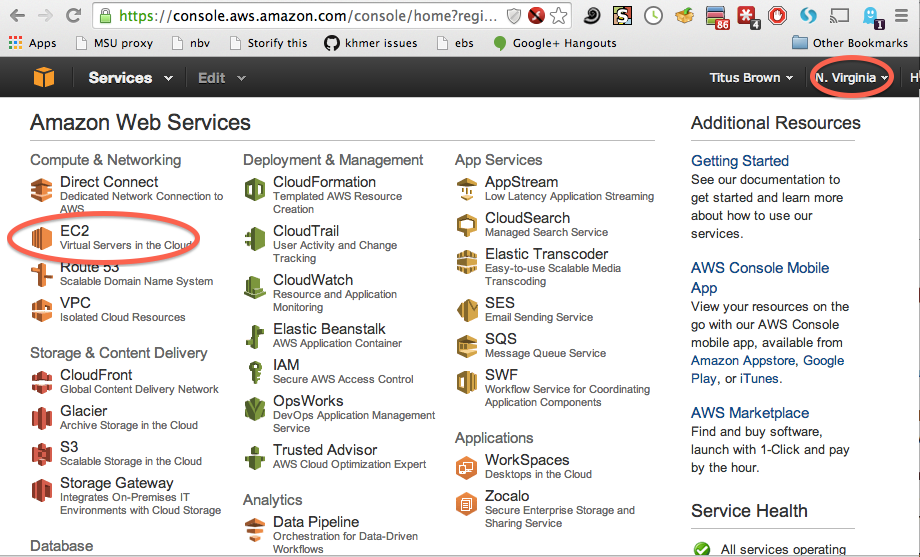
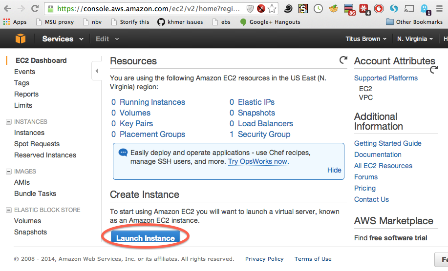
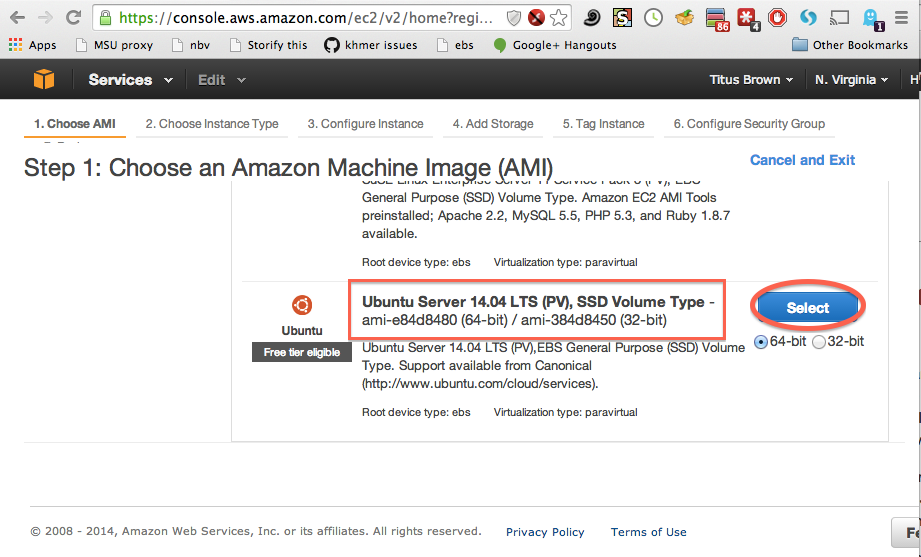
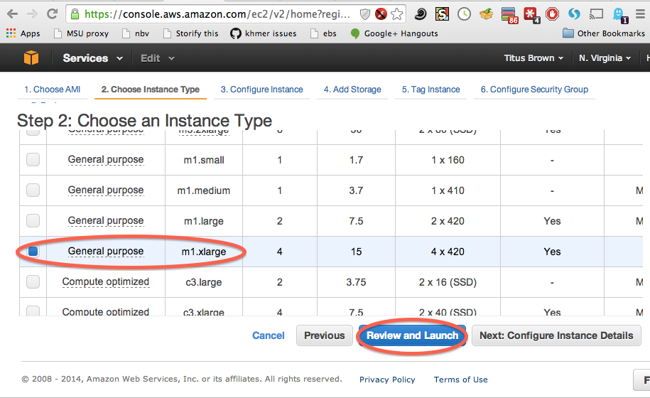
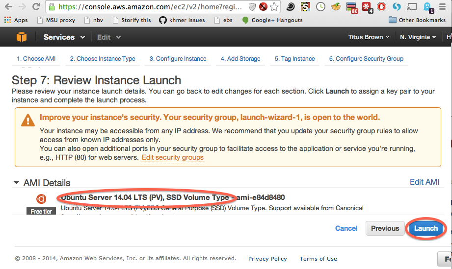
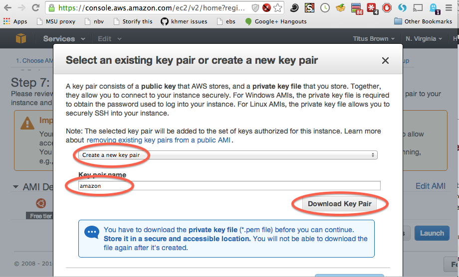
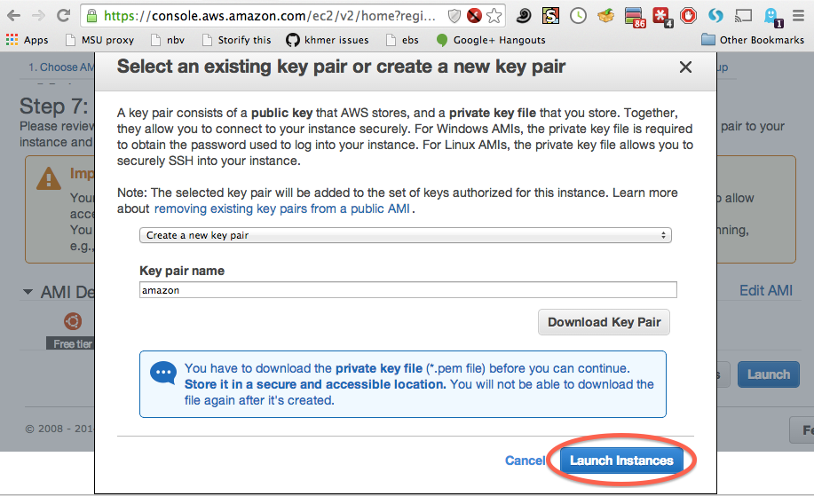
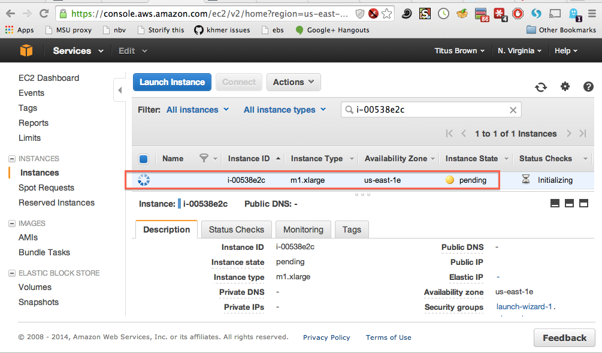
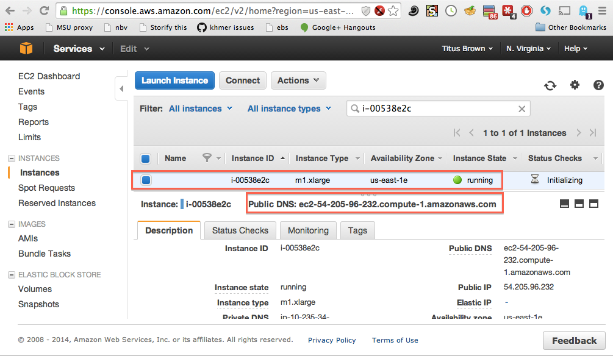

Start up an EC2 instance
========================

Here, we're going to startup an Amazon Web Services (AWS) Elastic
Cloud Computing (EC2) "instance", or computer.

----

Go to 'https://aws.amazon.com' in a Web browser.

Select 'My Account/Console' menu option 'AWS Management Console."

Log in with your username & password.

Make sure it says North Virginia in the upper right, then select EC2
(upper left).

Select "Launch Instance" (midway down the page).

Next, scroll down the list of operating system types until you find
Ubuntu 14.04 LTS (PV) -- it should be at the very bottom.  Click 'select'.
(See :doc:`starting-up-a-custom-ami` if you want to start up a custom
operating system instead of Ubuntu 14.04.)

Scroll down the list of instance types until you find "m1.xlarge".  Select
the box to the left, and then click "Review and Launch."

Ignore the warning, check that it says "Ubuntu 14.04 LTS (PV)", and cick
"Launch".

The *first* time through, you will have to "create a new key pair", which
you must then name (something like 'amazon') and download.

After this first time, you will be able to select an existing key pair.

Select "Launch Instance."

Select "view instance" and you should see a "pending" line in the
menu.

Wait until it turns green, then make a note of the "Public DNS" (we
suggest copying and pasting it into a text notepad somewhere).  This
is your machine name, which you will need for logging in.

Then, go to :doc:`log-in-with-ssh-win` or :doc:`log-in-with-ssh-mac`

You might also want to read about :doc:`terminating-your-instance`.
