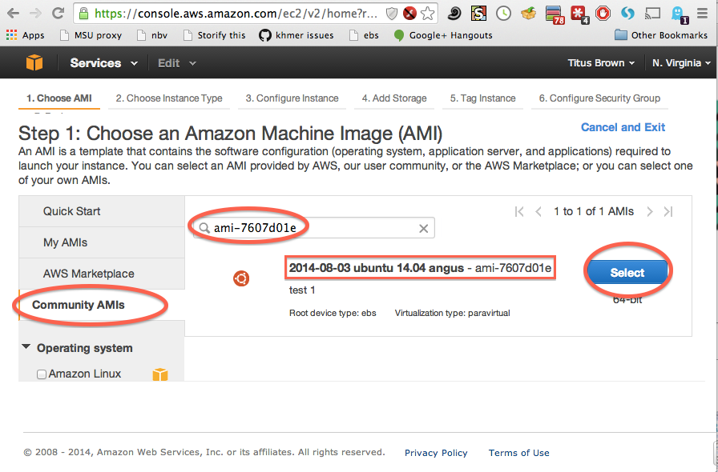

Starting up a custom operating system
=====================================

The instructions in :doc:`start-up-an-ec2-instance` tell you how to
start up a machine with Ubuntu Linux version 14.04 on it, but that
machine comes with very little software installed.  For anything
where you are executing actual analyses, you're going to want to have
a bunch of basic software installed.

Therefore, we make custom versions of Ubuntu available as well, that
come with some software pre-installed.  (See :doc:`technical-guide`
for a list of the packages installed on the ANGUS custom AMI.)

To boot these, go to EC2/Launch and select "Community AMIs" instead of
the default Quick Start; then type in the AMI number or name given to
you in the tutorial.  Below is a screenshot of an example for
'ami-7606d01e'.  Then proceed with the rest of
:doc:`start-up-an-ec2-instance`.

