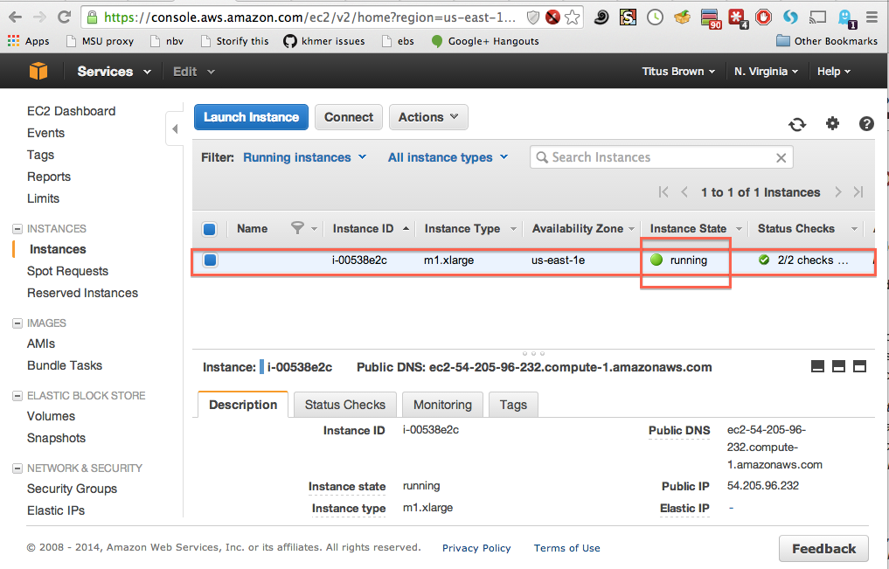
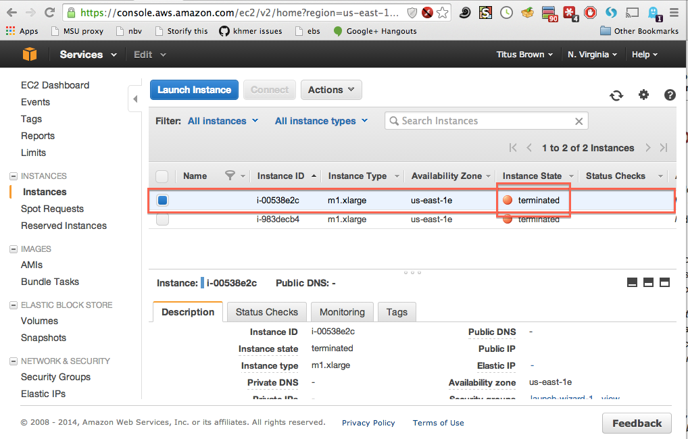

Terminating (shutting down) your EC2 instance
=============================================

While your instance is running, Amazon will happily charge you on a per-hour
basis -- `check out the pricing <http://www.ec2instances.info/>`__ for more
information.  In general, you will want to shut down your instance when
you're done with it; to do that, go to your EC2 console and find your
running instances (in green).

Then, select one or all of them, and go to the 'Actions...' menu, and
then select 'Terminate'.  Agree.

After a minute or two, the console should show the instance as "terminated".

