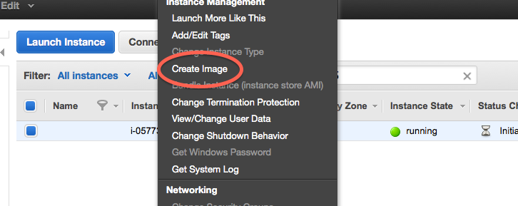
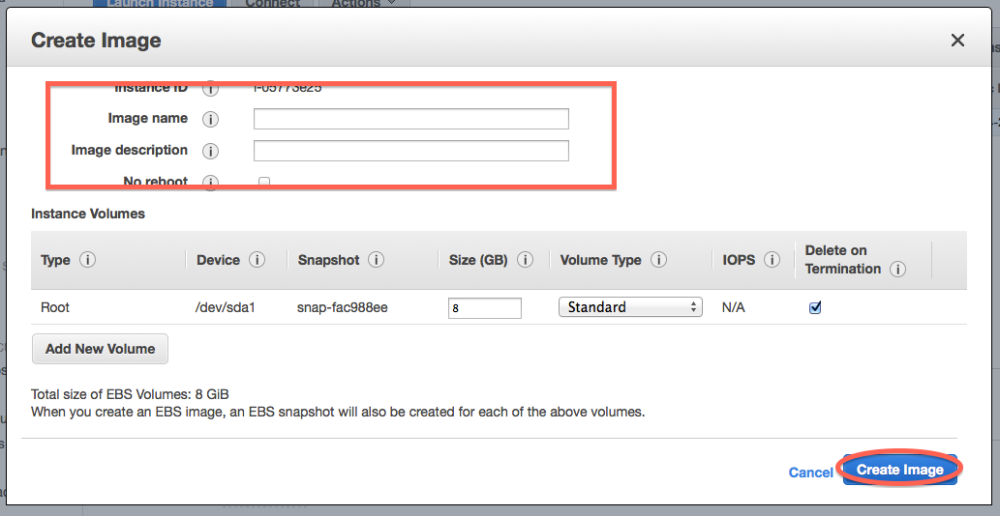

Creating a Custom AMI
=====================

When you find yourself continually starting EC2 instances and instantly having
to modify the AMI before each project, you may consider creating a custom AMI.
Below are the steps used to create ami-7f340c16.

Launch base image
-----------------

The ubuntu to provides at excellent base for our needs. As such we will begin
with ami-8f2718e6 (see :doc:`start-up-an-ec2-instance`). NOTE: It is important
to make sure the base image you choose is a community ami with public
permissions if want your ami to be available to the public.

Log in to the machine via the command line using::

		ssh -i <key_path> ubuntu@<machine_name>

Now you can start to add custom packages.

Customizing the instance
------------------------

Since our basic instance is a long-term release of Ubuntu, first we need to sure
everything is up to date::

		sudo –i
		apt–get –y update
		apt–get –y dist–upgrade

Next we need to make sure we have installed all packages commonly used in our
programs::

		apt-get -y install mercurial less python-matplotlib unzip bzip2 \
			zlib1g-dev ncurses-dev python-dev g++ screen pkg-config python-pip \
			curl git sysstat libgtextutils-dev make openjdk-7-jre-headless

The next few steps go through the process of installing software our lab uses
regularly.

Installing Software
-------------------

Install `ipython <http://ipython.org/>`__::

		cd /tmp
		git clone https://github.com/ipython/ipython.git
		cd ipython
		python setup.py install

Next the software needs to be configured::

		mkdir ~/.ipython
		cd ~/.ipython

Then, build a custom certificate for use with https::

		openssl req -x509 -nodes -days 365 -newkey rsa:1024 -keyout ~/.ipython/mycert.pem -out ~/.ipython/mycert.pem

Finally, ipython needs to be configured::

		ipython profile create
		cd profile_default/

Now you need to modify the configuration file so ipython can be accessed from
the end user's local machine::

		c.NotebookApp.certfile = u'/root/.ipython/mycert.pem'
		c.NotebookApp.ip = '*'
		c.NotebookApp.open_browser = False
		c.NotebookApp.password = u'sha1:6b543b7dcc9f:33d3890c64538eab5cad799d30605af314b6cb89'
		c.NotebookApp.port = 443

This basically sets things up to run under HTTPS on a public port, without
running a local browser on your EC2 instance, using the password ‘ngs’. See the
notebook docs for more information.

Enabling root access
--------------------

Since most of the lab's scripts require root access, it is a good idea to
permanently enable  this feature::

		perl -i -pe 's/disable_root: 1/disable_root: 0/' /etc/cloud/cloud.cfg
		perl -i -pe 's/#PermitRootLogin .*/PermitRootLogin without-password/' /etc/ssh/sshd_config
		perl -i -pe 's/.*(ssh-rsa .*)/\1/' /root/.ssh/authorized_keys

Next we want to make sure the image boots correctly. To do this simply type::

		reboot

Wait a minute or so to allow the machine to reboot. Then login using root::

		ssh -i <key_path> root@<machine_name>

Saving the new AMI
------------------

Now we know that the images working we can create a new AMI.  in the next steps
we will use the Amazon EC to console management page.

On the navigation pane click on "Instances" and this will take you to a list of
all your running machines. Right-click on the image  you would like to make an
AMI.  From the drop-down menu choose "Create Image".

This will open a pop-up window, where we will need to fill in the image name
and description. If you are making the image on behalf of GED, the naming
pattern is <project>/dragon/<current date>. For example, ami-7f340c16 is named 
khmer-protocols/dragon/2013.01.30.

Now press "create image". 

Generally it will take around five minutes for Amazon to process this request.
When the new AMI  has been created, you will be able to find it by using your
navigation pane in selecting AMIs.

For more information visit `documentation on Amazon 
<http://docs.aws.amazon.com/gettingstarted/latest/wah-linux/getting-started-create-custom-ami.html>`_.
