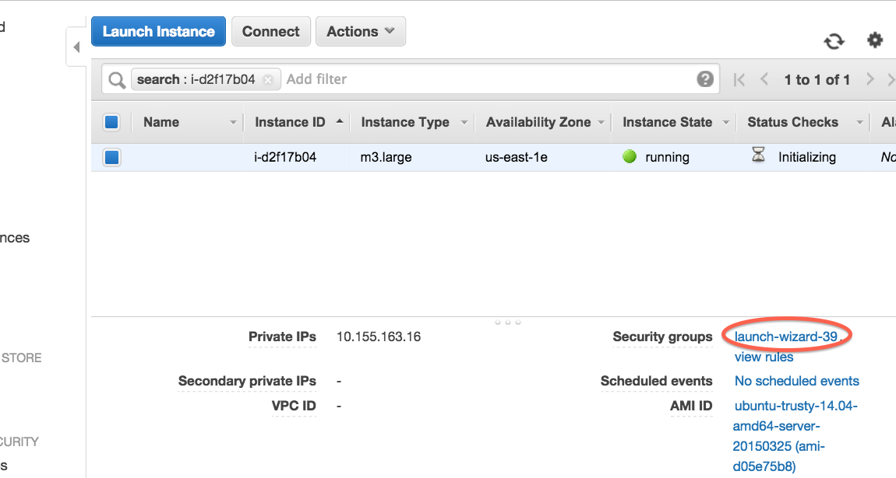
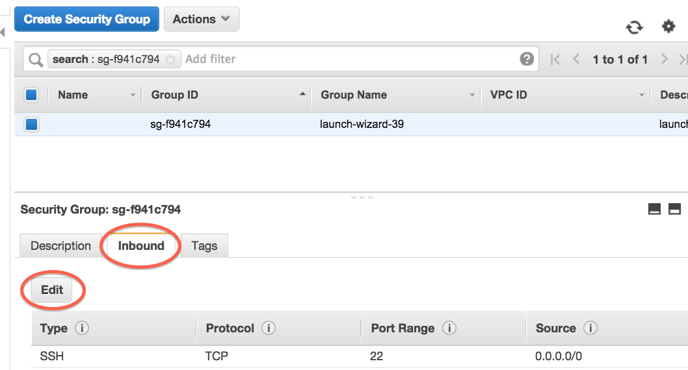
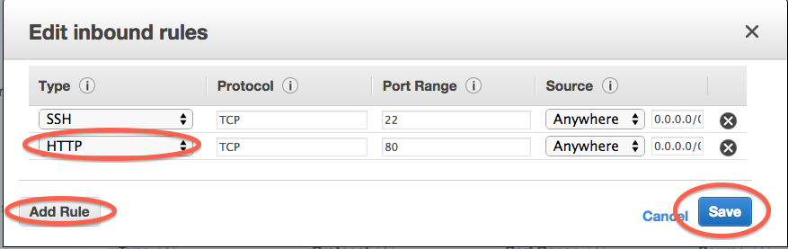

Enabling HTTP (Web) access to your EC2 server
=============================================

By default, you are only allowed to SSH into your EC2 server - this
is a security measure that prevents Evil Canadian Hackers from taking
over your rental computer.

For certain purposes - running a BLAST server, for example - you will need
to enable HTTP. To do this, locate the security group/security settings
for your Amazon instance:

Once there, click on "inbound" rules and "edit" them:

'Add rule', 'http', with default settings, and then click 'save'.

Voila - you will now be able to access your computer with HTTP as well as
SSH!
