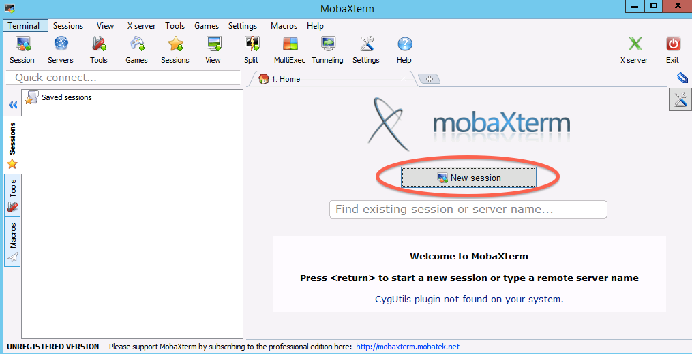
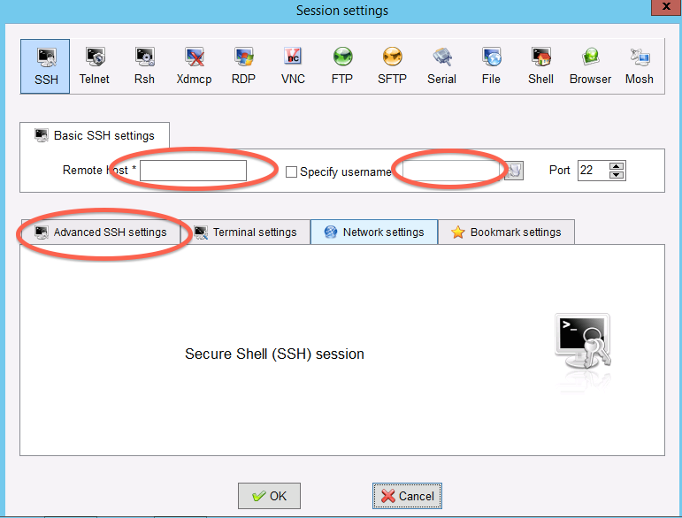
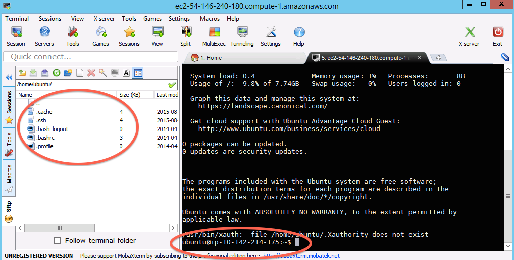

===============================================================
Logging into your new instance "in the cloud" (Windows version)
===============================================================

OK, so you've created a running computer.  How do you get to it?

The main thing you'll need is the network name of your new computer.
To retrieve this, go to the instance view and click on the instance,
and find the "Public DNS".  This is the public name of your computer
on the Internet.

Copy this name, and connect to that computer with ssh under the username
'ubuntu', as follows.

---

Install mobaxterm
~~~~~~~~~~~~~~~~~

First, download `mobaxterm <http://mobaxterm.mobatek.net/download.html>`__ and
run it.

Start a new session
~~~~~~~~~~~~~~~~~~~

Fill in session settings
~~~~~~~~~~~~~~~~~~~~~~~~

Put in your hostname (should be
``ec2-XXX-YYY-ZZZ-AAA.compute-1.amazon.aws.com``), select
'specify username', and enter 'ubuntu'.

Specify the session key
~~~~~~~~~~~~~~~~~~~~~~~

Copy the downloaded .pem file onto your primary hard disk (generally
C:) and the put in the full path to it.

.. image:: images/ec2-moba-3.png
   :width: 80%

Click OK
~~~~~~~~

Victory! (?)

----

Return to index: :doc:`index`
