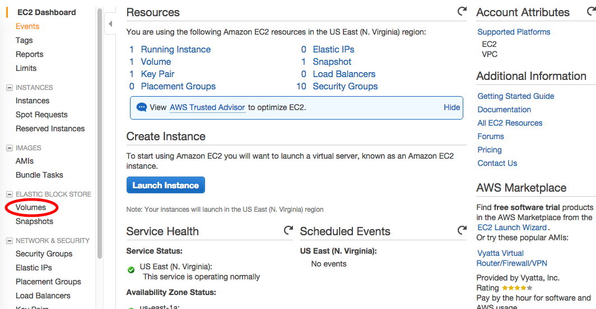
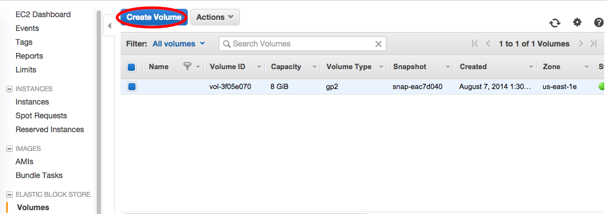
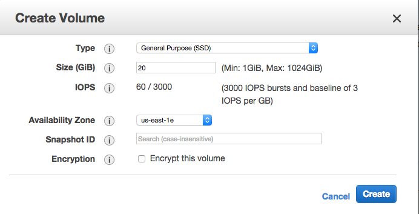
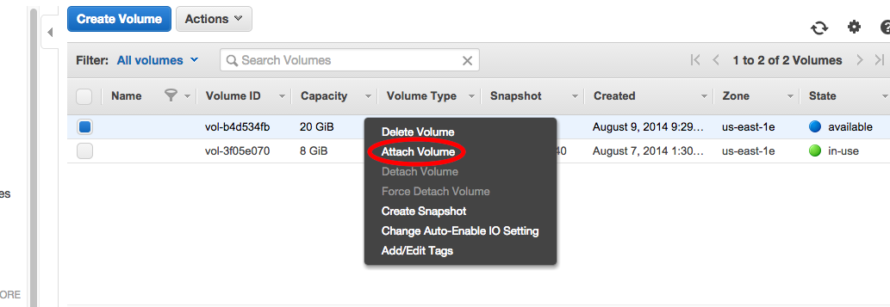
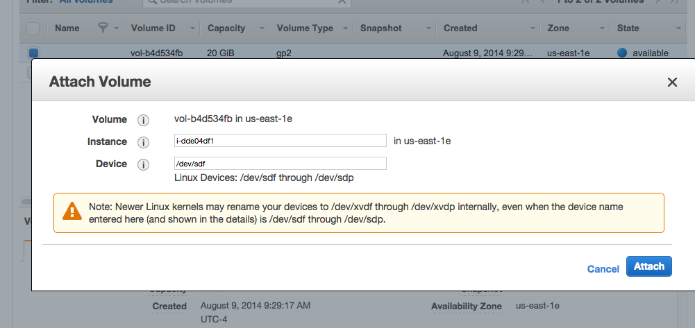

=================================================
Storing data persistently with Amazon EBS Volumes
=================================================

If you want to save your data across instances -- that is, if you want
to have persistent data -- Amazon can do that for you, too. 
Amazon is happy to rent disk space to you, in addition to compute time. 
They’ll rent you disk space in a few different ways, but the way that’s most 
useful for us is through what’s called Elastic Block Store(EBS). This is 
essentially a hard-disk rental service.

There are two basic concepts – “volume” and “snapshot”. A “volume” can be 
thought of as a pluggable-in hard drive: you create an empty volume of a 
given size, attach it to a running instance, and voila! You have extra hard 
disk space. Volume-based hard disks have two problems, however: first, they 
cannot be used outside of the “availability zone” they’ve been created in, 
which means that you need to be careful to put them in the same zone that 
your instance is running in; and they can’t be shared amongst people.

Snapshots, the second concept, are the solution to transporting and sharing 
the data on volumes. A “snapshot” is essentially a frozen copy of your 
volume; you can copy a volume into a snapshot, and a snapshot into a volume.

(Learn more from http://docs.aws.amazon.com/AWSEC2/latest/UserGuide/AmazonEBS.html)

In this and the following tutorials, you will be instructed to create 
new Amazon EBS Volume, to create Amazon EBS Snapshot from EBS Volume and to
restore EBS Volume from EBS Snapshot.

Prerequisites
-------------

This tutorial assumes you've already set up an account on Amazon Web
Services, and that you've completed the EC2 tutorial to set up an
Amazon instances.

Creating an Amazon EBS Volume
-----------------------------

Firstly open the Amazon EC2 console at 'https://console.aws.amazon.com/ec2>'
 and make sure it says North Virginia in the upper right.

At the AWS Management Console, on the left menu bar, click "Volumes".

Click "Create Volume".

Enter the desired size, and select the zone in which your instance is
running. The volume and instance must be in the same zone. Otherwise,
the volume cannot be attached to your instance.

Then click "Create".

Wait for your volume to finish being created, then click "Attach Volume".

Select the desired running instance. You may leave the Device at the
default: /dev/sdf. This is the name that your EC2 instance can use to
connect to the disk space. (If this is the second volume you want to attach
to this instance, this may be different, like /dev/sdg.)

Click "Attach".

When attachment is complete, connect to your instances via SSH.

If the volume is newly created, you must format the volume.

**WARNING: ONLY DO THIS ONCE, WHEN YOU FIRST CREATE THE VOLUME. OTHERWISE, YOU WILL LOSE ALL YOUR DATA. YOU SHOULD NOT DO THIS IF THE VOLUME IS RESTORED FROM A SNAPSHOT AND YOU WANT TO USE THE DATA ON IT.**

::

  ubuntu@ip-10-31-232-122:~$ sudo mkfs -t ext4 /dev/xvdf

Note1: here we use "xvdf" instead of "sdf".

Note2: The device may be different. 
If this is the second volume you 
attached to the same instance, the device ID may be /dev/xdg, so here just
use "xvdg" instead of "sdg". In this situation, for all the commands below,
replace "/dev/xvdf" by "/dev/xvdg".

Then, mount the volume. You'll do this every time you attach the volume to an instance::

  ubuntu@ip-10-31-232-122:~$ sudo mkdir /data
  ubuntu@ip-10-31-232-122:~$ sudo mount /dev/xvdf /data

Your drive is now ready to use -- it will be available under /data/.

Detaching an Amazon EBS Volume
------------------------------

Any volumes you have attached will automatically detach when you shut
down the instance.  You can also stop all processes that are using the
volume, change out of the directory, and type ::

  ubuntu@ip-10-31-232-122:~$ sudo umount -d /dev/xvdf

and then detach the volume via the AWS Web site.