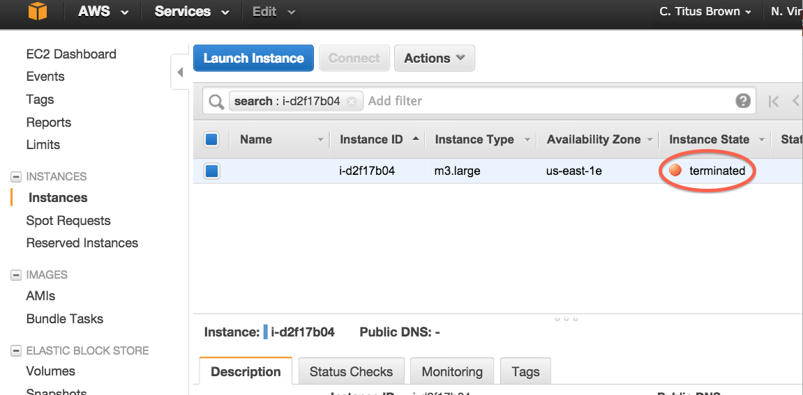

Terminating your instance
=========================

Be sure to terminate your instance(s) after transferring off any data
that you want to keep!

To terminate your instance, select the instance you want to terminate,
and then go to the 'Actions' menu and select 'Instance actions', 'terminate':

Wait a minute or two to be sure that the instance state changes to
"terminated":

