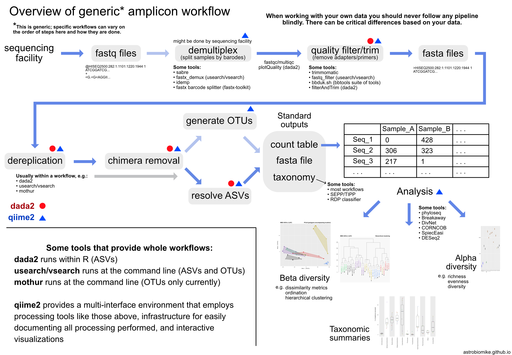
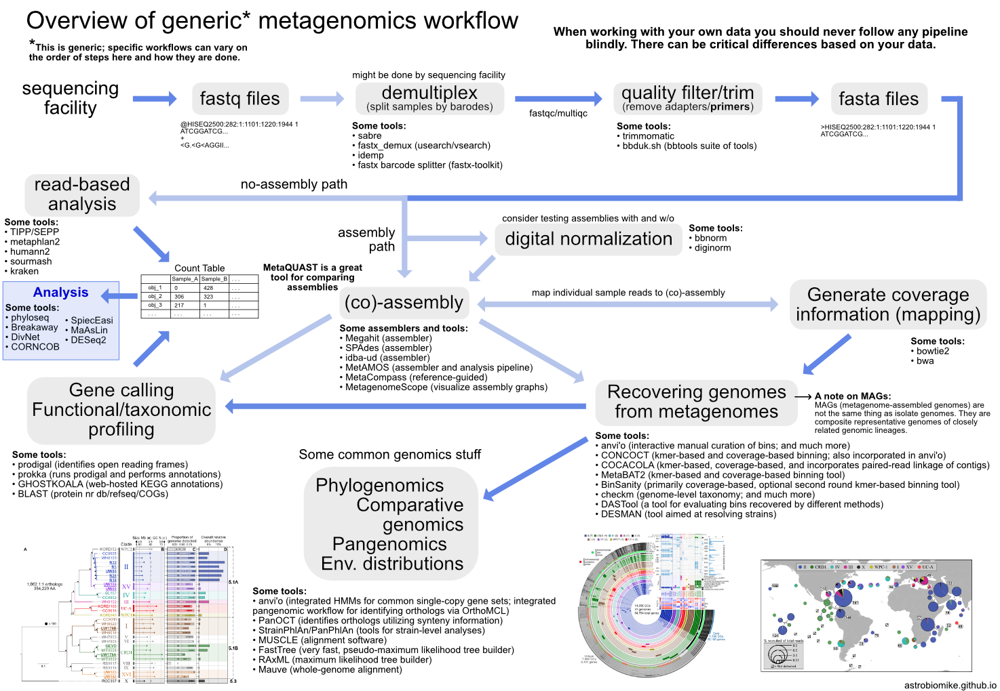

# Microbial Ecology - a discussion and overview of amplicon sequencing and metagenomics

>**ATTENTION!!**
>
> This is meant to be a guided, but very open discussion. Please feel free to jump in at any time with questions or thoughts on things!  

This page presents a broad-level overview of amplicon sequencing and metagenomics as applied to microbial ecology and outlines some generic workflows for each. Both of these methods are most often applied for exploration and hypothesis generation and should be thought of as steps in the process of science rather than end-points – like all tools of science 🙂 

**Amplicon sequencing**  

Amplicon sequencing of marker-genes (e.g. 16S, 18S, ITS) involves using specific primers that target a specific gene or gene fragment. It is one of the first tools in the microbial ecologist's toolkit. It is most often used as a broad-level survey of community composition used to generate hypotheses based on differences between recovered gene-copy numbers between samples.

**Metagenomics**  

Shotgun metagenomic sequencing aims to amplify all the accessible DNA of a mixed community. It uses random primers and therefore suffers much less from pcr bias (discussed below). Metagenomics enables profiling of taxonomy and functional potential. Recently, the recovery of representative genomes from metagenomes has become a very powerful approach in microbial ecology, drastically expanding the known Tree of Life by granting us genomic access to as-yet unculturable microbial populations (e.g. [Hug et al. 2016](https://www.nature.com/articles/nmicrobiol201648); [Parks et al. 2017](https://www.nature.com/articles/s41564-017-0012-7)). 

Here we'll discuss some of the things each is useful and not useful for, and then look at some general workflows for each. 

## Amplicon sequencing utility
* **Useful for:**
    * one metric of community composition
        * can say something about relative abundance of gene copies recovered
    * can track changes in community structure (as interpreted by recovered gene copy numbers) in response to a treatment and/or across environmental gradients/time
    * can provide strong support for further investigation of things 
        * e.g. *Trichodesmium–Alteromonas* story ([starting paper here](https://www.nature.com/articles/ismej201749))  

* **_Not_ useful for:**
    * abundance of organisms (or relative abundance of organisms)
        * recovered gene copies ≠ counts of organisms
            * gene-copy number varies per genome/organism (16S sequence can vary per genome)
            * pcr bias (small scale) -> under/over representation based on primer-binding efficiency
            * pcr bias (large scale) -> "universal" primers, only looking for what we know and they don't even catch all of that 
            * cell-lysis efficiencies
    * function
        * even if we can highly resolve the taxonomy of something from an amplicon sequence, it is still only one fragment of one gene
        * hypothesis generation is okay, e.g. speculating about observed shifts in gene-copy numbers based on what's known about nearest relatives in order to guide further work
        * but, for example, writing a metagenomics paper based on 16S data would likely not be a good idea
        * There is no strain-level resolving capability for a single gene, all that tells you is how similar those genes are.
        
        
As noted above, amplicon data can still be very useful. Most often when people claim it isn't, they are assessing that based on things it's not supposed to do anyway, e.g.:

> "Why are you doing 16S sequencing? That doesn't tell you anything about function."  
> 
> "Why are you measuring nitrogen-fixation rates? That doesn't tell you anything about the proteins that are doing it."  
> 
> **We shouldn't assess the utility of a tool based on something it's not supposed to do anyway 🙂**
        
## Metagenomics utility
* **Useful for:**
    * functional potential
    * insights into the genomes of as-yet unculturable microbes
    * much better for "relative" abundance due to no confounding copy-number problem and no drastic PCR bias (still not true abundance)
        * still some caveats, like cell-lysis efficiencies  

* **_Not_ useful for:**
    * abundance of organisms
    * "activity"
        * neither is transcriptomics or proteomics for that matter – each gives you insight into cellular regulation at different levels

<blockquote>

<b>QUICK QUESTION!</b>

With all that said, do you think we should expect relative abundance information from amplicon sequencing to match up with relative abundance from metagenomic sequencing? 

    <strong>Solution</strong>

No, and that's not a problem if we understand that neither are meant to tell us a true abundance anyway. They are providing different information is all. And the relative abundance metrics they do provide can still be informative when comparing multiple samples generated the same way 🙂

</blockquote>

# General workflows

## Amplicon overview

<a href="https://ndownloader.figshare.com/files/15628100">PDF download</a>

 

#### A Note on OTUs vs ASVs
All sequencing technologies make mistakes, and (to a much lesser extent), polymerases make mistakes as well during the amplification process. These mistakes artificially increase the number of unique sequences in a sample, a lot. Clustering similar sequences together (generating OTUs) emerged as one way to mitigate these errors and to summarize data – though at the cost of resolution. The field as a whole is moving towards using solely ASVs, and there is pretty good reasoning for this. This [Callahan et al. 2017 paper](https://www.nature.com/articles/ismej2017119) nicely lays out the case for that, summarized in the following points:  

* OTUs (operational taxonomic units)
    1. cluster sequences into groups based on percent similarity
    2. choose a representative sequence for that group
        * closed reference
            * **\+** can compare across studies
            * **\-** reference biased and constrained
        * de novo
            * **\+** can capture novel diversity
            * **\-** not comparable across studies
            * **\-** diversity of sample affects what OTUs are generated

* ASVs (amplicon sequence variants)
    1. attempt to identify the original biological sequences by taking into account error
        * **\+** enables single-nucleotide resolution
        * **\+** can compare across studies
        * **\+** can capture novel diversity

If you happen to work with amplicon data, I highly recommend digging into the [Callahan et al. 2017 paper](https://www.nature.com/articles/ismej2017119) sometime 🙂

## Metagenomics overview

<a href="https://ndownloader.figshare.com/files/15628103">PDF download</a>

