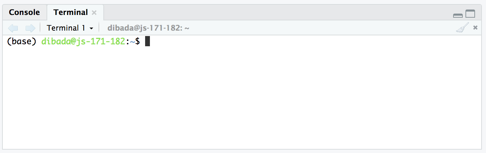
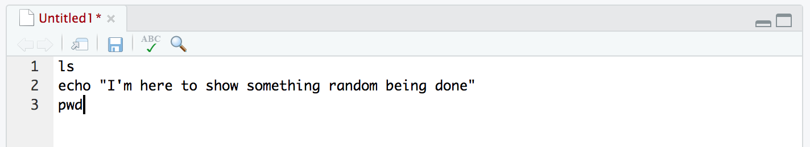
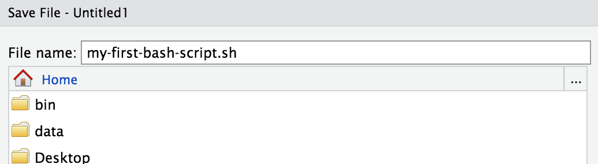
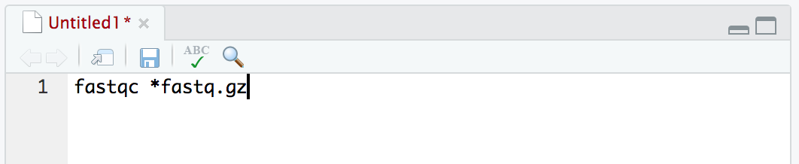
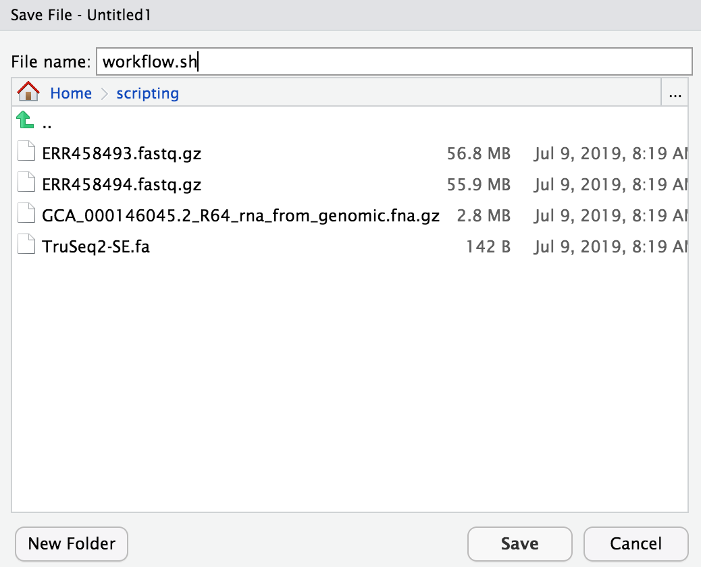
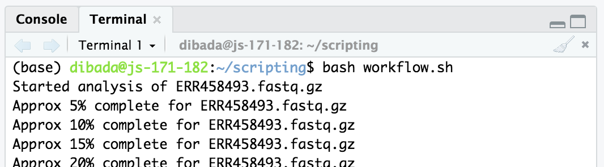
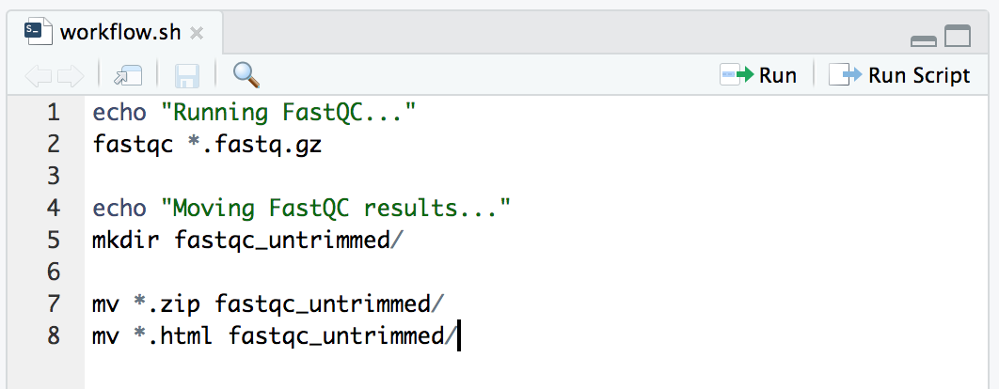
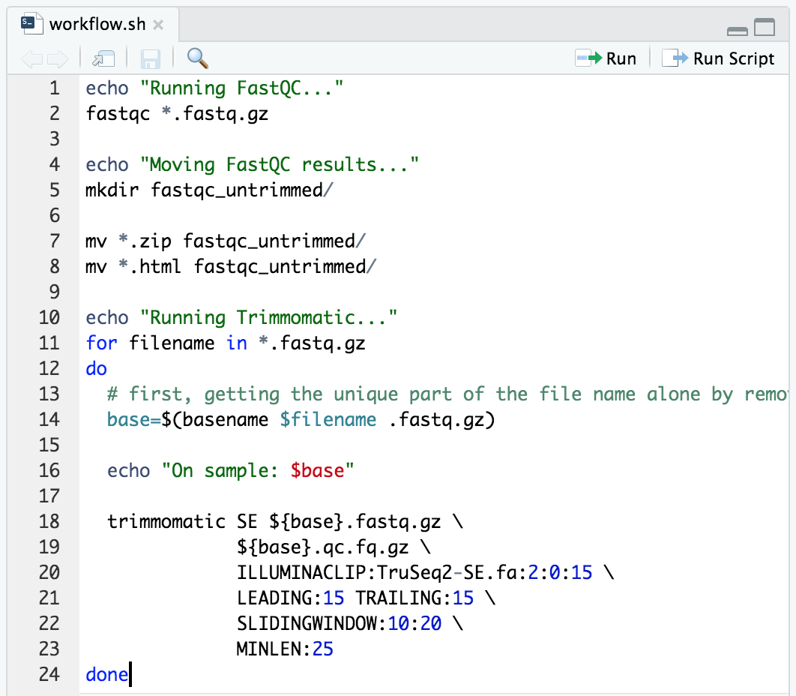

# Automating workflows using bash

## Objectives

+ Learn what a bash/shell script is and how to write one
+ Incorporate for loops within a shell script

---

We have now worked through two workflows, RNA-seq analysis and variant calling.
In both cases, we pasted all of our commands into the terminal one command at a time, and used for 
loops to run each step of the workflow over our six samples. This is necessary at first, and a great way
to understand how each tool works and establish a workflow we want to use.

Let's imagine now that we decided to download all 672 samples from this dataset
instead of only working with our six samples. Since we have already figured out how each tool in
our workflow works, and we know how we want to run them, one way we can automate (and document) our workflow is with a bash script (remember that *bash* is just the most common programming language used in our terminal environment). 

Here we are going to automate the quality assessment and trimming we did [here](quality-and-trimming.md) and the read quantification we performed [here](salmon-quant.md) in one script. But first, let's see what a bash script is!

## Accessing our JetStream intances
You should still have your jetstream instance running, you can follow the instructions [here](jetstream/boot.html) to log in to JetStream and find your instance. Then `ssh` into it following the instructions [here](jetstream/boot.html#ssh-secure-login).

Next, we're going to access RStudio again on our instances. RStudio will be convenient for being able to edit a text file alongside an active terminal window (command-line window). We'll see this in action in a second. As earlier, run the following link to produce
a url that navigates to RStudio when entered in your browser.

```bash
echo http://$(hostname -i):8787/
```

## Setting up our environment
Previously, we've been writting R code in the RStudio text-editor at the top left, but we can also write any kind of files there. So that will be where we build up our bash script. To start with a clean new document, select "**File**" from the top menu bar inside RStudio, then "**New File**", then "**Text File**". 

At the bottom left window is our R "console" right now. But if we select "**Tools**" from the top menu bar within RStudio, then "**Terminal**", and then "**New Terminal**", we will open a command-line terminal in that bottom left window that looks something like this:

<center></center>
<br>

This is the same as our terminal that we used to `ssh` into and then get the link to the RStudio environment, but we are just accessing it through RStudio here. Running commands like `cd`, `ls`, and others we've been using at the command line all work the same as if we were in a terminal outside of RStudio. If something isn't working there, double-check it is on the "Terminal" tab, and not the "Console" tab (the "Console" tab is the R environment, while the "Terminal" tab is our command-line environment).

## Our first bash script!
First, in the Terminal of RStudio, let's run these commands:

```bash
ls
echo "I'm here to show something random being done"
pwd
```

Those 3 commands just execute as we are used to when running them at the command line one-by-one. Now let's copy those 3 commands, and put them into our text editor window at the top-left:

<center></center>
<br>

And save the file in our home directory (which should be where it starts) as "my-first-bash-script.sh":

<center></center>
<br>

Now if we check at the command line, (our terminal window at the bottom left), we can see this file is there: 

```bash
ls *.sh
```

And we can run it by providing the command `bash`, and then the file we just made as a positional argument like so:

```bash
bash my-first-bash-script.sh
```

And all three lines are executed as though we entered them one at a time! **This is all a bash/shell script is** 🙂

Next let's build up a larger script!

## Grabbing some data
For the sake of speed while running things in this tutorial, we are going to be working with only 2 samples. But it would be the same process even if we had 200.

In the Terminal window of RStudio (bottom left), let's make a new directory to work in, download just two of our data files and the reference transcriptome we used for read quantification, and copy over the adapter file we used for Trimmomatic:

```bash
mkdir scripting/
cd scripting/

curl -L https://osf.io/5daup/download -o ERR458493.fastq.gz
curl -L https://osf.io/8rvh5/download -o ERR458494.fastq.gz
curl -O ftp://ftp.ncbi.nlm.nih.gov/genomes/all/GCA/000/146/045/GCA_000146045.2_R64/GCA_000146045.2_R64_rna_from_genomic.fna.gz

cp /opt/miniconda/pkgs/trimmomatic-*/share/trimmomatic-*/adapters/TruSeq2-SE.fa .
```

## Constructing a bash script
When we write a bash script, we need to add *all* the commands that we would run in our 
workflow if we were doing it in real-time. This includes making and changing directories, moving files, and 
running analysis programs like `fastqc`. 

Let's start by just running `fastqc` inside a script. 

**Don't enter this command in your Terminal, instead copy and paste it into a new text document in the top left panel (File -> New File -> Text File).**

```bash
fastqc *fastq.gz
```

<center></center>
<br>

And then save the file as "workflow.sh", and **be sure to save it in the "scripting/" directory** we are working in:

<center></center>
<br>

Now we have a bash script that automates `fastqc`! Let's run the bash script from our terminal in RStudio:**

```bash
bash workflow.sh
```

<center></center>
<br>

Let's add more to our script. Next we'll organize our output files, and add some `echo` commands to tell us where we are up to if we happen to be watching. **Add this text onto our file in the text-editor panel where our script is building, not in the Terminal window.**

```bash
echo "Running FastQC..."
fastqc *.fastq.gz

echo "Moving FastQC results..."
mkdir fastqc_untrimmed/

mv *.zip fastqc_untrimmed/
mv *.html fastqc_untrimmed/
``` 

And don't forget to save the file after making changes, `cmd + s` or `ctrl + s` should do the trick, and the file name at the top should change from red to black when saved:

<center></center>
<br>

Now, let's run this again. 

```bash
bash workflow.sh
```

We now see that our echo messages print to the terminal and tell us where we
are in the workflow. After it finishes, if we run `ls` on the "fastqc_untrimmed" directory, we see our `fastqc` output files are in there:

```bash
ls fastqc_untrimmed/
```

Now let's add our Trimmomatic command in a for loop like we did [here](https://angus.readthedocs.io/en/2019/quality-and-trimming.html#trimming-files-using-basename-and-for-loops): 

```bash
echo "Running FastQC..."
fastqc *.fastq.gz

echo "Moving FastQC results..."
mkdir fastqc_untrimmed/

mv *.zip fastqc_untrimmed/
mv *.html fastqc_untrimmed/

echo "Running Trimmomatic..."
for filename in *.fastq.gz
do
  # first, getting the unique part of the file name alone by removing ".fastq.gz"
  base=$(basename $filename .fastq.gz)
  
  echo "On sample: $base"

  trimmomatic SE ${base}.fastq.gz \
              ${base}.qc.fq.gz \
              ILLUMINACLIP:TruSeq2-SE.fa:2:0:15 \
              LEADING:15 TRAILING:15 \
              SLIDINGWINDOW:10:20 \
              MINLEN:25
done
``` 

And don't forget to save the file again:

<center></center>
<br>

And now we are ready to run it in our terminal window:

```bash
bash workflow.sh
```

<blockquote>
<center><b>PRACTICE!</b></center>

Add some commands at the end of our script that will:<br>&nbsp;&nbsp;1) run FastQC on the output files from Trimmomatic (those that end with ".qc.fq.gz")<br>&nbsp;&nbsp;2) create a new directory called "fastqc_trimmed"<br>&nbsp;&nbsp;3) move the output files from FastQC into "fastqc_trimmed".

<div class="toggle-header closed">
    <strong>Solution</strong>
</div>

<div class="toggle-content docutils container" style="width:100%">

<br>
Our entire file should now look something like this:

<div class="highlight-bash notranslate">
<div class="highlight">
<pre>
<span class="nb">echo "Running FastQC..."
fastqc *.fastq.gz<br>
echo "Moving FastQC results..."
mkdir fastqc_untrimmed/<br>
mv *.zip fastqc_untrimmed/
mv *.html fastqc_untrimmed/<br>
echo "Running Trimmomatic..."
for filename in *.fastq.gz
do<br>
&nbsp;&nbsp;# first, getting the unique part of the file name by removing ".fastq.gz"
&nbsp;&nbsp;base=$(basename $filename .fastq.gz)
&nbsp;&nbsp;echo On sample: $base<br>
&nbsp;&nbsp;trimmomatic SE ${base}.fastq.gz \
&nbsp;&nbsp;&nbsp;&nbsp;&nbsp;&nbsp;&nbsp;&nbsp;&nbsp;&nbsp;&nbsp;&nbsp;&nbsp;&nbsp;${base}.qc.fq.gz \
&nbsp;&nbsp;&nbsp;&nbsp;&nbsp;&nbsp;&nbsp;&nbsp;&nbsp;&nbsp;&nbsp;&nbsp;&nbsp;&nbsp;ILLUMINACLIP:TruSeq2-SE.fa:2:0:15 \
&nbsp;&nbsp;&nbsp;&nbsp;&nbsp;&nbsp;&nbsp;&nbsp;&nbsp;&nbsp;&nbsp;&nbsp;&nbsp;&nbsp;LEADING:15 TRAILING:15 \
&nbsp;&nbsp;&nbsp;&nbsp;&nbsp;&nbsp;&nbsp;&nbsp;&nbsp;&nbsp;&nbsp;&nbsp;&nbsp;&nbsp;SLIDINGWINDOW:10:20 \
&nbsp;&nbsp;&nbsp;&nbsp;&nbsp;&nbsp;&nbsp;&nbsp;&nbsp;&nbsp;&nbsp;&nbsp;&nbsp;&nbsp;MINLEN:25<br>
done<br>
echo "Running FastQC on trimmed files..."
fastqc *.qc.fq.gz<br>
echo "Moving trimmed FastQC results..."
mkdir fastqc_trimmed/<br>
mv *.zip fastqc_trimmed/
mv *.html fastqc_trimmed/</span>
</pre>
</div>
</div>

</div>
</blockquote>

Lastly, let's add on read quantification with Salmon like we did [here](salmon-quant.md#index-the-yeast-transcriptome). We only need to run the indexing command once, and then we can put a for loop to run the quantification command on our quality trimmed fastq files just like the one used [here](salmon-quant.md#run-salmon-on-all-the-samples):

```bash
echo "Running FastQC..."
fastqc *.fastq.gz

echo "Moving FastQC results..."
mkdir fastqc_untrimmed/

mv *.zip fastqc_untrimmed/
mv *.html fastqc_untrimmed/

echo "Running Trimmomatic..."
for filename in *.fastq.gz
do
  # first, getting the unique part of the file name alone by removing ".fastq.gz"
  base=$(basename $filename .fastq.gz)
  
  echo "On sample: $base"

  trimmomatic SE ${base}.fastq.gz \
              ${base}.qc.fq.gz \
              ILLUMINACLIP:TruSeq2-SE.fa:2:0:15 \
              LEADING:15 TRAILING:15 \
              SLIDINGWINDOW:10:20 \
              MINLEN:25
done

echo "Running FastQC on trimmed files..."
fastqc *.qc.fq.gz

echo "Moving trimmed FastQC results..."
mkdir fastqc_trimmed/

mv *.zip fastqc_trimmed/
mv *.html fastqc_trimmed/

echo "Indexing ref. transcriptome for Salmon..."
salmon index --index sc_index --type quasi --transcripts GCA_000146045.2_R64_rna_from_genomic.fna.gz

echo "Quantifying with Salmon..."
for filename in *.qc.fq.gz
do
  # getting the unique part of the file name alone by removing ".qc.fq.gz"
  base=$(basename $filename .qc.fq.gz)
  
  salmon quant -i sc_index --libType A \
               -r ${filename} -o ${base}_quant --seqBias \
               --gcBias --validateMappings
done

echo "Job Done!!"
```


Stellar! Don't forget to save it, and now let's run it!

```bash
bash workflow.sh
```

Bash scripting can be very powerful!!
