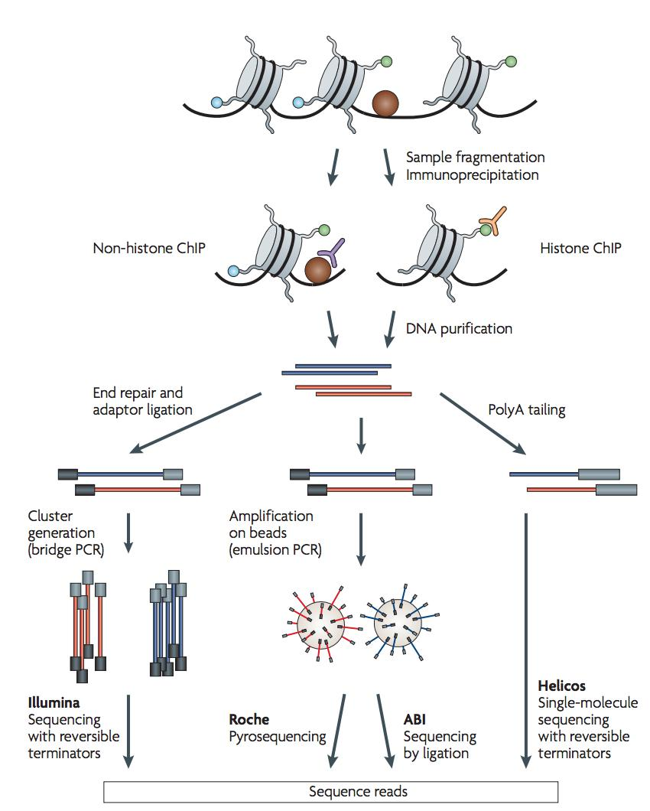
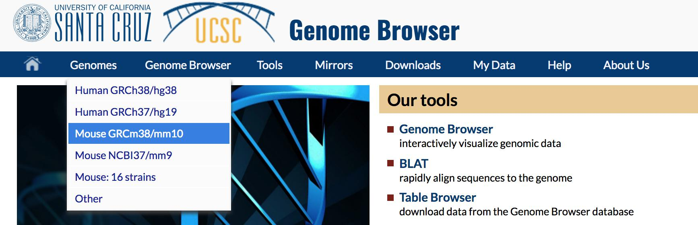
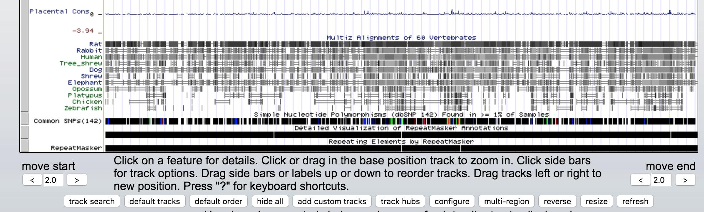
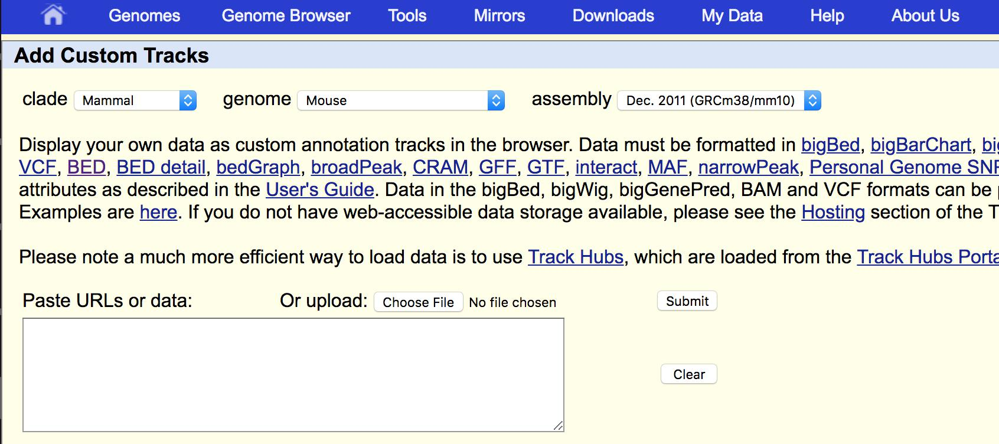
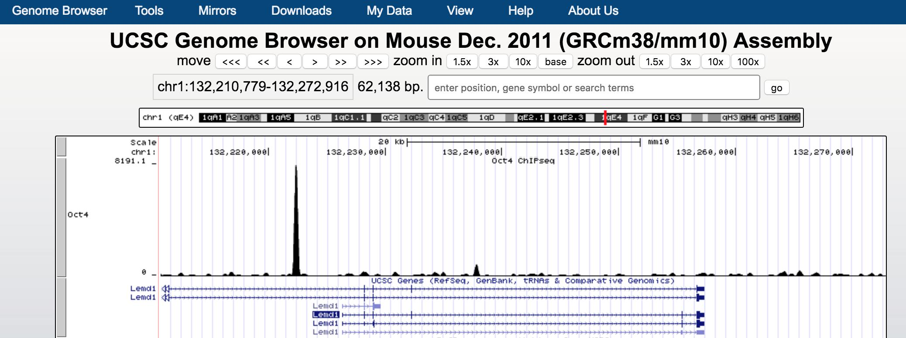
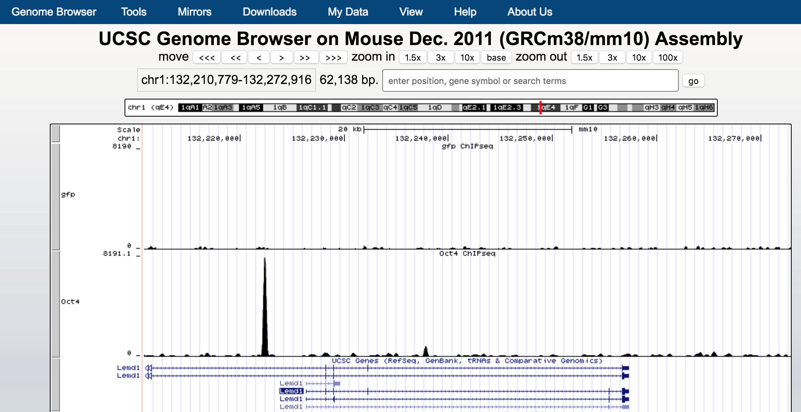
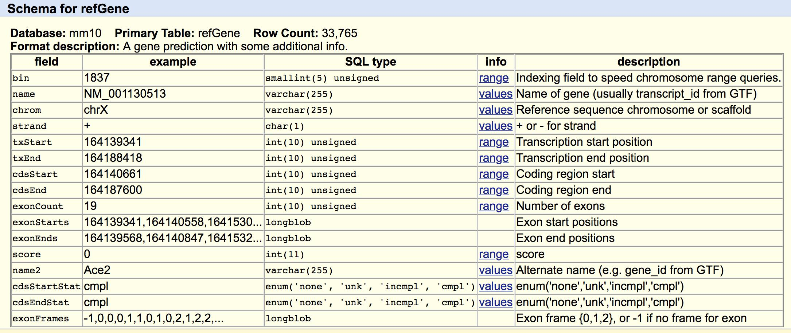

# ChIP-seq dibsi2018 tutorial

### Story line and background

> Before reading up, it might be good to start the data download using the command in the "Get some sample data" section below as it takes maybe 10 minutes to download. After starting the download, come back up and dig into the science.

Transcription of a gene is orchestrated by [transcription factors](https://en.wikipedia.org/wiki/Transcription_factor) and other proteins working in concert to finely tune the amount of RNA being produced through a variety of mechanisms. Understanding how transcription factors regulate gene expression is critical.

[Shinya Yamanaka](https://en.wikipedia.org/wiki/Shinya_Yamanaka) won the 2012 Nobel prize for the discovery that mature cells can be reprogrammed to become pluripotent. In his ground-breaking [paper](https://www.ncbi.nlm.nih.gov/pubmed/16904174) they showed that they could induce pluripotent stem cells from mouse adult fibroblasts by introducing four transcription factors, `Oct3/4`, `Sox2`, `c-Myc`, and `Klf4`, under embryonic stem cell culture conditions.
The material here is based on the ChIP‐seq Hands‐on Exercise, by Remco Loos and Myrto Kostadima at EMBL‐EBI, available [here](https://www.ebi.ac.uk/training/online/course/ebi-next-generation-sequencing-practical-course/chip-seq-analysis/chip-seq-practical). The transcription factor we will work on is `Oct4`!

### What is ChIP-seq?
ChIP-sequencing, also known as ChIP-seq, is a method used to analyze protein interactions with DNA. ChIP-seq combines chromatin immunoprecipitation (ChIP) with massively parallel DNA sequencing to identify the binding sites of DNA-associated proteins.

Briefly, DNA bounding proteins and DNA (Chromatin) are cross-linked by formaldehyde and the chromatin is sheared by sonication into small fragments (typically 200 ~ 600 bp). The protein-DNA complex is immnuoprecipitated by an antibody specific to the protein of interest. Then the DNA is purified and made to a library for sequencing. After aligning the sequencing reads to a reference genome, the genomic regions with many reads enriched are where the protein of interest bounds. ChIP-seq is a critical method for dissecting the regulatory mechanisms of gene expression.


### Our goal
The goal of this lesson is to perform some basic tasks in the analysis of ChIP-seq data. The first step includes an unspliced alignment for a small subset of raw reads. We will align raw sequencing data to the mouse genome using Bowtie2 and then we will manipulate the SAM output in order to visualize the alignment on the IGV/UCSC browser. Then based on these aligned reads we will find immuno-enriched areas using the peak caller MACS2. We will use `bedtools` to do some genomic interval overlapping analysis.

### Get some sample data

We will download the bundled data directly from the EMBL-EBI exercise [here](https://www.ebi.ac.uk/~emily/Online%20courses/NGS/ChIP-seq.zip).

The actual data that we will use for the ChIP-seq workflow are reported in Chen, X et al. (2008), [Integration of external signaling pathways with the core transcriptional network in embryonic stem cells. Cell](https://www.sciencedirect.com/science/article/pii/S009286740800617X). Jun 13;133(6):1106-17. It contains a few reads from the Mouse genome, and we will try to identify potential transcription factor binding sites of Oct4 in mouse embryonic stem cells.

Lets download these data using `wget` and uncompress using `unzip` as follows:
```
cd ~
wget https://www.ebi.ac.uk/~emily/Online%20courses/NGS/ChIP-seq.zip
sudo apt install unzip
unzip ChIP-seq.zip
```

### Setting up the tools

For this workflow, we are going to need the following tools:

* [Bowtie](http://bowtie-bio.sourceforge.net/index.shtml)
* [SAMtools](http://samtools.sourceforge.net/)
* [BEDTools](https://github.com/arq5x/bedtools2)
* [UCSC Tools](http://hgdownload.cse.ucsc.edu/admin/exe/)
* [MACS2](https://github.com/taoliu/MACS)
* [deepTools](https://deeptools.readthedocs.io/en/develop/)

And for visualization, we will use [UCSC genome browser](https://genome.ucsc.edu/).

Let do the installation process:

```bash
# this can take 5 mins
conda install -y bowtie2 samtools bedtools deeptools macs2 wget r-essentials bioconductor-deseq2 bioconductor-edger
```
We will also need a program called `bedGraphToBigWig`.
You can download the file from UCSC at [this link](http://hgdownload.cse.ucsc.edu/admin/exe/) as follows:


```
cd ~/
curl -O http://hgdownload.cse.ucsc.edu/admin/exe/linux.x86_64/bedGraphToBigWig

# make it executable
chmod +x bedGraphToBigWig

./bedGraphToBigWig

## explain here for path variable
echo $PATH

## explain the conda magic
## your conda path maybe different from the command below, however you should see the location from the 'echo $PATH' command
ls /opt/miniconda/bin | grep samtools

# for deepTools bamCoverage to convert a bam to bigwig, bedGraphToBigWig has to be in the path.
sudo mv bedGraphToBigWig /usr/local/bin
```

To make sure everything is installed correctly, type the following commands one by one and you should see some help messages.

```bash
bowtie2
samtools
macs2
bedtools
bedGraphToBigWig
# one command from deepTools
bamCoverage
```

### Let’s do mapping!

```
cd ~/ChIP-seq
```
The `.fastq` file that we will align is called Oct4.fastq. We will align these reads to the mouse chromosome. There are a number of competing tools for short read alignment, each with its own set of strengths, weaknesses, and caveats. Here we will try `Bowtie2`, a widely used ultrafast, memory efficient short read aligner.

Wait! How about quality?

Good point! The first step is (almost) always a quality assessment using FastQC and trimming/filtering tools like `Prinseq`, `trim_galore!` and `Trimmomatic`. In our case, someone has already done this, so we start with the “preprocessed” reads.

Bowtie has a number of parameters in order to perform the alignment. To view them all type:

```
bowtie2 --help
```

Bowtie uses indexed genome for the alignment in order to keep its memory footprint small. Because of time constraints we will build the index only for one chromosome of the mouse genome (can you find out which chromosome it is after mapping?). For this we need the chromosome sequence in fasta format. This is stored in a file named `mm10.fa`, under the subdirectory bowtie_index. The indexed chromosome is generated using the command (even if it’s just one chromosome, it will take ~5' to build):

```bash
bowtie2-build bowtie_index/mm10.fa bowtie_index/mm10
```

This command will output 6 files that constitute the index. These files that have the prefix mm10 are stored in the bowtie_index subdirectory. To view if they files have been successfully created type:

```bash
ls -l bowtie_index
```

Now that the genome is indexed we can move on to the actual alignment. The first argument `-x` provides the basename of the index for the reference genome (`mm10` in our case), the second argument `-U` provides the file with the unpaired reads to be aligned in `fastq` format, and the `-S` parameter makes sure that the output is in SAM format. Bear in mind that, by default, `bowtie2` searches for distinct, valid alignments for each read. When it finds a valid alignment, it continues looking for alignments that are nearly as good or better. The best alignment found is reported (randomly selected from among best if tied). Information about the best alignments is used to estimate mapping quality and to set SAM optional fields, such as `AS:i` and `XS:i`.

Align the Oct4 reads using Bowtie:

```
# finish in seconds, a real data set may take hours
## depending on number of CPU
bowtie2 -x bowtie_index/mm10 -U Oct4.fastq -S Oct4.sam -p 6
```

The above command outputs the alignment in SAM format and stores them in the file Oct4.sam. Have a look at the alignment file:

```
less -S Oct4.sam
```

**Questions:**

Can you distinguish between the header of the SAM format and the actual alignments? What kind of information does the header provide you with? To which chromosome are the reads mapped?

### Manipulate SAM output
`SAM` files are rather big and when dealing with a high volume of NGS data, storage space can become an issue. We can convert `SAM` to `BAM` files (their binary equivalent files that are not human readable) that occupy much less space.

Convert `SAM` to `BAM` using samtools and store the output in the file Oct4.bam. The input is automatically detected, but we need to instruct samtools that you want the output to be in BAM format (`-b`) and that you want the output to be stored in the file specified by the `-o` option:

```
samtools view -bo Oct4.bam Oct4.sam
```
Now, sort (by coordinates) and index the bam file

```bash
cd ~/ChIP-seq/

samtools sort Oct4.bam -o Oct4.sorted.bam

# index the bam
samtools index Oct4.sorted.bam
```

### Visualization

It is often instructive to look at your data in a genome browser. You could use something like [IGV](https://software.broadinstitute.org/software/igv/), a stand-alone browser, which has the advantage of being installed locally and providing fast access. Web-based genome browsers, like [Ensembl](http://useast.ensembl.org/index.html) or the [UCSC browser](https://genome.ucsc.edu/), are slower, but provide more functionality. They do not only allow for more polished and flexible visualisation, but also provide easy access to a wealth of annotations and external data sources. This makes it straightforward to relate your data with information about repeat regions, known genes, epigenetic features or areas of cross-species conservation, to name just a few. As such, they are useful tools for exploratory analysis. Visualisation will allow you to get a “feel” for the data, as well as detecting abnormalities and problems. Also, exploring the data in such a way may give you ideas for further analyses. For our visualization purposes we will use the `BAM` and `bigWig` formats.

#### Viewing with tview

```
cd ~/ChIP-seq/
samtools tview Oct4.sorted.bam bowtie_index/mm10.fa
```
`tview` commands of relevance:

* left and right arrows scroll
* q to quit
* CTRL-h and CTRL-l do “big” scrolls
* g to jump to the genomic region
```
# or alternatively specify the region you want to see
samtools tview -p chr1:173389928 Oct4.sorted.bam bowtie_index/mm10.fa
```

#### Viewing with Online Browsers
To visualize the alignments with an online browser, we need to convert the BAM file into a [bedgraph](https://genome.ucsc.edu/goldenpath/help/bedgraph.html) file. The bedgraph format is for display of dense, continuous data and the data will be displayed as a graph.

bedgraph file example:
```
track type=bedGraph name="BedGraph Format" description="BedGraph format" visibility=full color=200,100,0 altColor=0,100,200 priority=20
chr19 49302000 49302300 -1.0
chr19 49302300 49302600 -0.75
chr19 49302600 49302900 -0.50
chr19 49302900 49303200 -0.25
chr19 49303200 49303500 0.0
chr19 49303500 49303800 0.25
chr19 49303800 49304100 0.50
chr19 49304100 49304400 0.75
chr19 49304400 49304700 1.00
```
However, the bedgraph file can be big and slow when visualize in a genome browser. Instead, we will convert the bam file to [`bigWig`](https://genome.ucsc.edu/goldenpath/help/bigWig.html) format.

>The bigWig files are in an indexed binary format. The main advantage of this format is that only those portions of the file needed to display a particular region are transferred to the Genome Browser server. Because of this, bigWig files have considerably faster display performance than regular wiggle files when working with large data sets. The bigWig file remains on your local web-accessible server (http, https or ftp), not on the UCSC server, and only the portion needed for the currently displayed chromosomal position is locally cached as a "sparse file.

We will use `bamCoverage` from `deepTools` to convert the `bam` file to `bigWig` file on the fly.

```
# explain the flags!
bamCoverage -b Oct4.sorted.bam --normalizeUsing RPKM -p 5 --extendReads 200 -o oct4.bw

ls -lh
```

The command above takes bam file as input and output a bigwig file. Internally, `bamCoverage` converts the bam file first to `bedgraph` and then uses `bedGraphToBigWig` to convert it to `bigWig`. At this point, you have seen that most of the bioinformatics work is converting file formats.

`--extendReads` lets the program to extend the reads to 200bp (How long are the reads in the fastq file?). This is important as for a ChIP-seq experiment, we do size selection for ~200bp fragments and only sequence the first 26 bp to 100 bp. To recapitulate the real experimental condition, we want to extend the reads to the fragments length.

**Question**
what happens if we did not do the extending reads?

`--normalizeUsing RPKM` lets the program to normalize the `bigWig` file output to reads per kilobase per million total reads.

**Question**
why normalization is important?

#### Download the bigWig file to your local machine
On your local computer terminal not the jetstream instance terminal:
```

# to download your file from your instance, you need to have set a password
    # like we did for RStudio with `sudo passwd`)
# if that is done, you can pull it to your computer's current working directory from your cloud instance with a command like this:
scp dibXXXXX@XXX.XXX.XXX.XXX:~/ChIP-seq/oct4.bw .

# where you'd need to put in your appropriate class name, and the appropriate IP

# If you want a backup of this file from a previous run, you can run the following command:

curl -L https://ndownloader.figshare.com/files/12357641 -o oct4.bw
```

or use Rstudio sever to download. Open Rstudio server following [here](https://angus.readthedocs.io/en/2018/visualizing-blast-scores-with-RStudio.html) if you forget how to.

In the `Files` pannel:
```
check box the file ---> more ---> export
```
#### Viewing with UCSC


##### Hosting bigwig files

To visualize the `bigWig` file, we need to host our file to somewhere `UCSC genome browser` can acess. We will use [Open Science Framework](https://osf.io/).
Go to  https://osf.io/, create an account. click `My Quick Files` and upload the `Oct4.bw` file. click the file and you should see an url: `https://osf.io/crhxn`

go to [UCSC genome browser](https://genome.ucsc.edu/).

* select `mouse GRCm38/mm10` genome.

* click `add customer tracks` in the bottom of the browser.



* paste the following into the box
```
track type=bigWig name="Oct4" visibility="full" description="Oct4 ChIPseq" bigDataUrl=https://osf.io/crhxn/download
```



`bigDataUrl=https://osf.io/crhxn/download` is the link where you host the `bigWig` file. Everyone should have a similar link except the `crhxn` part. Click `submit` and then `go` and it will bring you to the genome browser view.

search `Lemd1` gene and click `go` you should see something like.



We see `Oct4` binds to the upstream of `Lemd1`.

**Question**
what happens if we choosed the wrong genome build in UCSC genome browser? Remember that we align the reads to mm10 genome build, if we choosed mm9 in the UCSC genome browser, can you still find the peak at `Lemd1` locus?

#### Viewing with IGV

You can also [download](https://software.broadinstitute.org/software/igv/download) `IGV` to your local computer and load the bigWig file to visualize it. (demonstrate if it is necessary)

### Aligning the control sample

what is a control sample in a ChIP-seq experiment? In our case, we have `gfp.fastq`. An antibody that recognizes GFP protein is used for pull-down. Since there is no GFP protein inside a cell unless we engineer the cells by overexpressing this protein, GFP-ChIP should only pull down non-specific GFP-associated DNA fragments. This can serve as a background noise control.

```
cd ~/ChIP-seq/

bowtie2 -x bowtie_index/mm10 -U gfp.fastq -S gfp.sam -p 6

samtools view -bSo gfp.bam gfp.sam

samtools sort gfp.bam -T gfp.temp -o gfp.sorted.bam

samtools index gfp.sorted.bam

bamCoverage -b gfp.sorted.bam --normalizeUsing RPKM -p 5 --extendReads 200 -o gfp.bw
```

**challenge**:
can you write a shell script to stream-line this proess? as you can see aligning the control sample steps are repetitive to the aligning oct4 sample steps.

can you visualize the `gfp.bw` together with the `Oct4.bw` in UCSC genome browser?

you should see something like:



You will need to configurate the tracks to show similar range of the scales of the data.

### macs2 peak calling

`MACS2` stands for Model based analysis of ChIP-seq. It was designed for identifying transcription factor binding sites. `MACS2` captures the influence of genome complexity to evaluate the significance of enriched ChIP regions, and improves the spatial resolution of binding sites through combining the information of both sequencing tag position and orientation. MACS2 can be easily used for ChIP-Seq data alone, or with a control sample to increase specificity.

The parameter `-c` provides as input the alignments for the control samples, `-t` provides the alignments for the treatment, `--format=BAM` specifies what is the file format of the input files and --name=Oct4 will set a prefix to all output files.

Of particular note are the next two parameters:

* `--gsize=138000000`: Effective genome size. It can be 1.0e+9 or 1000000000, or shortcuts:’hs’ for human (2.7e9), ‘mm’ for mouse (1.87e9), ‘ce’ for C. elegans (9e7) and ‘dm’ for fruitfly (1.2e8), Default:hs
* `--tsize=26`: Tag size. This will override the auto detected tag size. DEFAULT: Not set

```bash
macs2 callpeak -t Oct4.bam -c gfp.bam --format=BAM --name=Oct4 --gsize=138000000 --tsize=26

## confirm what are generated
ls -lh
```
Running `macs2` will produce the following 4 files:

* `Oct4_peaks.xls`: is a tabular file which contains information about called peaks. You can open it in excel and sort/filter using excel functions. Information include position, length and height of detected peak etc.
* `Oct4_peaks.narrowPeak`: is BED6+4 format file which contains the peak locations together with peak summit, p-value and q-value. You can load it directly to UCSC genome browser.
* `Oct4_summits.bed`: is in BED format, which contains the peak summits locations for every peaks. The 5th column in this file is -log10p-value the same as NAME_peaks.bed. If you want to find the motifs at the binding sites, this file is recommended. The file can be loaded directly to UCSC genome browser. But remember to remove the beginning track line if you want to analyze it by other tools.
* `Oct4_model.r`: is an R script which you can use to produce a PDF image about the model based on your data. Load it to R by: `$ Rscript NAME_model.r` Then a pdf file NAME_model.pdf will be generated in your current directory. Note, R is required to draw this figure.

cut out only the first 4 columns of the `narrowPeak` file:

```bash
cat Oct4_peaks.narrowPeak | cut -f1-4 > Oct_peaks.bed
```
Bonus: Try uploading the `Oct_peaks.bed` file generated by MACS2 to one of the genome browsers (IGV or UCSC). Find the first peak in the file (use the head command to view the beginning of the bed file), and see if the peak looks convincing to you.


### Use bedtools to to intersect bed files

It is very common to do genomic region overlap analysis. For this exercise, we want to find out which promoter regions are bound by Oct4. To do this we will first need the genomic coordinates of the promoters.

```
cd ~/ChIP-seq
curl -LO http://hgdownload.cse.ucsc.edu/goldenPath/mm10/database/refGene.txt.gz

# unzip the file
gunzip refGene.txt.gz

# have a look of the file
less -S refGene.txt
```

schema of the `refGene.txt`:


We will need field 3,4,5,6,13 and rearrange the columns to a bed format.

```
cat refGene.txt | cut -f3-6,13 | head

cat refGene.txt | cut -f3-6,13 | head | awk -v OFS='\t' '{print $1,$3,$4,$5,".",$2}'

cat refGene.txt | cut -f3-6,13 | awk -v OFS='\t' '{print $1,$3,$4,$5,".",$2}' > mm10_refgene.bed
```

Now, we want to get the promoter regions of the genes. The promoter definition is still arbitrary. We will use 5kb upstream of the transcription start site (TSS) as a promoter region. To do this, we will use [`bedtools flank`](http://bedtools.readthedocs.io/en/latest/content/tools/flank.html).

We will need a genome information file containing sizes of each chromsome.
```
# download the genome info file
curl -LO http://hgdownload.cse.ucsc.edu/goldenPath/mm10/bigZips/mm10.chrom.sizes

# get the 5kb promoter region
bedtools flank -i mm10_refgene.bed -g mm10.chrom.sizes -l 5000 -r 0 -s > mm10.genes.5kb.promoters.bed

# have a look of the file
head mm10.genes.5kb.promoters.bed

# compare to the original file
head mm10_refgene.bed
```
Which peaks overlap with the promoter regions? To do this, we will use [`bedtools intersect`](http://bedtools.readthedocs.io/en/latest/content/tools/intersect.html):

```bash
bedtools intersect -a Oct_peaks.bed -b mm10genes.5kb.promoters.bed -wa -wb > Oct4_peaks_overlap_promoter.txt
```
which genes?

```
cat Oct4_peaks_overlap_promoter.txt | cut -f8 | sort | uniq > genes_with_Oct4_binding.txt
```
Seeing is believing. Search several genes in the gene list in UCSC genome browser and see if there are binding peaks of Oct4 at the promoters or not!

## Alternatively you can use [HOMER](http://homer.ucsd.edu/homer/index.html)
First lets create a directory and download the homer installation script, and then run it
```
## This command creates the directory and (&&) if it is created it moves in the that directory
mkdir ~/homer && cd $_
curl -O http://homer.ucsd.edu/homer/configureHomer.pl
perl configureHomer.pl -install

## This command puts homer programs in your path, meaning you can use homer anywhere in your file system
export PATH=$PATH:/home/${USER}/homer/.//bin/
```
Homer has a number of organisms included, however they have to be installed. To list time the command is:
```
perl /home/${USER}/homer/.//configureHomer.pl -list
```
Since we are using the mouse genome v10, we will install mm10:
```
perl /home/${USER}/homer/.//configureHomer.pl -install mm10
```
Now we will [annotate](http://homer.ucsd.edu/homer/ngs/annotation.html) the peaks
```
annotatePeaks.pl Oct4_summits.bed mm10 > genes_with_Oct4_binding_homer.txt

less -S genes_with_Oct4_binding_homer.txt
```

Additionally you can add RNA-seq data to see the intersection of your datasets as such `annotation.pl <peak file> <genome> -gene <gene data file>   > output.txt`

Now lets compare the outputs:
```
wc genes_with_Oct4_binding*
```
Do we have the same output? What are some of the reasons they could be different?

### Further readings

* [Bedtools tutorial](http://quinlanlab.org/tutorials/bedtools/bedtools.html). You can do so much with this tool.
* Shameless plug in. I have collected many notes for ChIP-seq analysis in my [github](https://github.com/crazyhottommy/ChIP-seq-analysis) page.
