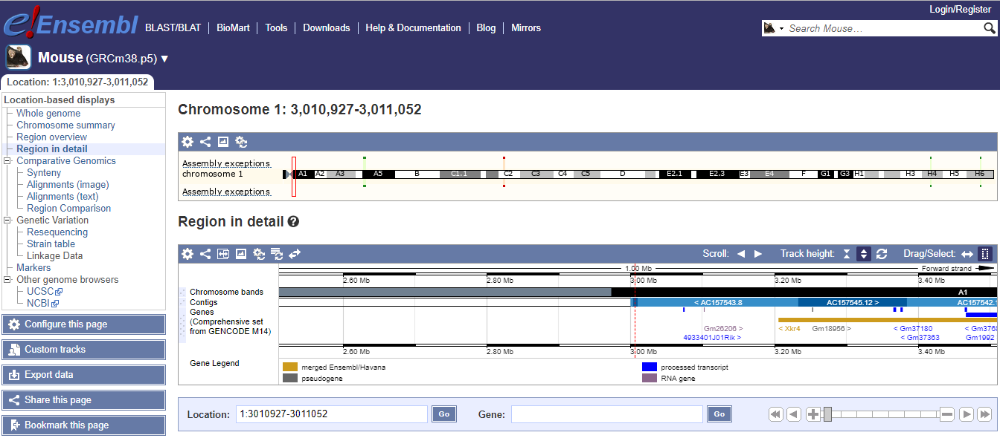

# Analyzing ChIP-seq data
_(the material here is based on the *ChIP­‐seq Hands­‐on Exercise*, by Remco Loos and Myrto Kostadima at EMBL‐EBI, available [here](https://www.ebi.ac.uk/training/online/course/ebi-next-generation-sequencing-practical-course/chip-seq-analysis/chip-seq-practical)_


## What is ChIP-seq?

ChIP-sequencing, also known as ChIP-seq, is a method used to analyze protein interactions with DNA. ChIP-seq combines chromatin immunoprecipitation (ChIP) with massively parallel DNA sequencing to identify the binding sites of DNA-associated proteins.


## Our goal

The goal of this lesson is to perform some basic tasks in the analysis of ChIP-seq data. The first step includes an unspliced alignment for a small subset of raw reads. We will align raw sequencing data to the mouse genome using Bowtie2 and then we will manipulate the SAM output in order to visualize the alignment on the IGV browser. Then based on these aligned reads we will find immuno-enriched areas using the peak caller MACS2. We will then perform functional annotation and motif analysis on the predicted binding regions.

## Get some sample data

We will download the bundled data directly from the EMBL-EBI exercise [here](https://www.ebi.ac.uk/~emily/Online%20courses/NGS/ChIP-seq.zip)

The actual data that we will use for the ChIP-seq workflow are reported in Chen, X et al. (2008), [Integration of external signaling pathways with the core transcriptional network in embryonic stem cells](http://www.sciencedirect.com/science/article/pii/S009286740800617X). Cell. Jun 13;133(6):1106-17. It contains a few reads from the Mouse genome, and we will try to identify potential transcription factor binding sites of Oct4 in mouse embryonic stem cells.

Lets download these data using `wget` and uncompress using `unzip` as follows:

```
cd ~
wget https://www.ebi.ac.uk/~emily/Online%20courses/NGS/ChIP-seq.zip
unzip ChIP-seq.zip
```

You should be able to see a new folder now in your home directory, with the name `ChIP-seq`, which contains both our reads (files `Oct4.fastq` and `gfp.fastq`), as well as some other files that will be useful down the road.

> Question: How many reads are in these files? How can you find out?


## Setting up the tools

For this workflow, we are going to need the following tools:
* [Bowtie](http://bowtie-bio.sourceforge.net/index.shtml)
* [SAMtools](http://samtools.sourceforge.net/)
* [BEDTools](http://code.google.com/p/bedtools/)
* [UCSC Tools](http://hgdownload.cse.ucsc.edu/admin/exe/)
* [MACS2](https://github.com/taoliu/MACS)

And for visualization, we will use ENSEMBL.

Let do the installation process:

### Bowtie:

```
wget https://downloads.sourceforge.net/project/bowtie-bio/bowtie2/2.3.2/bowtie2-2.3.2-linux-x86_64.zip
unzip bowtie2-2.3.2-linux-x86_64.zip

echo 'export PATH=$PATH:~/bowtie2-2.3.2' >> ~/.bashrc
source ~/.bashrc
```

### SAMtools:

Installation commands:
```
sudo apt-get -y install samtools
```

### Bedtools:

First check if you have bedtools installed, by running the following:
```
bedtools
```

If the output looks like the following, go ahead and install it:

```
The program 'bedtools' is currently not installed.
```

Installation commands:

```
curl -O -L https://github.com/arq5x/bedtools2/releases/download/v2.26.0/bedtools-2.26.0.tar.gz
tar -xzf bedtools-2.26.0.tar.gz

cd bedtools2
make
sudo make install
```

### bedGraphToBigWig:

You can download the file from `UCSC` as follows:

```
cd ~/
wget http://hgdownload.cse.ucsc.edu/admin/exe/linux.x86_64/bedGraphToBigWig
chmod +x bedGraphToBigWig
```

### MACS2:

The easiest way to install MACS2 is through PyPI system:

```
pip install numpy
pip install MACS2
```

This will take a few minutes, and in the end you can verify that everything is set by running MACS2:

```
macs2

```

should yield

```
 usage: macs2 [-h] [--version]
             {callpeak,bdgpeakcall,bdgbroadcall,bdgcmp,bdgopt,cmbreps,bdgdiff,filterdup,predictd,pileup,randsample,refinepeak}
             ...
  macs2: error: too few arguments
```

Ok, we are all set!

## Let's do mapping!

You can go directly to the folder by running:

```
cd ~/ChIP-seq
```


The `.fastq` file that we will align is called Oct4.fastq. We will align these reads to the mouse chromosome. There are a number of competing tools for short read alignment, each with its own set of strengths, weaknesses, and caveats. Here we will try `Bowtie2`, a widely used ultrafast, memory efficient short read aligner.

> **Wait! How about quality?**
>
> Good point! The first step is (almost) always a quality assessment using FastQC and trimming/filtering tools like Prinseq, trim_galore! and Trimmomatic. In our case, someone has already done this, so we start with the "preprocessed" reads.

Bowtie has a number of parameters in order to perform the alignment. To view them all type:

```
bowtie2 --help
```

Bowtie uses indexed genome for the alignment in order to keep its memory footprint small. Because of time constraints we will build the index only for one chromosome of the mouse genome. For this we need the chromosome sequence in fasta format. This is stored in a file named `mm10`, under the subdirectory `bowtie_index`. The indexed chromosome is generated using the command (even if it's just one chromosome, it will take ~2' to build):

```
bowtie2-build bowtie_index/mm10.fa bowtie_index/mm10
```

This command will output 6 files that constitute the index. These files that have the prefix mm10 are stored in the `bowtie_index` subdirectory. To view if they files have been successfully created type:

```
ls -l bowtie_index
```

Now that the genome is indexed we can move on to the actual alignment. The first argument `-x` provides the basename of the index for the reference genome (`mm10` in our case), the second argument `-U` provides the file with the unpaired reads to be aligned in `fastq` format, and the `-S` parameter makes sure that the output is in SAM format. Bear in mind that, by default, bowtie2 searches for distinct, valid alignments for each read. When it finds a valid alignment, it continues looking for alignments that are nearly as good or better. The best alignment found is reported (randomly selected from among best if tied). Information about the best alignments is used to estimate mapping quality and to set SAM optional fields, such as `AS:i` and `XS:i`.

Align the Oct4 reads using Bowtie:

```
bowtie2 -x bowtie_index/mm10 -U Oct4.fastq -S Oct4.sam
```

The above command outputs the alignment in SAM format and stores them in the file Oct4.sam. Have a look at the alignment file:

```
head -n 10 Oct4.sam
```

> **Questions:**
>
> Can you distinguish between the header of the SAM format and the actual alignments?
> What kind of information does the header provide you with?
> To which chromosome are the reads mapped?

### Manipulate SAM output

`SAM` files are rather big and when dealing with a high volume of NGS data, storage space can become an issue. We can convert `SAM` to `BAM` files (their binary equivalent files that are not human readable) that occupy much less space.

Convert `SAM` to `BAM` using `samtools` and store the output in the file `Oct4.bam`. You have to instruct samtools that the input is in `SAM` format (`-S`), the output should be in `BAM` format (`-b`) and that you want the output to be stored in the file specified by the `-o` option:

```
samtools view -bSo Oct4.bam Oct4.sam
```

## Visualization

It is often instructive to look at your data in a genome browser. You could use
something like [IGV](http://www.broadinstitute.org/igv/), a stand-alone browser, which has the advantage of being installed locally and providing fast access. Web-based genome browsers, like [Ensembl](http://www.ensembl.org/index.html) or the [UCSC browser](https://genome.ucsc.edu/), are slower, but provide more functionality. They do not only allow for more polished and flexible visualisation, but also provide easy access to a wealth of annotations and external data sources. This makes it straightforward to relate your data with information about repeat regions, known genes, epigenetic features or areas of cross-species conservation, to name just a few. As such, they are useful tools for exploratory analysis. Visualisation will allow you to get a "feel" for the data, as well as detecting abnormalities and problems. Also, exploring the data in such a way may give you ideas for further analyses. For our visualization purposes we will use the `BAM` and `bigWig` formats.

### Viewing with `tview`

SAMTools implements a very simple text alignment viewer based on the GNU `ncurses` library, called `tview`. This alignment viewer works with short indels and shows MAQ consensus. It uses different colors to display mapping quality or base quality, subjected to users' choice. SAMTools viewer is known to work with an 130GB alignment swiftly. Due to its text interface, displaying alignments over network is also very fast.

In order to use tview, we need first to sort the `BAM` file by position in the genome, and the index the produced sorted file so that we can randomly access it quickly.

Use the following commands. First, upgrade samtools:

```
cd
sudo mkdir /home/linuxbrew
sudo chown $USER:$USER /home/linuxbrew
git clone https://github.com/Linuxbrew/brew.git /home/linuxbrew/.linuxbrew

echo 'export PATH=/home/linuxbrew/.linuxbrew/bin:$PATH' >> ~/.bashrc
source ~/.bashrc

brew tap homebrew/science
brew install samtools

```

Now, sort:

```
cd ~/ChIP-seq/

samtools sort Oct4.bam -o Oct4.sorted.bam

samtools index Oct4.sorted.bam
```

Finally, Visualize with `tview`:

```
samtools tview Oct4.sorted.bam bowtie_index/mm10.fa
```

`tview` commands of relevance:

* left and right arrows scroll
* `q` to quit
* CTRL-h and CTRL-l do "big" scrolls

Alternatively, you can guide `tview` to start in a particular position, as follows:

```
samtools tview -p chr1:173389928 Oct4.sorted.bam bowtie_index/mm10.fa
```


### Viewing with Online Browsers

To visualize the alignments with an online browser, to convert the BAM file into a `bedgraph` file. The `bedgraph` format is for display of dense, continuous data and the data will be displayed as a graph.

So, we convert the `BAM` file into a `bedgraph`, called `Oct4.bedgraph`, using
the tool `genomeCoverageBed` from `BEDTools`:

```
genomeCoverageBed -bg -ibam Oct4.sorted.bam -g bowtie_index/mouse.mm10.genome > Oct4.bedgraph
```

The command above take as input a file called `mouse.mm10.genome` that is stored under the subdirectory `bowtie_index`. These genome files are tab-delimited and describe the size of the chromosomes for the organism of interest. When using the UCSC Genome Browser, Ensembl, or Galaxy, you typically indicate
which species/genome build you are working. The way you do this for BEDTools is to create a “genome” file, which simply lists the names of the chromosomes (or scaffolds, etc.) and their size (in basepairs). BEDTools includes pre-defined genome files for human and mouse in the `/genomes` directory included in the BEDTools distribution.

Let's try to load the file `Oct4.bedgraph` in the [Ensembl genome browser](http://www.ensembl.org/index.html). Select Mouse from the favorite genomes and then click on the `Display your data in Ensembl` link.  Now, upload the bedgraph file - you can either download it from your instance using RStudio, OR you can click on [this link](https://github.com/ngs-docs/angus/blob/update/chipseq/_static/Oct4.bedgraph?raw=true).

You will finally see a screen like this:



## Aligning the control sample

In the ChIP-seq folder you will find another `.fastq` file called `gfp.fastq`. We will follow the steps described above for this dataset in order to align the control reads to the mouse genome as well.

The commands are the following:

```
bowtie2 -x bowtie_index/mm10 -U gfp.fastq -S gfp.sam

samtools view -bSo gfp.bam gfp.sam

samtools sort gfp.bam -o gfp.sorted.bam

samtools index gfp.sorted.bam

genomeCoverageBed -bg -ibam gfp.sorted.bam -g bowtie_index/mouse.mm10.genome > gfp.bedgraph
```

Again, you can download this `gfp.bedgraph` from your own instance OR you can [grab it](https://github.com/ngs-docs/angus/blob/update/chipseq/_static/gfp.bedgraph?raw=true) from us.

## Finding enriched areas using MACS

MACS2 stands for Model based analysis of ChIP-seq. It was designed for identifying transcription factor binding sites. MACS2 captures the influence of genome complexity to evaluate the significance of enriched ChIP regions, and improves the spatial resolution of binding sites through combining the information of both sequencing tag position and orientation. MACS2 can be easily used for ChIP-Seq data alone, or with a control sample to increase specificity.

The parameter `-c` provides as input the alignments for the control samples, `-t` provides the alignments for the treatment, `--format=BAM` specifies what is the file format of the input files and `--name=Oct4` will set a prefix to all output files.

Of particular note are the next two parameters:
* `--gsize=138000000`: Effective genome size. It can be 1.0e+9 or 1000000000, or shortcuts:'hs' for human (2.7e9), 'mm' for mouse (1.87e9), 'ce' for C. elegans (9e7) and 'dm' for fruitfly (1.2e8), Default:hs
* `--tsize=26`: Tag size. This will override the auto detected tag size. DEFAULT: Not set

```
macs2 callpeak -t Oct4.bam -c gfp.bam --format=BAM --name=Oct4 --gsize=138000000 --tsize=26
```

Running `macs2` will produce the following 4 files:
1. `Oct4_peaks.xls`: is a tabular file which contains information about called peaks. You can open it in excel and sort/filter using excel functions. Information include position, length and height of detected peak etc.
2. `Oct4_peaks.narrowPeak`: is BED6+4 format file which contains the peak locations together with peak summit, p-value and q-value. You can load it directly to UCSC genome browser.
3. `Oct4_summits.bed`: is in BED format, which contains the peak summits locations for every peaks. The 5th column in this file is -log10p-value the same as NAME_peaks.bed. If you want to find the motifs at the binding sites, this file is recommended. The file can be loaded directly to UCSC genome browser. But remember to remove the beginning track line if you want to analyze it by other tools.
4. `Oct4_model.r`: is an R script which you can use to produce a PDF image about the model based on your data. Load it to R by: `$ Rscript NAME_model.r` Then a pdf file NAME_model.pdf will be generated in your current directory. Note, R is required to draw this figure.

> _Bonus_: Try uploading the peak file generated by MACS2 to one of the genome browsers (IGV or UCSC). Find the first peak in the file (use the head command to view the beginning of the bed file), and see if the peak looks convincing to you.

## Building a histogram from some ATAC-seq

The ability to visualize a bunch of peaks against a genome is really useful.
Let's go through it again for some ATAC-seq data!

Make a working directory:

```
cd ~/
mkdir atac
cd atac
```

Download a cut down data set; this is a bit from SRR3152806 that aligns
to some specific regions in mouse.

```
curl -L https://osf.io/5kq8s/download > SRR3152806.subset.R1.fq.gz
curl -L https://osf.io/hcqgp/download > SRR3152806.subset.R2.fq.gz
```

(All of the commands below work on the full data set too!)

Do some mapping:

```
bowtie2 -1 SRR3152806.subset.R1.fq.gz -2 SRR3152806.subset.R2.fq.gz -x ~/ChIP-seq/bowtie_index/mm10 -S SRR3152806.sam
```

Make a BAM from the alignment SAM, sort it, index it:

```
samtools view -bSo SRR3152806.bam SRR3152806.sam

samtools sort SRR3152806.bam -o SRR3152806.sorted.bam
samtools index SRR3152806.sorted.bam
```

Build a 'coverageBed' file that gives coverage per base in regions in the
genome:

```
genomeCoverageBed -bg -ibam SRR3152806.sorted.bam -g ~/ChIP-seq/bowtie_index/mouse.mm10.genome > SRR3152806.bedgraph
```

So let's take a look at this file --

```
head -20 SRR3152806.bedgraph
```

what's this format? It's *position within genome* and *mapping rate*
or some other quantity.

How do we figure out what regions are highest in this file?  It's a text
file, so we can sort on column 4 and take a look at a particular region --

```
sort -rn -k 4 SRR3152806.bedgraph | head -20
```

The bedgraph file for any REAL data set is going to be too big to upload
like we did above.  So instead we can use BigWig which we post to a public
URL and then UCSC downloads it from there.

```
~/bedGraphToBigWig SRR3152806.bedgraph ~/ChIP-seq/bowtie_index/mouse.mm10.genome SRR3152806.bw
```

This is now a file that we can give directly to UCSC.  But how do we do that!?
In general, these files will be too big (70+ MB per experiment).

## Adding a custom track

Let's start by using the file that we've already built and uploaded for you -
this is an example.

`https://raw.githubusercontent.com/ngs-docs/angus/2017/_static/SRR3152806.bw`

`https://raw.githubusercontent.com/ngs-docs/angus/2017/_static/tracks.txt`

We are working on making it possible to use [OSF.io](http://osf.io) to host such files - more soon.

## References

* Bailey T, Krajewski P, Ladunga I, et al. [Practical Guidelines for the Comprehensive Analysis of ChIP-seq Data](https://www.ncbi.nlm.nih.gov/pmc/articles/PMC3828144/). Lewitter F, ed. _PLoS Computational Biology_. 2013;9(11):e1003326. doi:10.1371/journal.pcbi.1003326.
