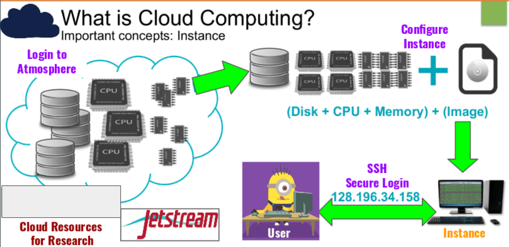
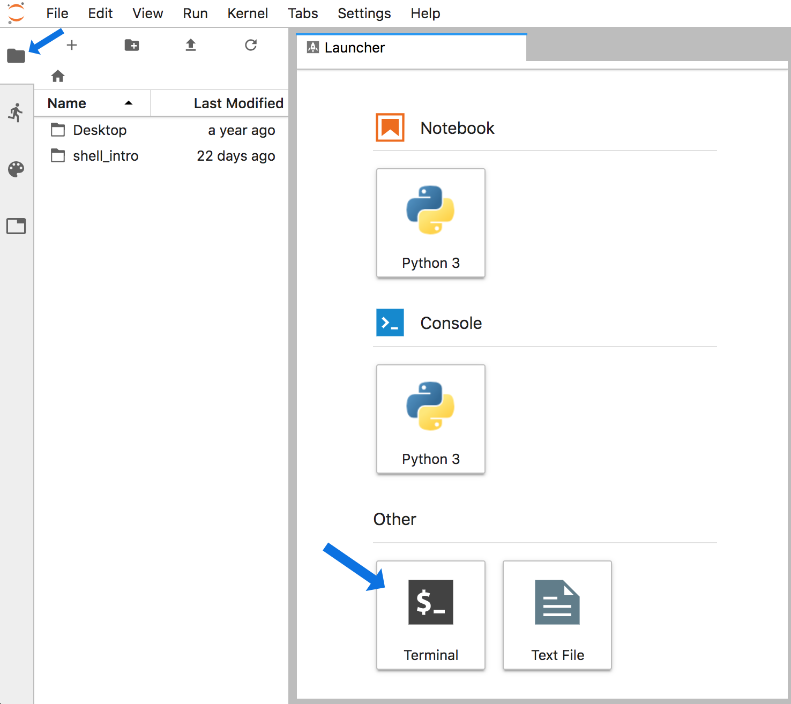
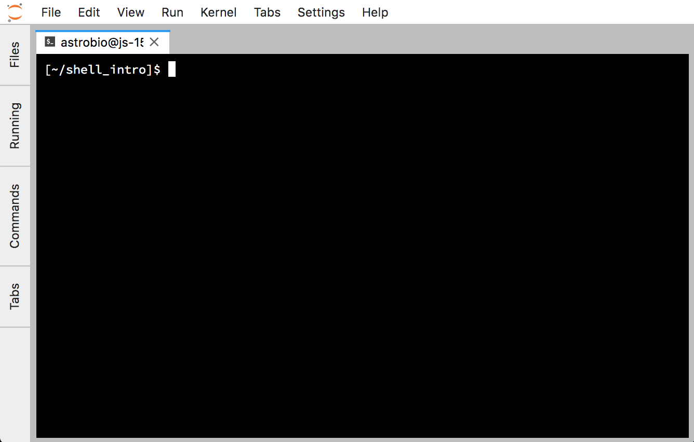
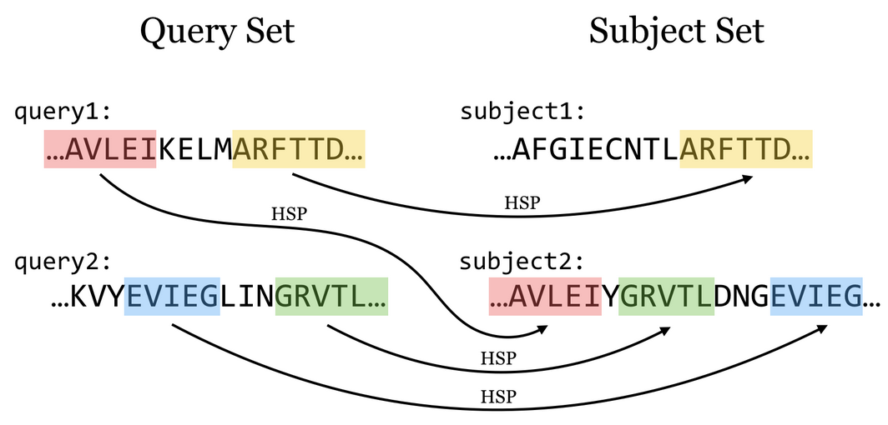
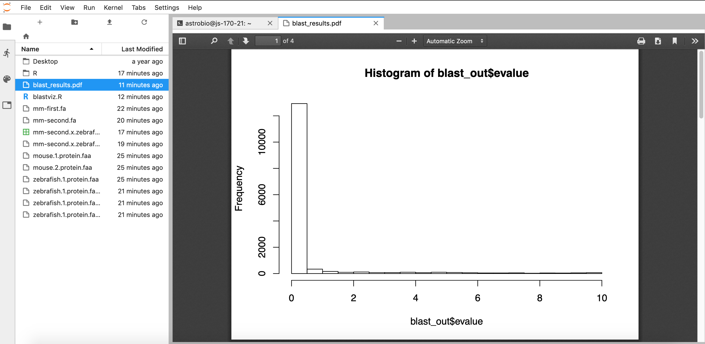

# Intro to cloud computing

## Learning Objectives:
+ Understand what cloud computing is
+ Get to know some popular cloud compute resources
+ Perform a command-line blast


## Rationale

Bioinformatics worldwide involves researchers connecting daily to cloud computing services to perform their analyses. Biology - like lots of areas - is dealing with a deluge of data due to the rapid advancement of data collection methods. It is now common that data collected for an experiment doesn't fit on a researcher's laptop and that the resources needed for running an analysis can far exceed a desktop computer's computing power. Cloud computing is a powerful avenue for dealing with this.

## What is the Cloud?

<center></center>
<br>

The cloud is basically lots of servers (think big computers) stacked together in a giant, powerful infrastructure. You can borrow part of this infrastructure for your computing needs. 

There are two main approaches to accessing computing time and power: 1) we can borrow computing time and resources from a commercial provider; or 2) you may have access to a computing infrastructure through your institution or somewhere else. Some countries have built national infrastructures where you can apply for computing time for your research projects. Most academic institutions or departments also have their own computing resources.

## Popular Cloud/HPC resources
+ Academic
    + [Jetstream](https://www.jetstream-cloud.org/)
    + [Atmosphere](https://atmo.cyverse.org/)

+ Commercial
    + [AWS](https://aws.amazon.com/getting-started/tutorials/launch-a-virtual-machine/)
    + [Google Cloud](https://cloud.google.com/)

## Let's connect to the cloud
We all have an IP address to link into our cloud computers stored in this [spreadsheet here](https://hackmd.io/LGeRCq5xRkm3ebSQ8lHgFg?view).

That will open a screen where you need to enter a password. (The password will be told to you in the room or in slack.) Then a screen like this will open (minus the blue arrows):

<center></center>
<br>

Now click the **files tab** at the top-left (that the smaller blue arrow points to above) and then click the "**Terminal**" icon at the bottom, and we'll be in our appropriate command-line environment:

<center></center>
<br>

Installing blast and creating a working directory:

```
cd ~/
conda install -y -c bioconda blast
mkdir opening_example
cd opening_example/
```

Note: takes 5-10 minutes


# Command Line BLAST
## Basic Local Alignment Search Tool

Given one or more query sequences (usually in FASTA format), BLAST looks for matching sequence regions between them and a subject set.

<center></center>
<br>

A sufficiently close match between subsequences (denoted by arrows in the figure above, though matches are usually longer than illustrated here) is called a high-scoring pair (HSP), while a query sequence is said to hit a target sequence if they share one or more HSPs

# Running command-line BLAST

The goal of this tutorial is to run you through a demonstration of the command line, which you may not have seen or used much before.

## Running BLAST

First! We need some data and an Rscript to later visualize blast results.  Let's grab the mouse and zebrafish RefSeq
protein data sets from NCBI, and put them in our home directory. We'll use `curl` to download the files; these originally came from the NCBI Web site: [ftp://ftp.ncbi.nih.gov/refseq/M_musculus/mRNA_Prot](ftp://ftp.ncbi.nih.gov/refseq/M_musculus/mRNA_Prot).

```
curl -o mouse.1.protein.faa.gz -L https://osf.io/v6j9x/download
curl -o mouse.2.protein.faa.gz -L https://osf.io/j2qxk/download
curl -o zebrafish.1.protein.faa.gz -L https://osf.io/68mgf/download
curl -o blastviz.R -L https://osf.io/e548g/download
```

To look at the files in your current directory:

```
ls -l
```

All three of the sequence files are FASTA protein files (that's what the .faa
suggests) that are compressed with `gzip` (that's what the .gz means).

Uncompress them:

```
gunzip *.faa.gz
```

And let's look at the first few sequences in the file:

```
head mouse.1.protein.faa 
```

These are protein sequences in FASTA format.  FASTA format is something
many of you have probably seen in one form or another -- it's pretty
ubiquitous.  It's a text file, containing records; each record
starts with a line beginning with a '>', and then contains one or more
lines of sequence text.

Let's take those first two sequences and save them to a file.  We'll
do this using output redirection with '>', which says "take
all the output and put it into this file here."

```
head -11 mouse.1.protein.faa > mm-first.fa
```

Now let's BLAST these two sequences against the entire zebrafish protein data set. First we need to create a database. That's done by calling 'makeblastdb':

```
makeblastdb -in zebrafish.1.protein.faa -dbtype prot
```

Next, we call BLAST to do the search:

```
blastp -query mm-first.fa -db zebrafish.1.protein.faa
```

This should run pretty quickly, but you're going to get a lot of output!!
To save it to a file instead of watching it go past on the screen,
ask BLAST to save the output to a file that we'll name `mm-first.x.zebrafish.txt`:

```
blastp -query mm-first.fa -db zebrafish.1.protein.faa -out mm-first.x.zebrafish.txt
```

and then you can 'page' through this file at your leisure by typing:

```
less mm-first.x.zebrafish.txt
```

(Type spacebar to move down, and 'q' to get out of paging mode.)

-----

Let's do some more sequences (this one will take a little longer to run):

```
head -498 mouse.1.protein.faa > mm-second.fa

blastp -query mm-second.fa -db zebrafish.1.protein.faa -out mm-second.x.zebrafish.txt
```

will compare the first 96 sequences. You can look at the output file with:

```
less mm-second.x.zebrafish.txt
```

(and again, type 'q' to get out of paging mode.)

Notes:

* you can copy/paste multiple commands at a time, and they will execute in order;

* why did it take longer to BLAST ``mm-second.fa`` than ``mm-first.fa``?


----

Last, but not least, let's generate a more machine-readable version of that
last file --

```
blastp -query mm-second.fa -db zebrafish.1.protein.faa -out mm-second.x.zebrafish.tsv -outfmt 6
```

See [this link](http://www.metagenomics.wiki/tools/blast/blastn-output-format-6) for a description of the possible BLAST output table formats.

Now we'll run an R script to visualize the blast results:

```
Rscript blastviz.R
```

A pdf will be generated with the results. We can view this by clicking on the Folder icon at the left ofour screen, and then double clicking on the file at the top to open the pdf:

<center></center>
<br>

Things to mention and discuss:

* `blastp` options and -help.
* command line options, more generally - why so many?
* automation rocks!
