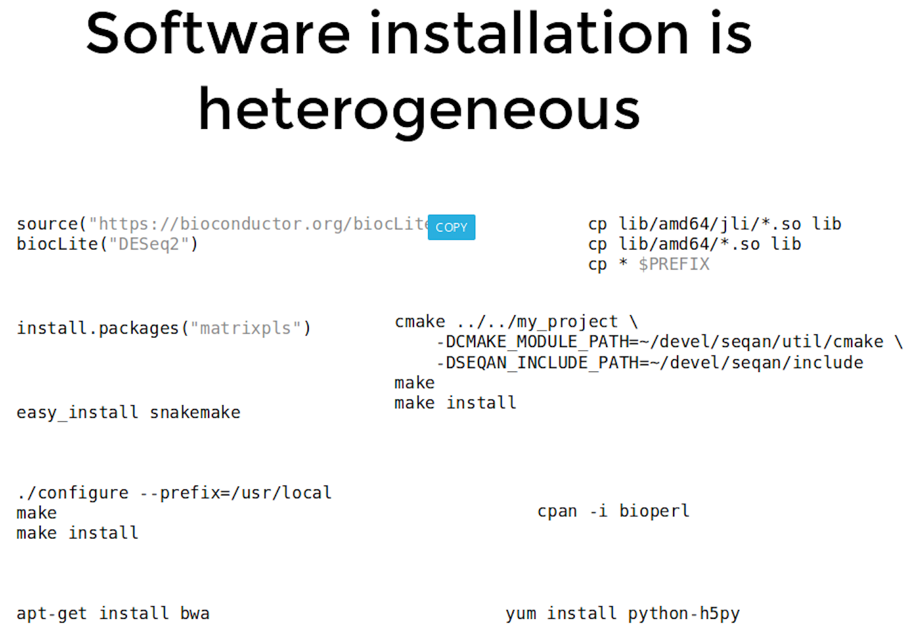
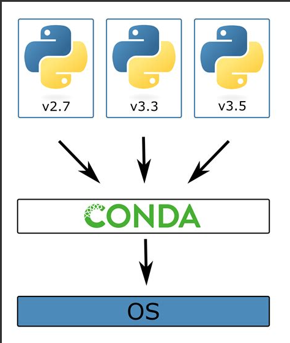
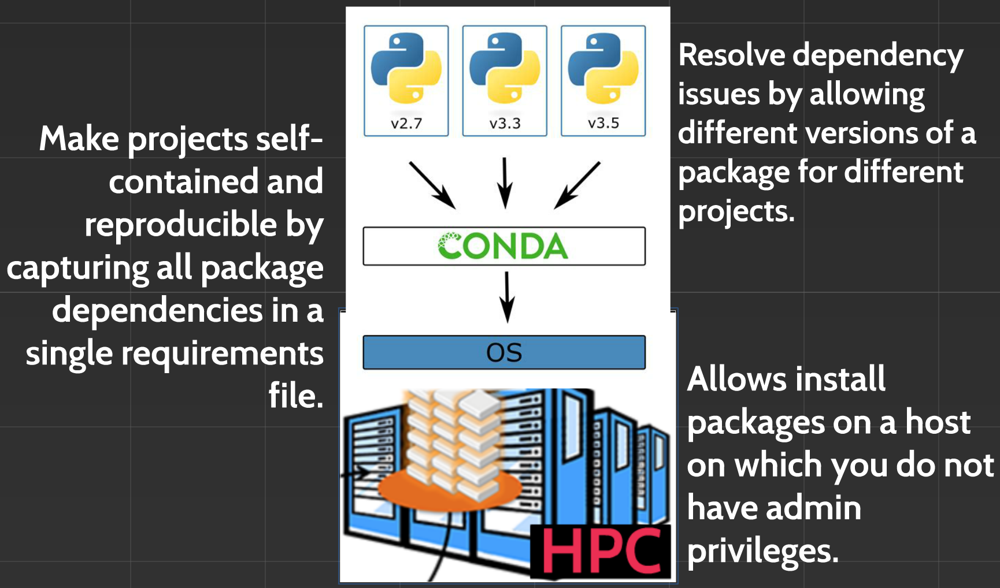
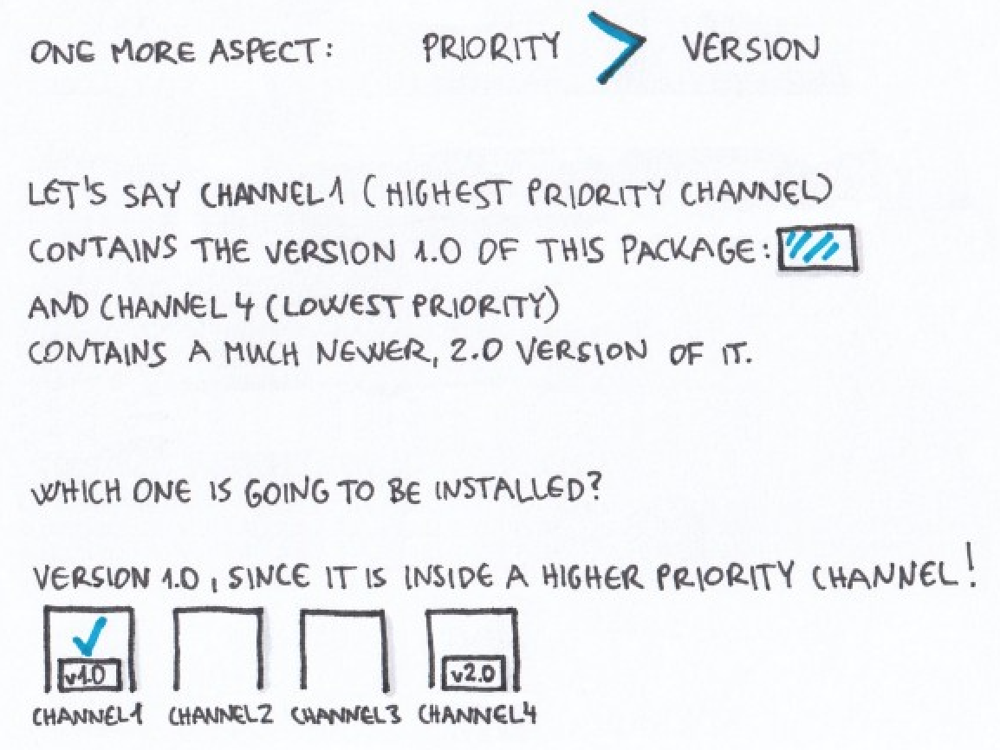

# Environment management with Conda

## Learning objectives
+ Why should I use a package and environment management system as part of my research workflow?
+ What is Conda? Why use Conda?
+ Manage Conda environments
+ Conda channels & packages

# Why should I use a package and environment management system?



Installing software is hard. Installing scientific software (including all required dependencies of said software!) is often even more challenging. 

Installing software system-wide  creates complex dependencies between your reearch projects that shouldn’t really exist!

Rather than installing software system-wide, wouldn’t it be great if we could install software separately for each research project?

# What is an environment?

A environment is a directory that contains a specific collection of packages/tools that you have installed. For example, you may have one environment with Pyton 2.7 and its dependencies, and another environment with Python 3.4 for legacy testing. If you change one environment, your other environments are not affected. You can easily activate or deactivate environments, which is how you switch between them. 



# What is Conda?

Conda is open source package and runs on Windows, Mac OS and Linux.

+ Conda can quickly install, run, and update packages and their dependencies.
+ Conda can create, save, load, and switch between project specific software environments on your local computer.


Conda as a package manager helps you find and install packages. If you need a package that requires a different version of Python, you do not need to switch to a different environment manager, because Conda is also an environment manager. With just a few commands, you can set up a totally separate environment to run that different version of Python, while continuing to run your usual version of Python in your normal environment.


# How does Conda work


# Benefits of Conda




## Installing & Activating Conda

We have already installed conda on this instance, but please see the [installation HackMD](https://hackmd.io/im0eDxViQgmxTL4zYBfGoQ) after the class if you'd like to do this yourself on your personal computer.

## Adding a new environment

Check your current version of python by exectuting `python --version`

To create a new environment named, for instance mynewenv (you can name it what ever you like), that includes, let’s say, a Python version 3.4., run:

```
conda create --name mynewenv
```

## Activating and leaving (deactivating) an environment

Inside a new Conda installation, the root environment is activated by default, so you can use it without activation.

In other cases, if you want to use an environment (for instance manage packages, or run Python scripts inside it) you need to first activate it.

```
conda activate mynewenv
```
The command prompt changes upon the environment’s activation, it now contains the active environment’s name.

The directories of the active environment’s executable files are added to the system path (this means that you can now access them more easily). You can leave an environment with this command:

```
conda deactivate
```

It needs to be mentioned that upon deactivating an environment, the base environment becomes active automatically.


## What are Conda channels?

Channels are the locations of the repositories (directories) online containing Conda packages. Upon Conda’s installation, Continuum’s (Conda’s developer) channels are set by default, so without any further modification, these are the locations where your Conda will start searching for packages.

Channels in Conda are ordered. The channel with the highest priority is the first one that Conda checks, looking for the package you asked for. You can change this order, and also add channels to it (and set their priority as well).


If multiple channels contain a package, and one channel contains a newer version than the other one, the order of the channels’ determines which one of these two versions are going to be installed, even if the higher priority channel contains the older version.



 Bioconda Channel

See the bioconda paper and the [bioconda web site](http://bioconda.github.io/)

Bioconda is a community-enabled repository of 3,000+ bioinformatics packages, installable via the conda package manager.
Note: bioconda is not available for windows systems

Add channels

```
conda config --add channels defaults
conda config --add channels conda-forge
conda config --add channels bioconda
```

Searching, installing and removing packages

To list out all the installed packages in the currently active environment, run:

```
conda list
```

Try running a program pre-installed on this instance:

```
fastqc
```

To search for all the available versions of a certain package, you can use the search command. For instance, to list out all the versions of the seaborn package (it is a tool for data visualization), run:

```
conda search samtools
```

Similarly to the conda list command, this one results in a list of the matching package names, versions, and channels:

```
Loading channels: done
# Name                       Version           Build  Channel             
samtools                      0.1.12               0  bioconda            
samtools                      0.1.12               1  bioconda            
samtools                      0.1.12               2  bioconda            
""""""""""""""""""""""""""""""""""""""""""""""""""""""""""""""  
samtools                         1.9      h91753b0_3  bioconda            
samtools                         1.9      h91753b0_4  bioconda            
samtools                         1.9      h91753b0_5  bioconda            
samtools                         1.9      h91753b0_8  bioconda  
```

To install a package (for samtools) that is inside a channel that is on your channel list, run this command (if you don’t specify which version you want, it’ll automatically install the latest available version from the highest priority channel):

```
conda install samtools
```

You can also specify the package’s version:
```
conda install samtools=1.9
```

### Freezing an environment

This will save the list of **conda-installed** software you have in a particular
environment to the file `packages.txt`:
```
conda list --export > packages.txt
```
(it will not record the software versions for software not installed by conda.)

```
conda install --file=packages.txt
```
will install those packages in your local environment.

### Conda Commands

| Conda commands | action |
| -------- | -------- |
| `conda install`     | install a package     |
| `conda list`     | list installed packages     |
| `conda search`     |   To search a package   |
| `conda info`     | list of information about the environment     |
| `conda list`     | list out all the installed packages in the currently active environment    |
| `conda remove`     | Remove a conda package     |
| `conda config --get channels`     | list out the active channels and their priorities     |
| `conda update`     | update all the installed packages     |


# More Reading on Conda

+ Conda [Documentation]()

+ Images are from this [tutorial](https://www.freecodecamp.org/news/why-you-need-python-environments-and-how-to-manage-them-with-conda-85f155f4353c/)
