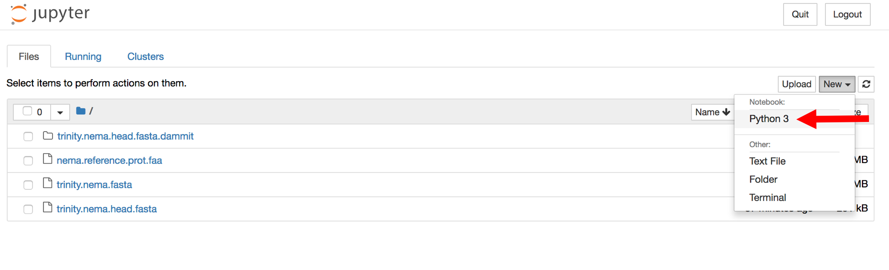
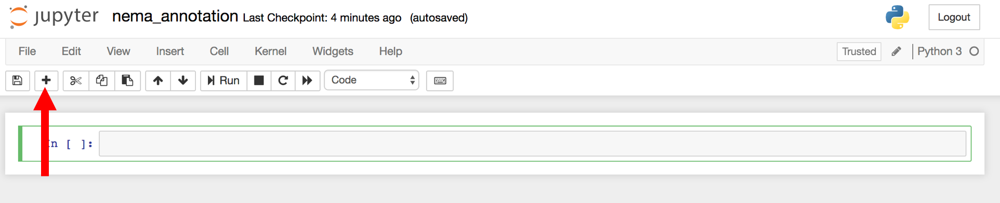
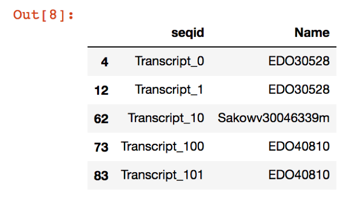

Annotating and evaluating a *de novo* transcriptome assembly
=========

At the end of this lesson, you will be familiar with:
* how to annotate a *de novo* transcriptome assembly
* parse GFF3 output from the annotation output to use for DE analysis
* several methods for evaluating the completeness of a *de novo* transcriptome assembly

# Annotation with dammit

dammit!

[dammit](http://www.camillescott.org/dammit/index.html) is an annotation pipeline written by [Camille Scott](http://www.camillescott.org/). The dammit pipeline runs a relatively standard annotation protocol for transcriptomes: it begins by building gene models with [Transdecoder](http://transdecoder.github.io/), then uses the following protein databases as evidence for annotation:
[Pfam-A](http://pfam.xfam.org/), [Rfam](http://rfam.xfam.org/), [OrthoDB](http://www.orthodb.org/), [uniref90](http://www.uniprot.org/help/uniref) (uniref is optional with`--full`).

If a protein dataset for your organism (or a closely-related species) is available, this can also be supplied to the dammit pipeline with the `--user-databases` as optional evidence for the annotation.

In addition, [BUSCO](http://busco.ezlab.org/) v3 is run, which will compare the gene content in your transcriptome with a lineage-specific data set. The output is a proportion of your transcriptome that matches with the data set, which can be used as an estimate of the completeness of your transcriptome based on evolutionary expectation ([Simho et al. 2015](http://bioinformatics.oxfordjournals.org/content/31/19/3210.full)).

There are several lineage-specific datasets available from the authors of BUSCO. We will use the `metazoa` dataset for this transcriptome.

## Installation

Annotation necessarily requires a lot of software! dammit attempts to simplify this and
make it as reliable as possible, but we still have some dependencies.

Create a python 3 environment for dammit:

```
conda create -n py3.dammit python=3
```
Then
```
source activate py3.dammit
```

dammit can be installed via bioconda. Due to some dependency issues with bioconda packages, first run:
```
conda config --add pinned_packages 'r-base >=3.4'
```
Add the appropriate channels, including bioconda:
```
conda config --add channels defaults
conda config --add channels conda-forge
conda config --add channels bioconda
```
Then, you can install dammit normally (this will take some time, ~5-10 min):
```
conda install -y dammit
```

To make sure your installation was successful, run

```
dammit help
```

This will give a list of dammit's commands and options:
```
/home/dibbears/miniconda3/envs/py3.dammit/lib/python3.6/site-packages/matplotlib/font_manager.py:278: UserWarning: Matplotlib is building the font cache using fc-list. This may take a moment.
  'Matplotlib is building the font cache using fc-list. '
usage: dammit [-h] [--debug] [--version] {migrate,databases,annotate} ...
dammit: error: invalid choice: 'help' (choose from 'migrate', 'databases', 'annotate')
```
The version (`dammit --version`) should be:
```
dammit 1.0rc2
```
## Database Preparation

dammit has two major subcommands: `dammit databases` and `dammit annotate`. The `databases` command checks that databases are installed and prepared, and if run with the `--install` flag,
it will perform that installation and preparation. If you just run `dammit databases` on its own, you should get a notification that some database tasks are not up-to-date. So, we need
to install them!

Note: if you have limited space on your instance, you can also install these databases in a different location (e.g. on an external volume). Run this command **before** running the database install.

```
#Run  ONLY if you want to install databases in different location. 
#To run, remove the `#` from the front of the following command:

# dammit databases --database-dir /path/to/databases
```

Install databases (this will take a long time, usually >10 min):

```
dammit databases --install --busco-group metazoa
```

We used the "metazoa" BUSCO group. We can use any of the BUSCO databases, so long as we install them with the `dammit databases` subcommand. You can see the whole list by running
`dammit databases -h`. You should try to match your species as closely as possible for the best results. If we want to install another, for example:

```
dammit databases --install --busco-group protists
```

Phew, now we have everything installed! 

Now, let's take a minute and thank [Camille](https://twitter.com/camille_codon) for making this process easy for us by maintaining a [recipe on bioconda](https://bioconda.github.io/recipes/dammit/README.html). This saves us a lot of hassle with having to install individual parts required for the pipeline. AND on top of the installation that, there is this pipeline! Historically, transcriptome annotation involved many tedious steps, requiring bioinformaticians to keep track of parsing databases alignment ouptut and summarizing across multiple databases. All of these steps have been standardized in the `dammit` pipeline, which uses the [pydoit](http://pydoit.org/) automation tool. Now, we can input our assembly fasta file -> query databases -> and get output annotations with gene names for each contig. Thank you, Camille!

## Annotation

Keep things organized! Let's make a project directory:

```
cd ~/
mkdir -p ~/annotation
cd ~/annotation
```

You all ran Trinity earlier to generate an assembly, but just in case, we're going to download
a version of that assembly to annotate.

```
curl -OL https://darchive.mblwhoilibrary.org/bitstream/handle/1912/5613/Trinity.fasta
head -3000 Trinity.fasta > trinity.nema.fasta
```

Now we'll download a custom *Nematostella vectensis* protein database available
from JGI. Here, somebody has already created a proper database for us [1] (it has a reference proteome
available through uniprot). If your critter
is a non-model organism, you will
likely need to create your own with proteins from closely-related species. This will rely on your
knowledge of your system!

```
curl -LO ftp://ftp.uniprot.org/pub/databases/uniprot/current_release/knowledgebase/reference_proteomes/Eukaryota/UP000001593_45351.fasta.gz
gunzip -c UP000001593_45351.fasta.gz > nema.reference.prot.faa
rm UP000001593_45351.fasta.gz
```

Run the command:

```
dammit annotate trinity.nema.fasta --busco-group metazoa --user-databases nema.reference.prot.faa --n_threads 4
```

While dammit runs, it will print out which tasks its running to the terminal. dammit is
written with a library called [pydoit](www.pydoit.org), which is a python workflow library similar
to GNU Make. This not only helps organize the underlying workflow, but also means that if we
interrupt it, it will properly resume! 

After a successful run, you'll have a new directory called `trinity.nema.fasta.dammit`. If you
look inside, you'll see a lot of files:

```
ls trinity.nema.fasta.dammit/
```    
```    
    annotate.doit.db                              trinity.nema.fasta.dammit.namemap.csv  trinity.nema.fasta.transdecoder.pep
    dammit.log                                    trinity.nema.fasta.dammit.stats.json   trinity.nema.fasta.x.nema.reference.prot.faa.crbl.csv
    run_trinity.nema.fasta.metazoa.busco.results  trinity.nema.fasta.transdecoder.bed    trinity.nema.fasta.x.nema.reference.prot.faa.crbl.gff3
    tmp                                           trinity.nema.fasta.transdecoder.cds    trinity.nema.fasta.x.nema.reference.prot.faa.crbl.model.csv
    trinity.nema.fasta                            trinity.nema.fasta.transdecoder_dir    trinity.nema.fasta.x.nema.reference.prot.faa.crbl.model.plot.pdf
    trinity.nema.fasta.dammit.fasta               trinity.nema.fasta.transdecoder.gff3
    trinity.nema.fasta.dammit.gff3                trinity.nema.fasta.transdecoder.mRNA
```

The most important files for you are `trinity.nema.fasta.dammit.fasta`,
`trinity.nema.fasta.dammit.gff3`, and `trinity.nema.fasta.dammit.stats.json`.

If the above `dammit` command is run again, there will be a message:
`**Pipeline is already completed!**`


## Parse dammit output

Cammille wrote dammit in Python, which includes a library to parse gff3 dammit output. To send this output to a useful table, we will need to open the Python environemnt.

Install Jupyter notebook:
```
conda install -y jupyter
```
Then
```
jupyter notebook --generate-config
```
Then generate a config file. (Note: this password protects the notebook.)
```
cat >> ~/.jupyter/jupyter_notebook_config.py <<EOF
c = get_config()
c.NotebookApp.ip = '*'
c.NotebookApp.open_browser = False
c.NotebookApp.password = u'sha1:d3f13af9db69:31268fb729f127aebb2f77f7b61fa92d6c9e3aa1'
c.NotebookApp.port = 8000

EOF
```

Now run the jupyter notebook:
```
jupyter notebook &
```

You will see a list of files, start a new Python 3 notebook:


This will open a new notebook.

Enter this into the first cell:

```
import pandas as pd
from dammit.fileio.gff3 import GFF3Parser
```

Press Shift + Enter to execute the cell.

To add a new cell, with the "plus" icon. 



In a new cell enter:
```
gff_file = "trinity.nema.fasta.dammit/trinity.nema.fasta.dammit.gff3"
annotations = GFF3Parser(filename=gff_file).read()
names = annotations.sort_values(by=['seqid', 'score'], ascending=True).query('score < 1e-05').drop_duplicates(subset='seqid')[['seqid', 'Name']]
new_file = names.dropna(axis=0,how='all')
new_file.head()
```
Which should give an output that looks like this:


To save the file, add a new cell and enter:
```
new_file.to_csv("nema_gene_name_id.csv")
```

This will output a table of genes with 'seqid' and 'Name' in a .csv file: `nema_gene_name_id.csv`. Let's take a look at that file:

```
less nema_gene_name_id.csv
```

Notice there are multiple transcripts per gene model prediction. This `.csv` file can be used in `tximport` in downstream DE analysis.

# Evaluation

We will be using Transrate and Busco!

## Install


## Transrate

[Transrate](http://hibberdlab.com/transrate/getting_started.html) serves two main purposes. It can compare two assemblies to see how similar they are. Or, it can give you a score which represents proportion of input reads that provide positive support for the assembly. We will use transrate to get a score for the assembly. Use the trimmed reads. For a further explanation of metrics and how to run the reference-based transrate, see the [documentation](http://hibberdlab.com/transrate/metrics.html) and the paper by [Smith-Unna et al. 2016](http://genome.cshlp.org/content/early/2016/06/01/gr.196469.115). 

### Install Transrate

```
cd 
curl -SL https://bintray.com/artifact/download/blahah/generic/transrate-1.0.3-linux-x86_64.tar.gz | tar -xz
cd transrate-1.0.3-linux-x86_64 
./transrate --install-deps ref
rm -f bin/librt.so.1
echo 'export PATH="$HOME/transrate-1.0.3-linux-x86_64":$PATH' >> ~/.bashrc
source ~/.bashrc
conda activate py3.dammit
```

* How do the two transcriptomes compare with each other?

```
transrate --reference=Trinity.fasta --assembly=trinity.nema.fasta --output=subset_v_full
transrate --reference=trinity.nema.fasta --assembly=Trinity.fasta --output=full_v_subset
```

The results will be in two separate directoreis, with the important metrics in the `assemblies.csv` files.

## BUSCO

* Metazoa database used with 978 genes
* "Complete" lengths are within two standard deviations of the BUSCO group mean length

* Useful links:
  * Website: [http://busco.ezlab.org/](http://busco.ezlab.org/)
  * Paper: [Simao et al. 2015](http://bioinformatics.oxfordjournals.org/content/31/19/3210)
  * [User Guide](http://gitlab.com/ezlab/busco/raw/master/BUSCO_v2.0_userguide.pdf)

### Run the actual command:

```
run_BUSCO.py \
-i Trinity.fixed.fasta \
-o nema_busco_metazoa -l ~/busco/metazoa_odb9 \
-m transcriptome --cpu 2
```

Check the output:

```
cat run_nema_busco_metazoa/short_summary_nema_busco_metazoa.txt
```

How does the full transcriptome compare?


When you're finished, exit out of this virtual environment
```
source deactivate
```

## References

1. Putnam NH, Srivastava M, Hellsten U, Dirks B, Chapman J, Salamov A,
Terry A, Shapiro H, Lindquist E, Kapitonov VV, Jurka J, Genikhovich G,
Grigoriev IV, Lucas SM, Steele RE, Finnerty JR, Technau U, Martindale
MQ, Rokhsar DS. (2007) Sea anemone genome reveals ancestral eumetazoan
gene repertoire and genomic organization. Science. 317, 86-94.

