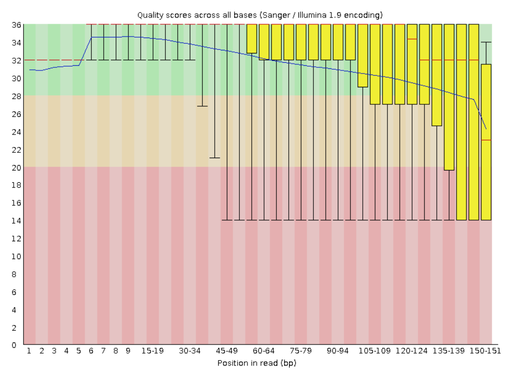
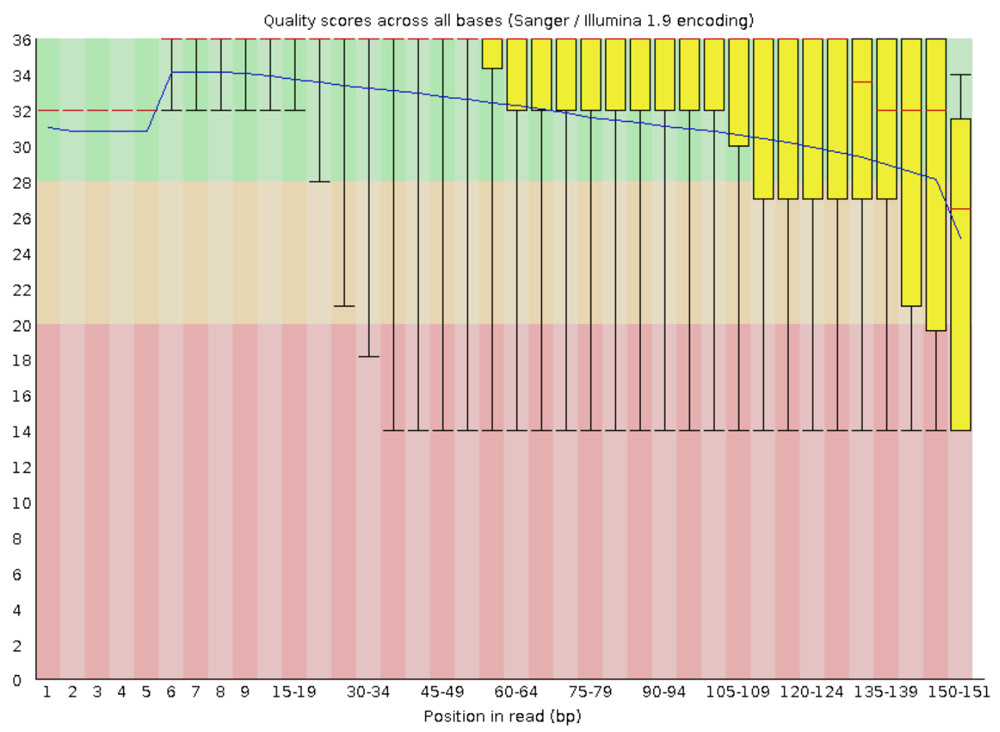
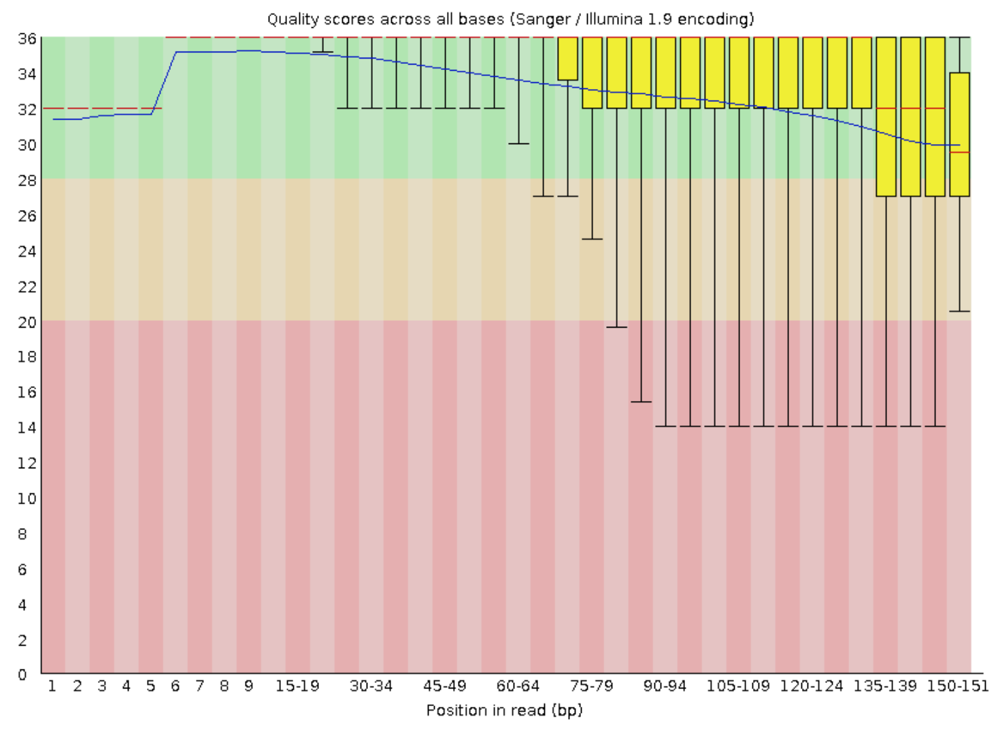
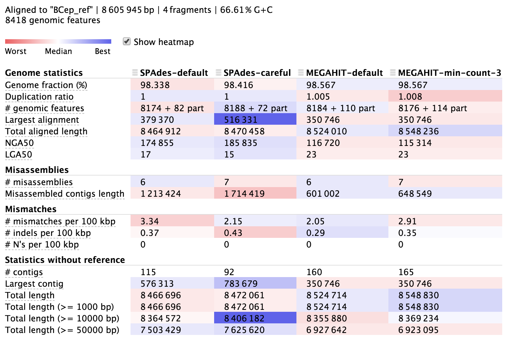

# De novo genome assembly

Here we're going to run through some of the typical steps for taking a newly sequenced bacterial isolate genome from raw fastq files through to some assemblies and discussing how we might choose which assembly to move forward with 🙂  

Before we get started, a public service announcement:

> **ATTENTION!**
> 
> This is not an authoritative or exhaustive workflow for working with a newly sequenced genome. No such thing exists! All genomes, datasets, and goals are different, and new tools are constantly being developed. The point of this page is just to give examples of some of the things we <i>can</i> do. <b>Don't let anything here, or anywhere, constrain your science to doing only what others have done!</b></div>

Now that that's out of the way, let's get to it!  

## Accessing our JetStream instances
We should still have our jetstream instances running. You can follow the instructions [here](jetstream/boot.html) to log in to the [JetStream](https://use.jetstream-cloud.org/application/dashboard) website and find your instance and IP address. Then `ssh` into it from your laptop following the instructions [here](jetstream/boot.html#ssh-secure-login), so we are working in a terminal on our JetStream instance.

## Setting up our working environment
Throughout this process we'll be using a variety of tools. They are going to be installed using [conda](https://conda.io/docs/) with the specific versions used at the time this was put together. 

First, we will create an environment, activate it, and then install all the needed programs:

```bash
conda create -y -n de_novo_example
conda activate de_novo_example

conda install -y -c bioconda -c conda-forge fastqc=0.11.5 \
              trimmomatic=0.36 spades=3.11.1 megahit=1.1.1 \
              quast=5.0.2 bowtie2=2.2.5 anvio=5.5.0 \
              centrifuge=1.0.4
```

> **CODE BREAKDOWN**
> 
> - **`conda create`** - creating our conda environment
>   - **`-y`** - say yes to all questions automatically (just do it and leave me alone)
>   - **`-n de_novo_example`** - names the environment we are creating "de_novo_example"
> 
> - **`conda activate de_novo_example`** - activates our new environment (puts us in it)
> 
> - **`conda install`** - installs the programs we need in our current conda environment
>   - **`-y`** - same as above, just do it, no questions
>   - **`-c bioconda`** and **`-c conda-forge`** - specifies to search these channels for the following programs
>   - **`fastqc=0.11.5`** and rest of positional arguments - names the program wanted, followed by an equals sign preceding the version we want (the version used when this was put together)

## The data
The practice data we're going to use here was provided by colleagues at the [J. Craig Venter Institute](http://www.jcvi.org/). In working out the details for a rather large-scale project, which in part involves sequencing a bunch of *Burkholderia* isolates from the International Space Station and performing de novo genome assemblies, [Aubrie O'Rourke](https://www.jcvi.org/about/aorourke) and her team put an already sequenced isolate – [*Burkholderia cepacia* (ATCC 25416)](https://www.atcc.org/products/all/25416.aspx) – through their pipeline in order to test things out and to have something to benchmark their expectations against. Here we are going to be assembling that genome. The sequencing was done on Illumina's Nextseq platform as paired-end 2x150 bps, with about a 350-bp insert size.  

The data files are rather large for this example, at 1.7 GB compressed, and 2.6 GB uncompressed. This is because the download comes with starting and output files, so that we can skip some of the more time-consuming steps and just copy over results. 

Copying and pasting this code block will get us the data:

```bash
cd ~
curl -L https://ndownloader.figshare.com/files/16197626 -o genomics_de_novo_temp.tar.gz
tar -xzvf genomics_de_novo_temp.tar.gz
rm genomics_de_novo_temp.tar.gz

cd genomics_de_novo_temp/
```

> **CODE BREAKDOWN**
> 
> - **`cd ~`** - this moves us into our home directory in case we aren't already there, so we are all starting in the same place
> 
> - **`curl`** - this let's us download the data
>   - **`-L`** - this specifies to follow "soft links" if there are any (these are like redirects when we click to download a file and are sent somewhere else first)
>   - **`https:...`** - this is the link to download the data
>   - **`-o`** - let's us specify the name of the output file, which we are naming "genomics_de_novo_temp.tar.gz"
> 
> - **`tar`** - program that unpacks "tarballs" (.tar) files, and can also optionally decompress them if they are gzipped (.gz)
>   - **`-x`** - exctract files from a .tar
>   - **`-z`** - decompress if gzipped (.gz)
>   - **`-v`** - print verbose output
>   - **`-f genomics_de_novo_tmp.tar.gz`** - specifies the file we want to act on
> 
> Then we delete the downloaded file with **`rm`** and change into our new directory with the last **`cd`** command

There are two subdirectories here, we are going to change into the "working/" directory:

```bash
cd working/
```

## Quality trimming/filtering
Assessing the quality of our sequence data and filtering appropriately should pretty much always be one of the first things we do with our data. A great tool we've already used for this is [FastQC](https://www.bioinformatics.babraham.ac.uk/projects/fastqc/). Here we'll start with that on the raw reads.

## FastQC
Remember that [FastQC](https://www.bioinformatics.babraham.ac.uk/projects/fastqc/) scans the fastq files we give it to generate a broad overview of some summary statistics. And it has several screening modules that test for some commonly occurring problems. But as we talked about before, its modules are expecting random sequence data, and any warning or failure notices the program generates should be interpreted within the context of our experiment (e.g. high duplication levels are to be expected with RNAseq or amplicon data, but FastQC would still flag them as something possibly wrong). If a module "fails" or throws a warning, it's a good idea to look into what might be expected to cause that looking through their manual [here](https://www.bioinformatics.babraham.ac.uk/projects/fastqc/Help/3%20Analysis%20Modules/). Here we'll provide our forward and reverse reads as 2 positional arguments:

```bash
fastqc B_cepacia_raw_R1.fastq.gz B_cepacia_raw_R2.fastq.gz -t 6
```

Looking at our output from the forward reads ([B_cepacia_raw_R1_fastqc.html](_static/de-novo-pre-trim-R1-fastqc.html)), not too much stands out other than the quality scores are pretty mediocre from about 2/3 of the way through the read on: 

<center></center>  
<br>

> Here: the read length is stretched across the x-axis; the blue line is the mean quality score of all reads at the corresponding positions; red line is the median; the yellow boxplots represent the interquartile range; and the whiskers represent the 10th and 90th percentiles. 

The [reverse reads](_static/de-novo-pre-trim-R2-fastqc.html) look pretty similar: 

<center></center>  
<br>

## Trimmomatic
Also as we've seen, [Trimmomatic](http://www.usadellab.org/cms/?page=trimmomatic) is a pretty flexible tool that enables us to trim up our sequences based on several quality thresholds. The summary from [FastQC](https://www.bioinformatics.babraham.ac.uk/projects/fastqc/) didn't look all that terrible other than semi-low quality scores towards the end of each read, so for a first pass let's run Trimmomatic with pretty generic, but stringent settings (particularly the minimum length being our full read size), and see what we get (takes < 1 min.):

```bash
trimmomatic PE B_cepacia_raw_R1.fastq.gz B_cepacia_raw_R2.fastq.gz \
            BCep_R1_paired.fastq.gz BCep_R1_unpaired.fastq.gz \
            BCep_R2_paired.fastq.gz BCep_R2_unpaired.fastq.gz \
            LEADING:20 TRAILING:20 SLIDINGWINDOW:5:20 MINLEN:151 \
            -threads 6
```

> **CODE BREAKDOWN**
> 
> - **`PE`** - specifies our data are paired-end
> - **`B_cepacia_raw_R1.fastq.gz`** and **`B_cepacia_raw_R2.fastq.gz`** - first and second positional arguments are our input forward and reverse reads
> - **`BCep_R1_paired.fastq.gz `** and **`BCep_R1_unpaired.fastq.gz `** - third and fourth positional arguments are our output files for our forward reads: the third is for those that remain paired (i.e. their partner in the reverse files also passed the filtering thresholds); the fourth is for those that passed filtering but their partner did not 🥺 (gah, that emoji really tugs at the heart strings!)
> - **`BCep_R2_paired.fastq.gz `** and **`BCep_R2_unpaired.fastq.gz `** - fifth and sixth positional arguments are the same as 3rd and 4th above, but now for the reverse reads
> - **`LEADING:20`** - this states, starting from the left, if a base has a quality score less than 20, cut it off (will stop at first base above 20)
> - **`TRAILING:20`** - same as above, except working from the end of the read in
> - **`SLIDINGWINDOW:5:20`** - starting at base 1, look at a window of 5 bps, and if the average quality score of those 5 cut the read at the first position of that window and only keep up to that point
> - **`MINLEN:151`** - after performing all steps above, if the read is now shorter than 151, throw it away. For our purposes this means if any trimming happened the read will be removed. - Note that not all things happen in the order in which we provide them at the command line, but Trimmomatic does work that way 
> - **`-threads 6`** - specifies how many threads will be used, here 6 (["threads"](https://en.wikipedia.org/wiki/Thread_(computing)) are complicated)

The output printed to our terminals from Trimmomatic states that only about 14% of the read pairs (both forward and reverse from the same fragment) passed, leaving us with ~350,000 read pairs. That sounds low, but since we know what we're working with here (meaning it's an isolate of a known genus and not a metagenome or something completely unknown), we can pretty quickly estimate if this could even possibly be enough coverage for us to assemble the genome we're expecting. 

Assuming those reads were perfect quality and perfectly evenly distributed (which they're not), that would be 350,000 read pairs * 300 bps per paired read = 105 Mbps covered. Most *Burkholderia* are around 8.5 Mbps, meaning we'd rougly expect around 12X coverage right now, if all were perfect (105,000,000 / 8,500,000). This confirms that this is a little low and we should probably adjust our stringency on filtering – there aren't solid rules on a minimum level of coverage for all situations, but a general target to shoot for might be around >50X coverage for de novo assembly of a typical prokaryotic genome.  

So, let's go back and alter how we are filtering a bit. 

Since the worst part of the reads quality-wise is at the end, and this is likely getting chopped off in a lot of reads during the sliding window scan, when we had the highly stringent `MINLEN:151` above, those would all be completely thrown out. So let's try allowing a shorter minimum length of 140 in order to retain some of those reads (takes < 1 min.): 

```bash
trimmomatic PE B_cepacia_raw_R1.fastq.gz B_cepacia_raw_R2.fastq.gz \
            BCep_R1_paired.fastq.gz BCep_R1_unpaired.fastq.gz \
            BCep_R2_paired.fastq.gz BCep_R2_unpaired.fastq.gz \
            LEADING:20 TRAILING:20 SLIDINGWINDOW:5:20 \
            MINLEN:140 -threads 6
```

These settings allowed ~49% of paired reads through (~1.2 million read pairs), which by the same quick estimation we did above suggests we have around an estimated 40X coverage (1,200,000 * 280 bps per read pair ≈ 336 Mbps covered; 336,000,000 / 8,500,000 ≈ 40X coverage). While "throwing away" half the data here may still feel a bit uncomfortable, it's always important to think about what we're doing with it when making these decisions. Here, we are trying to assemble a good genome. If we can successfully do that with *less* "good data", that's better than doing it with *more* "bad data" – especially when bad sequence data could severely inhibit our assembly efforts.  

And just for a peek at the FastQC output after our trimming:

```bash
fastqc BCep_R1_paired.fastq.gz BCep_R2_paired.fastq.gz -t 6
```

<center></center>
<br>

These are the [forward reads](_static/de-novo-post-trim-R1-fastqc.html), the [reverse](_static/de-novo-post-trim-R2-fastqc.html) looked basically the same. Things still don't look perfect, but they look much cleaner than before – now our interquartile boxes (yellow) are much more snuggly sitting up top telling us our distribution of qualities across the ends of the reads is much better. 

## Read-error correction
Even though we've done our best to quality trim and filter our reads, there can still be errors in there that may hurt our assembly attempts. Conceptually, read-error correction tools try to find bases that have a lot of coverage where the base is the same, but maybe in a tiny fraction of reads that base is different, and they will change that base to be what the others are. This paper by [Heydari et al.](https://bmcbioinformatics.biomedcentral.com/articles/10.1186/s12859-017-1784-8) goes a bit into trying to systematically evaluate Illumina read-error correction tools, which might be a good place to start if you'd like to look into this more. In our experience employing a read-error correction step seems to consistently improve assembly, but as with most of these things, that isn't necessarily *always* the case – which is discussed a bit in [the Heydari et al. paper](https://bmcbioinformatics.biomedcentral.com/articles/10.1186/s12859-017-1784-8). Here we'll be trying different 4 different assemblies all with error-corrected reads, but feel free to experiment with that too 🙂

The read-error correction we are going to use here is employed by the SPAdes assembler, and is called [BayesHammer](http://bioinf.spbau.ru/en/spades/bayeshammer) (initial publication [here](https://bmcgenomics.biomedcentral.com/articles/10.1186/1471-2164-14-S1-S7) if you'd like to look into more sometime). So even though we want to try different assemblies, we are still going to run the error-correction step within SPAdes first, and take the error-corrected reads from that to be used with whatever assemblers we try. If we run the SPAdes program with the `--error-correction-only` flag specified, it will stop after that point and not go into assembly. 

>**NOTICE**
>
>This was the most computationally intensive step, taking about 45 minutes with the resources specified in the following command (which is more than are available on our instances). So for the sake of this tutorial, instead of running this command (which is commented out below), we are just going to copy over the result files in the next code block:

```bash
   ## DON'T RUN THIS CODE BLOCK; WE WILL COPY OVER THE RESULTS ##

# spades.py -1 BCep_R1_paired.fastq.gz -2 BCep_R2_paired.fastq.gz \
#           -o spades_error_corrected_reads -t 50 -m 500 \
#           --only-error-correction
```

> **CODE BREAKDOWN**
> 
> - **`-1`** and **`-2`** - specify the input forward and reverse reads
> - **`-o`** - specifies the output directory where the results will be stored
> - **`-t`** - specifies how many threads will be used (["threads"](https://en.wikipedia.org/wiki/Thread_(computing)) are complicated)
> - **`-m`** - specifies the maximum amount of memory to possibly be used in gigabytes; program would quit if it needed more than that (our instances have 16 GB available to them)
> - **`--only-error-correction`** - telling SPAdes to only runn the error-correction step, and not perform an assembly

And here we are going to copy over the result files:

```bash
cp ../downloaded_results/BCep_R?_err_corr.fq.gz .
```

## Assembly
Now that we have our reads quality filtered and we have run an error-correction step, we're ready to move on to assembling them! There are lots of assembly programs out there, and once again, there is no one-size-fits-all. The reason each new assembly paper shows it doing better than all the others is not because everyone is lying about things, it's just that the data have a lot to say about which assembler is going to work the "best" – and what's "best" is not really a straightforward criterion to shoot for either. 

Two of the most commonly used prokaryotic assemblers today are [SPAdes](http://cab.spbu.ru/software/spades/) and [MEGAHIT](https://github.com/voutcn/megahit). SPAdes uses much more memory than MEGAHIT, so it is often more suitable for working with one or a few genomes (like from an isolate or enrichment culture). But if working with high-diversity metagenomic samples, sometimes the memory requirements for SPAdes get too high, and MEGAHIT (which uses much less memory) can handle things. This is *not* to say SPAdes is always better when both can be run, it's not necessarily. 

When working with a new dataset, it's not uncommon to generate a few assemblies testing different programs with different parameters and then compare the results to try to feel a little confident we are doing the best that can currently be done with the data.  

Here we'll run a couple with [SPAdes](http://cab.spbu.ru/software/spades/) and a couple with [MEGAHIT](https://github.com/voutcn/megahit).

> **NOTICE**
> 
> We're going to be comparing a total of 4 different assembly variations here, with each taking about 5-10 minutes to run. So for the sake of time while doing this tutorial, we will only run the first one together, and for the rest we'll copy over the results like we did with the error-correction step above.

## SPAdes
As mentioned above, [SPAdes](http://cab.spbu.ru/software/spades/) tends to do well with isolate or enrichment cultures that aren't too diverse. Since this is an isolate culture that was sequenced, it should run just fine. We're going to try one SPAdes run with default settings and then one with an additional option set, for a total for 2 assemblies from SPAdes. 

### SPAdes with default settings
Let's first run a SPAdes assembly with default settings. Note that we are providing the `--only-assembler` flag because we already ran the read-error correction step above, and we are using the outputs from that here as the input (takes < 5 min.): 

```bash
spades.py -1 BCep_R1_err_corr.fq.gz -2 BCep_R2_err_corr.fq.gz \
          -o spades-default-assembly/ -t 6 --only-assembler
```

While that's running, let's talk about some of the others 🙂

### SPAdes in careful mode
In the [SPAdes documentation](http://cab.spbu.ru/files/release3.11.1/manual.html), they have [this note](http://cab.spbu.ru/files/release3.11.1/manual.html#sec3.4) suggesting specific assembly settings when using 2x150 paired-end Illumina data as we are here. Most of the suggestions there are defaults in the version we are using, and were run with our command above, but one (running things in `--careful` mode) was not. This tries to find and fix mismatches after the initial assembly is finished. Here's how we would run one with careful mode on (though again we're skipping it for time and will copy over the results once our other assembly finishes):

```bash
   ## DON'T RUN THIS CODE BLOCK; WE WILL COPY OVER THE RESULTS ##
   
# spades.py -1 BCep_R1_err_corr.fq.gz -2 BCep_R2_err_corr.fq.gz \
#           -o spades-careful-assembly -t 6 --only-assembler \
#           --careful
```

## MEGAHIT
Next we'll run some assemblies with [MEGAHIT](https://github.com/voutcn/megahit). 

### MEGAHIT with default settings
Here's how we could run one with default MEGAHIT settings:

```bash
   ## DON'T RUN THIS CODE BLOCK; WE WILL COPY OVER THE RESULTS ##

# megahit -1 BCep_R1_err_corr.fq.gz -2 BCep_R2_err_corr.fq.gz \
#         -o megahit-default-assembly -t 6
```

### MEGAHIT adjusted min-count parameter
The [MEGAHIT documentation](https://github.com/voutcn/megahit/wiki) has an assembly-tips page that [notes here](https://github.com/voutcn/megahit/wiki/Assembly-Tips#filtering-kmin1-mer) that the default settings are largely tuned for metagenomic assembly, and that for a generic assembly (like our case here with an isolate) when there is greater than 40X coverage it is suggested to set the `--min-count` parameter (which deals with the frequency of kmers and filtering out reads with unique kmers) to `3`. The coverage we estimated was around 40X, so let's also try a run with that parameter set:

```bash
   ## DON'T RUN THIS CODE BLOCK; WE WILL COPY OVER THE RESULTS ##

# megahit -1 BCep_R1_err_corr.fq.gz -2 BCep_R2_err_corr.fq.gz \
#         -o megahit-min-count-3-assembly/ -t 6 --min-count 3
```

---

Once our first assembly finishes, let's copy over the results for the other 3 with this code block:

```bash
cp -r ../downloaded_results/assemblies/spades-careful-assembly/ spades-careful-assembly/

cp -r ../downloaded_results/assemblies/megahit-default-assembly/ megahit-default-assembly/

cp -r ../downloaded_results/assemblies/megahit-min-count-3-assembly/ megahit-min-count-3-assembly/
```

Now that we have a handful of assemblies, let's see how they compare 🙂

## Comparing assemblies
Let's just get this out there right off the bat, **there is no individual metric that exists to determine if we have a good assembly or not**, especially if we have no reference, and *especially* especially if we're working with a metagenomic assembly. 

There are, however, some general things we can look at, like [N50](https://en.wikipedia.org/wiki/N50,_L50,_and_related_statistics#N50) (half of the total assembly size can be found in contigs >= this size) or largest contig, or fraction of reads that successfully recruit to your assembly, or how many genes we can identify, and more. But: 1) these don't really have any context to tell us if they're "good" or not unless we're comparing multiple assemblies of the same data; and 2) it's possible to have an assembly with "worse" overall summary statistics compared to some other assembly, but that may actually enable us to do whatever it is we want to do *better* than the assembly with more appealing summary metrics. So, as usual, we have to keep in mind what our goals are, and know that picking the "best" assembly we can get out of our data is not necessarily a trivial or straightforward task. Having a reference genome like we do in this case makes things a lot easier as we'll see next, and then we'll talk a little bit about what we could do if we didn't have a reference 🙂

### QUAST
[QUAST](https://github.com/ablab/quast) is a really nice tool for comparing multiple assemblies, and for metagenome assemblies there is a comparable [MetaQUAST](http://bioinf.spbau.ru/metaquast). We can provide QUAST with all of our assemblies, a fasta file of our reference genome, and a .gff (**g**eneral **f**eature **f**ormat) file of our reference genome that contains information about its genes. Then QUAST will compare our assemblies to the reference, and also generate several reference-independent summary statistics. Our two reference files for our *Bulkholderia cepacia* ATCC 25416 came from NCBI [here](https://www.ncbi.nlm.nih.gov/genome/10703?genome_assembly_id=255013). And here's how we can run QUAST (takes < 1 min.):  

```bash
quast -o quast-B-cep-out -r reference_genome/BCep_ref.fna \
      -g reference_genome/BCep_ref.gff -t 6 -m 1000 \
      -l "SPAdes-default, SPAdes-careful, MEGAHIT-default, MEGAHIT-min-count-3" \
      spades-default-assembly/contigs.fasta \
      spades-careful-assembly/contigs.fasta \
      megahit-default-assembly/final.contigs.fa \
      megahit-min-count-3-assembly/final.contigs.fa
```

> **CODE BREAKDOWN**
> 
> Remember the backslashes (**`\`**) don't have anything to do with the actual command, they are just there so this is not one long line and we can copy and paste (otherwise the "enter" character that comes after them would try to execute the command on each line when pasted into our terminal.
> 
> - **`-o quast-B-cep-out`** - setting the output directory
> - **`-r reference_genome/BCep_ref.fna`** - providing a fasta file of our reference genome
> - **`-g reference_genome/BCep_ref.gff`** - providing the gene coordinates of our reference (this is so QUAST can see if it finds them in our assemblies)
> - **`-l "..."`** - within these quotes are labels for each of the input assemblies (so the output has something cleaner than file names), these need to be provided here in the same order in which their input fasta files are entered next as positional arguments
> - the end is 4 positional arguments for our 4 input assemblies

There is more information about QUAST [in its documentation here](http://quast.bioinf.spbau.ru/manual.html). The output directory contains lots of information, but it is also nicely summarized in an html file called "report.html" (we can access this from [here](_static/de-novo-quast.html) for now). Here's a portion of it:

<center></center>
<br>

The columns here hold information about each of our 4 assemblies, and each row presents a different metric. The majority of the rows starting from the top are in relation to the reference we provided, then the last few starting with "# contigs" are reference-independent. In the [interactive html page](_static/de-novo-quast.html), we can highlight the row names to get some help on what they mean, and there is more info in the [QUAST manual](http://quast.bioinf.spbau.ru/manual.html). The cells are shaded across the assemblies for each row from red to blue, indicating "worst" to "best", but this is only a loose guide to help your eye, as differences can be negligible or up to interpretation, and some rows are more important than others.  

It seems all of them did pretty well. They each reconstructed over 98% of the reference genome, which is pretty stellar, but none of them got 100%. This is common when using solely short Illumina reads because they aren't able to assemble repetitive regions that extend longer than the paired-read fragment length. We can also see that our assemblies aligned across about 8,180 genomic features (genes, transcripts, tRNAs, and such) out of the 8,418 that are annotated in the reference genome. And looking at mismatches per 100 kbp we can see we're down around 2-4 mismatches per 100 kbp. 


<blockquote>
<center><b>QUICK QUESTION!</b></center>

What might be causing the 2-4 mismatches per 100 kbps?

<div class="toggle-header closed">
    <strong>Solution</strong>
</div>

<div class="toggle-content docutils container" style="width:100%">

This could be a mix of sequencing and/or assembly error, but it is also very likely some actual biological variation too. There is no reason to expect the genome to be <i>exactly</i> identical to the reference even after just 1 culturing transfer.

</div>
</blockquote>

Moving down to the reference-independent section in the table we can see which assemblies cover the most bps with the fewest contigs. This doesn't mean everything either, but **fewer contigs covering about the same amount of bps does provide more information on synteny, which can be very helpful for functional annotation**. 

### Read recruitment
Another metric to assess the quality of an assembly is to see how well the reads that went into the assembly recruit back to it. It's sort of a way of checking to see how much of the data that went in actually ended up getting used. This tends to be more informative with mixed community metagenomes – e.g. if one assembly enables recruitment of 85% of our input reads, and another enables only 10% of the input reads to recruit, it is safe to say the first one does a better job of representing what was recovered with our metagenomic sequencing. But in this case – with an isolate genome when the few assemblies tested performed pretty similarly – it turns out that they all pretty much recruited reads just as efficiently (> 99% with the default settings of [bowtie2 v2.2.5](https://github.com/BenLangmead/bowtie2) at least). 

---

As far as selecting which of our assemblies to move forward with, since they all performed reasonably well, mostly for the reason of maximizing insight into synteny as mentioned above, based on the QUAST output we might choose to move forward with the SPAdes assembly done with the `--careful` setting as that gave us the most genes on the fewest contigs.


## What about when we don't have a reference?
It's pretty nice here because we have a known reference genome. When that's not that case, it's much harder to be confident we are making the best decisions we can. If we know something about the organism, even if we don't have an ideal reference, we might have a rough idea of what size genome to expect. We can use the detected copy numbers of genes known to most often be present in single-copy in its nearest relatives to get a rough estimate of percent completion (and percent redundancy which gives us one window into if there may be contamination). 

Also with no reference, we might go further down the path of processing and analysis with multiple assemblies. Some might be better than others depending on our particular purpose, and that might not always be apparent based on overall summary statistics. For instance, if recovering representative genomes from a metagenome is the goal, we might want to start that process and see which assembly is better suited for that. As mentioned above, in some cases it is possible to be able to better recover representative genomes from an assembly that has seemingly worse overall summary statistics. And if we just chose based on the assembly-level summary statistics, we wouldn't find that out. Or, if our question is more about the functional potential of the whole community, or maybe looking for specific genes in a metagenomic assembly, then seeing which assembly yields the prediction of more [open-reading frames](https://en.wikipedia.org/wiki/Open_reading_frame), or better annotation results, might help us decide. The bottom line is it's difficult, and there is no one answer, but we do the best we can 🙂  


### Epilogue
That's as far as we can go for now. Some more things to do to check the quality of this assembly and begin exploring it – along with a mention of some common tasks after we're happy with our new genome – are presented in [this lesson](de-novo-genome-exploration.md) 🙂 

