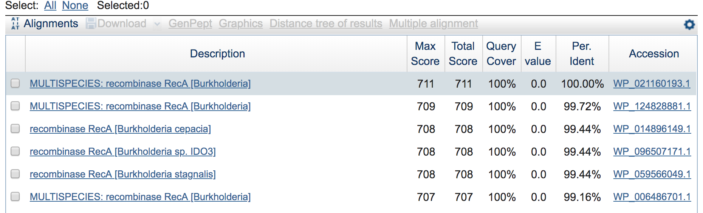
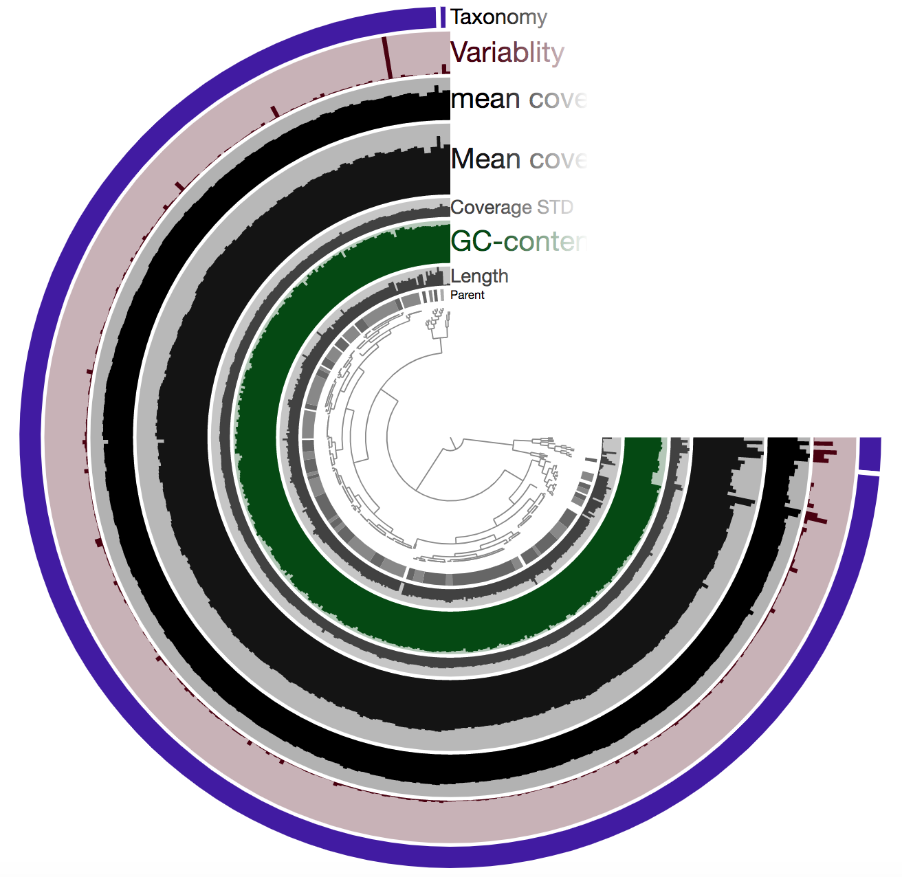
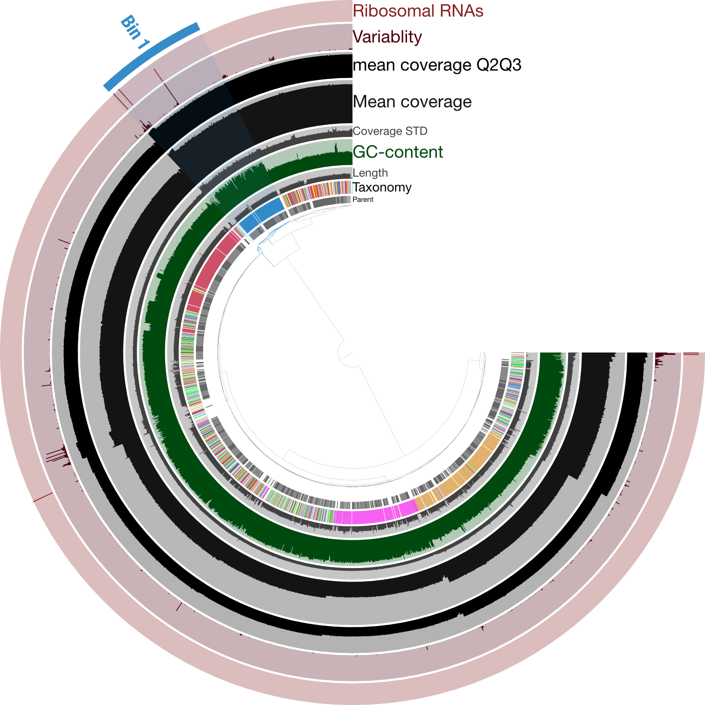
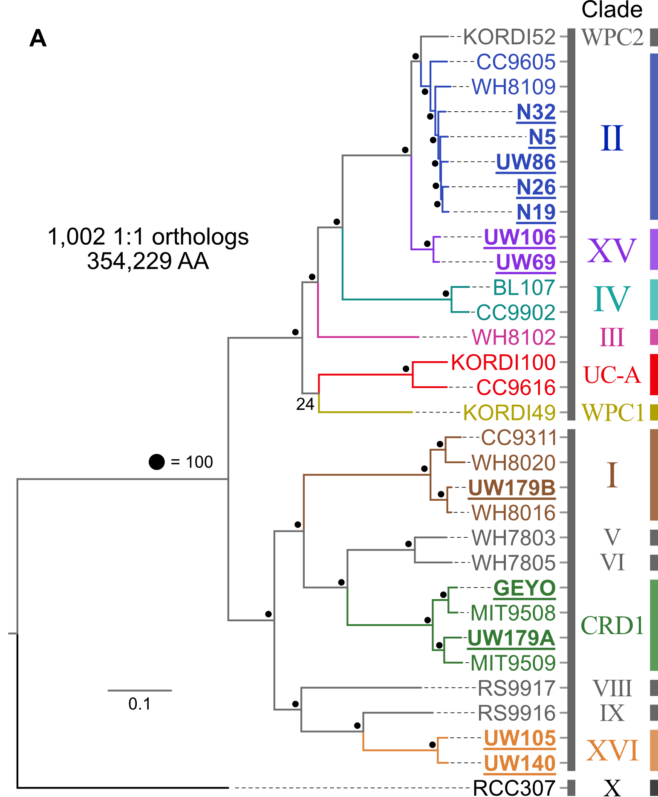
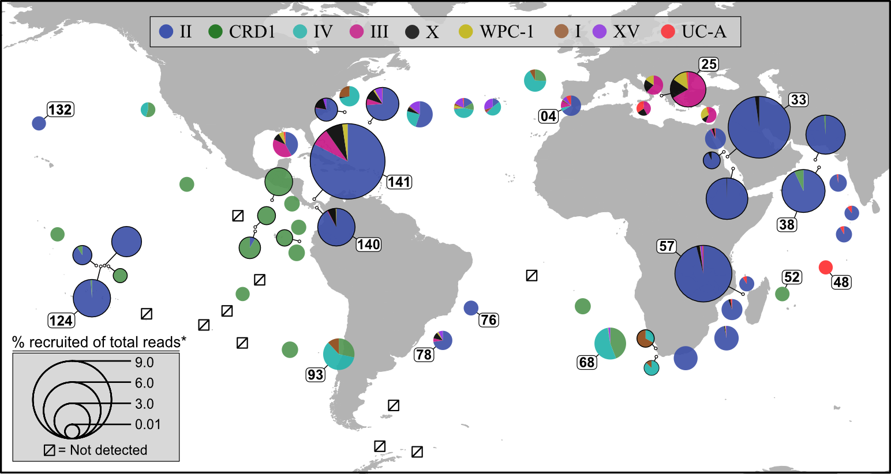
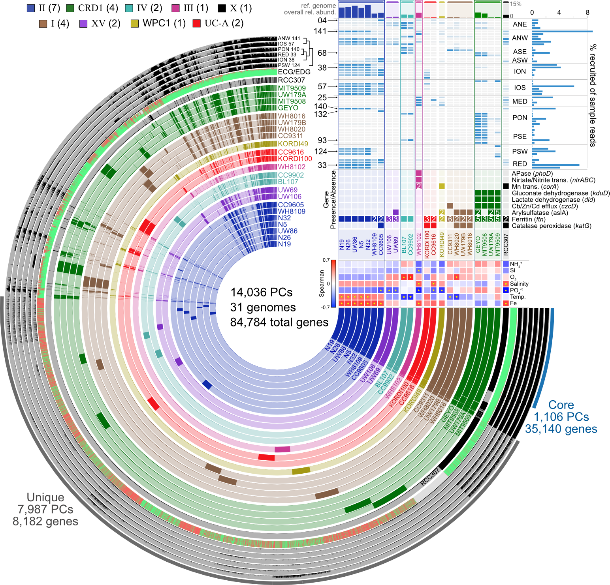

# De novo genome exploration

Here we're going to take off from a de novo prokaryotic genome assembly performed in [this lesson](de-novo-genome-assembly.md). That involved logging into our JetStream instances as [noted here](de-novo-genome-assembly.md#accessing-our-jetstreaminstances) and setting up a specific conda environment as [noted here](de-novo-genome-assembly.md#setting-up-our-working-environment). If you didn't do that lesson, be sure to set up that conda environment as shown there. If you did, then be sure to activate that conda environment with the following after logged in:

```bash
conda activate de_novo_example
```

## The data
The data used here is described [here](de-novo-genome-assembly.md#the-data). If you did not do the [previous lesson](de-novo-genome-assembly.md), the following code block will download the data and copy over the required assembly. But otherwise you will have all of this already:

```bash
cd ~
curl -L https://ndownloader.figshare.com/files/16197626 -o genomics_de_novo_temp.tar.gz
tar -xzvf genomics_de_novo_temp.tar.gz
rm genomics_de_novo_temp.tar.gz

cp -r ~/genomics_de_novo_temp/downloaded_results/assemblies/spades-careful-assembly/ ~/genomics_de_novo_temp/working/spades-careful-assembly/
```

Now let's change directories into our working directory:

```bash
cd ~/genomics_de_novo_temp/working/
```

## Exploring our assembly with anvi'o
Now that we've selected an assembly we're going to move forward with, we can start to take a closer look at it. To do that we're going to use a wonderful platform called [anvi'o](http://merenlab.org/software/anvio/) - which stands for analysis and visualization of omics data.

anvi'o is very expansive, but to try to summarize it in a sentence, it is a powerful and user-friendly data visualization and exploration platform. There is a ton of excellent documentation at the [anvi'o site](http://merenlab.org/software/anvio/), including workflows, tutorials, and blog posts. 

Here we're going to put our isolate-genome assembly into the anvi'o framework and see just a few of the ways it can help us begin to look at our assembled genome - including a visual way of checking for possible contamination (which in this case would be anything in there that's *not* our target *Burkholderia cepacia*). Many of the major steps we're going to be performing here are laid out in the [metagenomic workflow presented here](http://merenlab.org/2016/06/22/anvio-tutorial-v2/), as much of the processing is the same even though we are not working with a metagenome here. 

### Putting our assembly into anvi'o and generating some information about it
For us to get our assembly into anvi'o, first we need to generate what it calls a [contigs database](http://merenlab.org/2016/06/22/anvio-tutorial-v2/#creating-an-anvio-contigs-database). This contains the contigs from our assembly and some information intrisic to them (like GC content, tetranucleotide frequency, and open-reading frame coordinates). The following command will organize our contigs in an anvi'o-friendly way, generate some basic stats about them, and use the program [Prodigal](https://github.com/hyattpd/Prodigal) to identify [open-reading frames](https://en.wikipedia.org/wiki/Open_reading_frame) (takes < 2 min.):

```bash
anvi-gen-contigs-database -f spades-careful-assembly/contigs.fasta \
                          -o contigs.db -n B_cepacia_assembly
```

> **CODE BREAKDOWN**
> 
> - **`-f`** - specifies our input fasta file of our chosen assembly
> - **`-o`** - specifies our output file name, which has the ".db" extension as required by anvi'o
> - **`-n`** - specifies a name for our anvi'o project

Now that we have our `contigs.db` that holds our sequences and some basic information about them, we can start adding more information. This is one of the places where the flexibility comes into play, but for now we'll just move forward with some parts of a general anvi'o workflow, including:

- using the program [HMMER](http://hmmer.org/) with profile hidden Markov models (HMMs) to scan for bacterial single-copy genes [(from Campbell et al. 2013)](http://www.pnas.org/content/110/14/5540.short)
  - if new to HMMs, see the bottom of page 7 [here](http://eddylab.org/software/hmmer3/3.1b2/Userguide.pdf) for a good explanation of what exactly a "hidden Markov model" is in the realm of sequence data
  - to summarize, instead of treating all columns of an alignment equally (like something like BLAST does), HMMs can weight individual columns in an alignment differently. So the highly-conserved stretches within, say, a conserved domain of a protein will matter more than a stretch in between two domains that may vary more.

- using [NCBI COGs](https://www.ncbi.nlm.nih.gov/COG/) to functionally annotate the open-reading frames [Prodigal](https://github.com/hyattpd/Prodigal) predicted

- using a tool called [centrifuge](https://ccb.jhu.edu/software/centrifuge/index.shtml) for taxonomic classification of the identified open-reading frames

- generate coverage information for our assembly so we can visualize it

The following block of code would take ~45 minutes to run, mostly because of needing to download and setup some files for their first use. So we are going to skip this code block, copy over the results, and pick up with mapping to generate the coverage information. 

```bash
   ## DON'T RUN THIS CODE BLOCK; WE WILL COPY OVER THE RESULTS ##

  # HMM searching for bacterial single-copy genes
# anvi-run-hmms -I Campbell_et_al -c contigs.db -T 6

  # functional annotation with DIAMOND against NCBI's COGs
# anvi-setup-ncbi-cogs -T 6 # only needed the first time
# anvi-run-ncbi-cogs -c contigs.db --num-threads 6

  # exporting Prodigal-identified open-reading frames from anvi'o
# anvi-get-sequences-for-gene-calls -c contigs.db -o gene_calls.fa

  # setting up centrifuge for taxonomy (only needed the first time)
# wget ftp://ftp.ccb.jhu.edu/pub/infphilo/centrifuge/data/p_compressed+h+v.tar.gz
# tar -xzvf p_compressed+h+v.tar.gz && rm -rf p_compressed+h+v.tar.gz

  # running centrifuge taxonomy (this taxonomically classifies each identified coding sequence)
# centrifuge -f -x p_compressed+h+v gene_calls.fa -S centrifuge_hits.tsv -p 6

  # importing the taxonomy results into our anvi'o contigs database
# anvi-import-taxonomy-for-genes -p centrifuge -c contigs.db \
#                                -i centrifuge_report.tsv \
#                                centrifuge_hits.tsv
```

Let's copy over the new "contigs.db" that has the information stored from running those commands:

```bash
cp ../downloaded_results/anvio/contigs.db .
```

The last thing we want to add right now is mapping information from recruiting our reads to the assembly we built with them. Here is generating that mapping information with [bowtie2](https://github.com/BenLangmead/bowtie2) (this is another aligner like `bwa` that we used) and preparing the output file for anvi'o (altogether takes < 5 min.):

```bash
  # building bowtie index from our selected assembly fasta file
bowtie2-build spades-careful-assembly/contigs.fasta \
              spades-careful-assembly.btindex

  # mapping our reads (takes ~1 min.)
bowtie2 -q -x spades-careful-assembly.btindex \
        -1 BCep_R1_err_corr.fq.gz -2 BCep_R2_err_corr.fq.gz \
        -p 6 -S spades-careful-assembly.sam

  # converting to a bam file (takes < 1 min.)
samtools view -bS spades-careful-assembly.sam > B-cep-assembly.bam

  # sorting and indexing our bam file (takes < 1 min.)
anvi-init-bam B-cep-assembly.bam -o B-cep.bam
```

We can now integrate this mapping information into anvi'o with the `anvi-profile` program, which generates another type of database anvi'o calls a "profile database" that holds extrinsic information about our contigs. For our purposes right now, this is mostly about storing coverage information for each contig. We'll see what that looks like and why it's helpful soon!

```bash
  # integrating the read-mapping info into anvi'o (takes ~2 min.)
anvi-profile -i B-cep.bam -c contigs.db -M 1000 -T 6 --cluster-contigs -o B-cep-profiled/
```

### Pulling out some sequences and summarizing our assembly
Ok, great, so we've just generated and put quite a bit of information about our assembly into our contigs and profile databases. And this being anvi'o, it's now very easy to access specifics of that information when we want it (you can see all of the available programs by typing `anvi-` and hitting tab twice).

For example, one of the commands we just ran, `anvi-run-hmms`, searched for bacterial single-copy genes. We can ask anvi'o to give us which genes were identified using `anvi-get-sequences-for-hmm-hits` (and adding the flag `-h` will tell us all about how to use the program). Including adding the `-l` flag to see which HMM sets we have:

```bash
anvi-get-sequences-for-hmm-hits -c contigs.db -l
```

Which shows us "Campbell_et_al" which we specified above. And adding the `-L` flag will list the names of the genes in that set:

```bash
anvi-get-sequences-for-hmm-hits -c contigs.db --hmm-sources Campbell_et_al -L
```

And say we want to pull out the "RecA" gene, which is a commonly targeted bacterial single-copy gene involved in DNA repair:

```bash
anvi-get-sequences-for-hmm-hits -c contigs.db --hmm-sources Campbell_et_al \
                                --gene-names RecA \
                                --get-aa-sequences \
                                --no-wrap -o RecA.faa
```

If we print out what's in that file with `cat`:

```bash
cat RecA.faa
```

Copy it and paste it into [NCBI's protein BLAST here](https://blast.ncbi.nlm.nih.gov/Blast.cgi?PROGRAM=blastp&PAGE_TYPE=BlastSearch&LINK_LOC=blasthome) and BLAST it, we can see that the top hit is 100% identical across the entire query to *B. cepacia*, and all top hits are to the same species (which is a nice little sanity check). Here are just a few from the top:

<center></center>  
<br>

We can also generate some summary statistics on our assembly, including estimated percent completion and redundancy based on the presence/absence of the single-copy marker genes we scanned for above. Here are the two steps needed to summarize our isolate-genome assembly: 

```bash
  # this is adding all contigs to a group called "DEFAULT"
anvi-script-add-default-collection -p B-cep-profiled/PROFILE.db
  # and here is our summary command
anvi-summarize -c contigs.db -p B-cep-profiled/PROFILE.db \
               -C DEFAULT -o B-cepacia-assembly-summary/
```

A lot was generated with that, now found in our new directory, "B-cepacia-assembly-summary/". If we glance at the "bins_summary.txt" file, we can see some summary statistics of our assembled genome, including the completion/redundancy estimates (`column -t` will keep the columns lined up for us):

```bash
column -t B-cepacia-assembly-summary/bins_summary.txt
```

```bash
## output from above command ##
# bins        taxon         total_length  num_contigs  N50     GC_content         percent_completion  percent_redundancy
# EVERYTHING  Burkholderia  8472061       92           194480  66.44548680306582  99.28057553956835   1.4388489208633093
```

Which shows us, in the second column, the majority of taxonomy calls by [Centrifuge](https://ccb.jhu.edu/software/centrifuge/manual.shtml#obtaining-centrifuge) were actually for the right genus, that's always nice. Also, based on the [Campbell et al. 2013](http://www.pnas.org/content/110/14/5540.short) bacterial single-copy marker genes, our assembly is estimated to be ~99.3% complete with ~1.4% redundancy. This approach doesn't actually add up to 100% completion and 0% redundancy in many, if any, organisms, so for comparison's sake, running the ATCC 25416 reference genome through the same pipeline gives the same results based on this single-copy gene set. Though we are still ~130 Mbps short, as we saw with the QUAST output above.

But great, things look pretty much as they should so far. We can also visually inspect our assembly, and how the reads that went into it recruit to it. In theory, if all the DNA in the assembly came from the same organisms (i.e. it's a clean assembly), there should be pretty even coverage across the whole thing. And if there is contamination in there (something other than our target *B. cepacia*, it will likely have very different coverage). So let's finally take a look with `anvi-interactive`. 

### Visualizing with anvi-interactive
To be able to visualize our work from the server, we need to `ssh` in slightly different than we did earlier. So now, let's type `exit` in our terminal to disconnect, press the up arrow to bring up our last login command, and modify it to look like this:

```bash
ssh -L 8080:localhost:8080 dibada@XXX.XXX.XXX.XXX
```

Where the `-L 8080:localhost:8080` stays exactly the same as it appears above, but `dibada` above should be your room name, and the IP address at the end should be yours. You will also need to enter the password again.

Next we need to re-activate our conda environment:

```bash
conda activate de_novo_example
```

Next, let's copy-and-paste this command to get the link we will need to view our anvi'o interactive interface:

```bash
echo "http://$(hostname -i):8080"
```

Now let's start up the anvi'o interactive interface:

```bash
anvi-interactive -c contigs.db -p B-cep-profiled/PROFILE.db \
                 --server-only -P 8080
```

Now if we copy the link that was generated above and paste it into our browser, after the page loads and we click "Draw" in the bottom left corner, it should look something like this: 

<center></center>
<br>

So there is a lot going on here at first glance, especially if we're not yet familiar with how anvi'o organizes things. So here's a quick crash course 🙂  

At the center of the figure is a hierarchical clustering of the contigs from our assembly (here clustered based on tetranucleotide frequency and coverage). So each tip (leaf) represents a contig (or a fragment of a contig as each is actually broken down into a max of ~20,000bps, but for right now we'll just be referring to them as contigs). Then radiating out from the center are layers of information ("Parent", "Length", "GC content", etc.), with each layer displaying information for each contig.

One of the first things that might jump out here is the outer layer (purple in this image, but may be different on yours), labeled "Taxonomy". There is actually a color for each contig for whatever taxonomy was assigned to the majority of genes in that particular contig. This solid bar all around tells us that the genes in almost the entire assembly were identified as *Burkholderia* – minus two contigs which were not classified as anything (and have no color there). The next thing that stands out is how stable the mean coverage is across almost all contigs, other than that area near the top in this image (yours may be oriented differently too). That likely holds things found in multiple copies in the genome. For instance, according to [IMG](https://img.jgi.doe.gov/cgi-bin/m/main.cgi?section=TaxonDetail&page=taxonDetail&taxon_oid=2509276048), *B. cepacia* ATCC 25416 has 7 16S copies and 9 23S copies, which would complicate assembly if they aren't all identical, and would inflate their coverage compared to the parts of the genome that exist in single copy. Overall this is great and shows the culture really seems to have been axenic.  

Just for a quick comparison, here is the same type of figure (taxonomy at the inner-part of the circle here), but from an enrichment culture, rather than axenic:  

<center></center>
<br>

Here the highlighted contigs, labeled "Bin 1", represent the targeted cultivar from this sequencing run, demonstrating a nice example of how anvi'o can help you manually curate bins you're trying derive from assemblies.  

While we didn't need much (any) manual curation in this case, it was still a good idea to visually inspect the coverage of our assembly to make sure nothing weird was going on. And if we wanted, we could further explore those parts with higher coverage to find out which parts of the genome seem to exist in greater than 1 copy.  


## Epilogue
This and the [prior lesson](de-novo-genome-assembly.md) were all basically to get a high-quality draft of our isolate genome, that we could feel confident about investigating further. Once we feel comfortable with our assembled genome, we can go a lot of different ways. Going into individual approaches are beyond the scope of this particular page, but here are just a few examples.  


### Phylogenomics
Pull available reference genomes of close relatives and build a phylogenomic tree to get a robust estimate of where our newly acquired isolate(s) fit in evolutionarily with what is already known. 

<center></center>
<br>

### Distributions
Pull available metagenomes from studies and recruit the reads to a reference library containing our isolate (and its close relatives if it has any) to begin assessing their distributions across samples. This example is done with ocean samples, but the same principle can be applied to any environments.

<center></center> 
<br>

### Pangenomics
Start investigating differences in the genetic complement of our new isolate as compared to its known close relatives. This example figure is combining pangenomics (the core of the figure showing the presence or absence of genes within each genome) with metagenomics (distributions of the genomes across samples in the top right corner) to try to associate genomic variability with ecological delineations:

<center></center>  
<br>

And so much more! This is where just pure data crunching slows down, and the actual science begins. The above are just some of the ways to get to the point where we can then consider our experimental design and our questions and let them guide where we go next 🙂
