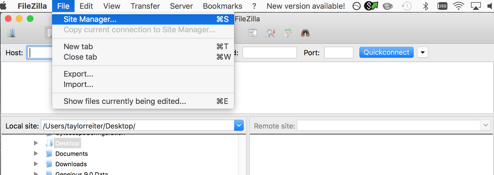
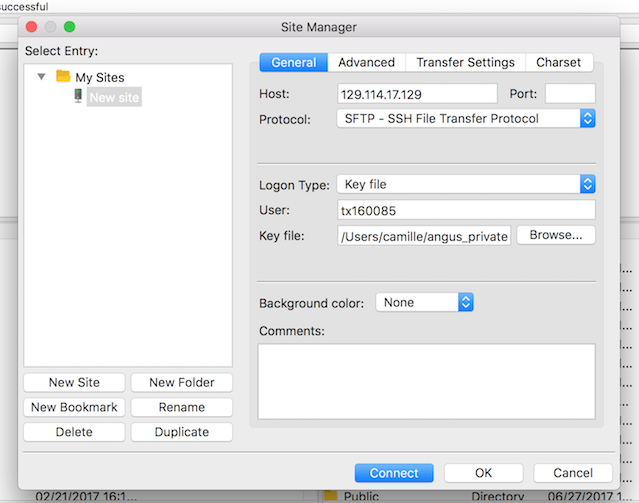

# Downloading and Transferring Files

Our goals for this lesson are:

* Download a file from the internet with wget
* Transfer a file from a remote machine to your computer with FileZilla
* Transfer a file from your computer to a remote machine with FileZilla
* Name other tools that can be used for file transfer

## Download file from the internet to your remote machine

One way to download files to your remote instance from a webserver is to use the command line tool, *wget*. This command supports downloading files from FTP and HTTP(s). The tool *wget* also supports recursive download (with the parameter *-r*), allowing you to download content from a directory or folder. For your information, there are other command line tools that can also be used to download data (e.g., *curl*), but *wget* should serve you well for this lesson and bioinformatic analysis.

An example of this would be: 
```bash
$ cd ~
$ wget https://static.pexels.com/photos/104827/cat-pet-animal-domestic-104827.jpeg 
```

And now, you will have a file named `cat-pet-animal-domestic-104827.jpeg` on your remote instance in our home directory. 

Now we have a conundrum! We have downloaded a file that we know is a cat photo, but we can't view it on our remote machine! Let's use FileZilla to facilitate the transfer so we can take a look.

## Transfer Files From Your Instance with Filezilla
Let's pretend that we didn't just grab that cat photo from the internet, and we have something unique that we would like to view. For this, *wget* would not work. Instead, you can use FileZilla to transfer a file from your local machine to a remote instance, or vice versa. 

### Open the site manager

Open *FileZilla*, and click on the File tab. Choose 'Site Manager'.
 


### Get The Key File

See the instructions under ["Getting your private key"](jetstream/login.html#getting-the-private-key) to download your key file. This will allow you to authenticate
with your instance. Please do not post this file publicly!

### Add your instances as a site

Within the 'Site Manager' window, do the following: 

1. Click on 'New Site', and name it something intuitive (e.g. ANGUS or jetstream_angus)
2. Host: address of your cloud instance. Should be of the form W.X.Y.Z.
3. Protocol: SFTP - SSH File Transfer Protocol
4. Logon Type: Key file
5. User: `tx160085`
6. Keyfile: The key you downloaded.
7. Click 'Connect'
	


### Filezilla - Step 3

In FileZilla, on the left side of the screen navigate to the location you would like to save the file, and on the right side of the screen navigate through your remote directory to the file `~/cat-pet-animal-domestic-104827.jpeg`. Double click on the .jpeg file to transfer a copy, or click and drag over to the right hand panel.

Open the file on your local machine, and bask in the glory of the cute cat.

We could also use `scp` or `rsync` to transfer files. These are command line utilities. If you're transferring a large datafile, `rsync` may be slightly better, because if the download fails it will restart from where it left off. 
+ [rsync](https://rsync.samba.org/)
+ scp
