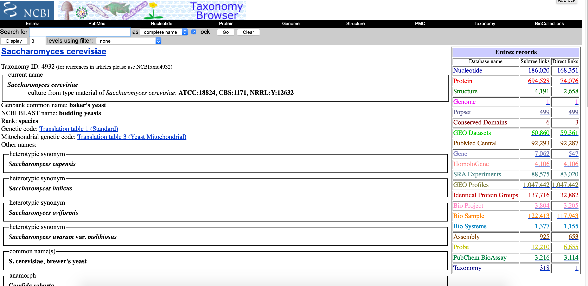
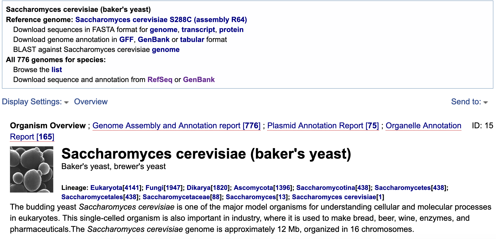
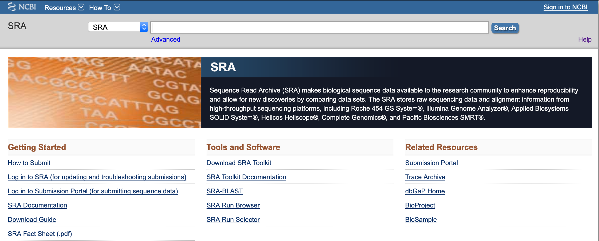
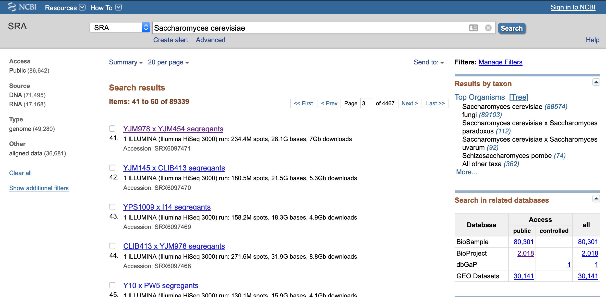
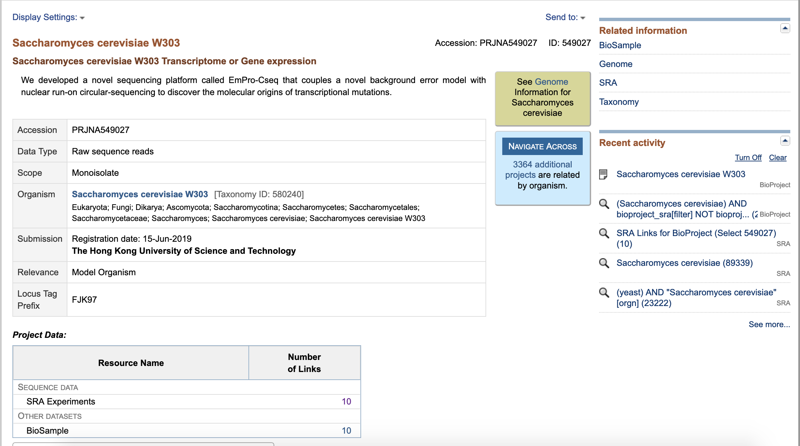
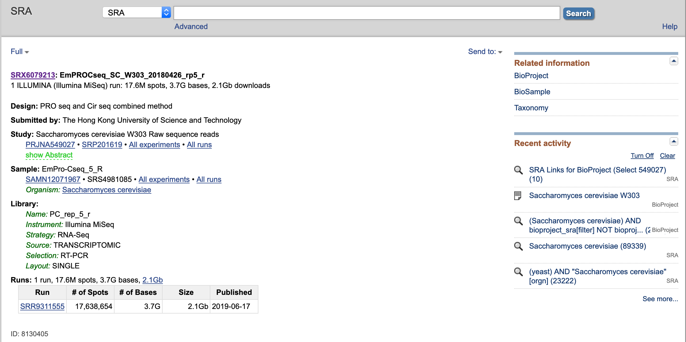
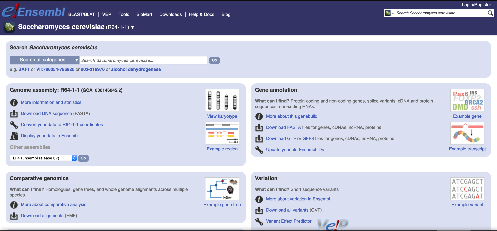
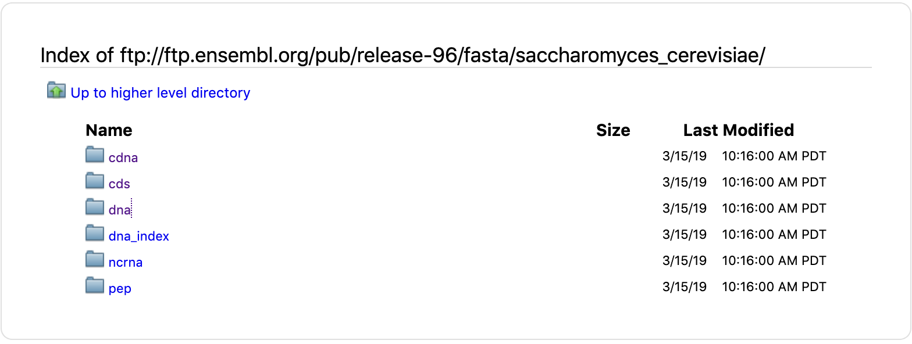
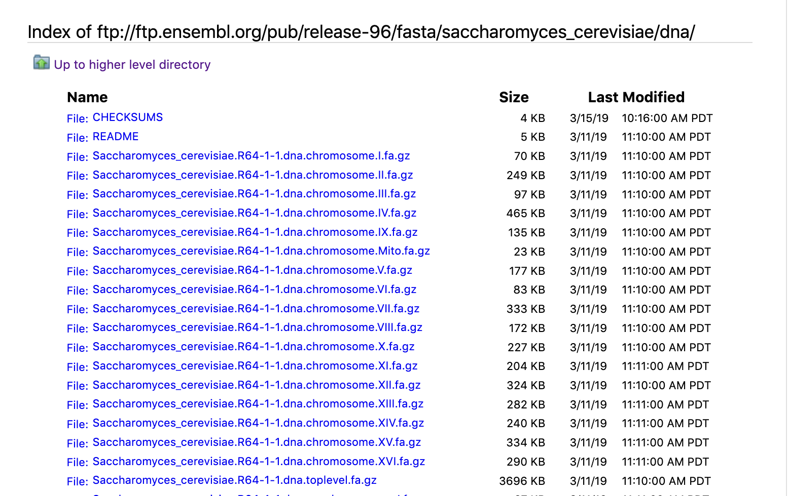

# Finding Resources online

## Objectives

+ Discover common biological databases
+ Understand common bioinformatics file formats

## Biological Databases

There are many sources available for acquiring biological data. A partial, and by no means exhaustive, list includes:

+ [NCBI (National Center for Biotechnology Information)](https://www.ncbi.nlm.nih.gov/)
+ [GenBank](https://www.ncbi.nlm.nih.gov/genbank/)
+ [RefSeq](https://www.ncbi.nlm.nih.gov/refseq/)
+ [SRA (Sequence Read Archive)](https://www.ncbi.nlm.nih.gov/sra)
+ [Ensembl](https://www.ensembl.org/index.html?redirect=no)
+ [IMG (Integrated Microbial Genomes)](https://img.jgi.doe.gov/)
+ [DDBJ (DNA Data Bank of Japan)](https://www.ddbj.nig.ac.jp/index-e.html)
+ [FungiDB](https://fungidb.org/fungidb/)

Note that many of these databases cross-reference one-another, with the same depositions found in multiple sources.

## NCBI

+ [NCBI](https://www.ncbi.nlm.nih.gov/search/) - NCBI houses many major databases, including GenBank and RefSeq, which house genes and genome assemblies, and the SRA, which houses sequencing data. It's also home to databases like PubMed. 
	+ [RefSeq](https://www.ncbi.nlm.nih.gov/refseq/) is a highly curated subset of [GenBank](https://www.ncbi.nlm.nih.gov/genbank/)

## NCBI Taxonomy

[NCBI Taxonomy](https://www.ncbi.nlm.nih.gov/taxonomy) is one particularly useful database. The Taxonomy Browser displays a hierarchical view of the taxonomy, as well as more detailed taxon-specific pages that highlight the internal links to other databases, and LinkOut links to external resources and other taxon-specific data. It is particularly useful for finding genomes and assemblies. 

1. Go to the [NCBI Taxonomy](https://www.ncbi.nlm.nih.gov/taxonomy) page and search for "Saccharomyces cerevisiae"

 

<ol start="2">
  <li>Click on one of the <code>1</code>s in the <code>Genome</code> row in the table on the right side to launch a new page. This page contains links to download the genome sequence and annotation files.</li>
</ol>

 

## NCBI SRA

NCBI's [Sequence Read Archive (SRA)](https://www.ncbi.nlm.nih.gov/sra) stores sequence and quality data (fastq files) in aligned or unaligned formats from NextGen sequencing platforms.

1. Open the [NCBI SRA](https://www.ncbi.nlm.nih.gov/sra) page and search for "Saccharomyces cerevisiae"

 

<ol start="2">
  <li>Click on any of the listed results to show project information</li>
</ol>

 

<ol start="3">
  <li>Under "Project Data" click on links to "SRA Experiments"</li>
</ol>

 

<ol start="4">
  <li>In, this page, you can find:
    <ul>
      <li>Experimental Design</li>
      <li>Sample Information</li>
      <li>Library Preparation Information</li>
      <li>Sequencing "Run" information with an identifier usually starting with "SRR"</li>
    </ul>
  </li>
</ol>

 

### SRA ID's from publications

Most journals require researchers to publish their sequencing data in a public repository upon manuscript publication.
There's often a section somewhere in the publication that indicates where data were deposited, and their corresponding accession numbers. For example, the 
dataset we're using in these lessons comes from this [paper](https://www.ncbi.nlm.nih.gov/pmc/articles/PMC4878611/). The text says the following:

>DATA DEPOSITION  
>
>The data sets supporting the results of this article are available in the European Nucleotide Archive repository (ENA) (PRJEB5348, http://www.ebi.ac.uk/ena/data/view/ERX425102). All the code for this work is publicly available (https://github.com/bartongroup/profDGE48).

The ENA and SRA mirror each other, so we can view this accession from either location. It is often easier to download 
single or a handful of accessions from the ENA. In our R lesson, we will work with the ENA table from this dataset. 

## File formats

There are a lot of different file formats in bioinformatics! We've listed a few common ones below (and their common extensions):

+ FASTA – plain sequences (.fa, .fasta, .fna, .fnn, if amino acids often .faa)
+ FASTQ – sequencing reads (.fq, .fastq)
+ GFF – general feature format (.gff)
+ GTF - variation of GFF (.gtf)
+ VCF – sequence variants (.vcf)
+ SAM – sequence alignments (.sam)
+ BAM – alignments in binary (a compressed version of SAM, .bam)

## Optional: Ensemble

Ensembl is another useful database if you're working with a model organism. It provides a browser for vertebrate (and sometimes other) genomes and supports research in comparative genomics, evolution, sequence variation, and transcriptional regulation. Ensembl annotates genes, computes multiple alignments, predicts regulatory function, and collects disease data. Ensembl tools include BLAST, BLAT, BioMart, and the Variant Effect Predictor (VEP) for all supported species. Below we demonstrate how to find annotated genes using Ensemble.

1. Open [Ensemble](https://www.ensembl.org/index.html?redirect=no) webpage and search for "Saccharomyces cerevisiae"

 

<ol start="2">
  <li>Under the "Gene Annotation" section you can download FASTA files for genes, cDNA, ncRNA, proteins, and annotations for the same</li>
</ol>

 

<ol start="3">
  <li>This is the ftp site of ensemble</li>
</ol>

 

 

