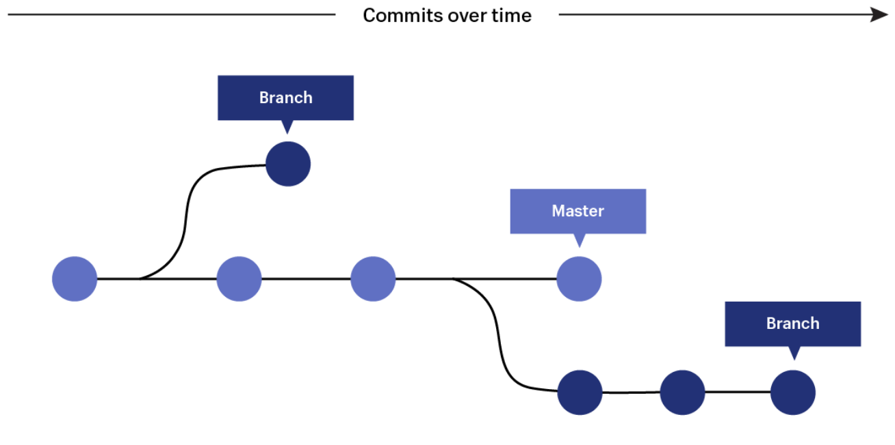
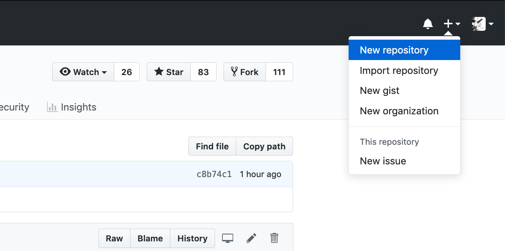
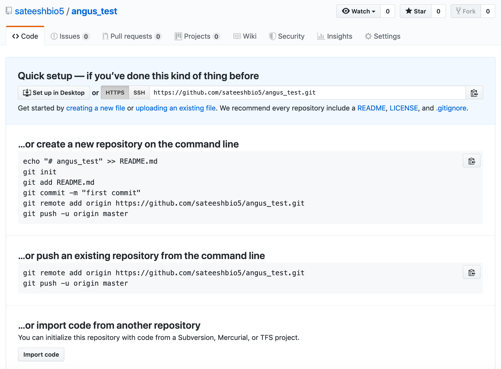
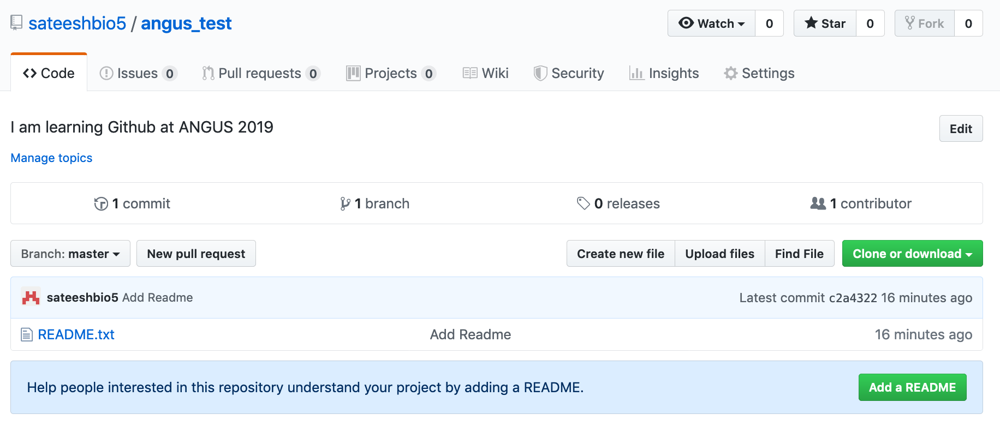
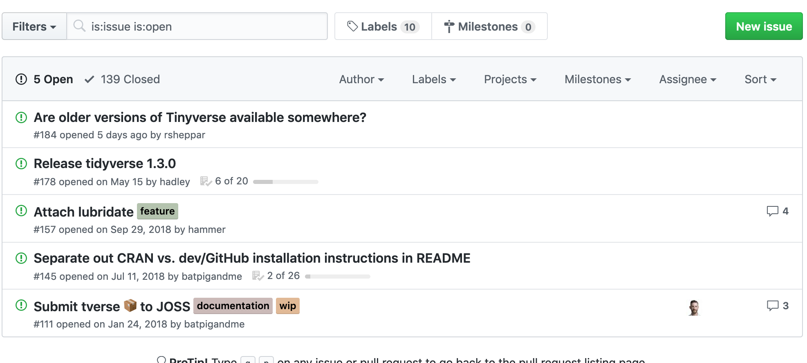
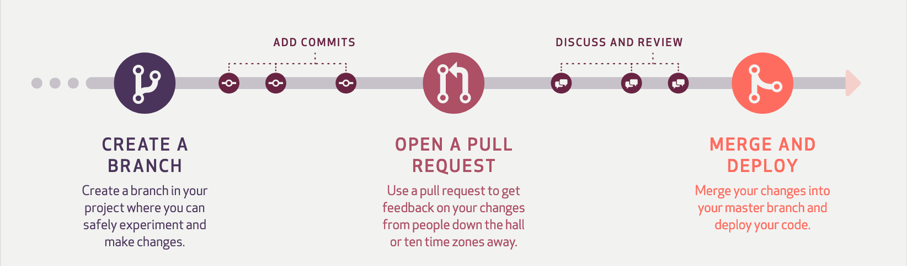

# Version Control with Github


Learning objectives

+ Learn about version Control
+ Learn about Github repositories
+ Create local repositories
+ Backup your work online using git

## Setup

First, you’ll need to sign up for a free account on [GitHub.com](https://github.com/). It’s as simple as signing up for any other social network. Keep the email you picked handy; we’ll be referencing it again in the lesson.

We will be following this lesson on our Jetstream instances which comes with `Git` installed. However, if you want to work on your project on your local computer, you need to have `Git` installed. Instructions to install Git for Windows, Mac or Linux can be found [here](https://git-scm.com/downloads).

## What is Github?

GitHub is a code hosting platform for version control and collaboration. It lets you and others work together on projects from anywhere. GitHub is now the largest online storage space of collaborative works that exists in the world

## What Is Git?

Why use something like Git? Say you and a coworker are both updating pages on the same website. You make your changes, save them, and upload them back to the website. So far, so good. The problem comes when your coworker is working on the same page as you at the same time. One of you is about to have your work overwritten and erased.

A version control application like Git keeps that from happening. You and your coworker can each upload your revisions to the same page, and Git will save two copies. Later, you can merge your changes together without losing any work along the way. You can even revert to an earlier version at any time, because Git keeps a “snapshot” of every change ever made.

## Git terms

#### **Repository:** 
A directory or storage space where your projects can live. Sometimes GitHub users shorten this to “repo.” It can be local to a folder on your computer, or it can be a storage space on GitHub or another online host. You can keep code files, text files, image files, you name it, inside a repository.

#### **Version Control:** 
Basically, the purpose Git was designed to serve. When you have a Microsoft Word file, you either overwrite every saved file with a new save, or you save multiple versions. With Git, you don’t have to. It keeps “snapshots” of every point in time in the project’s history, so you can never lose or overwrite it.

#### **Commit:** 
This is the command that gives Git its power. When you commit, you are taking a “snapshot” of your repository at that point in time, giving you a checkpoint to which you can reevaluate or restore your project to any previous state.

#### **Branch:** 
How do multiple people work on a project at the same time without Git getting them confused? Usually, they “branch off” of the main project with their own versions full of changes they themselves have made. After they’re done, it’s time to “merge” that branch back with the “master,” the main directory of the project.

<center></center>
<br>

## Git-Specific Commands

`git init`: Initializes a new Git repository. Until you run this command inside a repository or directory, it’s just a regular folder. Only after you input this does it accept further Git commands.

`git config`: Short for “configure,” this is most useful when you’re setting up Git for the first time.

`git help`: Forgot a command? Type this into the command line to bring up the 21 most common git commands. You can also be more specific and type “git help init” or another term to figure out how to use and configure a specific git command.

`git status`: Check the status of your repository. See which files are inside it, which changes still need to be committed, and which branch of the repository you’re currently working on.

`git add`: This does not add new files to your repository. Instead, it brings new files to Git’s attention. After you add files, they’re included in Git’s “snapshots” of the repository.

`git commit`: Git’s most important command. After you make any sort of change, you input this in order to take a “snapshot” of the repository. Usually it goes `git commit -m “Message here.”` The `-m` indicates that the following section of the command should be read as a message.

`git branch`: Working with multiple collaborators and want to make changes on your own? This command will let you build a new branch, or timeline of commits, of changes and file additions that are completely your own. Your title goes after the command. If you wanted a new branch called “cats,” you’d type `git branch cats`.

`git checkout`: Literally allows you to “check out” a repository that you are not currently inside. This is a navigational command that lets you move to the repository you want to check. You can use this command as g`it checkout master` to look at the master branch, or `git checkout cats` to look at another branch.

`git merge`: When you’re done working on a branch, you can merge your changes back to the master branch, which is visible to all collaborators. `git merge cats` would take all the changes you made to the “cats” branch and add them to the master.

`git push`: If you’re working on your local computer, and want your commits to be visible online on GitHub as well, you “push” the changes up to GitHub with this command.

`git pull`: If you’re working on your local computer and want the most up-to-date version of your repository to work with, you “pull” the changes down from GitHub with this command.

## Setting Up GitHub And Git For The First Time

Login to your Jetstream computer! You should see and should see something like this:

```
diblynn@js-17-71:~$
```

Make sure you're in your home directory:

```
cd ~
```

**It’s time to introduce yourself to Git. Type in the following code:**

```
git config --global user.name "Your Name Here"
```

Next, tell it your email and make sure it’s the same email you used when you signed up for a GitHub.com account

```
git config --global user.email "your_email@youremail.com"
```

## Creating Your Online Repository

Now that you’re all set up, it’s time to create a place for your project to live. Both Git and GitHub refer to this as a repository, or “repo” for short, a digital directory or storage space where you can access your project, its files, and all the versions of its files that Git saves.

- On your Github profile, click the plus button and select a "New Repository".

<center></center>
<br>

- Give your repository a name & fill out the necessary information for your repository to be distinct and recognizeable.

- Don’t worry about clicking the checkbox next to “Initialize this repository with a README.” A Readme file is usually a text file that explains a bit about the project. But we can make our own Readme file locally for practice.

- Click the green “Create Repository” button and you’re set. You now have an online space for your project to live in.

<center></center>
<br>

## Creating Your Local Repository

To begin, let's create a new directory called MyProject.

```
mkdir ~/MyProject
```

Then we will move into this new directory.

```
cd ~/MyProject
```

To create a local repository, we will first initiate a new repository for "MyProject" by entering the following command:

```
git init
```

`touch` is a multi-purpose command, but one of its key uses is to creat new, empty files. In our case, we will create a new file called Readme.txt. 

```
touch Readme.txt
```

We can check the status of our new repository by using `git status`.  

```
git status
```

When we want Git to track a file, we use `git add` followed by the file we want Git to "see". If we do not use `git add`, Git will not "see" this file.

```
git add Readme.txt
```

Lastly, to have Git track the current "snapshot" of our file, we enter `git commit`. The `-m` flag allows us to add a personal message with the files we are committing. In the following example, our message is "Add Readme.txt". Examples of other messages could include version information, changes made to a document, document descriptions, etc. 

```
git commit -m “Add Readme.txt”
```

Now Git has a "snapshot" of this version of Readme.txt which you can return to at any time in the future!

<center></center>
<br>

## Connect Your Local Repository To Your GitHub Repository Online

<center></center>
<br>

This setup also makes it easy to have multiple collaborators working on the same project. Each of you can work alone on your own computers, but upload or “push” your changes up to the GitHub repository when they’re ready.

To tell Git the address off your remote repo in Github, Type the following replacing the address of the repo with your own

```
git remote add origin https://github.com/username/myproject.git
```

Git now knows there’s a remote repository and it’s where you want your local repository changes to go. To confirm, type this to check:

```
git remote -v
```

Great, Git is able to connect with our remote on Github. So, let's go ahead and push our files to Github

```
git push origin master
```

**You will be prompted for your Github username and password at this point**

and you can see some output like this that git is sending packets of data to your github repo and by this you will force git to back up all of your commits since the last time you pushed to be backed up online. FOR FREE!

```
Counting objects: 3, done.
Writing objects: 100% (3/3), 217 bytes | 217.00 KiB/s, done.
Total 3 (delta 0), reused 0 (delta 0)
To https://github.com/sateeshbio5/angus_test.git
 * [new branch]      master -> master

```

> Note: To avoid having to type your username and password each time you push/pull from your github repos, read about Secure Login [here](https://help.github.com/articles/connecting-to-github-with-ssh/)


<center></center>
<br>

## Collaborating via GitHub

- **GitHub Issues:** Issues are a great way to keep track of tasks, enhancements, and bugs for your projects. They’re kind of like email—except they can be shared and discussed with all. Read more about Mastering Issues on Github [here](https://guides.github.com/features/issues/)

<center></center>
<br>

- **GitHub Pull-Requests:** Pull requests let you tell others about changes you've pushed to a branch in a repository on GitHub. Once a pull request is opened, you can discuss and review the potential changes with collaborators and add follow-up commits before your changes are merged into the base branch.

<center></center>
<br>

Look at others' repositories:

- [Hadley Wickham (ggplot2)](https://github.com/hadley)

- [Yihui Xie (knitr)](https://github.com/yihui)

- [ANGUS 2019](https://angus.readthedocs.io/en/2019/)

## Host Websites & Blogs on GitHub

- GitHub Pages is an awesome feature that lets you host websites/blogs for you and your projects.

- Hosted directly from your GitHub repository. Just edit, push, and your changes are live.

- Read more about GitHub Pages [here](https://pages.github.com/)


## Sources for this tutorial & Additional Git Resources

- **Introductory tutorial by Lauren Orsini [here](https://readwrite.com/2013/09/30/understanding-github-a-journey-for-beginners-part-1/)**

- [Pro Git](https://git-scm.com/book)

- [Try Git](https://www.codeschool.com/courses/try-git)

- [Github Guides](https://www.youtube.com/GitHubGuides)

- [Github Reference](http://gitref.org/)

- [Git - Simple Guide](https://rogerdudler.github.io/git-guide)

- [Github Hello World](https://guides.github.com/activities/hello-world/)
