Accessing The Jetstream Cloud
===

# Learning Objectives:
+ Launching Jetstream instances
+ SSH Secure Shell login to instances
+ Jetstream instance maintenance


What we're going to do here is walk through starting up a running
computer (an "instance") on the Jetstream service. 

[Jetstream](https://jetstream-cloud.org/) is an [NSF/XSEDE] resource designed to promote and provide configurable cyberinfrastructure in the form of cloud computing to both novice and experienced users.

If you would like to read more about cloud computing, see this [Carpentry Cloud Computing lesson](http://www.datacarpentry.org/cloud-genomics/01-why-cloud-computing/).

> **NOTE: WINDOWS users** will need to install a UNIX-ready terminal to SSH-login (if you haven't already). 
> Options:
	+ Later versions of windows 10 support an ubuntu terminal. Read more [here](https://tutorials.ubuntu.com/tutorial/tutorial-ubuntu-on-windows#0)
	+ Git-bash. Download [here](https://gitforwindows.org/)

# Login & Launch Instance

- **Login to [Jetstream](https://use.jetstream-cloud.org/application/jetstream/images/search) by clicking the "login" button towards the right-upper corner of the screen.**


- **Fill in your Jetstream username and password and click "LOGIN"**

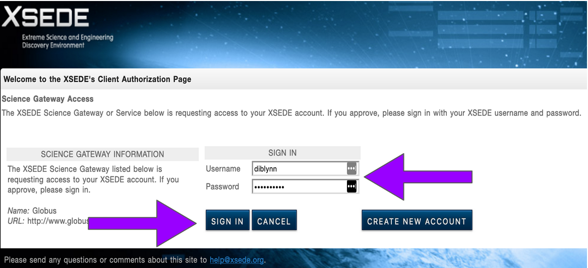

- **Select the "Projects" tab and then click the "CREATE NEW PROJECT" button**

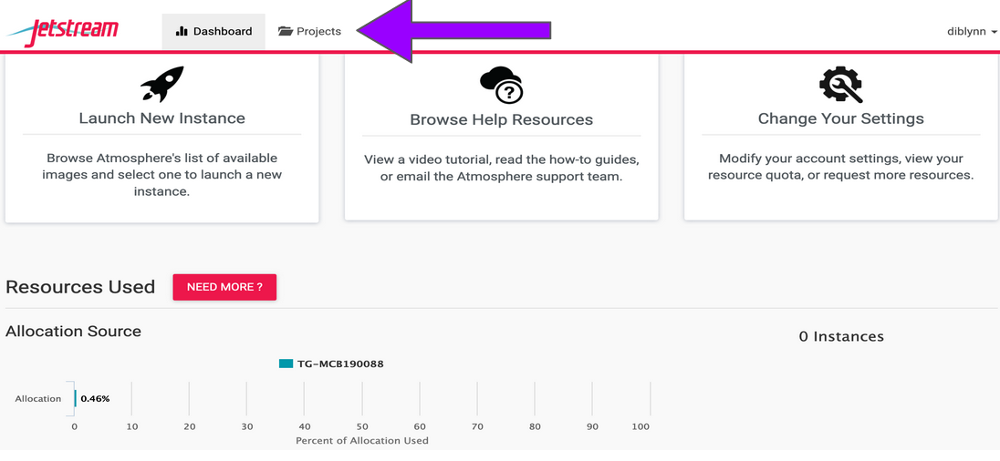

- **Give your Project folder a name (Description is optional). Then click "CREATE".**

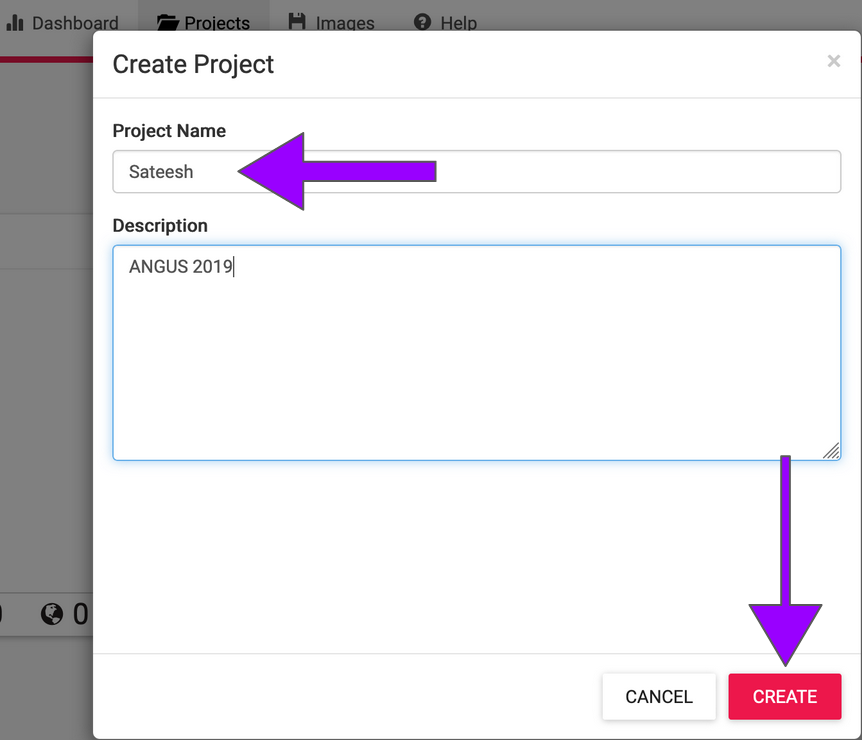

- **Click on your newly created project and then Click on "NEW" and then "Instance" from the drop-down menu to start up a new virtual machine.**

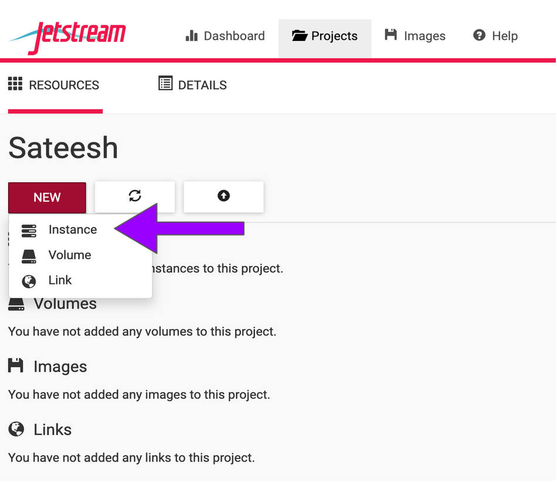

- **To select an image click on "Show All" tab and Search for "ANGUS 2019" and choose the "ANGUS 2019" image created by 'titus'.**

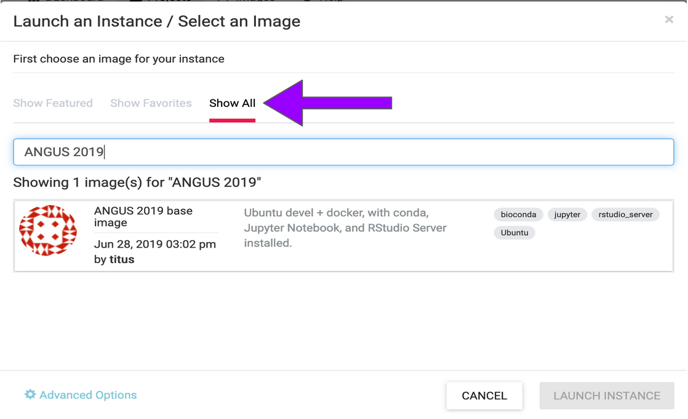

**NOTE:** Here "Image" refers to the template of a virtual machine containing an installed operating system, software, and configuration stored as a file on disk. Think of it like apps that come with your phone before you add new ones on your own.

**You will be presented with options to choose and configure your virtual machine here:

	+ Instance Name: e.x., "ANGUS 2019 base image" or you can leave it default which is the image name.

	+	Base Image Version: "1.3"

	+	Project: select your project folder

	+	Allocation Source: DIBSI Jetstream account

	+	Provider: "Jetstream - TACC"

	+ Instance size: We recommend ""m1.medium" (CPU: 6, Mem: 16GB, Disk: 60GB)"for this tutorial; Though  depending on your allocations, choose most suitable one.**

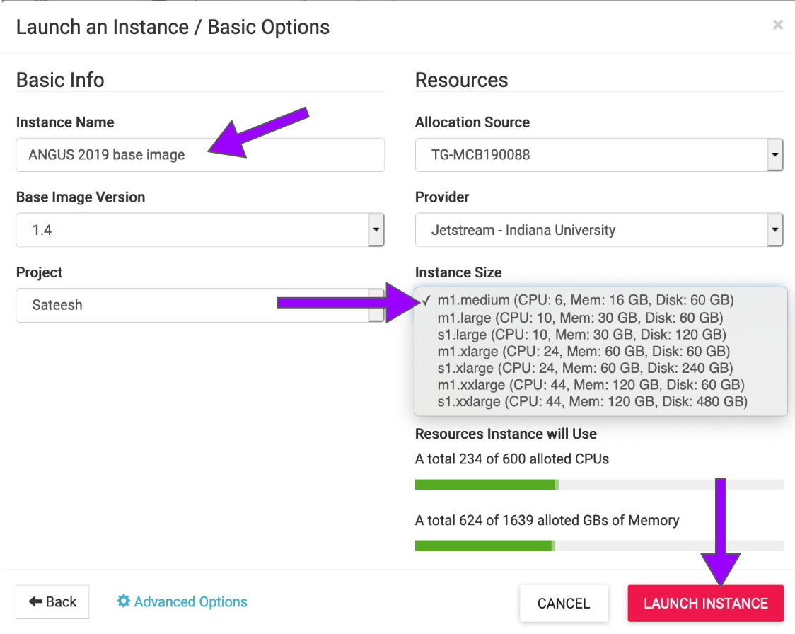

- **Launch instance and wait for the build to be deployed (~ 5-10 minutes).**

> ***Note: During the build process: `scheduling-->building-->spawning-->deploying-->Networking-->N/A`; Be patient! Don't reload!!. Once the virtual machine is ready, the "Activity" column will show "N/A" and the "Status" column will turn green and "Active".***

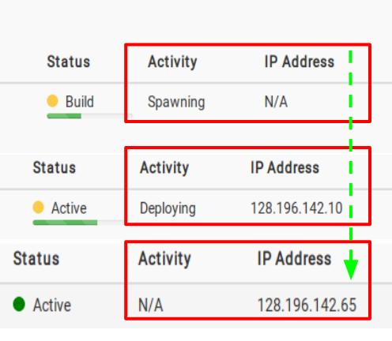

- **Navigate back to 'Projects' and click on your new instance's name to see more information related to the instance you just created! and Copy the IP address of your instance created.**

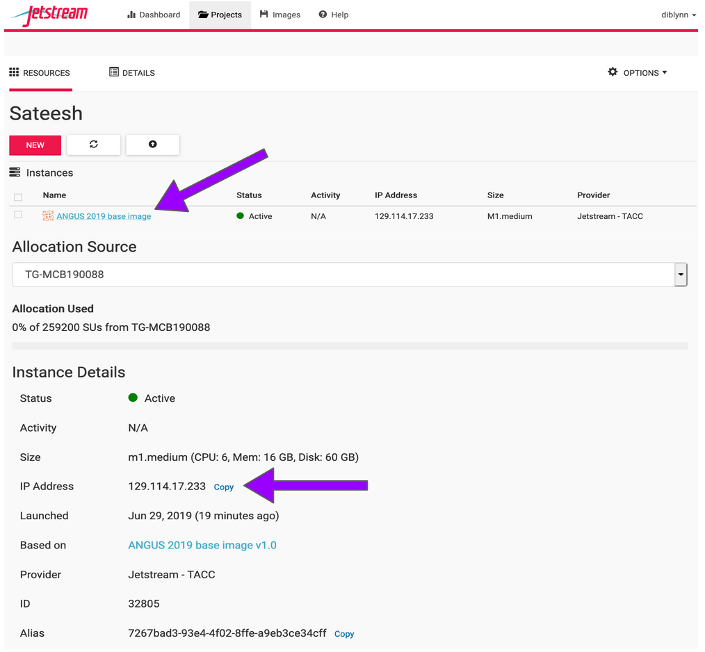

> **Great! We have now built our very own remote virtual machine with all the software pre-installed. Next we will use SSH-Secure-Login to access these remote instances from our laptop !!!.**

# SSH Secure-Login

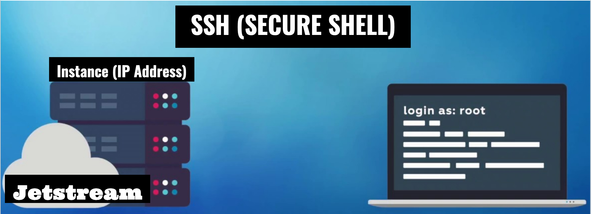

- macOS & LINUX users can open a Terminal window now.
- Windows 10 users with ubuntu can open a terminal 
- If your windows doesn't come with ubuntu distribution, users start a new session in git bash
	+ Start a new session; Fill in your "remote host" the IP address of your virtual machine; select "specify username" and enter your Jetstream username; Click OK.


- **Establish a secure-login to the instance by typing the following:**

```
$ ssh your_Jetstreamusername@ip_address
```

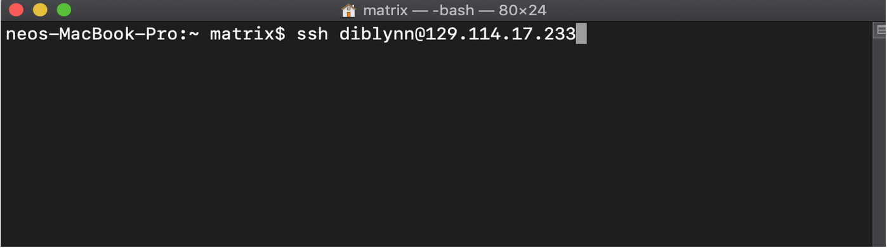

- **This should log you into Jetstream and you should see a screen like this; Enter 'yes' and then enter your Jetstream password.**

> Your cursor will not move or indicate you are typing as you enter your password. If you make a mistake, hit enter and you will be prompted again.

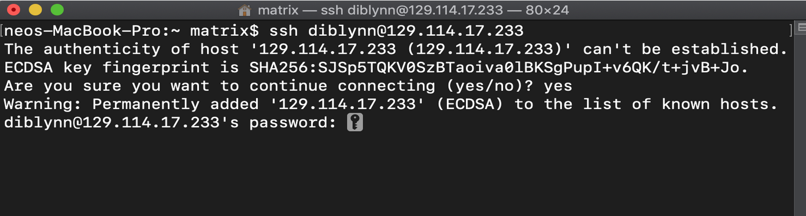

> **Success !!! We have established connections with our instances. Proceed to the Tutorial section.**

# Instance Maintenance

> To end your current session on an Instance and close SSH connection, type 'exit'

#### Jetstream Dashboard

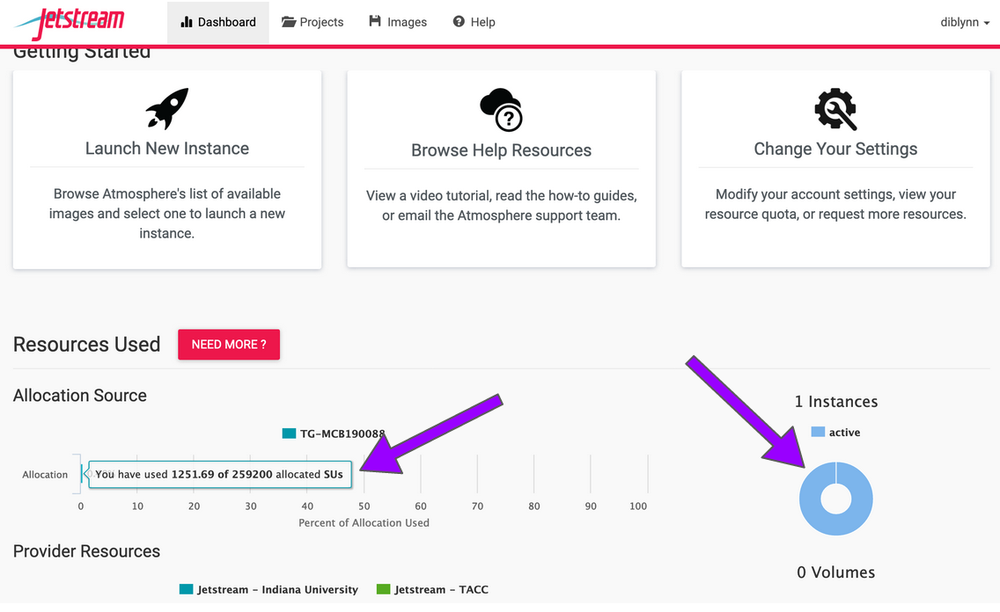

### Instance Actions

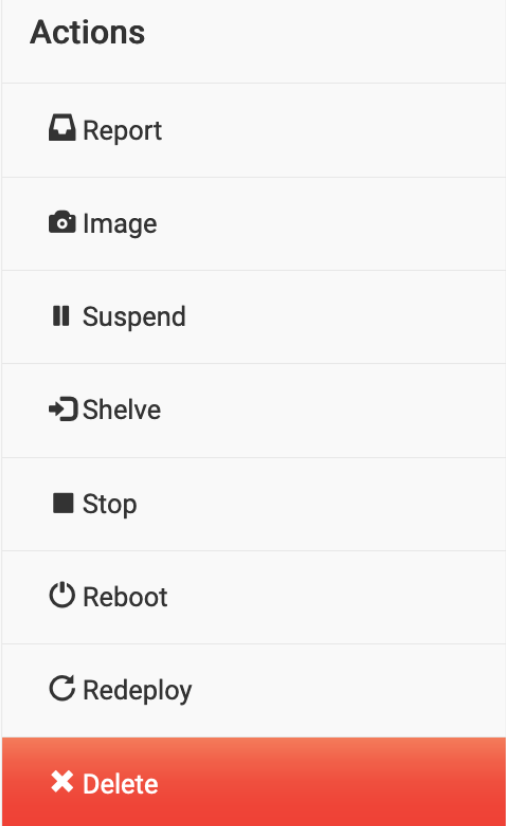

| Action | Description |
| ----- | ----- |
| Report | instance exhibiting unexpected behavior? Report here |
| Image | Request an image (a type of template for a virtual machine) of a running instance |
| Suspend | Suspending an instance frees up resources for other users and allows you to safely preserve the state of your instance without imaging. Your time allocation no longer counts against you in the suspended mode |
| Shelve | Shelving will safely preserve the state of your instance for later use. And, it frees up resources for other users . In fact, it is the best way to reduce resource usage when compared with other actions, like "suspend" and "stop".Your time allocation no longer counts against you in the shelved mode |
| Stop | Stop an instance |
| Reboot | Reboot an instance |
| Redeploy | Redeploying an instance will allow you to fix instances that show up as 'active - deploy_error' |
| Delete | following instance will be shut down and all data will be permanently lost |

> **Note: It is advisable to delete the machine if you are not planning to use it in future to save valuable resources. However if you want to use it in future, you can suspend it. Notice: IP address changes**


# Additional Features

## You can access a shell terminal and a web-desktop via your browser !!!


