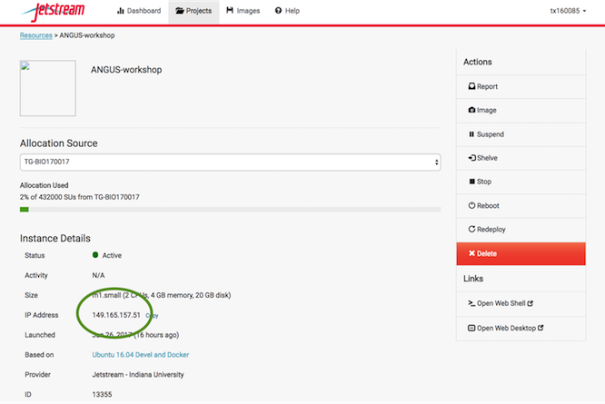
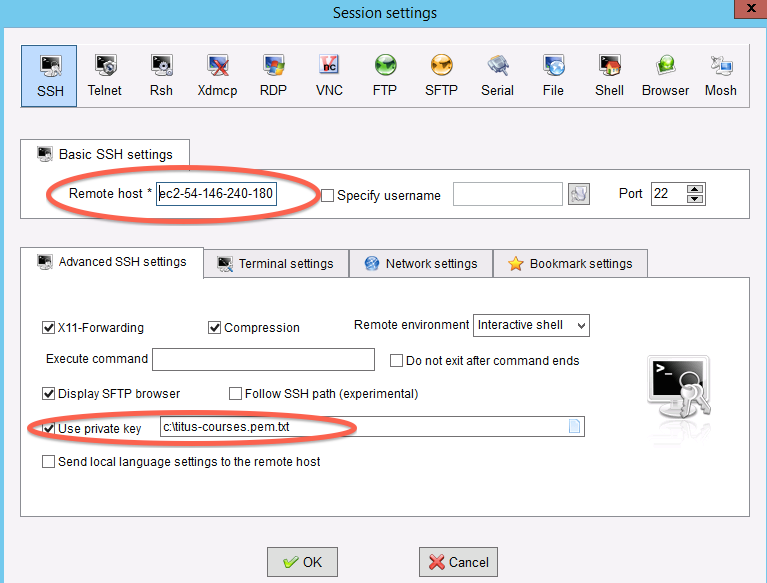

# Logging in to jetstream from your local terminal with a key file

Some of us have had problems with the web shell and getting into the Jetstream
portal. These materials will show you how to log in using an SSH key through your
local terminal.

## Concerning Keys

Cryptographic keys are a convenient and secure way to authenticate without having to use
passwords. They consist of a pair of files called the public and private keys: the public part can
be shared with whoever you'd like to authenticate with (in our case, Jetstream!), and the private
part is kept "secret" on your machine. Things that are encrypted with the public key can be be
decrypted with the private key, but it is computationally intractable (ie, it would take on the
order of thousands of years) to determine a private key from a public key. You can read more about
it [here](https://en.wikipedia.org/wiki/Public-key_cryptography).

The good news is that there is already a registered public key for our Jetstream account. However,
to make use of it, you'll need the private key. And so, we move on!

## Getting the Private Key

The private key has been posted on slack in the `#general` channel. You can download it by 
visiting [here](https://dibsi2018.slack.com/files/UBHJK59T9/FBHQP0KRB/angus_private_key), selecting
**Actions**, and pressing download.

## Getting your instance IP address

In order to connect to your instance, we need to know its IP address, its unique identifier on the
internet. This is listed in your instance details, circled below:

[](../_images/ip-address.png)

Now, things diverge a little.

## On MacOS/Linux

These systems have their own terminal by default. Find and open your terminal: on MacOS, you can
search for Terminal in finder. 

We're going to assume that the key file ended up in your `Downloads` folder. In your terminal,
run:

```bash
cd && mv ~/Downloads/angus_private_key .
```

This puts you and the file in your home folder. Now, we need to set its permissions more strictly:

```bash
chmod 600 angus_private_key
```

Finally, we can use the IP address from before, along with the common login name and the key, to log
in we need to use the `ssh` command, provide the key file with the `-i` flag, and then our class name (login ID) and the IP address we got above for our instance. This will look something like this:

```bash
ssh -i angus_private_key YOUR_CLASS_NAME@YOUR_IP_ADDRESS

The authenticity of host 'YOUR_IP_ADDRESS (YOUR_IP_ADDRESS)' can't be established.
ECDSA key fingerprint is SHA256:jPDtbjMUp9c7FWAvaLLwR9vWVNTOyqikzcE3m0hglG0.
Are you sure you want to continue connecting (yes/no)? yes
```

You should now have access to atmosphere within your local terminal.

## On Windows

For Windows, we first need to actually *install* a terminal.

### Install mobaxterm

First, download [mobaxterm home edition (portable)](http://mobaxterm.mobatek.net/download-home-edition.html)
and run it.

### Start a new session

[](../_images/moba-1.png)

### Fill in session settings

Fill in your "remote host," which will be the IP address from earlier. Then select
"specify username" and enter your class group name (e.g. dibbears).

[](../_images/ec2-moba-2.png)

### Specify the session key

Copy the downloaded private file onto your primary hard disk (generally
C:) and the put in the full path to it.

[](../_images/ec2-moba-3.png)

### Click OK

Victory!

[](../_images/ec2-moba-4.png)
