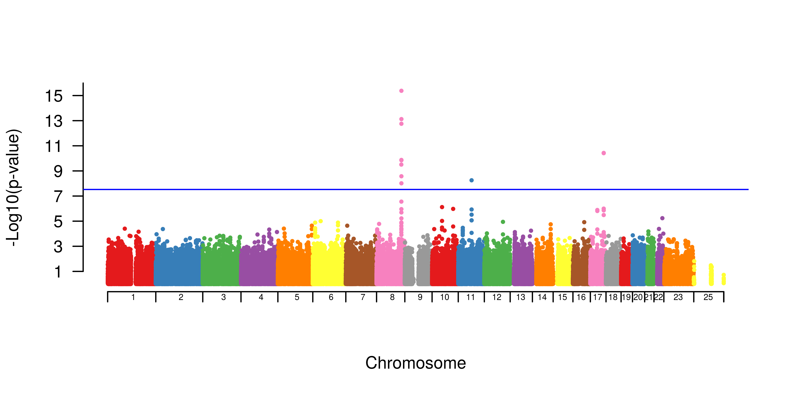
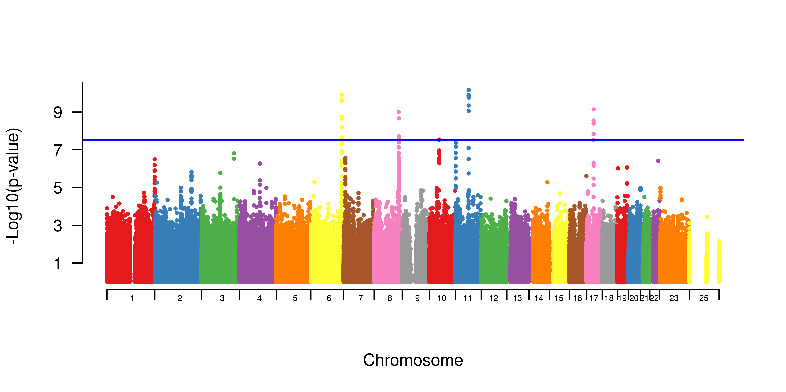

# Meta-Analysis of Genome Wide Association Studies

Previously we conducted a [genome wide association study](GWAS.md) (GWAS). 
Genome-wide association studies are useful for dectecting common variants in complex diseases. 
Meta-analysis of multiple genome-wide association studies  increases the power of detecting rare variants and reduces false positives.  

Today we will conduct a *meta-analysis* of two previously conducted prostate cancer GWASs in humans.

## Download METAL

```
cd
curl -O http://csg.sph.umich.edu/abecasis/Metal/download/Linux-metal.tar.gz
tar -xvzf Linux-metal.tar.gz 
sudo mv generic-metal/metal /usr/local/bin/.
```

### Download a prostate cancer dataset and unpack

```
curl -O https://de.cyverse.org/dl/d/9DEF6A65-F0A7-4C6E-8633-957C118FD1B3/meta_GWAS.tar.gz
tar -xvzf meta_GWAS.tar.gz
cd ~/meta_GWAS
```

Let's look at each study's manhattan plot.

** Study1:prostate-606 **



** Study2:prostate-396 **




We may be able to use the power of meta-analysis to resolve some of the questionably significant markers.

Let's use METAL to run a fixed-effect meta-analysis weighted by sample number fore each study.

Note: it is important to investigate what type of meta-analysis is most appropriate for your study, as each kind has limitations. For example, fixed effect meta-analyses will be biased under a large amount of heterogeneity. 

### Run metal

Start METAL:
```
metal
``` 
and press `enter` to access the program.

Next, lets tell METAL what files to read in and a little bit about the files:

```
# METAL commands
# READ in 606 data
SCHEME STDERR
MARKER SNP_ID
ALLELE Allele.1 Allele.2
EFFECT beta
STDERR SE
PROCESS prostate_606.assoc.logistic

# READ in 733 data
MARKER SNP
ALLELE A1 A2
EFFECT BETA
STDERR SE
PROCESS prostate_396.assoc.logistic

ANALYZE
```

Now exit the program by typing 
```
quit
```
and hitting the `return` key.

We can see our meta-analysis results in the `METAANALYSIS1.TBL` file.


## Visualize Meta-Analysis Results
First, we need to install one more R package **RColorBrewer**.

```
sudo Rscript -e "install.packages('RColorBrewer', contriburl=contrib.url('http://cran.r-project.org/'))"
```

Now we can create a manahattan plot from our results. 

```
Rscript create_manhattan.R METAANALYSIS1.TBL
``` 

This will take a minute.

Now lets view our plot in the Rstudio server tab!

```
setwd("/home/tx160085/meta_GWAS")
openPDF("METAANALYSIS1.TBL.allChrs.manhattan.png")
```

### References 
[http://www.nature.com/nrg/journal/v14/n6/full/nrg3472.html](http://www.nature.com/nrg/journal/v14/n6/full/nrg3472.html)

[METAL Documentation](http://genome.sph.umich.edu/wiki/METAL_Documentation)
