# Recovering "genomes" from metagenomes

---

## Objectives

- Discuss how we currently recover "genomes" from metagenomes (and why genomes is in quotes)
- Talk about considerations in assembling individual samples vs co-assembling multiple samples together
- Assemble a metagenome
- Recover and assess "genomes"

---

## Intro

There are a lot of different paths we take with metagenomics. Here's a generic overview that tries to highlight some things: 

<center></a></center>

<p align="right"><a href="https://ndownloader.figshare.com/files/15628103">PDF download</a></p>

Shotgun metagenomic sequencing aims to amplify all the accessible DNA of a mixed community, enabling profiling of taxonomy and functional potential. Recently, the recovery of "genomes" from metagenomes has become a very powerful approach in microbial ecology, drastically expanding the known Tree of Life by granting us genomic access to as-yet unculturable microbial populations (e.g. [Hug et al. 2016](https://www.nature.com/articles/nmicrobiol201648); [Parks et al. 2017](https://www.nature.com/articles/s41564-017-0012-7)). 

> **NOTE**
> 
> It is important to understand that even the highest quality genomes recovered from a metagenome are most often *not* the same as an isolate genome. This is why the community has taken to referring to them as **M**etagenome-**A**ssembled **G**enomes, or MAGs. Due to the nature of microbial diversity, high-quality MAGs we can recover from metagenomes are better thought of as an agglomeration of a very closely related organisms due to the assembly process and the fine-scale variation that often exists in microbial populations. 

## How do we recover MAGs?

<center>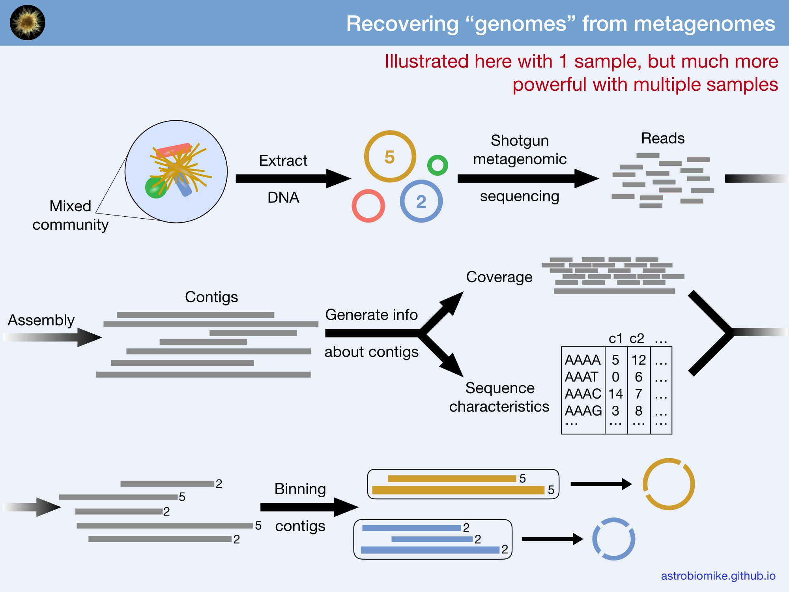</center>
<p align="right"><a href="https://ndownloader.figshare.com/files/16241105">PDF download</a>; <a href="https://ndownloader.figshare.com/files/16240550">Keynote slide</a>; <a href="https://ndownloader.figshare.com/files/16240814">Powerpoint slide</a></p>

## Accessing our JetStream instances
We should still have our jetstream instances running. You can follow the instructions [here](jetstream/boot.html) to log in to the [JetStream](https://use.jetstream-cloud.org/application/dashboard) website and find your instance and IP address. Then we need to `ssh` into it slightly differently than we have been in order to work with the interactive visualization program we will be using:

```
ssh -L 8080:localhost:8080 dibxxxx@xxx.xxx.xxx.xx
```

Here, all that needs to be changed for your login is "dibxxxx" to whatever your user name is (which is dependent upon your initial room), and then the "xxx.xxx.xxx.xx" needs to be your specific IP address.

## Setting up our working environment
We'll need two programs for the work in this page. They are going to be installed using [conda](https://conda.io/docs/) with the specific versions used at the time this was put together. 

Here, we are creating a new environment and specifying the packages we want installed at the same time, then entering the environment: 

```bash
conda create -y -n metagen_example -c conda-forge -c bioconda \
             bowtie2=2.2.5 anvio=5.5.0 megahit=1.1.1 centrifuge=1.0.4

conda activate metagen_example
```

## Our example data
To work with a smaller dataset here that will let us do things in a reasonable amount of time, we're going to be working with a relatively simple microbial community that comes from 2x50bp paired-end Illumina metagenomic sequencing of an enrichment culture of a nitrogen-fixing cyanobacterium called *Trichodesmium* (from [Lee et al. 2017](https://www.nature.com/articles/ismej201749). Including 4 full samples, which was needed to get a good assembly, made the data and full processing a bit much for the purposes of this page. So we're going to start with data already quality trimmed and filtered here (though this step is absolutely necessary, and as discussed in the [genomic assembly lesson here](de-novo-genome-assembly.md), consideration of what you're trying to do with the data can also be a factor). Also, to lighten the processing load, the majority of *Trichodesmium* reads (the dominant organism in the culture) have also been largely removed, and for the steps that take longer than are practical here, we will break down the code that was run, but copy over result files to save time 🙂

Let's start downloading the example data and then talk about what a co-assembly is and what it's good for while it's downloading (it's about 1.7GB total):

```bash
cd ~/
curl -L https://ndownloader.figshare.com/files/16249280 -o metagen-ex.tar.gz
```

## What is a co-assembly?
"Co-assembly" refers to performing an assembly where the input files would be reads from multiple samples. This is in contrast to doing an independent assembly for each sample, where the input for each assembly would be just the reads from that individual sample. 

Three major benefits of co-assembly include:

1. higher read depth (this *can* allow you to have a more robust assembly that captures more of the diversity in your system, *but not always*)
2. it facilitates the comparison across samples by giving you one reference assembly to use for all
3. it can substantially improve your ability to recover genomes from metagenomes due to the awesome power of differential coverage (this concept of using coverage to recover genomes is shown in the figure and slides available above with one sample, but as noted really becomes powerful with multiple)

## To co-assemble or not to co-assemble?
Though a co-assembly has its benefits, it will not be ideal in all circumstances. And as with most things in bioinformatics, there are no golden rules as for when it would be better to co-assemble multiple samples together over when it would be better to run individual assemblies on each. This is because it depends on many factors, like: the diversity of the communities as a whole; how much variation in the communities there is between the samples; the assembler(s) we're trying; and our overall goals. There can be many situations where a co-assembly might give us a much poorer assembly than any individual assembly might, and there are cases where we might get a much better assembly from a co-assembly than from any individual sample's assembly. It is something to be aware of and consider, and if we have the time and resources, it is reasonable to try multiple avenues.

>**NOTE:** The following examples are not authoritative guidelines at all, those really don't exist for this. These are just anecdotally observed trends 🙂

**Example scenario where it's *probably* a good idea to co-assemble:**  

If working with an experiment that started from a mixed culture that was split into multiple treatments, and then some time later we sequenced the metagenomes of all. 

**Example scenario where it is very hard to know if a co-assembly would hurt or help more before trying things:**  

If working with multiple environmetal samples from different locations (whether meters apart or centimeters apart depending on the sampling context).

**Example scenario where it's *most likely not* a good idea to co-assemble:**  

If working with microbiome samples from different individuals. (However, if working with microbiome samples from the *same* individual across time, it *probably* is a good idea to co-assemble.)

---

When the data download is complete, let's run the following commands to unpack and decompress it, change into our new directory, and see what's there:

```
tar -xzvf metagen-ex.tar.gz
cd metagen-ex/
ls
```

This main directory we just changed into holds 3 subdirectories: "data", which holds our 4 samples' forward (R1) and reverse (R2) reads (though they are empty here to save storage space and transfer time); "results", which holds our result files we'll use from time to time to skip longer steps; and "working", where we are going to be running our commands from.

Let's change into the "working" directory (which will be empty right now):

```bash
cd working/
ls
```

Let's make a "samples.txt" file that contains each of our sample names. This can be useful for writing loops to do things to all of our samples as we'll see in a bit. Our sample reads are in the data directory we downloaded, we can peek at them like so:

```bash
ls ../data/
```

We have forward and reverse reads for 4 different samples here, here's one quick way we can make a list of all of our samples:

```bash
ls ../data/*1.fastq.gz | cut -d "/" -f 3 | cut -d "_" -f 1,2 > samples.txt
```

## Co-assembly

Here we are working with 4 samples initially split off from one enrichment culture, so we are going to coassemble things in this case. The companion organisms were also in relatively very low abundance relative to the host, *Trichodesmium*, and individual assemblies didn't seem to provide enough coverage to assemble their genomes.

We will be using the [MEGAHIT](https://github.com/voutcn/megahit) assembler here, but there is a bit more discussion on testing and comparing different assemblies on the [de novo genome assembly page](de-novo-genome-assembly.md). 

In this case, here is how the command would be run, with a breakdown to follow, but since it would take roughly 45 minutes to run, we are going to skip this step for now and just copy over the results: 

```bash
   ## DON'T RUN THIS CODE BLOCK; WE WILL COPY OVER THE RESULTS ##
   
# megahit -1 ../data/Sample_A_1.fastq.gz,../data/Sample_B_1.fastq.gz,../data/Sample_C_1.fastq.gz,../data/Sample_D_1.fastq.gz \
#         -2 ../data/Sample_A_2.fastq.gz,../data/Sample_B_2.fastq.gz,../data/Sample_C_2.fastq.gz,../data/Sample_D_2.fastq.gz \
#         -o megahit-assembly -t 6
```

> **CODE BREAKDOWN** 
> 
> - **`megahit`** is our starting command
>   - **`-1`** is for specifying the forward reads. Since we are doing a co-assembly of multiple samples, we could have stuck them altogether first into one file, but `megahit` allows multiple input files to be provided at once. Notice here we are specifying the relative paths to all of the forward reads, each separated by a **comma**, with **no** spaces.  
>   - **`-2`** contains all the reverse read files, separated by commas, *in the same order as the forward reads were provided*.
>   - **`-o`** specifies the output directory
>   - **`-t`** specifies that we want to use 6 threads

When the assembly finishes, we would have the "megahit-assembly" directory that is currently within our "results" directory. So we're just going to copy over that final output fasta file (our co-assembly) into our working directory:

```bash
cp ../results/megahit-assembly/final.contigs.fa .
```

## Mapping the reads that built our assembly *to* that assembly

As discussed above, "coverage" information (how the reads recruit to our assembly) from each sample will help us in our efforts to recover metagenome-assembled genomes (MAGs). 

The next code block shows how we would run [bowtie2](http://bowtie-bio.sourceforge.net/bowtie2/index.shtml) to first index do our assembly for bowtie2, and shows the required following commands to map one sample, convert it from a ".sam" (**s**equence **a**lignment **m**ap) to ".bam" (**b**inary **a**lignment **m**ap), and then to sort and index the ".bam" file (which is required for many programs to rapidly work with ".bam" files. Then the following code block demonstrates how those steps would be run for all samples in a for loop. But for time purposes here as well, we are going to copy over the results rather than running these commands now: 

```bash
   ## DON'T RUN THIS CODE BLOCK; WE WILL COPY OVER THE RESULTS ##

  # making index
# bowtie2-build final.contigs.fa assembly

  # here is what mapping one sample would look like
# bowtie2 -q -x assembly -1 ../data/Sample_A_1.fastq.gz \
#         -2 ../data/Sample_A_2.fastq.gz --no-unal \
#         -p 6 -S Sample_A.sam

  # converting .sam to .bam
# samtools view -b -o Sample_A-raw.bam Sample_A.sam

  # sorting and indexing .bam file
# samtools sort -o Sample_A.bam Sample_A-raw.bam
# samtools index Sample_A.bam
```

> **CODE BREAKDOWN** 
> 
> - **`bowtie2-build`** - this indexes our assembly file (we only need to run this once so it won't be in our for loop below)
>   - `final.contigs.fa` - the first positional argument is our input assembly fasta file
>   - `assembly` - the second positional argument is the prefix of the output files we want it to create
> - **`bowtie2`** is the command we're running
>   - `-q` specifies the input files are in fastq format
>   - `-x` specifies the prefix of the index we just built 
>   - `-1` specifies the forward reads of the sample we're mapping
>   - `-2` specifies the reverse reads
>   - `--no-unal` tells the program we don't want to record the reads that don't align successfully
>   - `-p` specifies how many threads we want to use
>   - `-S` specifies the name of the output "sam" file we want to create (**S**equence **A**lignment **M**ap)
> - **`samtools view`** - the starting command to convert from ".sam" to ".bam" format
>   - `-b` - specifies we want the output to be in ".bam" format
>   - `-o` - specifies the output file name
>   - `Sample_A.sam` - positional argument specifying the input file name
> - **`samtools sort`** - command to sort the ".bam" file
>   - `-o` - specifies the output file name
>   - `Sample_A-raw.bam` - positional argument specifying the input file name
> - **`samtools index`** - indexes our ".bam" file, taking only a positional argument specifying the input file (it creates an additional file with the same name but an additional ".bai" extension)

For all those steps we need to run on each individual sample, it'd be much better to do this with a for loop. That might take advantage of our "samples.txt" file that holds all of our sample names, and look something like this:

```bash
   ## DON'T RUN THIS CODE BLOCK; WE WILL COPY OVER THE RESULTS ##
   
# for sample in $(cat samples.txt)
# do
#
#   bowtie2 -x assembly -q -1 ../data/"$sample"_1.fastq.gz \
#           -2 ../data/"$sample"_2.fastq.gz --no-unal -p 4 \
#           -S "$sample".sam
#
#   samtools view -b -o "$sample"-raw.bam "$sample".sam
#
#   samtools sort -o "$sample".bam "$sample"-raw.bam
#   samtools index "$sample".bam
#
# done
```

As mentioned above, running that together would take a little longer than is practical for us time-wise. So here we're just going to copy over the file resulting final ".bam" files and their ".bai" indexes:

```bash
ls ../results/*.bam
cp ../results/*.bam .

ls ../results/*.bai
cp ../results/*.bai .
```

## Identifying individual MAGs based on coverage and sequence composition within anvi'o

Here we're going to use a wonderful platform called [anvi'o](http://merenlab.org/software/anvio/), which stands for analysis and visualization of omics data. anvi'o is very expansive, but to try to summarize it in a sentence, it is a powerful and user-friendly data visualization and exploration platform. There is a ton of excellent documentation at the [anvi'o site](http://merenlab.org/software/anvio/), including workflows, tutorials, and blog posts. 

Here we're going to put our assembly into the anvi'o framework and use it to help us visualize and identify our **m**etagenome-**a**ssembled **g**enomes (MAGs). Many of the major steps we're going to be performing here are laid out in the [metagenomic workflow presented here](http://merenlab.org/2016/06/22/anvio-tutorial-v2/). 

### Putting our assembly into anvi'o and generating some information about it

For us to get our assembly into anvi'o, first we need to generate what it calls a [contigs database](http://merenlab.org/2016/06/22/anvio-tutorial-v2/#creating-an-anvio-contigs-database). This contains the contigs from our assembly and some information them (like GC content, tetranucleotide frequency, and open-reading frame coordinates). The following command will organize our contigs in an anvi'o-friendly way, generate some basic stats about them, and use the program [Prodigal](https://github.com/hyattpd/Prodigal) to identify [open-reading frames](https://en.wikipedia.org/wiki/Open_reading_frame). This is how the code would be run, but again to save time, we are going to skip it here and copy the results in a bit:

```bash
   ## DON'T RUN THIS CODE BLOCK; WE WILL COPY OVER THE RESULTS ##

# anvi-gen-contigs-database -f final.contigs.fa -o contigs.db \
#                           -n "Our metagenome"
```

After generating an initial `contigs.db` that holds our sequences and some basic information about them, we can start adding more information. This is one of the places where the flexibility comes into play, but for now we'll just move forward with some parts of a general anvi'o workflow, including:

- using the program [HMMER](http://hmmer.org/) with profile hidden Markov models (HMMs) to scan for bacterial single-copy genes [(from Campbell et al. 2013)](http://www.pnas.org/content/110/14/5540.short)
  - if new to HMMs, see the bottom of page 7 [here](http://eddylab.org/software/hmmer3/3.1b2/Userguide.pdf) for a good explanation of what exactly a "hidden Markov model" is in the realm of sequence data
  - to summarize, instead of treating all columns of an alignment equally (like something like BLAST does), HMMs can weight individual columns in an alignment differently. So the highly-conserved stretches within, say, a conserved domain of a protein will matter more than a stretch in between two domains that may vary more.

- using [NCBI COGs](https://www.ncbi.nlm.nih.gov/COG/) to functionally annotate the open-reading frames [Prodigal](https://github.com/hyattpd/Prodigal) predicted

- using a tool called [centrifuge](https://ccb.jhu.edu/software/centrifuge/index.shtml) for taxonomic classification of the identified open-reading frames

The following block of code would take ~45 minutes to run, mostly because of needing to download and setup some databases (only needed for their first use). So we are going to skip running this code block also and copy over the results.

```bash
   ## DON'T RUN THIS CODE BLOCK; WE WILL COPY OVER THE RESULTS ##

  # HMM searching for bacterial single-copy genes
# anvi-run-hmms -I Campbell_et_al -c contigs.db -T 6

  # functional annotation with DIAMOND against NCBI's COGs
# anvi-setup-ncbi-cogs -T 6 # only needed the first time
# anvi-run-ncbi-cogs -c contigs.db --num-threads 6

  # exporting Prodigal-identified open-reading frames from anvi'o
# anvi-get-sequences-for-gene-calls -c contigs.db -o gene_calls.fa

  # setting up centrifuge db for taxonomy (only needed the first time)
# wget ftp://ftp.ccb.jhu.edu/pub/infphilo/centrifuge/data/p_compressed+h+v.tar.gz
# tar -xzvf p_compressed+h+v.tar.gz && rm -rf p_compressed+h+v.tar.gz

  # running centrifuge taxonomy (this taxonomically classifies each identified coding sequence)
# centrifuge -f -x p_compressed+h+v gene_calls.fa -S centrifuge_hits.tsv -p 6

  # importing the taxonomy results into our anvi'o contigs database
# anvi-import-taxonomy-for-genes -p centrifuge -c contigs.db \
#                                -i centrifuge_report.tsv \
#                                centrifuge_hits.tsv
```

Let's copy over the new "contigs.db" that has the information stored from running those commands:

```bash
cp ../results/contigs.db .
```

### Integrating coverage information

The last thing we want to integrate into anvi'o right now is the mapping information from recruiting the reads of each of our samples to the assembly we built with them. anvi'o stores this information in what it calls a profile database. Here is how we would run this on one of our samples:

```bash
   ## DON'T RUN THIS CODE BLOCK; WE WILL COPY OVER THE RESULTS ##
   
# anvi-profile -i Sample_A.bam -c contigs.db -T 6
```

> **CODE BREAKDOWN**
> 
> - **`anvi-profile`** - our main command
>   - **`-i`** - specifies the input bam file
>   - **`-c`** - specifies our contigs database file
>   - **`-T`** - sets the number of threads to use

And here is how we could run this on all our samples with a for loop:

```bash
   ## DON'T RUN THIS CODE BLOCK; WE WILL COPY OVER THE RESULTS ##
   
# for sample in $(cat samples.txt)
# do 
#
#   anvi-profile -i "$sample".bam -c contigs.db -T 6
#
# done
```

And the last step we would need to do is to merge all of these profile databases together into one anvi'o profile database so that we can vizualize them all together. This would be done as follows:

```bash
   ## DON'T RUN THIS CODE BLOCK; WE WILL COPY OVER THE RESULTS ##
   
# anvi-merge */PROFILE.db -o merged_profile -c contigs.db
```

> **CODE BREAKDOWN** 
> - **`anvi-merge`** is the main program we're using
>   - the first positional argument specifies the sample-specific input profile databases. For each sample, when we ran `anvi-profile` above, the output created a subdirectory of results. By providing the `*` wildcard here followed by `/PROFILE.db` we are providing all of them as inputs to this command.
>   - `-o` specifies the output directory
>   - `-c` specifies our contigs database

We skipped those steps to save some time, so let's copy over the results "merged_profile" directory now:

```bash
  # the -r is required to copy the directory and its contents
cp -r ../results/merged_profile/ .
```

## Visualization!
Ok! Now the payoff for all that hard work we just did. We are going to launch `anvi-interactive` which allows us to see our metagenome and how each sample's reads recruited to it. This is why we had to `ssh` into our JetStream instances a little differently, to be able to host the website we are going to interact with so that we could get to it from our local computer.

First, copy and paste this command to generate the link we will need to access our interactive interface:

```bash
echo "http://$(hostname -i):8080"
```

Now, let's run this command will launch the interactive interface:

```bash
anvi-interactive -p merged_profile/PROFILE.db -c contigs.db \
                 --server-only -P 8080
```

If that successfully launches, your terminal should display this message: 

"The server is now listening the port number "8080". When you are finished, press CTRL+C to terminate the server."

Then go to your computer's web browser and paste in the link that we generated in the terminal with the above `echo` command. Once there, click the "Draw" buttom at the bottom left and you should see something like this:

<br>
<center>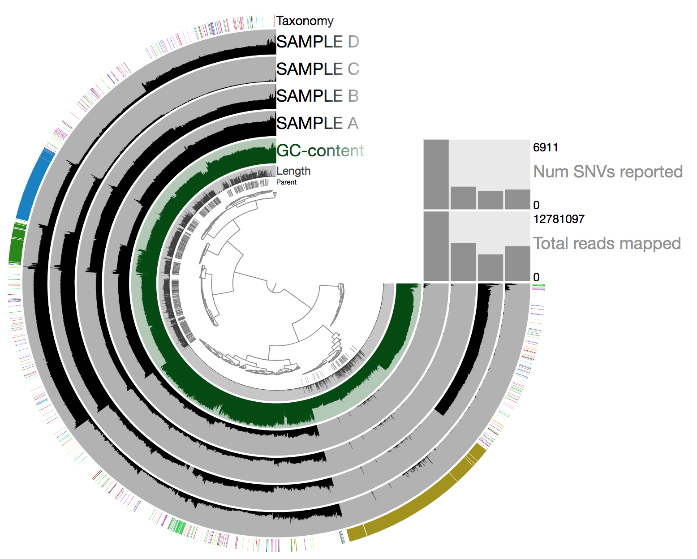</center>
<br>

So there is a lot going on here at first glance, especially if we're not yet familiar with how anvi'o organizes things. So here's a quick crash course 🙂  

At the center of the figure is a hierarchical clustering of the contigs from our assembly (here clustered based on tetranucleotide frequency and coverage). So each tip (leaf) represents a contig (or a fragment of a contig as each is actually broken down into a max of ~20,000bps, but for right now we'll just be referring to them as contigs). Then radiating out from the center are circular layers of information ("Parent", "Length", "GC content", our 4 samples, and then "Taxonomy".), with each layer displaying information for each contig. For each of our samples, the circular layer is showing the mean coverage for that sample to each contig from our assembly. 

Let's look at the taxonomy layer at the outer edge for a second, if we press the `M` key on our keyboard, a panel should pop out from the right side with information. Then if we hover over the taxonomy bar, we will see the taxonomy classification for whichever particular contig we are hovering over. Here is an example:

<br>
<center>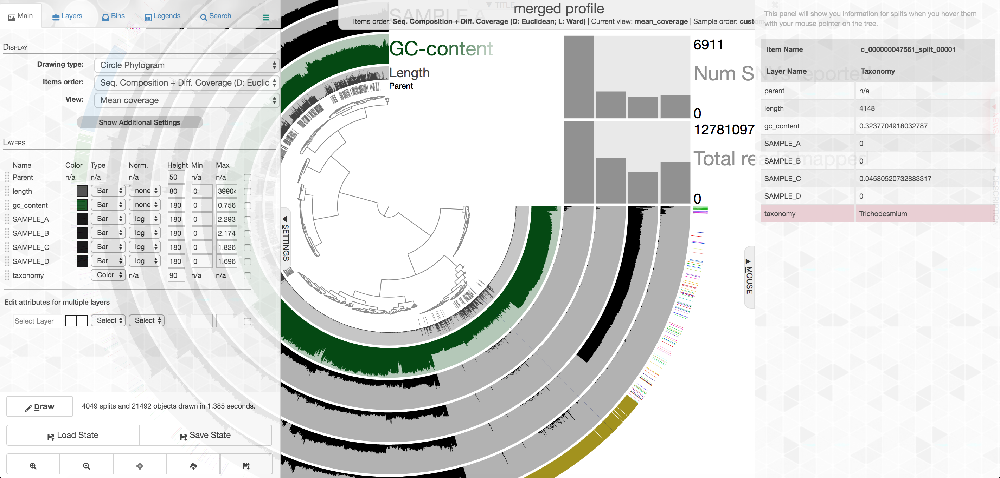</center>
<br>

Your colors will probably be different, as they are chosen at random when launched if not set already. Try to find the cluster of contigs that represents *Trichodesmium*. If we click on the "Bins" tab at the top left, and then select the branch on the tree at the center that holds all the *Trichodesmium*-classified contigs, we will see a real-time estimate of % completion/redundancy:

<br>
<center></center>
<br>

And we can see in the left pane that we selected 535 splits (contigs and/or split contigs due to length), with a total length of 7 Mbps, with an estimated 100% completion and 4.3% redundancy – estimations based on the bacterial single-copy genes we scanned for with `anvi-run-hmms` above. This is pretty good, but *Trichodesmium* has a very strange genome for a prokaryote, with a lot of long, repetitive regions that don't assemble well, so we're actually about 1 Mbps short of what would be expected (another reminder that these % completion estimations are valuable, but they are a little bit of a skewed window, and not perfect. As mentioned above, to shrink the dataset to make it more manageable most of the *Trichodesmium* reads have been removed, which is why the coverage patterns across the samples for *Trichodesmium* look strange, so don't pay too much attention to that. Let's move on to something else 🙂

In the panel to the left, click "New bin", and let's look at some of these other clusters of contigs. Try to find the *Alteromonas* cluster, and then select the branch that holds them:

<br>
<center>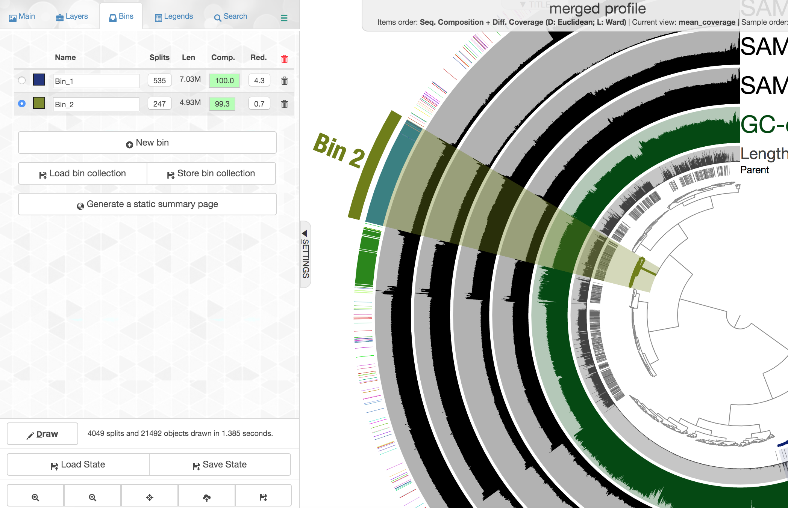</center>
<br>

This ones says 4.93 Mbps which is pretty spot on for a typical *Alteromonas* genome, with an estimated 99.3% complete and 0.7% redundancy. Here we had the taxonomy clearly helping to define this group of contigs, but that's very dependent on databases. Let's imagine we didn't have the taxonomy guiding us, and take a closer look at the coverage of reads from the 4 different samples across these contigs:

<br>
<center>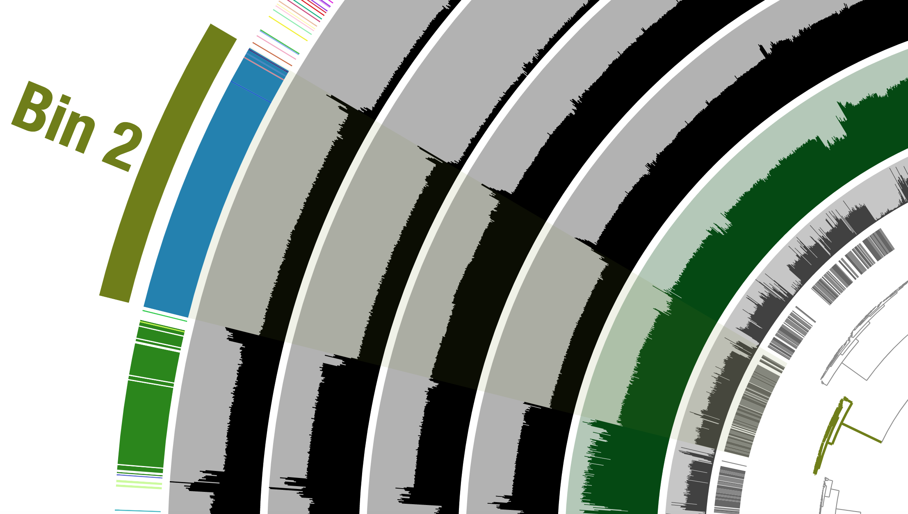</center>
<br>

Notice how across the samples (the rows wrapping around the circle), the coverage of these contigs varies, but that within a sample it is pretty consistent across these selected contigs. Meaning, Sample B seems to have the highest coverage for these contigs, but evenly across, and Sample C seems to have the lowest, but again consistent within that sample. This is what we would expect the coverage to do if these contigs all came from a similar source, and that source as a whole was in a different relative abundance in different samples 🙂 

Let's look at one where the taxonomy layer is a mess and doesn't help as much. First click "New bin" again at the left, then select this cluster of contigs:

<br>
<center>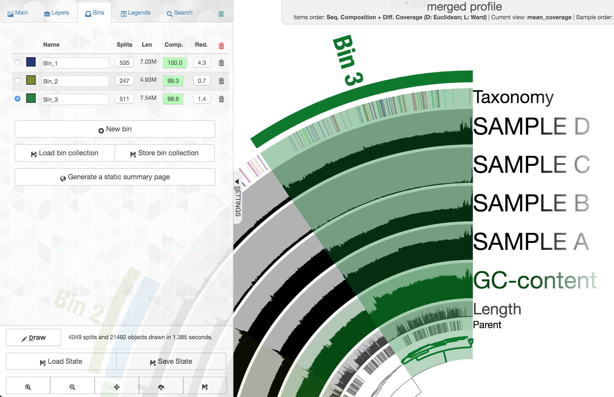</center>
<br>

Note again how drastically the coverage shifts across samples, but how consistent it is within a sample. This is currently the most powerful tool we have for attempting to recover genomes from metagenomes. There are some contigs with pretty different coverage at the top here, higher than the rest of what we've selected, and they also have a pretty drastically different GC content:

<br>
<center>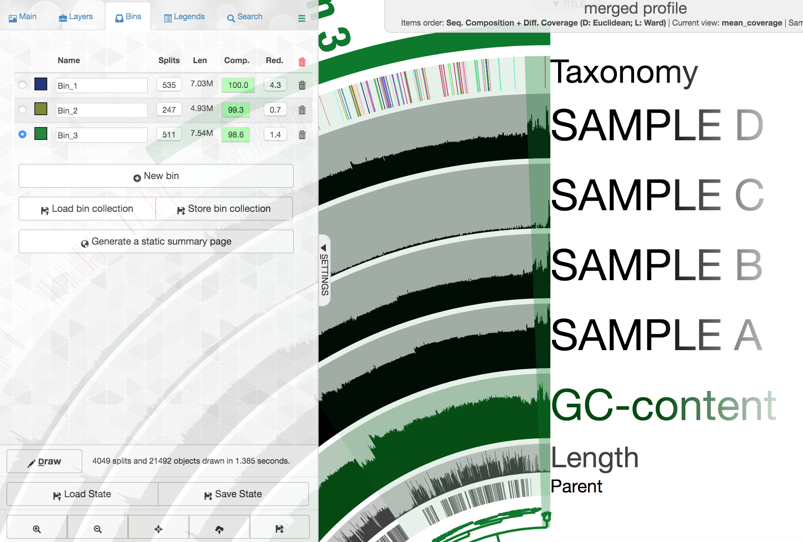</center>
<br>

But, they still change consistently across samples in the same fashion the rest of these contigs do. 

So let's go one layer deeper and take a quick look at this. If we "right" click on one of the specific contigs, here selecting the tallest peak in coverage "c_000000020639", we'll get a menu where we can select "Inspect" which opens a visualization of that particular contig:

<br>
<center>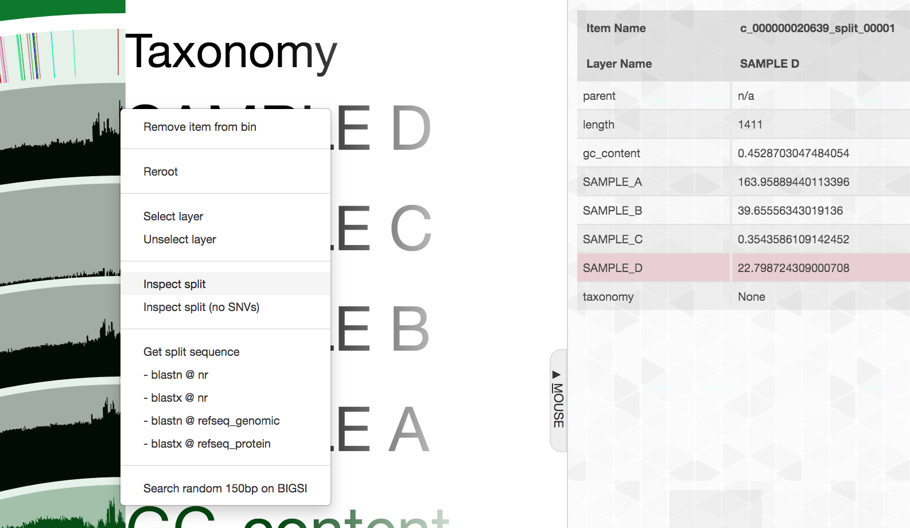</center>
<br>

<center>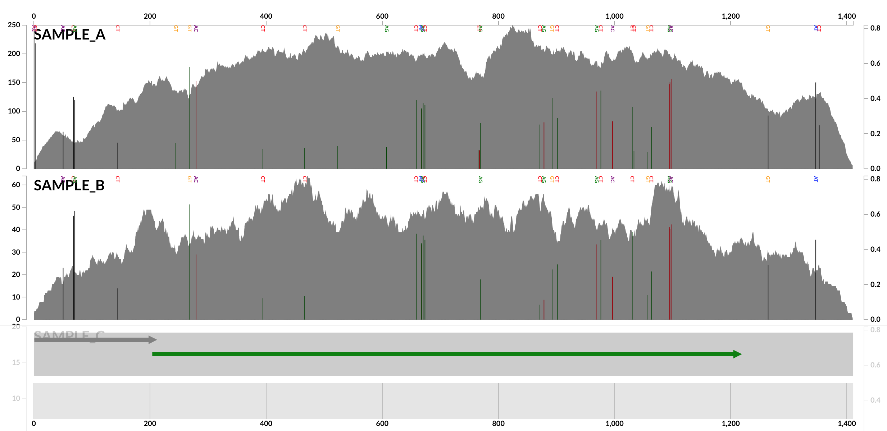</center>
<br>

Here each row is a sample, the x-axis is the contig laid out, showing about 1,400 bps here, and the peaks show read coverage according to the y-axis on the left side. The majority of this contig is spanned by one gene, shown by the green arrow on the bottom (green means there is an annotation stored, gray is one without any annotation stored). If we click on that green arrow, we can see what the gene was annotated as:

<br>
<center>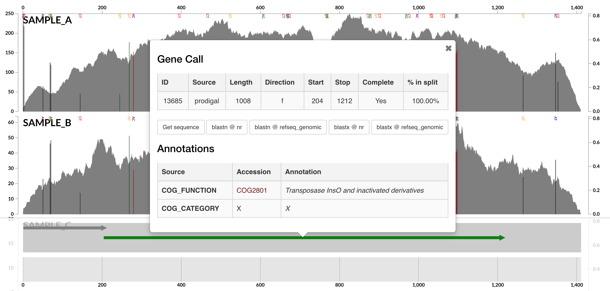</center>
<br>

And it seems that was annotated as a transposase. If we select "Get sequence" from the gene info window, copy the sequence, and then paste it into [NCBI to BLASTX it here](https://blast.ncbi.nlm.nih.gov/Blast.cgi?PROGRAM=blastx&PAGE_TYPE=BlastSearch&LINK_LOC=blasthome), it is highly similar (97% identity across 98% of the sequence) to a integrase/transposase/recombinase from *Phaeodactylibacter xiamenensis*, a member of the Bacteroidetes phylum that this entire bin actually comes from (known from further work not included here - it turns out it is just not well-represented in the database we used for taxonomic classification here). So it seems it does belong with this genome, but maybe has much higher coverage due to existing in multiple copies within the *P. xiamenensis* genome, or maybe other organisms have also picked it up 🤷‍♂️

This was just an example of how this interface can help us manually identify and curate our efforts to recover genomes from metagenomes.

## Exporting our bins
Now that we've selected 3 bins, if we want to export them from anvi'o we need to save them first. To do that, on the "Bins" pane at the left of the main interactive screen, we need to select "Store bin collection", and give it a new name like "my_bins" and click "Store". Then one way we can summarize them and generate fasta files for them is by clicking "Generate a static summary page" in the "Bins" pane, and then select the new collection we made, and then click "Generate":

<br>
<center>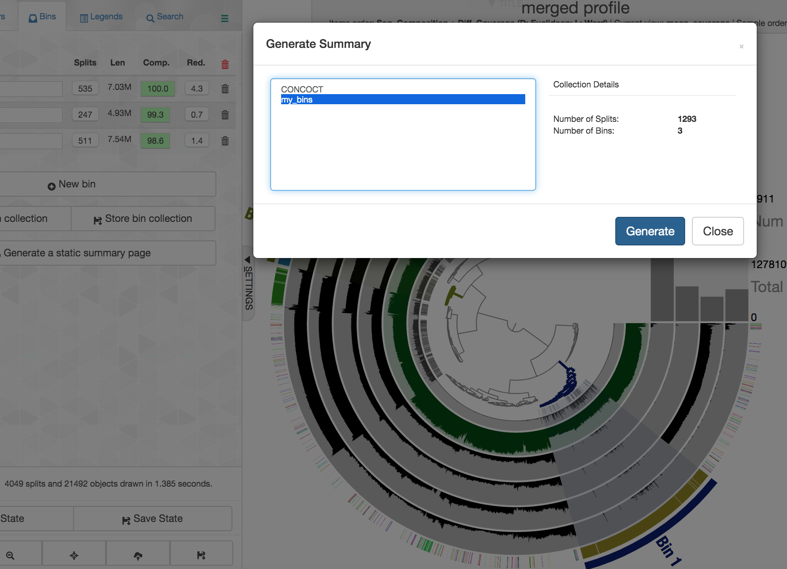</center>
<br>

After a few seconds it will finish, and for now let's click "Close" and return to our JetStream terminal running the interactive interface. 

Since we're done with the interactive mode for now, we can press `ctrl + c` to cancel the operation in the terminal. Our summary of our bins created a new directory within our merged_profile directory. In there is a summary of our bins we can peek at:

```bash
column -t merged_profile/SUMMARY_my_bins/bins_summary.txt
```

And there are also fasta files of each bin stored within the summary directory, e.g.:

```bash
head merged_profile/SUMMARY_my_bins/bin_by_bin/Bin_2/Bin_2-contigs.fa
```
___

## So what now?
There are lots of fun things to do with newly recovered genomes! Some common characterization avenues involve things like phylogenomics, looking at distributions of them by recruiting metagenomic reads from other samples and environments, and comparative genomics/pangenomics. 

**Go forth and expand the Tree of Life 🙂**

<center><a href="_static/metagenomics_overview.png"></a></center>

<p align="right"><a href="https://ndownloader.figshare.com/files/15628103">PDF download</a></p>
