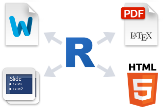
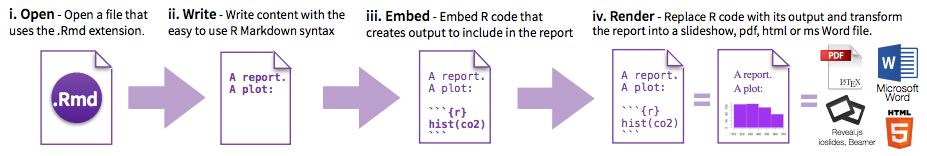
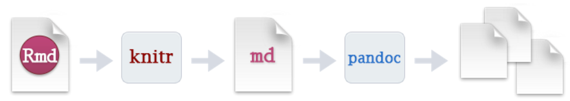
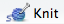
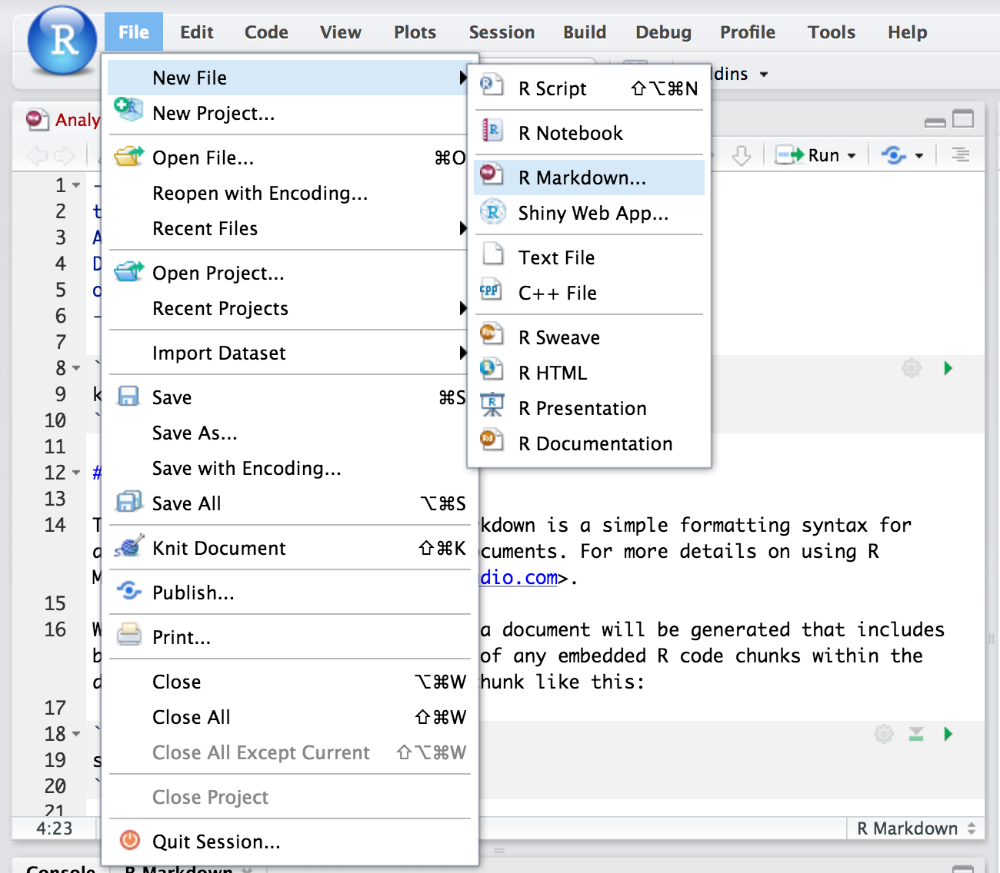
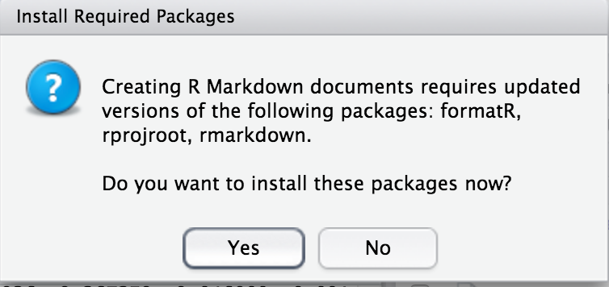
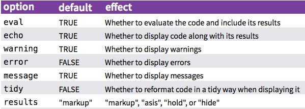

# Exploratory RNAseq data analysis using RMarkdown


During this lesson, you’ll learn how to use RMarkdown for reproducible data analysis.  We will work with the RNAseq data from the yeast `mut` and `wt` dataset from last week. The data are from this [paper](http://rnajournal.cshlp.org/content/22/6/839.long).

This lesson will get you started with RMarkdown, but if you want more, [here](https://rpubs.com/marschmi/RMarkdown) is a great angus-esque tutorial.

## Getting started

[Start up an m1.medium instance running Ubuntu 16.04 on Jetstream.](jetstream/boot.html)


## Make sure R & RStudio are installed:

```
sudo apt-get update && sudo apt-get -y install gdebi-core r-base
```

Try to connect to a running RStudio Web server instance – you can get the Web address by running this command:
```
echo My RStudio Web server is running at: http://$(hostname):8787/
```

If you cannot connect, download and install RStudio.

```
wget https://download2.rstudio.org/rstudio-server-1.0.143-amd64.deb
sudo gdebi -n rstudio-server-1.0.143-amd64.deb
```
And, finally, change the password to something you can remember. If your username is different than the one below (i.e. `diblions` or `dibtiger`), you'll need to change that.
```
sudo passwd your_username
```      

## Download the data for today's tutorial

We will be using the salmon output from the yeast RNA-seq analysis we did last week. In case your instance was deleted, we have the data here for you. So we're all working with the exact same data, please download the counts and the transcripts per million from salmon:

```
wget https://github.com/ngs-docs/angus/raw/marschmi-patch-1/_static/markdown_tutorial.tar.gz
tar xvf markdown_tutorial.tar.gz
```

******************************************************************************************

## Introduction to RMarkdown

### Rmarkdown is a type of *dynamic document*

<a href="https://en.wikipedia.org/wiki/Literate_programming">Literate programming</a> is the basic idea behind dynamic documents and was proposed by Donald Knuth in 1984.  Originally, it was for mixing the source code and documentation of software development together.  Today, we will create dynamic documents in which program or analysis code is run to produce output (e.g. tables, plots, models, etc) and then are explained through narrative writing.

The 3 steps of **Literate Programming**:  

1. **Parse** the source document and separate code from narratives.  
2. **Execute** source code and return results.  
3. **Mix** results from the source code with the original narratives.  

So that leaves us, the writers, with 2 steps which includes writing:  

1. Analysis code  
2. A narrative to explain the results from the analysis code.  

> **Note #1:** R Markdown is very similar to Jupyter notebooks! They are two sides of the same coin. We suggest that you adopt which ever one makes more sense to you and is in a layout that has a lower barrier for you to learn.

> **Note #2:** The RStudio core team has also developed something called R Notebooks.  An R Notebook is an R Markdown document with chunks that can be executed independently and interactively, with output visible immediately beneath the input. Also, R notebooks do not need to be "knit".  More on knitting later...

## Markdown

To fully understand RMarkdown, we first need to cover <a href="https://daringfireball.net/projects/markdown/">Markdown</a>, which is a system for writing simple, readable text that is easily converted to HTML.  Markdown essentially is two things:  

1. A plain text formatting syntax  
2. A software tool written in Perl.  
    - Converts the plain text formatting into HTML.  

>**Main goal of Markdown:**  
> Make the syntax of the raw (pre-HTML) document as readable possible.

Would you rather read this code in HTML?  
```html
<body>
  <section>
    <h1>Fresh Berry Salad Recipe</h1>
    <ul>
      <li>Blueberries</li>
      <li>Strawberries</li>
      <li>Blackberries</li>
      <li>Raspberries</li>
    </ul>
  </section>
</body>
```

Or this code in Markdown?  
```markdown
# Fresh Berry Salad Recipe

* Blueberries
* Strawberries
* Blackberries  
* Raspberries
```

If you are human, the Markdown code is definitely easier to read! Let us take a moment to soak in how much easier our lives are/will be because Markdown exists!  Thank you <a href="https://en.wikipedia.org/wiki/John_Gruber">John Gruber</a> and <a href="https://en.wikipedia.org/wiki/Aaron_Swartz">Aaron Swartz</a> (RIP) for creating Markdown in 2004!

******************************************************************************************

## RMarkdown
<a href="http://rmarkdown.rstudio.com/">RMarkdown</a> is a variant of Markdown that makes it easy to create dynamic documents, presentations and reports within RStudio.  It has embedded R (originally), python, perl, shell code chunks to be used with **knitr** (an R package) to make it easy to create reproducible reports in the sense that they can be automatically regenerated when the underlying code it modified.    

**RMarkdown renders many different types of files including:**  

- <a href="http://rmarkdown.rstudio.com/html_document_format.html">HTML</a>    
- <a href="http://rmarkdown.rstudio.com/pdf_document_format.html">PDF</a>  
- Markdown  
- <a href="http://rmarkdown.rstudio.com/word_document_format.html">Microsoft Word</a>   
- Presentations:  
    - Fancy HTML5 presentations:  
        - <a href="http://rmarkdown.rstudio.com/ioslides_presentation_format.html">ioslides</a>
        - <a href="http://rmarkdown.rstudio.com/slidy_presentation_format.html">Slidy</a>  
        - <a href="http://slidify.org/index.html">Slidify</a>
    - PDF Presentations:  
        - <a href="http://rmarkdown.rstudio.com/beamer_presentation_format.html">Beamer</a>  
    - Handouts:  
        - <a href="http://rmarkdown.rstudio.com/tufte_handout_format.html">Tufte Handouts</a>
- <a href="http://rmarkdown.rstudio.com/package_vignette_format.html">HTML R Package Vignettes</a>  
- <a href="http://rmarkdown.rstudio.com/rmarkdown_websites.html">Even Entire Websites!</a>   




### A few step workflow  

Briefly, to make a report:  

1. **Open** a `.Rmd` file.  
    - Create a YAML header (more on this in a minute!)
2. **Write** the content with RMarkdown syntax.  
3. **Embed** the R code in code chunks or inline code.  
4. **Render** the document output.  




**Overview of the steps RMarkdown takes to get to the rendered document:**  

1. Create `.Rmd` report that includes R code chunks and and markdown narratives (as indicated in steps above.).  
2. Give the `.Rmd` file to `knitr` to execute the R code chunks and create a new `.md` file.  
    - <a href="http://yihui.name/knitr/" target="_blank">Knitr</a> is a package within R that allows the integration of R code into rendered RMarkdown documents such as HTML, latex, pdf, word, among other document types.  
3. Give the `.md` file to **pandoc**, which will create the final rendered document (e.g. html, Microsoft word, pdf, etc.).  
    - <a href="http://pandoc.org/" target="_blank">Pandoc</a> is a universal document converter and enables the conversion of one document type (in this case: `.Rmd`) to another (in this case: HTML)



While this may seem complicated, we can hit the  button at the top of the page. **Knitting** is the verb to describe the combining of the code chunks, inline code, markdown and narrative.   

> **Note:** Knitting is different from rendering!  **Rendering** refers to the writing of the final document, which occurs *after* knitting.

*********

## Creating a `.Rmd` File  

It's go time!  Let's start working with RMarkdown!

1.  In the menu bar, click **File -> New File -> RMarkdown**  
    - Or click on the  button in the top left corner.



2. The following image will popup.  Click **"Yes"**



3. The window below will pop up.  
- Inside of this window, choose the type of output by selecting the radio buttons.  **Note:** this output can be easily changed later!  


4. Click **OK**  


## Anatomy of Rmarkdown file

4 main components:  

1. YAML headers  
2. Narrative/Description of your analysis
3. Code  

	a. Inline Code  
	b. Code Chunks


### 1. YAML Headers

YAML stands for "Yet Another Markup Language" or "Yaml ain't markup language" and is a nested list structure that includes the metadata of the document.  It is enclosed between two lines of three dashes `---` and as we saw above is automatically written by RStudio.  A simple example:  

```
---
title:  "Yeast RNAseq Analysis"  
Author:  "Marian L. Schmidt"  
date: "July 4th, 2017"  
output:  html_document
---
```

The above example will create an HTML document.  However, the following options are also available.  

- `html_document`  
- `pdf_document`  
- `word_document`  
- `beamer_presentation` (pdf slideshow)  
- `ioslides_presentation` (HTML slideshow)  
- and more...  

Today, we will create HTML files.  Presentation slides take on a slightly different syntax (e.g. to specify when one slide ends and the next one starts) and so please note that there is a bit of markdown syntax specific to presentations.


### 2. Narrative/Description of your analysis

For this section of the document, you will use markdown to write descriptions of whatever the document is about.  For example, you may write your abstract, introduction, or materials and methods to set the stage for the analysis to come in code chunks later on.


### 3. Code

There are 2 ways to embed code within an RMarkdown document.  

1. **Inline Code:**  Brief code that takes place during the written part of the document.  

2. **Code Chunks:**  Parts of the document that includes several lines of program or analysis code.  It may render a plot or table, calculate summary statistics, load packages, etc.  


### a. Inline R Code  

Inline code is created by using a back tick (the key next to the #1) (\`) and the letter r followed by another back tick.  

- For example:  2^11^ is \`r 2^11\`.  

Imagine that you're reporting a p-value and you do not want to go back and add it every time the statistical test is re-run.  Rather, the p-value is `0.0045`.  

This is really helpful when writing up the results section of a paper.  For example, you may have ran a bunch of statistics for your scientific questions and this would be a way to have **R** save that value in a variable name.  

Cool, huh?!  


### b. Code Chunks  

Code chunks can be used to render code output into documents or to display code for illustration. The code chunks can be in shell/bash, python, Rcpp, SQL, or Stan.   

**The Anatomy of a code chunk:**  

To insert an R code chunk, you can type it manually by typing ```` ```{r} ```` followed by  ```` ``` ```` on the next line.  You can also press the   button or use the shortcut key. This will produce the following code chunk:


    ```{r}
    n <- 10
    seq(n)
    ```


Name the code chunk something meaningful as to what it is doing.  Below I have named the code chunk `10_random_numbers`:

    ```{r 10_random_numbers}
    n <- 10
    seq(n)
    ```


The code chunk input and output is then displayed as follows:

```{r 10_random_numbers}
n = 10
seq(n)
```

**Always name/label your code chunks!**

## Chunk Labels

Chunk labels must be **unique IDs** in a document and are good for:  

- Generating external files such as images and cached documents.  
- Chunk labels often are output when errors arise (more often for line of code).     
- **Navigating throughout long `.Rmd` documents.**  


When naming the code chunk:  Use `-` or `_` in between words for code chunks labels instead of spaces.  This will help you and other users of your document to navigate through.  

Chunk labels must be **unique throughout the document** (if not there will be an error) and the label should **accurately describe what's happening** in the code chunk.


## Chunk Options  

Pressing tab when inside the braces will bring up code chunk options.





- `results = "asis"` stands for "as is" and will output a non-formatted version.
- `collapse` is another chunk option which can be helpful.  If a code chunk has many short R expressions with some output, you can collapse the output into a chunk.     

There are too many chunk options to cover here.  After the workshop take a look around at the options.

Great website for exploring <a href="http://yihui.name/knitr/options/#chunk_options">Knitr Chunk Options</a>.  


### Figures  

**Knitr** makes producing figures really easy.  If analysis code within a chunk is supposed to produce a figure, it will just print out into the document.  

Some knitr chunk options that relate to figures:  

- `fig.width` and `fig.height`  
    - *Default:* `fig.width = 7`, `fig.height = 7`  
- `fig.align`:  How to align the figure  
    - *Options include:* `"left"`, `"right"`, and `"center"`  
- `fig.path`: A file path to the directory to where knitr should store the graphic output created by the chunk.  
    - *Default:* `'figure/'`  
- There's even a `fig.retina`(only for HTML output) for higher figure resolution with retina displays.  


## Global Chunk Options

You may wish to have the same chunk settings throughout your document and so it might be nice to type options once instead of always re-typing it for each chunk.  To do so, you can set global chunk options at the top of the document.  

```
knitr::opts_chunk$set(echo = FALSE,
                      eval = TRUE,
                      message = FALSE,
                      warning = FALSE,
                      fig.path = "Figures/",
                      fig.width = 12,
                      fig.height = 8)
```

For example, if you're working with a collaborator who does not want to see the code - you could set `eval = TRUE` and `echo = FALSE` so the code is evaluated but not shown.  In addition, you may want to use `message = FALSE` and `warning = FALSE` so your collaborator does not see any messages or warnings from R.  

If you would like to save and store figures within a sub directory within the project, `fig.path = "Figures/"`.  Here, the `"Figures/"` denotes a folder named *Figures* within the current directory where the figures produced within the document will be stored.  **Note:** by default figures are not saved.  

Global chunk options will be set for the rest of the document.  If you would like to have a particular chunk be different from the global options, specify at the beginning of that particular chunk.


## Tables

Hand writing tables in Markdown can get tedious.  We will not go over this here, however, if you'd like to learn more about Markdown tables check out the <a href="http://rmarkdown.rstudio.com/authoring_pandoc_markdown.html#tables">documentation on tables</a> at the RMarkdown v2 website.

In his <a href="http://kbroman.org/knitr_knutshell/pages/figs_tables.html">Knitr in a Knutshell</a>, Dr. Karl Broman introduces:  `kable`, `pander`, and `xtable` and many useRs like the first two:  

- `kable`: Within the **knitr** package - not many options but looks nice with ease.
- `pander`: Within the **pander** package - has many more options and customization.  Useful for bold-ing certain values (e.g. values below a threshold).  

You should also check out the `DT` package for interactive tables.  Check out more details here [http://www.htmlwidgets.org/showcase_datatables.html](http://www.htmlwidgets.org/showcase_datatables.html)


## Citations and Bibliography

## Bibliography  

It's also possible to include a bibliography file in the YAML header.  Bibliography formats that are readable by Pandoc include the following:  

| Format | File extension |
|--- | ---|
| MODS  | 	.mods |
| BibLaTeX  | .bib  |
| BibTeX  | .bibtex  |
| RIS  | .ris  |
| EndNote  | .enl  |
| EndNote XML  | .xml  |
| ISI  | .wos  |
| MEDLINE  | .medline  |
| Copac  | 	.copac  |
| JSON citeproc  | 	.json  |

To create a bibliography in RMarkdown, two files are needed:  

1. A bibliography file with the **information** about each reference.  
2. A citation style language (CSL) to describe how to **format** the reference

An example YAML header with a bibliography and a citation style language (CSL) file:

```
output: html_document
bibliography: bibliography.bib
csl: nature.csl
```

Check out the very helpful web page by the R Core team on <a href="http://rmarkdown.rstudio.com/authoring_bibliographies_and_citations.html" target="_blank">bibliographies and citations</a>.  

If you would like to cite R packages, **knitr** even includes a function called `write_bib()` that creates a `.bib` entries for R packages.  It will even write it to a file!  

```{r eval = FALSE}
write_bib(file = "r-packages.bib") # will write all packages  
write_bib(c("knitr", "ggplot2"), file = "r-packages2.bib") # Only writes knitr and ggplot2 packages
```


## Placement

Automatically the bibliography will be placed at the end of the document. Therefore, you should finish your `.Rmd` document with `# References` so the bibliography comes after the header for the bibliography.

```
final words...

# References
```


## Citation Styles

**Citation Style Language (CSL)** is an XML-based language that identifies the format of citations and bibliographies. Reference management programs such as Zotero, Mendeley and Papers all use CSL.

Search for your favorite journal and CSL in the <a href="https://www.zotero.org/styles" target="_blank">Zotero Style Repository</a>, which currently has >8,000 CSLs.  Is there a style that you're looking for that is not there?   

```
output: html_document
bibliography: bibliography.bib
csl: nature.csl
```

## Citations  

Citations go inside square brackets `[ ]`and are separated by semicolons `;`. Each citation must have a key, composed of `@ + the citation identifier` from the database, and may optionally have a prefix, a locator, and a suffix.  To check what the citation key is for a reference, take a look at the `.bib` file.  Here in this file, you can also change key for each reference.  However, be careful that each ID is unique!   


## Publishing on RPubs  

Once you make a beautiful dynamic document you may wish to share it with others.  One option to share it with the world is to host it on <a href="https://rpubs.com/" target="_blank">RPubs</a>.  With RStudio, this makes it very easy!  Do the following:  

1. Create your awesome `.Rmd` document.  
2. Click the  button to render your HTML document to be published.  
3. In the top right corner of the preview window, click the publish  button and follow the directions.  
    - *Note:*  You will need to create an RPubs profile.  
4. Once you have a profile you can choose the following:  
    - The title of the document.  
    - A description of the document.  
    - The URL in which the website will be hosted.  
        - *Note:*  The beginning of the URL will be:  **www.rpubs.com/your_username/name_of_your_choice**  

## Updating RPubs  

If you make some changes to your document it is very easy to update the web page.  Once you have rendered your edited document click the  button on the top right corner of the preview window.  The edited document will be in the same URL as the original document.  

Yay!


******************************************************************************************

## Exploratory data analysis with Yeast RNAseq data  

Navigate to the folder we downloaded at the beginning of the lesson, and we'll start using RMarkdown!

******************************************************************************************

# Amazing Resources for learning Rmarkdown

1. The <a href="http://rmarkdown.rstudio.com/index.html" target="_blank">RMarkdown</a> website hosted by RStudio.  
2. Dr. Yuhui Xie's book:  <a href="http://www.amazon.com/Dynamic-Documents-knitr-Chapman-Hall/dp/1482203537" target="_blank">Dynamic Documents with R and Knitr</a> 2^nd^ Edition [@Xie2015] and his <a href="http://yihui.name/knitr/" target="_blank">Knitr</a> website.  
    - A **BIG thank you** to Dr. Xie for writing the **Knitr** Package!!  
3. Dr. Karl Broman's <a href="http://kbroman.org/knitr_knutshell/" target="_blank">"Knitr in a Knutshell"</a>.  
4. <a href="https://www.rstudio.com/resources/cheatsheets/" target="_blank">Cheatsheets</a> released by RStudio.
