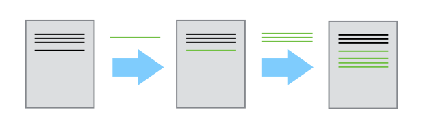
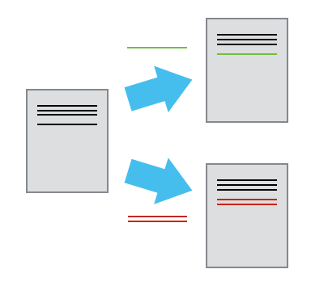
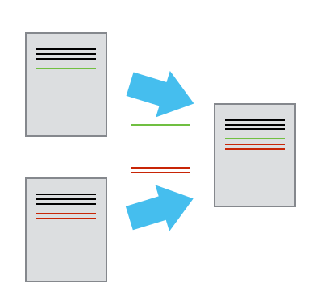

# Exploratory RNAseq data analysis using RMarkdown


During this lesson, you’ll learn how to use RMarkdown for reproducible data analysis.  We will work with the RNAseq data from the yeast `mut` and `wt` dataset from last week. The data are from this [paper](http://rnajournal.cshlp.org/content/22/6/839.long).

This lesson will get you started with RMarkdown, but if you want more, [here](https://rpubs.com/marschmi/RMarkdown) is a great angus-esque tutorial.

## Getting started on Jetstream

[Start up an m1.medium instance running Ubuntu 16.04 on Jetstream.](jetstream/boot.html)


## Make sure R & RStudio are installed and connect

Connect to RStudio by setting your password (note, password will not be visible on the screen):

```
sudo passwd $USER
```

figuring out your username:

```
echo My username is $USER
```

and finding YOUR RStudio server interface Web address:

```
echo http://$(hostname):8787/
```

Now go to that Web address in your Web browser, and log in with the username and password from above.

## Download the data for today's tutorial

We will be using the salmon output from the yeast RNA-seq analysis we did last week. In case your instance was deleted, we have the data here for you. So we're all working with the exact same data, please download the counts and the transcripts per million from salmon.

```
wget https://github.com/ngs-docs/angus/raw/2018/_static/markdown_tutorial.tar.gz
tar xvf markdown_tutorial.tar.gz
```

The last command will uncompress the file and put everything inside the `markdown_tutorial` folder. Let's go in the folder and see what files and folders are there.

```
cd markdown_tutorial
ls -lh
```

You will see the following list:

```
dibtiger@js-170-21:~/markdown_tutorial$ ls -lh
total 2.6M
drwxr-xr-x 2 dibtiger dibtiger 4.0K Jul  8 19:02 Bibliography
-rw-r--r-- 1 dibtiger dibtiger  66K Jul  5  2017 ERR458493.fastq.gz.quant.counts
-rw-r--r-- 1 dibtiger dibtiger  63K Jul  5  2017 ERR458493.fastq.gz.quant.tpm
-rw-r--r-- 1 dibtiger dibtiger  66K Jul  5  2017 ERR458494.fastq.gz.quant.counts
-rw-r--r-- 1 dibtiger dibtiger  63K Jul  5  2017 ERR458494.fastq.gz.quant.tpm
-rw-r--r-- 1 dibtiger dibtiger  66K Jul  5  2017 ERR458495.fastq.gz.quant.counts
-rw-r--r-- 1 dibtiger dibtiger  63K Jul  5  2017 ERR458495.fastq.gz.quant.tpm
-rw-r--r-- 1 dibtiger dibtiger  68K Jul  5  2017 ERR458500.fastq.gz.quant.counts
-rw-r--r-- 1 dibtiger dibtiger  64K Jul  5  2017 ERR458500.fastq.gz.quant.tpm
-rw-r--r-- 1 dibtiger dibtiger  68K Jul  5  2017 ERR458501.fastq.gz.quant.counts
-rw-r--r-- 1 dibtiger dibtiger  64K Jul  5  2017 ERR458501.fastq.gz.quant.tpm
-rw-r--r-- 1 dibtiger dibtiger  68K Jul  5  2017 ERR458502.fastq.gz.quant.counts
-rw-r--r-- 1 dibtiger dibtiger  64K Jul  5  2017 ERR458502.fastq.gz.quant.tpm
-rw-r--r-- 1 dibtiger dibtiger  11K Jul  5  2017 markdown-angus-rnaseq-viz.Rmd
-rw-r--r-- 1 dibtiger dibtiger 1.8M Jul  5  2017 markdown-angus-rnaseq-viz.html
```

What we are interested now is the `.Rmd` file, which is an RMarkdown file - we can view this on RStudio.

******************************************************************************************

## Introduction to RMarkdown

### Rmarkdown is a type of *dynamic document*

[Literate programming](https://en.wikipedia.org/wiki/Literate_programming) is the basic idea behind dynamic documents and was proposed by Donald Knuth in 1984.  Originally, it was for mixing the source code and documentation of software development together.  Today, we will create dynamic documents in which program or analysis code is run to produce output (e.g. tables, plots, models, etc) and then are explained through narrative writing.

The 3 steps of **Literate Programming**:  

1. **Parse** the source document and separate code from narratives.  
2. **Execute** source code and return results.  
3. **Mix** results from the source code with the original narratives.  

So that leaves us, the writers, with 2 steps which includes writing:  

1. Analysis code  
2. A narrative to explain the results from the analysis code.  

> **Note #1:** R Markdown is very similar to Jupyter notebooks! They are two sides of the same coin. We suggest that you adopt which ever one makes more sense to you and is in a layout that has a lower barrier for you to learn.

> **Note #2:** The RStudio core team has also developed something called R Notebooks.  An R Notebook is an R Markdown document with chunks that can be executed independently and interactively, with output visible immediately beneath the input. Also, R notebooks do not need to be "knit".  More on knitting later...

### Markdown

To fully understand RMarkdown, we first need to cover [Markdown](https://daringfireball.net/projects/markdown/), which is a system for writing simple, readable text that is easily converted to HTML.  Markdown essentially is two things:  

1. A plain text formatting syntax  
2. A software tool written in Perl.  
    - Converts the plain text formatting into HTML.  

>**Main goal of Markdown:**  
> Make the syntax of the raw (pre-HTML) document as readable possible.

Would you rather read this code in HTML?  
```html
<body>
  <section>
    <h1>Fresh Berry Salad Recipe</h1>
    <ul>
      <li>Blueberries</li>
      <li>Strawberries</li>
      <li>Blackberries</li>
      <li>Raspberries</li>
    </ul>
  </section>
</body>
```

Or this code in Markdown?  
```markdown
# Fresh Berry Salad Recipe

* Blueberries
* Strawberries
* Blackberries  
* Raspberries
```

If you are human, the Markdown code is definitely easier to read! Let us take a moment to soak in how much easier our lives are/will be because Markdown exists!  Thank you [John Gruber](https://en.wikipedia.org/wiki/John_Gruber) and [Aaron Swartz](https://en.wikipedia.org/wiki/Aaron_Swartz) (RIP) for creating Markdown in 2004!

******************************************************************************************

### RMarkdown
[RMarkdown](http://rmarkdown.rstudio.com/) is a variant of Markdown that makes it easy to create dynamic documents, presentations and reports within RStudio.  It has embedded R (originally), python, perl, shell code chunks to be used with **knitr** (an R package) to make it easy to create reproducible reports in the sense that they can be automatically regenerated when the underlying code it modified.    

**RMarkdown renders many different types of files including:**  

- [HTML](http://rmarkdown.rstudio.com/html_document_format.html)    
- [PDF](http://rmarkdown.rstudio.com/pdf_document_format.html)
- Markdown  
- [Microsoft Word](http://rmarkdown.rstudio.com/word_document_format.html)
- Presentations:  
    - Fancy HTML5 presentations:  
        - [ioslides](http://rmarkdown.rstudio.com/ioslides_presentation_format.html)
        - [Slidy](http://rmarkdown.rstudio.com/slidy_presentation_format.html)
        - [Slidify](http://slidify.org/index.html)
    - PDF Presentations:  
        - [Beamer](http://rmarkdown.rstudio.com/beamer_presentation_format.html)
    - Handouts:  
        - [Tufte Handouts](http://rmarkdown.rstudio.com/tufte_handout_format.html)
- [HTML R Package Vignettes](http://rmarkdown.rstudio.com/package_vignette_format.html)
- [Even Entire Websites!](http://rmarkdown.rstudio.com/rmarkdown_websites.html)


## A few step workflow  

Briefly, to make a report:  

1. **Open** a `.Rmd` file.  
    - Create a YAML header (more on this in a minute!)
2. **Write** the content with RMarkdown syntax.  
3. **Embed** the R code in code chunks or inline code.  
4. **Render** the document output.  


**Overview of the steps RMarkdown takes to get to the rendered document:**  

1. Create `.Rmd` report that includes R code chunks and and markdown narratives (as indicated in steps above.).  
2. Give the `.Rmd` file to `knitr` to execute the R code chunks and create a new `.md` file.  
    - [Knitr](http://yihui.name/knitr/) is a package within R that allows the integration of R code into rendered RMarkdown documents such as HTML, latex, pdf, word, among other document types.  
3. Give the `.md` file to **pandoc**, which will create the final rendered document (e.g. html, Microsoft word, pdf, etc.).  
    - [Pandoc](http://pandoc.org/) is a universal document converter and enables the conversion of one document type (in this case: `.Rmd`) to another (in this case: HTML)


While this may seem complicated, we can hit the  button at the top of the page. **Knitting** is the verb to describe the combining of the code chunks, inline code, markdown and narrative.   

> **Note:** Knitting is different from rendering!  **Rendering** refers to the writing of the final document, which occurs *after* knitting.

*********

## Creating a `.Rmd` File  

It's go time!  Let's start working with RMarkdown!

1.  In the menu bar, click **File -> New File -> RMarkdown**  
    - Or click on the  button in the top left corner.


2. The following image will popup.  Click **"Yes"**


3. The window below will pop up.  
- Inside of this window, choose the type of output by selecting the radio buttons.  **Note:** this output can be easily changed later!  


4. Click **OK**  


## Anatomy of Rmarkdown file

4 main components:  

1. YAML headers  
2. Narrative/Description of your analysis
3. Code  

	a. Inline Code  
	b. Code Chunks


### 1. YAML Headers

YAML stands for "Yet Another Markup Language" or "Yaml ain't markup language" and is a nested list structure that includes the metadata of the document.  It is enclosed between two lines of three dashes `---` and as we saw above is automatically written by RStudio.  A simple example:  

```
---
title:  "Yeast RNAseq Analysis"  
Author:  "Marian L. Schmidt"  
date: "July 4th, 2017"  
output:  html_document
---
```

The above example will create an HTML document.  However, the following options are also available.  

- `html_document`  
- `pdf_document`  
- `word_document`  
- `beamer_presentation` (pdf slideshow)  
- `ioslides_presentation` (HTML slideshow)  
- and more...  

Today, we will create HTML files.  Presentation slides take on a slightly different syntax (e.g. to specify when one slide ends and the next one starts) and so please note that there is a bit of markdown syntax specific to presentations.


### 2. Narrative/Description of your analysis

For this section of the document, you will use markdown to write descriptions of whatever the document is about.  For example, you may write your abstract, introduction, or materials and methods to set the stage for the analysis to come in code chunks later on.


### 3. Code

There are 2 ways to embed code within an RMarkdown document.  

1. **Inline Code:**  Brief code that takes place during the written part of the document.  

2. **Code Chunks:**  Parts of the document that includes several lines of program or analysis code.  It may render a plot or table, calculate summary statistics, load packages, etc.  


### a. Inline R Code  

Inline code is created by using a back tick (the key next to the #1) (\`) and the letter r followed by another back tick.  

- For example:  2^11^ is \`r 2^11\`.  

Imagine that you're reporting a p-value and you do not want to go back and add it every time the statistical test is re-run.  Rather, the p-value is `0.0045`.  

This is really helpful when writing up the results section of a paper.  For example, you may have ran a bunch of statistics for your scientific questions and this would be a way to have **R** save that value in a variable name.  

Cool, huh?!  


### b. Code Chunks  

Code chunks can be used to render code output into documents or to display code for illustration. The code chunks can be in shell/bash, python, Rcpp, SQL, or Stan.   

**The Anatomy of a code chunk:**  

To insert an R code chunk, you can type it manually by typing ```` ```{r} ```` followed by  ```` ``` ```` on the next line.  You can also press the   button or use the shortcut key. This will produce the following code chunk:


    ```{r}
    n <- 10
    seq(n)
    ```


Name the code chunk something meaningful as to what it is doing.  Below I have named the code chunk `10_random_numbers`:

    ```{r 10_random_numbers}
    n <- 10
    seq(n)
    ```


The code chunk input and output is then displayed as follows:

```{r 10_random_numbers}
n = 10
seq(n)
```

**Always name/label your code chunks!**

### Chunk Labels

Chunk labels must be **unique IDs** in a document and are good for:  

- Generating external files such as images and cached documents.  
- Chunk labels often are output when errors arise (more often for line of code).     
- **Navigating throughout long `.Rmd` documents.**  


When naming the code chunk:  Use `-` or `_` in between words for code chunks labels instead of spaces.  This will help you and other users of your document to navigate through.  

Chunk labels must be **unique throughout the document** (if not there will be an error) and the label should **accurately describe what's happening** in the code chunk.

### Chunk Options  

Pressing tab when inside the braces will bring up code chunk options.


- `results = "asis"` stands for "as is" and will output a non-formatted version.
- `collapse` is another chunk option which can be helpful.  If a code chunk has many short R expressions with some output, you can collapse the output into a chunk.     

There are too many chunk options to cover here.  After the workshop take a look around at the options.

Great website for exploring [Knitr Chunk Options](http://yihui.name/knitr/options/#chunk_options).  


### Figures  

**Knitr** makes producing figures really easy.  If analysis code within a chunk is supposed to produce a figure, it will just print out into the document.  

Some knitr chunk options that relate to figures:  

- `fig.width` and `fig.height`  
    - *Default:* `fig.width = 7`, `fig.height = 7`  
- `fig.align`:  How to align the figure  
    - *Options include:* `"left"`, `"right"`, and `"center"`  
- `fig.path`: A file path to the directory to where knitr should store the graphic output created by the chunk.  
    - *Default:* `'figure/'`  
- There's even a `fig.retina`(only for HTML output) for higher figure resolution with retina displays.  


### Global Chunk Options

You may wish to have the same chunk settings throughout your document and so it might be nice to type options once instead of always re-typing it for each chunk.  To do so, you can set global chunk options at the top of the document.  

```
knitr::opts_chunk$set(echo = FALSE,
                      eval = TRUE,
                      message = FALSE,
                      warning = FALSE,
                      fig.path = "Figures/",
                      fig.width = 12,
                      fig.height = 8)
```

For example, if you're working with a collaborator who does not want to see the code - you could set `eval = TRUE` and `echo = FALSE` so the code is evaluated but not shown.  In addition, you may want to use `message = FALSE` and `warning = FALSE` so your collaborator does not see any messages or warnings from R.  

If you would like to save and store figures within a sub directory within the project, `fig.path = "Figures/"`.  Here, the `"Figures/"` denotes a folder named *Figures* within the current directory where the figures produced within the document will be stored.  **Note:** by default figures are not saved.  

Global chunk options will be set for the rest of the document.  If you would like to have a particular chunk be different from the global options, specify at the beginning of that particular chunk.


### Tables

Hand writing tables in Markdown can get tedious.  We will not go over this here, however, if you'd like to learn more about Markdown tables check out the [documentation on tables](http://rmarkdown.rstudio.com/authoring_pandoc_markdown.html#tables) at the RMarkdown v2 website.

In his [Knitr in a Knutshell](http://kbroman.org/knitr_knutshell/pages/figs_tables.html), Dr. Karl Broman introduces:  `kable`, `pander`, and `xtable` and many useRs like the first two:  

- `kable`: Within the **knitr** package - not many options but looks nice with ease.
- `pander`: Within the **pander** package - has many more options and customization.  Useful for bold-ing certain values (e.g. values below a threshold).  

You should also check out the `DT` package for interactive tables.  Check out more details here [http://www.htmlwidgets.org/showcase_datatables.html](http://www.htmlwidgets.org/showcase_datatables.html)


### Citations and Bibliography

#### Bibliography  

It's also possible to include a bibliography file in the YAML header.  Bibliography formats that are readable by Pandoc include the following:  

| Format | File extension |
|--- | ---|
| MODS  | 	.mods |
| BibLaTeX  | .bib  |
| BibTeX  | .bibtex  |
| RIS  | .ris  |
| EndNote  | .enl  |
| EndNote XML  | .xml  |
| ISI  | .wos  |
| MEDLINE  | .medline  |
| Copac  | 	.copac  |
| JSON citeproc  | 	.json  |

To create a bibliography in RMarkdown, two files are needed:  

1. A bibliography file with the **information** about each reference.  
2. A citation style language (CSL) to describe how to **format** the reference

An example YAML header with a bibliography and a citation style language (CSL) file:

```
output: html_document
bibliography: bibliography.bib
csl: nature.csl
```

Check out the very helpful web page by the R Core team on [bibliographies and citations](http://rmarkdown.rstudio.com/authoring_bibliographies_and_citations.html).  

If you would like to cite R packages, **knitr** even includes a function called `write_bib()` that creates a `.bib` entries for R packages.  It will even write it to a file!  

```{r eval = FALSE}
write_bib(file = "r-packages.bib") # will write all packages  
write_bib(c("knitr", "ggplot2"), file = "r-packages2.bib") # Only writes knitr and ggplot2 packages
```


### Placement

Automatically the bibliography will be placed at the end of the document. Therefore, you should finish your `.Rmd` document with `# References` so the bibliography comes after the header for the bibliography.

```
final words...

# References
```


### Citation Styles

**Citation Style Language (CSL)** is an XML-based language that identifies the format of citations and bibliographies. Reference management programs such as Zotero, Mendeley and Papers all use CSL.

Search for your favorite journal and CSL in the [Zotero Style Repository](https://www.zotero.org/styles), which currently has >8,000 CSLs.  Is there a style that you're looking for that is not there?   

```
output: html_document
bibliography: bibliography.bib
csl: nature.csl
```

### Citations  

Citations go inside square brackets `[ ]`and are separated by semicolons `;`. Each citation must have a key, composed of `@ + the citation identifier` from the database, and may optionally have a prefix, a locator, and a suffix.  To check what the citation key is for a reference, take a look at the `.bib` file.  Here in this file, you can also change key for each reference.  However, be careful that each ID is unique!   


## Publishing on RPubs  

Once you make a beautiful dynamic document you may wish to share it with others.  One option to share it with the world is to host it on [RPubs](https://rpubs.com/).  With RStudio, this makes it very easy!  Do the following:  

1. Create your awesome `.Rmd` document.  
2. Click the  button to render your HTML document to be published.  
3. In the top right corner of the preview window, click the publish  button and follow the directions.  
    - *Note:*  You will need to create an RPubs profile.  
4. Once you have a profile you can choose the following:  
    - The title of the document.  
    - A description of the document.  
    - The URL in which the website will be hosted.  
        - *Note:*  The beginning of the URL will be:  **www.rpubs.com/your_username/name_of_your_choice**  

### Updating RPubs  

If you make some changes to your document it is very easy to update the web page.  Once you have rendered your edited document click the  button on the top right corner of the preview window.  The edited document will be in the same URL as the original document.  

Yay!


## Amazing Resources for learning Rmarkdown

1. The [RMarkdown](http://rmarkdown.rstudio.com/index.html) website hosted by RStudio.  
2. Dr. Yuhui Xie's book:  [Dynamic Documents with R and Knitr](http://www.amazon.com/Dynamic-Documents-knitr-Chapman-Hall/dp/1482203537) 2^nd^ Edition [@Xie2015] and his [Knitr](http://yihui.name/knitr/) website.  
    - A **BIG thank you** to Dr. Xie for writing the **Knitr** Package!!  
3. Dr. Karl Broman's ["Knitr in a Knutshell"](http://kbroman.org/knitr_knutshell/).  
4. [Cheatsheets](https://www.rstudio.com/resources/cheatsheets/) released by RStudio.


******************************************************************************************

# Exploratory data analysis with Yeast RNAseq data  

Navigate to the folder we downloaded at the beginning of the lesson, and we'll start using RMarkdown!

******************************************************************************************

# Version Control with Git and GitHub

## Automated Version Control

We'll start by exploring how version control can be used to keep track of what one person did and when. Even if you aren't collaborating with other people, automated version control is much better than this situation:

[](http://www.phdcomics.com)

"Piled Higher and Deeper" by Jorge Cham, http://www.phdcomics.com

We've all been in this situation before: it seems ridiculous to have multiple nearly-identical versions of the same document. Some word processors let us deal with this a little better, such as Microsoft Word's [Track Changes](https://support.office.com/en-us/article/Track-changes-in-Word-197ba630-0f5f-4a8e-9a77-3712475e806a), Google Docs' [version history](https://support.google.com/docs/answer/190843?hl=en), or LibreOffice's [Recording and Displaying Changes](https://help.libreoffice.org/Common/Recording_and_Displaying_Changes).

Version control systems start with a base version of the document and then save just the changes you made at each step of the way. You can think of it as a tape: if you rewind the tape and start at the base document, then you can play back each change and end up with your latest version.



Once you think of changes as separate from the document itself, you can then think about "playing back" different sets of changes onto the base document and getting different versions of the document. For example, two users can make independent sets of changes based on the same document.



Unless there are conflicts, you can even play two sets of changes onto the same base document.



A version control system is a tool that keeps track of these changes for us and helps us version and merge our files. It allows you to decide which changes make up the next version, called a commit and keeps useful metadata about them. The complete history of commits for a particular project and their metadata make up a repository. Repositories can be kept in sync across different computers facilitating collaboration among different people.

> **The Long History of Version Control Systems**
>
> Automated version control systems are nothing new. Tools like RCS, CVS, or Subversion have been around since the early 1980s and are used by many large companies. However, many of these are now becoming considered as legacy systems due to various limitations in their capabilities. In particular, the more modern systems, such as Git and [Mercurial](http://swcarpentry.github.io/hg-novice/) are *distributed*, meaning that they do not need a centralized server to host the repository. These modern systems also include powerful merging tools that make it possible for multiple authors to work within the same files concurrently.


## How can version control help me make my work more open?

> The opposite of "open" isn't "closed".
> The opposite of "open" is "broken".
>
> --- John Wilbanks

Free sharing of information might be the ideal in science, but the reality is often more complicated. Normal practice today looks something like this:

*   A scientist collects some data and stores it on a machine that is occasionally backed up by her department.
*   She then writes or modifies a few small programs (which also reside on her machine) to analyze that data.
*   Once she has some results, she writes them up and submits her paper. She might include her data—a growing number of journals require this—but she probably doesn't include her code.
*   Time passes.
*   The journal sends her reviews written anonymously by a handful of other people in her field. She revises her paper to satisfy them, during which time she might also modify the scripts she wrote earlier, and resubmits.
*   More time passes.
*   The paper is eventually published. It might include a link to an online copy of her data, but the paper itself will be behind a paywall: only people who have personal or institutional access will be able to read it.

For a growing number of scientists, though, the process looks like this:

*   The data that the scientist collects is stored in an open access repository like [figshare](http://figshare.com/) or [Zenodo](http://zenodo.org), possibly as soon as it's collected, and given its own [Digital Object Identifier](https://en.wikipedia.org/wiki/Digital_object_identifier) (DOI). Or the data was already published and is stored in [Dryad](http://datadryad.org/).
*   The scientist creates a new repository on GitHub to hold her work.
*   As she does her analysis, she pushes changes to her scripts (and possibly some output files) to that repository. She also uses the repository for her paper; that repository is then the hub for collaboration with her colleagues.
*   When she's happy with the state of her paper, she posts a version to [arXiv](http://arxiv.org/) or some other preprint server to invite feedback from peers.
*   Based on that feedback, she may post several revisions before finally submitting her paper to a journal.
*   The published paper includes links to her preprint and to her code and data repositories, which  makes it much easier for other scientists to use her work as starting point for their own research.

This open model accelerates discovery: the more open work is, [the more widely it is cited and re-used](http://dx.doi.org/10.1371/journal.pone.0000308). However, people who want to work this way need to make some decisions about what exactly "open" means and how to do it. You can find more on the different aspects of Open Science in [this book](http://link.springer.com/book/10.1007/978-3-319-00026-8).

This is one of the (many) reasons we teach version control. When used diligently, it answers the "how" question by acting as a shareable electronic lab notebook for computational work:

*   The conceptual stages of your work are documented, including who did what and when. Every step is stamped with an identifier (the commit ID) that is for most intents and purposes unique.
*   You can tie documentation of rationale, ideas, and other intellectual work directly to the changes that spring from them.
*   You can refer to what you used in your research to obtain your computational results in a way that is unique and recoverable.
*   With a distributed version control system such as Git, the version control repository is easy to archive for perpetuity, and contains the entire history.

> **Making Code Citable**
>
> [This short guide](https://guides.github.com/activities/citable-code/) from GitHub explains how to create a Digital Object Identifier (DOI) for your code, your papers, or anything else hosted in a version control repository.

## Storing our newly created RMarkdown file on GitHub

### Creating a repository

The folder that currently contains our RMarkdown notebook and the data file should look like this:

```
dibtiger@js-170-21:~/markdown_tutorial$ ls -lh

total 2.6M
drwxr-xr-x 2 dibtiger dibtiger 4.0K Jul  8 19:02 Bibliography
-rw-r--r-- 1 dibtiger dibtiger  66K Jul  5  2017 ERR458493.fastq.gz.quant.counts
-rw-r--r-- 1 dibtiger dibtiger  63K Jul  5  2017 ERR458493.fastq.gz.quant.tpm
-rw-r--r-- 1 dibtiger dibtiger  66K Jul  5  2017 ERR458494.fastq.gz.quant.counts
-rw-r--r-- 1 dibtiger dibtiger  63K Jul  5  2017 ERR458494.fastq.gz.quant.tpm
-rw-r--r-- 1 dibtiger dibtiger  66K Jul  5  2017 ERR458495.fastq.gz.quant.counts
-rw-r--r-- 1 dibtiger dibtiger  63K Jul  5  2017 ERR458495.fastq.gz.quant.tpm
-rw-r--r-- 1 dibtiger dibtiger  68K Jul  5  2017 ERR458500.fastq.gz.quant.counts
-rw-r--r-- 1 dibtiger dibtiger  64K Jul  5  2017 ERR458500.fastq.gz.quant.tpm
-rw-r--r-- 1 dibtiger dibtiger  68K Jul  5  2017 ERR458501.fastq.gz.quant.counts
-rw-r--r-- 1 dibtiger dibtiger  64K Jul  5  2017 ERR458501.fastq.gz.quant.tpm
-rw-r--r-- 1 dibtiger dibtiger  68K Jul  5  2017 ERR458502.fastq.gz.quant.counts
-rw-r--r-- 1 dibtiger dibtiger  64K Jul  5  2017 ERR458502.fastq.gz.quant.tpm
-rw-r--r-- 1 dibtiger dibtiger  11K Jul  5  2017 markdown-angus-rnaseq-viz.Rmd
-rw-r--r-- 1 dibtiger dibtiger 1.8M Jul  5  2017 markdown-angus-rnaseq-viz.html
```

Before starting using Git, we should let it know who we are. In order to run this, we will use the following two commands:

```
git config --global user.email "fpsom@issel.ee.auth.gr"
git config --global user.name "Fotis E. Psomopoulos"
```

Replace my email and name with your own - ideally **use the same email as the one you used for your GitHub account**.

The next step is to tell Git to make this folder a repository — a place where Git can store versions of our files:

```
git init
```

If we use `ls` to show the directory’s contents, it appears that nothing has changed. But if we add the `-a` flag to show everything, we can see that Git has created a hidden directory within planets called `.git`:

```
dibtiger@js-170-21:~/markdown_tutorial$ ls -la

total 2652
drwxr-xr-x  4 dibtiger dibtiger    4096 Jul  8 19:05 .
drwx------ 20 dibtiger dibtiger    4096 Jul  8 19:02 ..
-rw-r--r--  1 dibtiger dibtiger    6148 Jul  5  2017 .DS_Store
-rw-r--r--  1 dibtiger dibtiger     120 Jul  5  2017 ._.DS_Store
drwxrwxr-x  7 dibtiger dibtiger    4096 Jul  8 19:05 .git
drwxr-xr-x  2 dibtiger dibtiger    4096 Jul  8 19:02 Bibliography
-rw-r--r--  1 dibtiger dibtiger   66797 Jul  5  2017 ERR458493.fastq.gz.quant.counts
-rw-r--r--  1 dibtiger dibtiger   64390 Jul  5  2017 ERR458493.fastq.gz.quant.tpm
-rw-r--r--  1 dibtiger dibtiger   66793 Jul  5  2017 ERR458494.fastq.gz.quant.counts
-rw-r--r--  1 dibtiger dibtiger   64448 Jul  5  2017 ERR458494.fastq.gz.quant.tpm
-rw-r--r--  1 dibtiger dibtiger   66765 Jul  5  2017 ERR458495.fastq.gz.quant.counts
-rw-r--r--  1 dibtiger dibtiger   64367 Jul  5  2017 ERR458495.fastq.gz.quant.tpm
-rw-r--r--  1 dibtiger dibtiger   68827 Jul  5  2017 ERR458500.fastq.gz.quant.counts
-rw-r--r--  1 dibtiger dibtiger   64800 Jul  5  2017 ERR458500.fastq.gz.quant.tpm
-rw-r--r--  1 dibtiger dibtiger   68836 Jul  5  2017 ERR458501.fastq.gz.quant.counts
-rw-r--r--  1 dibtiger dibtiger   64815 Jul  5  2017 ERR458501.fastq.gz.quant.tpm
-rw-r--r--  1 dibtiger dibtiger   68800 Jul  5  2017 ERR458502.fastq.gz.quant.counts
-rw-r--r--  1 dibtiger dibtiger   64805 Jul  5  2017 ERR458502.fastq.gz.quant.tpm
-rw-r--r--  1 dibtiger dibtiger   11215 Jul  5  2017 markdown-angus-rnaseq-viz.Rmd
-rw-r--r--  1 dibtiger dibtiger 1861485 Jul  5  2017 markdown-angus-rnaseq-viz.html
```

Git stores information about the project in this special sub-directory. If we ever delete it, we will lose the project’s history.

We can check that everything is set up correctly by asking Git to tell us the status of our project. It shows that there are two new files that are currently not tracked (meaning that any changes there will not be monitored).

```
git status
```

This command will print out the following screen

```
On branch master

No commits yet

Untracked files:
  (use "git add <file>..." to include in what will be committed)

        .DS_Store
        ._.DS_Store
        Bibliography/
        ERR458493.fastq.gz.quant.counts
        ERR458493.fastq.gz.quant.tpm
        ERR458494.fastq.gz.quant.counts
        ERR458494.fastq.gz.quant.tpm
        ERR458495.fastq.gz.quant.counts
        ERR458495.fastq.gz.quant.tpm
        ERR458500.fastq.gz.quant.counts
        ERR458500.fastq.gz.quant.tpm
        ERR458501.fastq.gz.quant.counts
        ERR458501.fastq.gz.quant.tpm
        ERR458502.fastq.gz.quant.counts
        ERR458502.fastq.gz.quant.tpm
        markdown-angus-rnaseq-viz.Rmd
        markdown-angus-rnaseq-viz.html

nothing added to commit but untracked files present (use "git add" to track)
```

### Our first commit

The _untracked files_ message means that there’s a file in the directory that Git isn’t keeping track of. We can tell Git to track a file using `git add`:

```
git add *.tpm markdown-angus-rnaseq-viz.Rmd
```

and then check that the right thing happened:

```
git status
```

The output should be:

```
On branch master

No commits yet

Changes to be committed:
  (use "git rm --cached <file>..." to unstage)

        new file:   ERR458493.fastq.gz.quant.tpm
        new file:   ERR458494.fastq.gz.quant.tpm
        new file:   ERR458495.fastq.gz.quant.tpm
        new file:   ERR458500.fastq.gz.quant.tpm
        new file:   ERR458501.fastq.gz.quant.tpm
        new file:   ERR458502.fastq.gz.quant.tpm
        new file:   markdown-angus-rnaseq-viz.Rmd

Untracked files:
  (use "git add <file>..." to include in what will be committed)

        .DS_Store
        ._.DS_Store
        Bibliography/
        ERR458493.fastq.gz.quant.counts
        ERR458494.fastq.gz.quant.counts
        ERR458495.fastq.gz.quant.counts
        ERR458500.fastq.gz.quant.counts
        ERR458501.fastq.gz.quant.counts
        ERR458502.fastq.gz.quant.counts
        markdown-angus-rnaseq-viz.html
```

Git now knows that it’s supposed to keep track of these seven files, but it hasn’t recorded these changes as a commit yet. To get it to do that, we need to run one more command:

```
git commit -m "Let's do our initial commit"
```

This produces the following output.

```
[master (root-commit) cd1ceaf] Let's do our initial commit
 7 files changed, 35772 insertions(+)
 create mode 100644 ERR458493.fastq.gz.quant.tpm
 create mode 100644 ERR458494.fastq.gz.quant.tpm
 create mode 100644 ERR458495.fastq.gz.quant.tpm
 create mode 100644 ERR458500.fastq.gz.quant.tpm
 create mode 100644 ERR458501.fastq.gz.quant.tpm
 create mode 100644 ERR458502.fastq.gz.quant.tpm
 create mode 100644 markdown-angus-rnaseq-viz.Rmd
```

When we run `git commit`, Git takes everything we have told it to save by using `git add` and stores a copy permanently inside the special `.git` directory. This permanent copy is called a `commit` (or `revision`) and its short identifier is `cd1ceaf` (Your commit may have another identifier.)

We use the `-m` flag (for “_message_”) to record a short, descriptive, and specific comment that will help us remember later on what we did and why. If we just run `git commit` without the `-m` option, Git will launch `nano` (or whatever other editor we configured as `core.editor`) so that we can write a longer message.

Good commit messages start with a brief (<50 characters) summary of changes made in the commit. If you want to go into more detail, add a blank line between the summary line and your additional notes.

If we run `git status` now:

```
On branch master
Untracked files:
  (use "git add <file>..." to include in what will be committed)

        .DS_Store
        ._.DS_Store
        Bibliography/
        ERR458493.fastq.gz.quant.counts
        ERR458494.fastq.gz.quant.counts
        ERR458495.fastq.gz.quant.counts
        ERR458500.fastq.gz.quant.counts
        ERR458501.fastq.gz.quant.counts
        ERR458502.fastq.gz.quant.counts
        markdown-angus-rnaseq-viz.html

nothing added to commit but untracked files present (use "git add" to track)
```

This is the first steps in maintaining versions. There are a few more commands that you should be aware of, such as `git diff` and `git log`, but for the purposes of this exercise, this is sufficient.

### Pushing our RMarkdown notebook to GitHub

Version control really comes into its own when we begin to collaborate with other people. We already have most of the machinery we need to do this; the only thing missing is to copy changes from one repository to another.

Systems like `Git` allow us to move work between any two repositories. In practice, though, it’s easiest to use one copy as a central hub, and to keep it on the web rather than on someone’s laptop. Most programmers use hosting services like [GitHub](http://github.com/), [BitBucket](http://bitbucket.org/) or [GitLab](http://gitlab.com/) to hold those master copies; we’ll explore the pros and cons of this in the final section of this lesson.

Let’s start by sharing the changes we’ve made to our current project with the world. Log in to GitHub, then click on the icon in the top right corner to create a new repository called `RMarkdownDIBSI2018`. As soon as the repository is created, GitHub displays a page with a URL and some information on how to configure your local repository.

The next step is to connect the two repositories; the local and the one we just created on GitHub. We do this by making the GitHub repository a remote for the local repository. The home page of the repository on GitHub includes the string we need to identify it:
- Click on the `‘HTTPS’` link to change the protocol from `SSH` to `HTTPS`.
- Copy that URL from the browser, go into the local repository, and run this command:

```
git remote add origin https://github.com/fpsom/RMarkdownDIBSI2018.git
```

Make sure to use the URL for your repository rather than mine: the only difference should be your username instead of `fpsom`.

We can check that the command has worked by running `git remote -v`:

```
origin  https://github.com/fpsom/RMarkdownDIBSI2018.git (fetch)
origin  https://github.com/fpsom/RMarkdownDIBSI2018.git (push)
```

The name `origin` is a local nickname for your remote repository. We could use something else if we wanted to, but `origin` is by far the most common choice.

Once the nickname origin is set up, this command will push the changes from our local repository to the repository on GitHub:

```
git push origin master
```

The output should look something like the following.

```
Username for 'https://github.com': fpsom
Password for 'https://fpsom@github.com':
Counting objects: 9, done.
Delta compression using up to 6 threads.
Compressing objects: 100% (9/9), done.
Writing objects: 100% (9/9), 134.26 KiB | 1.84 MiB/s, done.
Total 9 (delta 0), reused 0 (delta 0)
To https://github.com/fpsom/RMarkdownDIBSI2018.git
 * [new branch]      master -> master

```

Excellent job! You now have both the remote and the local repositories in sync!

> **Exercise**: Make a change to one of the two local files, commit, and push.

## References / Sources
- [Software Carpentry: Version Control with Git](http://swcarpentry.github.io/git-novice/)

******************************************************************************************


# Making it all work with Binder

## What is Binder?

- It’s a service
  - https://mybinder.org
- It’s a way to display your work (Jupyter notebooks and more)
  - https://binderhub.readthedocs.io/en/latest/overview.html
  - A clickable badge in a GitHub repo too
- It’s a project (BinderHub) that you can deploy
  - https://binderhub.readthedocs.io/en/latest/

## Using Binder to provide a dynamic version of our document.

Now that we have our own GitHub repository with an RMarkdown document, we can use Binder to give the community with a fully working version of the document, instead of a static (a.k.a. non clickable) version of it.

### Setup

Binder supports using R and RStudio, with libraries pinned to a specific snapshot on [MRAN](https://mran.microsoft.com/documents/rro/reproducibility). In order to specify this, we need to add in our repository a `runtime.txt` file that is formatted like:

```
r-<YYYY>-<MM>-<DD>
```

where YYYY-MM-DD is a snapshot at MRAN that will be used for installing libraries. In our instance, we'll need to specify:

```
r-2018-02-05
```

You can also have an `install.R` file that will be executed during build, and can be used to install libraries. In our instance, the `install.R` file will contain the libraries already listed under the RMarkdown file, i.e.:

```
install.packages("tidyverse")
install.packages("rmarkdown")
install.packages("httr")
install.packages("???")
```

You can create both these files locally (e.g. using an editor such as `nano`) and push them to the GitHub repository using the `git add`, `git commit` and `git push` commands we show earlier. Another approach is to directly create these files through the GitHub web interface, by clicking the `Create new file` button and then adding the content with the correct file name. A final option is to download these files from the links below, and upload them to GitHub again using the graphical interface.

- [`runtime.txt`](_static/binder/runtime.txt)
- [`install.R`](_static/binder/install.R)


### Running Binder

Now that we have everything setup, we can launch our Binder instance.

- **Step 1**: Go to the [Binder webpage](https://mybinder.org)

- **Step 2**: In the `GitHub repo or URL` field, enter the full URL of your repository, that contains all three files (i.e. the RMarkdown document, `runtime.txt` and `install.R`). For example, the URL could be `https://github.com/fpsom/RMarkdownDIBSI2018`.

- **Step 3**: In the `URL to open (optional)` field, type in `rstudio` and then select `URL` from the dropdown list on the right.

- **Step 4**: Click on `Launch` and have a break while Binder builds and launches your instance.

Congrats! You now have a fully reproducible document that contains both your analysis and your data, and the people can recreate in the exact same environment! Go #OpenScience!
