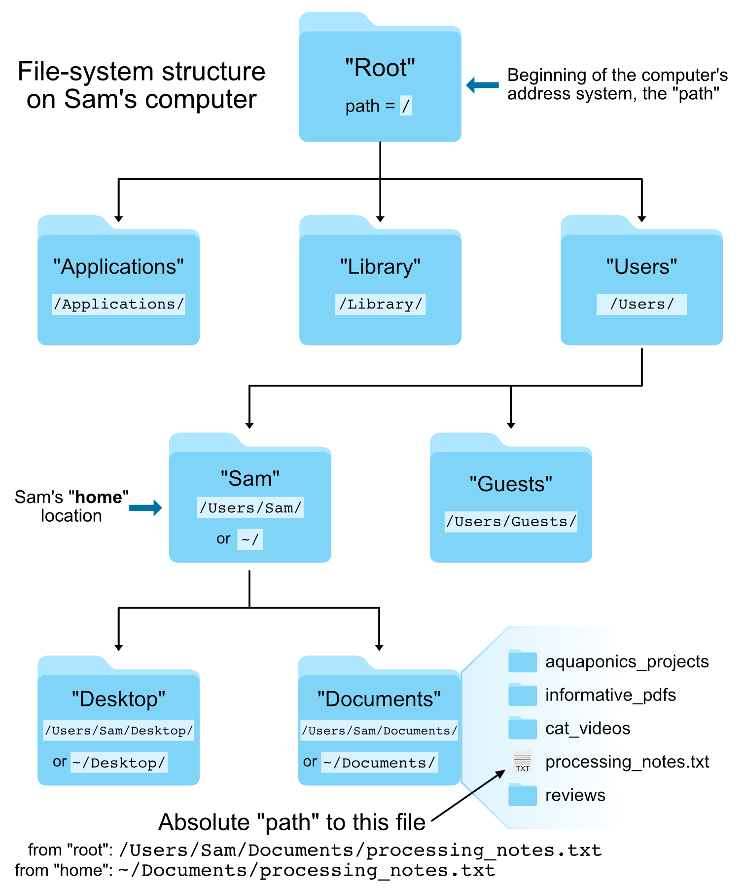

# Getting started with the shell

## How to access the shell for now


We all have an IP address to link into our cloud computers stored in this [spreadsheet here](https://hackmd.io/LGeRCq5xRkm3ebSQ8lHgFg?view). Find your name and click the link associated with your name. 


That will open a screen where you need to enter a password. The password is **`davis.2019`**. Then a screen like this will open (minus the blue arrows):

<center></center>
<br>

Now click the **files tab** at the top-left (that the smaller blue arrow points to above) and then click the "**Terminal**" icon at the bottom, and we'll be in our appropriate command-line environment:

<center></center>
<br>

This is our "command line", and that one line showing with the cursor ready is our "prompt" – where we will be typing all of our commands 🙂 

---

<blockquote><center><b>Important note!</b></center>
Keep in mind, none of this is about memorization. It may seem counterintuitive at first, but the little details aren't important. What matters is starting to build a mental framework of the foundational rules and concepts. That equips us to figure out the things we need to do, when we need to do them!  
</blockquote>

## A few foundational rules

* **Spaces are special!** The command line uses spaces to know how to properly break things apart. This is why it's not ideal to have filenames that contain spaces, but rather it's better to use dashes (**`-`**) or underscores (**`_`**) – e.g., "draft_v3.txt" is preferred over "draft v3.txt".  
<br>

* The general syntax working at the command line goes like this: **`command argument`**.  
<br>

* Arguments (which can also be referred to as "flags" or "options" or "parameters") can be **optional** or **required** based on the command being used.  

Before we start, copy and paste this one command and hit `enter`, so we are all starting in the same place:

```bash
cd ~/shell_intro/
```

## Running commands

>**NOTE:** It's okay to copy and paste things. This is not a typing test 🙂

**`date`** is a command that prints out the date and time. This particular command does not require any arguments:

```bash
date
```

When we run **`date`** with no arguments, it uses some default settings, like assuming we want to know the time in our local time zone. But we can provide optional arguments to **`date`**. Optional arguments most often require putting a dash in front of them in order for the program to interpret them properly. Here we are adding the **`-u`** argument to tell it to report UTC time instead of the local time: 

```bash
date -u
```

Note that if we try to run it without the dash, we get an error:

```bash
date u
```

Also note that if we try to enter this without the "space" separating **`date`** and the optional argument **`-u`**, the computer won't know how to break apart the command and we get a different error:

```bash
date-u
```

>The first error comes from the program **`date`**, and it doesn't know what to do with the letter **`u`**. The second error comes from **`bash`**, the language we are working in, because it's trying to find a program called "date-u" since we didn't tell it how to properly break things apart. 

Unlike `date`, most commands require arguments and won't work without them. **`head`** is a command that prints the first lines of a file, so it **requires** us to provide the file we want it to act on: 

```bash
head example.txt
```

Here "example.txt" is the **required** argument, and in this case it is also what's known as a **positional** argument. Whether things are positional arguments or not depends on how the command was written. Sometimes we need to specify the input file by putting something in front of it (e.g. some commands will use the `-i` flag, but it's often other things as well).

There are also optional arguments for the **`head`** command. The default for **`head`** is to print the first 10 lines of a file. We can change that by specifying the **`-n`** flag, followed by how many lines we want:

```bash
head -n 5 example.txt
```

How would we know we needed the **`-n`** flag for that? There are a few ways to find out. Many standard shell commands have manual pages, we can access this one like so: 

```bash
man head
```

A lot of times the `man` page for a command has an overwhelming abount of info. Press the <kbd>q</kbd> key to exit this window and return to our normal prompt. 

Many tools have a help menu built in that we can access by providing **`-h`** or **`--help`** as the only argument:

```bash
head -h
head --help
```

And/or we can go to google to look for help. This is one of the parts that is not about memorization at all. We might remember a few if we use them a lot, but searching for options and details when needed is definitely the norm!

---

<blockquote>
<center><b>Congrats!</b></center>
<center>That really is the framework for how all things work at the command line! Multiple commands can be strung together, and some commands can have many options, inputs, and outputs and can grow to be quite long, but this general framework is underlying it all.<br><br><b>Becoming familiar with these baseline rules is important, memorizing particular commands and options is not!</b></center>
</blockquote>

## The Unix file-system structure

Your computer stores file locations in a hierarchical structure. You are likely already used to navigating through this stucture by clicking on various folders (also known as directories) in a Windows Explorer window or a Mac Finder window. Just like we need to select the appropriate files in the appropriate locations there (in a GUI), we need to do the same when working at a command-line interface. What this means in practice is that each file and directory has its own "address", and that address is called its "**path**". 

Here is an image of an example file-system structure:

<center></center>
<br>

There are two special locations in all Unix-based systems: the "**root**" location and the current user's "**home**" location. "Root" is where the address system of the computer starts; "home" is where the current user's location starts.

We tell the command line where files and directories are located by providing their address, their "path". If we use the **`pwd`** command (for **p**rint **w**orking **d**irectory), we can find out what the path is for the directory we are sitting in. And if we use the **`ls`** command (for **l**i**s**t), we can see what directories and files are in the current directory we are sitting in.

```
pwd
ls
``` 

### Absolute vs relative path
There are two ways to specify the path (address) of the file we want to do something to:

* An **absolute path** is an address that starts from an explicitly specified location: either the "root" **`/`** or the "home" **`~/`** location. 
* A **relative path** is an address that starts from wherever we are currently sitting.

For example, let's look again at the **`head`** command we ran above:

```bash
head example.txt
```

**What we are actually doing here is using a *relative path* to specify where the "example.txt" file is located.** This is because the command line automatically looks in the current working directory if we don't specify anything else about its location. 

We can also run the same command on the same file using an **absolute path**:

```bash
head ~/shell_intro/example.txt
```

The previous two commands both point to the same file right now. But the first way, **`head example.txt`**, will only work if we are entering it while "sitting" in the directory that holds that file, while the second way will work no matter where we happen to be in the computer. 

>**Note:** The address of a file, its "path", includes the file name also, it doesn't stop at the directory that holds it.

It is important to always think about *where* we are in the computer when working at the command line. **One of the most common errors/easiest mistakes to make is trying to do something to a file that isn't where we think it is.** Let's run **`head`** on the "example.txt" file again, and then let's try it on another file: "notes.txt":

```bash
head example.txt
head notes.txt
```

Here the **`head`** command works fine on "example.txt", but we get an error message when we call it on "notes.txt" telling us no such file or directory. If we run the **`ls`** command to **l**i**s**t the contents of the current working directory, we can see the computer is absolutely right – spoiler alert: it usually is – and there is no file here named "notes.txt". 

The **`ls`** command by default operates on the current working directory if we don't specify any location, but we can tell it to list the contents of a different directory by providing it as a positional argument: 

```bash
ls
ls experiment
```

We can see the file we were looking for is located in the subdirectory called "experiment". Here is how we can run **`head`** on "notes.txt" by specifying an accurate **relative path** to that file:

```bash
head experiment/notes.txt
```

If we had been using **tab-completion**, we would not have made that mistake!

### BONUS ROUND: Tab-completion is our friend!
Tab-completion is a huge time-saver, but even more importantly it is a perpetual sanity-check that helps prevent mistakes. 

If we are trying to specify a file that's in our current working directory, we can begin typing its name and then press the <kbd>tab</kbd> key to complete it. If there is only one possible way to finish what we've started typing, it will complete it entirely for us. If there is more than one possible way to finish what we've started typing, it will complete as far as it can, and then hitting <kbd>tab</kbd> twice quickly will show all the possible options. **If tab-complete does not do either of those things, then we are either confused about where we are, or we're confused about where the file is that we're trying to do something to** – this is invaluable.

> **Quick Practice**  <br>
> Try out tab-complete! Run **`ls`** first to see what's in our current working directory again. Then type **`head e`** and then press the <kbd>tab</kbd> key. This will auto-complete out as far as it can, which in this case is up to "ex", because there are multiple possibilities still at that point. If we press <kbd>tab</kbd> twice quickly, it will print out all of the possibilities for us. And if we enter "a" and press <kbd>tab</kbd> again, it will finish completing "example.txt" as that is the only remaining possibility, and we can now press <kbd>return</kbd>. 

<center><b>Use tab-completion whenever you can!!</b></center>
<br>

## Moving around
We can also move into the directory containing the file we want to work with by using the **`cd`** command (**c**hange **d**irectory). This command takes a positional argument that is the path (address) of the directory we want to change into. This can be a relative path or an absolute path. Here we'll use the relative path of the subdirectory, "experiment", to change into it (use tab-completion!):

```bash
cd experiment/
pwd
ls
head notes.txt
```

Great. But now how do we get back "up" to the directory above us? One way would be to provide an absolute path, like **`cd ~/shell_intro`**, but there is also a handy shortcut. **`..`** are special characters that act as a relative path specifying "up" one level – one directory – from wherever we currently are. So we can provide that as the positional argument to **`cd`** to get back to where we started:

```bash
cd ..
pwd
ls
```

Moving around the computer like this may feel a bit cumbersome at first, but after spending a little time with it and getting used to tab-completion you'll soon find yourself slightly frustrated when you have to scroll through a bunch of files and click on something by eye in a GUI 🙂


## Summary
While maybe not all that exciting, these things really are the foundation needed to start utilizing the command line – which then gives us the capability to use lots of tools that only work at a command line, manipulate large files rapidly, access and work with remote computers, and more! Next we're going to look at some of the ways to [work with files and directories](shell-working-02.html). 

<center>
<h4><i>Terms introduced:</i></h4>

|| | ||
||:----------:|:------------------:||
|| **Term**     | **What it is**          ||
|| **`path`** | the address system the computer uses to keep track of files and directories ||
|| **`root`** | where the address system of the computer starts, **`/`** ||
|| **`home`** | where the current user's location starts, **`~/`**||
|| **`absolute path`** | an address that starts from a specified location, i.e. root, or home ||
|| **`relative path`** | an address that starts from wherever we are ||
|| **`tab-completion`** | our best friend ||
|| | ||

<h4><i>Commands introduced:</i></h4>

|| | ||
||:----------:|:------------------:||
||**Command**     |**Function**          ||
||**`date`**| prints out information about the current date and time ||
||**`head`**| prints out the first lines of a file ||
||**`pwd`**       |tells us where we are in the computer (**p**rint **w**orking **d**irectory)||
||**`ls`**        |lists contents of a directory (**l**i**s**t)||
||**`cd`**| **c**hange **d**irectories ||
|| | ||

<h4><i>Special characters introduced:</i></h4>

|| | ||
||:----------:|:------------------:||
||**Characters**     |  **Meaning**  ||
|| **`/`** | the computer's root location ||
|| **`~/`** | the user's home location ||
|| **`../`** | specifies a directory one level "above" the current working directory ||
|| | ||

</center>

---

<a href="index.html" style="float: left"><b>Back to:</b> Shell crash course home</a>
<a href="shell-working-02.html" style="float: right"><b>Next:</b> Working with files and directories</a><br>

<div style="text-align: center">
	<a href="../index.html">ANGUS Home</a>
</div>
