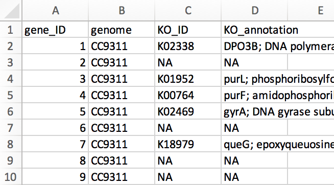

# Six glorious commands

There are **a lot** of things we can do at the command line, and there is unfortunately no *one* place to go to find all of the things that would be helpful. But here we are going to introduce six standard and powerful commands that are worth being aware of. Again, we don't need to remember the details of any of them, but having an idea they exist means we might think of them when we have a problem to solve, and then we can learn what we need. **Remember, this is just about exposure right now** 🙂

If you'd like to follow along, but need to pull up the proper working environment again, revisit [here](shell-getting-started-01.html#how-to-access-the-shell-for-now) and then come back 🙂 

---

<blockquote>

To be sure we are starting in the same place, let's run: 

```bash
cd ~/shell_intro
```

</blockquote>

---

We'll mostly be working with a file here called "gene_annotations.tsv", which is a tab-delimited table holding genes, their annotations, and their amino acid sequences. To help orient us, here is a peek at it in Excel:

<center></center>
<br>

We can see the file has 4 columns: "gene_ID", "genome", "KO_ID", and "KO_annotation" (KO is for **K**egg **O**rthology, a popular functional database). Let's change into our working directory for this page and explore it a little at the command line with some of the things we've seen already.

```bash
cd ~/shell_intro/six_commands/
head gene_annotations.tsv
```

We can also just pull out the header if we'd like by setting the number of lines **`head`** prints out to 1:

```bash
head -n 1 gene_annotations.tsv
```

And let's count how many rows there are:

```bash
wc -l gene_annotations.tsv
```

Now that we know something about the file we're working with, let's get to some new commands!

## cut  
**`cut`** is a command that's great for manipulating columns. The required arguments for **`cut`** are which columns we want, and from which file. Here's how we can use **`cut`** to pull out just the gene_ID column (column 1):

```bash
cut -f 1 gene_annotations.tsv
```

That is printing out all of the lines to the screen though, let's pipe **`|`** it into **`head`** for now to keep things manageable while we're working on it (remember we can bring up a previous command by pressing up):

```bash
cut -f 1 gene_annotations.tsv | head
```

Here we are specifying which column we want with the **`-f`** parameter (for **f**ield). We can specify multiple individual columns if we separate them with a comma:

```bash
cut -f 1,3 gene_annotations.tsv | head
```

And a range of columns if we join them with a dash:

```bash
cut -f 1-3 gene_annotations.tsv | head
```

Just like in Excel, **`cut`** thinks about where columns start and stop based on a delimiter, like a comma or a tab. The default setting is a tab, so we didn't need to change it for that file. But if we try using it on a **c**omma **s**eparated **v**alues file (a csv), things don't work well:

```bash
cut -f 1-3 example_gene_annotations.csv | head
```

Unless we tell **`cut`** the delimiter is a comma, which we can do with the **`-d`** parameter:

```bash
cut -d , -f 1-3 example_gene_annotations.csv | head
```

<blockquote>
<center><b>PRACTICE!</b></center>

From our tab-delimited file, "<b>gene_annotations.tsv</b>", try to make a new file that has just 2 columns: the gene_ID and KO_annotation columns (remember the <span class="nb"><b>></b></span> redirector). Name the new file "<b>IDs_and_annotations.tsv</b>". 

<div class="toggle-header closed">
    <strong>Solution</strong>
</div>

<div class="toggle-content docutils container" style="width:100%">

<div class="highlight-bash notranslate">
<div class="highlight">
<pre>
<span class="nb">cut -f 1,4 gene_annotations.tsv | head</span>
<span class="nb">cut -f 1,4 gene_annotations.tsv > IDs_and_annotations.tsv</span>
<span class="nb">head IDs_and_annotations.tsv</span>
</pre>
</div>
</div>

And to make sure it holds all 101 lines and not just the first 10!

<div class="highlight-bash notranslate">
<div class="highlight">
<pre>
<span class="nb">wc -l IDs_and_annotations.tsv</span>
</pre>
</div>
</div>

</div>
</blockquote>

## grep  
**`grep`** (**g**lobal **r**egular **e**x**p**ression) is a search tool. It looks through text files for strings (sequences of characters). In its default usage, **`grep`** will look for whatever string of characters you give it (1st positional argument), in whichever file you specify (2nd positional argument), and then print out the lines that contain what you searched for. Let's try it:

```bash
head colors.txt

grep blue colors.txt
```

If there are multiple lines that match, grep will print them all:

```bash
grep re colors.txt
```

If what we are looking for is not in the file, we will just get our prompt back with nothing printed out:

```bash
grep black colors.txt
```

Back to our gene annotations file, remember it holds KO-annotation information in the 3rd and 4th columns:

```bash
head -n 1 gene_annotations.tsv
```

For the moment, let's pretend we're interested in genes predicted to encode for the enzyme epoxyqueuosine reductase. If we search at the [KO website](https://www.genome.jp/kegg/ko.html) for this, it tells us that there are [2 KO_IDs](https://www.genome.jp/dbget-bin/www_bfind_sub?mode=bfind&max_hit=1000&dbkey=orthology&keywords=epoxyqueuosine+reductase) associated with it: K09765 and K18979. **`grep`** is a super-quick way to see if they are in our annotations file: 

```bash
grep K09765 gene_annotations.tsv

grep K18979 gene_annotations.tsv
```

It seems the first one wasn't found in our genomes, but the second one is in there twice!

<blockquote>
<center><b>PRACTICE!</b></center>

Using a combination of <span class="nb"><b>grep</b></span> and <span class="nb"><b>cut</b></span>, try to print out just the genomes (column 2) that have the "K18979" annotation.

<div class="toggle-header closed">
    <strong>Solution</strong>
</div>

<div class="toggle-content docutils container" style="width:100%">

<div class="highlight-bash notranslate">
<div class="highlight">
<pre>
<span class="nb">grep K18979 gene_annotations.tsv | cut -f 2</span>
</pre>
</div>
</div>

</div>
</blockquote>

We're just scratching the surface of what **`grep`** can do, but one thing worth mentioning is the **`-c`** flag. This tells **`grep`** to just report how many lines matched, instead of printing them to the screen:

```bash
grep -c K18979 gene_annotations.tsv
```

## paste
Like **`cut`**, **`paste`** also works with columns. It pastes things together horizontally with a delimiter in between them (a tab by default). 

We have another file in our working directory that holds some color names in Spanish: 

```bash
head colores.txt
```

For a quick example of how **`paste`** works, let's paste this file to our "colors.txt" file:

```bash
paste colors.txt colores.txt 
```

For a more practical example, let's look at another file in our directory that holds the amino acid lengths and sequences of our genes:

```bash
head genes_and_seqs.tsv
```

If the lines are longer than the terminal window, then they will wrap like this and look kind of messy. We can take a look without linewraps with the **`less`** program by adding the **`-S`** option:

```bash
less -S genes_and_seqs.tsv
```

In this view things run off the screen, but each line is one row. Note that the terminal doesn’t automatically line up columns for us. <kbd>q</kbd> will exit less.

Let's say we want to add these protein lengths and sequences to our "gene_annotations.tsv" file. We can **`paste`** the two files together, but then we'll have two columns for gene_ID (columns 1 and 5):

```bash
paste gene_annotations.tsv genes_and_seqs.tsv | head -n 1
```

>**Note:** If a "paste: write error: Broken pipe" message pops up here, it can be ignored. It is just happening because the **`head`** command is finishing before the **`paste`** command, and then **`paste`** is telling us it had nowhere to send the output anymore. But since all we care about is the first line here, it does not affect what we're doing. (Not all systems do things this way, but the one we're working on does.)

If we wanted to take everything except the fifth column (the second "gene_ID" column), we could do it like this:

```bash
paste gene_annotations.tsv genes_and_seqs.tsv | cut -f 1-4,6- | head -n 2
```

Notice that by putting the dash after the 6, and nothing else, we are specifying that column and all that follow. 

>**NOTE:** **`paste`** is a super-useful command. But it does **not** check to make sure what we are doing makes sense. If these files were out of order from each other, **`paste`** would still be just as happy to stick them together and then our merged file would hold mismatched information. So it's important to make sure things we are pasting together are in the appropriate order. It's a little too far off the path for now, but just to note them, useful commands to look into for doing this would be **`sort`** and **`comm`** 🙂

## sed
**`sed`** (for **s**tream **ed**itor) is our "search and replace" command, just like in something like Excel or Word, but much more powerful. Like many of the commands here, **`sed`** is useful in just general usage, but you can also learn to do a lot more with it if you need/want to at some point. For now, let's look at the general usage.

Let's imagine a totally-not-real, never-happened scenario where co-authors waited until our paper was accepted (and we've even approved the proofs already) to then tell us they want to change the name of one of the new genomes in it 🤦 So now we need to change all instances of "UW179A" to "UW277". 

This genome happens to be at the end of our file, so we can check it with **`tail`** if we'd like:
 
```bash
tail gene_annotations.tsv
```

The syntax of **`sed`** is a little strange at first, so let's run it and then break it down (don't forget, feel free to copy and paste things):

```bash
sed 's/UW179A/UW277/' gene_annotations.tsv | tail
```

>Here, the **`sed`** command is followed by an expression within single quotes. This expression holds 4 items separated by the 3 forward slashes in there: the 1st is the letter "s", which is for "substitute"; the 2nd is what we'd like to find and replace, "UW179A"; the 3rd is what we'd like to replace it with, "UW277"; and the 4th is actually empty in this case (the next example will use that slot).

Now that we've previewed this, we can remove the **`tail`** and write the new version to a file with a redirector:

```bash
sed 's/UW179A/UW277/' gene_annotations.tsv > modified_gene_annotations.tsv

tail modified_gene_annotations.tsv
```

And note that this did not alter the original file:

```bash
tail gene_annotations.tsv
```

**One important thing to know about `sed` is that by default it will only change the first occurrence of something in a line.** For example, let's say we need to change all occurrences of "NA" to "\<NA\>" to fit a certain program we want to use:

```bash
head gene_annotations.tsv

sed 's/NA/<NA>/' gene_annotations.tsv | head
```

Note that only the first occurrence in each line was changed. To change that behavior, we need to add a "g" (for **g**lobal) to that fourth slot like so:

```bash
sed 's/NA/<NA>/g' gene_annotations.tsv | head
```

And now all instances are replaced. These quick examples were just looking for exact matches, but **`sed`** has very powerful pattern searching features (building off of what special characters like **`*`**, **`?`**, and others can do) that you can look into as needed.

## awk  
**`awk`** is even more expansive than any of the others we've seen, but like the others, just being familiar with its basic command-line usage can be powerful. **`awk`** is useful for doing things like filtering based on columns and doing calculations.

The syntax of **`awk`** can also take a little getting used to. For some examples, we're going to work with a typical BLAST output table. Let's take a look at it first with **`head`**:

```bash
head blast_output.tsv
```

Here we have 6 columns: "query" is our input sequence ; "qlen" is the length of the query; "subject" is the reference sequence our query hit; "slen" is subject length; "pident" is percent identity; and "al_length" is the length of the alignment.

After blasting, it is common to want to filter the output by some criteria. For the first example, let's say we only want to keep hits that percent identities greater than 95%. For **`awk`**, we specify which columns we want to act on with a **`$`** followed by the column number. In this case, the percent identity is column 5, and we put the whole expression within quotes so it is sent to **`awk`** as one argument: 

```bash
awk ' $5 > 95 ' blast_output.tsv
```

>Note that this returns the column header too. That tells us that **`awk`** is not filtering out text when doing a numeric comparison like this. 

We can also do this sort of filtering based on multiple conditions by connecting them with "and/or" type statements. An "and" in **`awk`** is specified with **`&&`**, and an "or" is specified with two pipes, **`||`**. Let's say we want our 95% ID criterion, but we also want the query length to be greater than 1000:

```bash
awk ' $5 > 95 && $2 > 1000 ' blast_output.tsv
```

We can also perform calculations on-the-fly to filter columns with **`awk`**. BLAST is a "local" aligner, which means we can have just a small portion of our input sequence align to something with a very high percent identity, but taken as a whole the entire sequences may be very different. The second row from the last command shows an example of this:

<pre>query   qlen    subject slen    pident  al_length
Te_4133 1470    3R_1087 8642    100.0   200</pre>

Query sequence "Te_4133" hit a reference sequence with 100% identity, **but** the alignment length is only 200 while the input sequence (the query) length is 1470. Depending on what we are doing, this might not be what we want. It is common to filter out hits like this by requiring some minimum fraction of the query sequence to have successfully aligned. 

Here is how we can tell **`awk`** to only keep the hits that are greater than 95% identical AND if more than 90% of the query sequence aligned:

```bash
awk ' $5 > 95 && $6 > $2 * 0.9 ' blast_output.tsv
```

Again, **`awk`** can seem pretty tricky, especially at first, but forunately we don't need to remember *how* to do these things, just that they can be done. And then we can look it up when we need it 🙂

## tr
The last one we're going to look at is **`tr`** (for **tr**anslate). **`tr`** changes one character into another character. It seems to become more useful with time, but it's worth knowing early if for no other reason than it deals with special characters really well – the type of special characters that many Excel versions put in exported tables that can ruin working with them at the command line 🤬

For example, when exporting a table as tab-delimited or as a csv file from many versions of Excel, there will be odd newline characters (newline characters tell the computer to end one line and start a new one). The typical newline character is represented like this **`\n`**, but Excel likes to put in **`\r`** characters. We can see this messing with things on the Excel-exported file if we open it with **`less`**:

```bash
less gene_annotations_excel_exported.tsv
```

Where everywhere there should be a line break, there is an odd <kbd>^M</kbd> thing going on (hit <kbd>q</kbd> to exit **`less`**). We can also see it if we try to count the number of lines:

```bash
wc -l gene_annotations_excel_exported.tsv
```

**`wc -l`** actually just counts the newline characters in a file (normally **`\n`**), so here it finds none. 

But this is where **`tr`** comes to the rescue. These characters can be swapped so that working between Excel and the command-line is no longer a problem and we can enjoy both worlds 🙂

The **`tr`** command does not accept the file you want to work on as a positional argument like many of the other commands we've seen. Instead we need to use a new *redirector*, **`<`**. While **`>`** as we've seen handles the output, **`<`** handles the input. It gives the file following it to the program in front of it: 

```bash
tr "\r" "\n" < gene_annotations_excel_exported.tsv > gene_annotations_fixed.tsv
```

Now we can see the new file we made is ready for the command line (<kbd>q</kbd> exits **`less`**):

```bash
less gene_annotations_fixed.tsv
```

## Summary
As mentioned, this page is just a first introduction to some great commands that are worth having in our toolkit. Each of them has much more functionality that we can dig into further as needed 🙂

Next we're going to look at [variables and for loops!](shell-for-loops-05.md)

<center>
<h4><i>Commands introduced:</i></h4>

|| | ||
||:----------:|:------------------:||
||**Command**     |**Function**\*          ||
||**`cut`**| cuts columns from tables ||
||**`grep`**| finds matching text and returns lines ||
||**`paste`**       | sticks columns or files together horizontally||
||**`sed`**        | search and replace ||
||**`awk`**| good for filtering columns and calculations ||
||**`tr`**        | swap characters for other characters (**tr**anslate) ||
|| | ||

\*general use, many can do much more
</center>

---

<a href="shell-wild-redirectors-03.html" style="float: left"><b>Previous:</b> Redirectors and wildcards</a>
<a href="shell-for-loops-05.html" style="float: right"><b>Next:</b> Variables and For loops</a><br>

<div style="text-align: center">
	<a href="../index.html">ANGUS Home</a>
</div>

