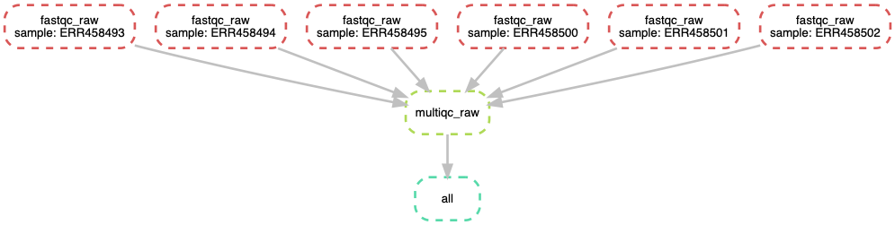

# Workflow Management using Snakemake

## Objectives

+ Identify cases where workflow managers are helpful for automation
+ Understand the components of a Snakefile: rules, inputs, outputs, and actions.
+ Write and run a Snakefile.

## Accessing our JetStream intances

You should still have your jetstream instance running, you can follow the instructions [here](jetstream/boot.html) to log in to JetStream and find your instance. Then `ssh` into it following the instructions [here](jetstream/boot.html#ssh-secure-login).

You should now be logged into your Jetstream computer! You should see
something like this:

```
diblynn@js-17-71:~$
```

Make sure you're in your home directory:

```
cd ~
```

Install `snakemake` using conda. 

```
conda install -y -c conda-forge -c bioconda snakemake-minimal
```

Type the following in your terminal to display a link to Rstudio web-server 
for your instance’s $(hostname -i):

```
echo http://$(hostname -i):8787/
```

Copy and paste the generated link into your browser to open Rstudio and login
with your room's jetstream username and password. We’re going to again work 
with the text editor and the terminal of Rstudio.


## Automation with BASH

In both our RNA-seq workflow and our mapping and variant calling workflow, we 
performed many steps. We performed steps like quality assessment and filtering using
`fastqc` and `trimmomatic`. We performed these steps on 6 files using for loops.

In our last lesson, we automated these steps using a bash script. We put all of 
our commands into one file so that we only had to run one command to orchestrate
our quality control workflow. Bash scripting for automation is really powerful!

Let's revisit the first part of our bash script for running and organizing our 
fastqc results:

```
cd ~/data/

echo "Running FastQC ..."
fastqc *.fastq.gz 

mkdir -p ~/fastqc_untrimmed

echo "Saving FastQC results..."
mv *.zip ~/fastqc_untrimmed/
mv *.html ~/fastqc_untrimmed/

cd ~/fastqc_untrimmed/

echo "Running multiqc..."
multiqc .
```

We can run it using this command:

```
bash qc.sh
```

Oh crap! We realize just after we've finished `Running FastQC` that we wanted 
to move our summary file to a subdirectory! Quick, press `ctrl - C` and cancel
the run!

Even if we made this change though, we're in a bit of a pickle. We want to
re-start our script that automates the runs and the file movements for us, but
we already ran the first part of our file! Let's add comment characters to the
lines we know already ran and then re-run the script:

```
cd ~/data/

# echo "Running FastQC ..."
# fastqc *.fastq.gz 

mkdir -p ~/data/fastqc_untrimmed

echo "Saving FastQC results..."
mv *.zip ~/data/fastqc_untrimmed/
mv *.html ~/data/fastqc_untrimmed/

cd ~/data/fastqc_untrimmed/

echo "Running multiqc..."
multiqc .
```

Now we can re-run the script:

```
bash qc.sh 
```

This (maybe) worked out ok this time. However, it's hard to be sure we know 
where we stopped our command. For this reason and many others, we use workflow
managers to keep track of the things that have and haven't run yet! 

We'll be using snakemake for automation. 

## Introduction to Snakemake

The Snakemake workflow management system is a tool to create reproducible and 
scalable data analyses. It orchestrates and keeps track of all the different
steps of workflows that have been run so you don't have to! It has a lot of 
wonderful features that can be invoked for different applications, making it
very flexible while maintaining human interpretability.  

There are many different tools that researchers use to automate computational
workflows. We selected snakemake for the following reasons:

+ It was written by a bioinformatician for bioinformatics workflows.
+ It’s free, open-source, and conda-installable
+ Snakemake works cross-platform (Windows, MacOS, Linux) and is compatible with 
all HPC schedulers. It works on laptops, the cloud, and clusters without
modification to the main workflow (as long as you have enough compute 
resources!).
+ Snakemake is written using Python, but supports bash and R code as well.
+ Anything that you can do in Python, you can do with Snakemake (since you can 
pretty much execute arbitrary Python code anywhere).

Like other workflow management systems, Snakemake allows you to:

+ Keep a record of how your scripts are used and what their input dependencies 
are
+ Run multiple steps in sequence, parallelising where possible
+ Automatically detect if something changes and then reprocess data if needed

Our goal is to automate the first two steps (FastQC MultiQC) of our example 
workflow using snakemake! 

## Starting with Snakemake

Snakemake workflows are built around **rules**. The diagram below shows the
anatomy of a snakemake rule:

<center></center>
<br>

Let's make a rule to run `fastqc` on one of our samples below. We'll put this 
rule in a file called `Snakefile`.

```
rule fastqc_raw:
    input: "data/ERR458493.fastq.gz"
    output: 
        "data/ERR458493_fastqc.html",
        "data/ERR458493_fastqc.zip"
    shell:'''
    fastqc -o data {input}
    '''
```

Let's try and run our Snakefile! Return to the command line and run `snakemake`.

```
snakemake
```

You should see output that starts like this:

```
Building DAG of jobs...
Using shell: /bin/bash
Provided cores: 1
Rules claiming more threads will be scaled down.
Job counts:
	count	jobs
	1	fastqc_raw
	1

[Tue Jul  2 19:10:26 2019]
rule fastqc_raw:
    input: data/ERR458493.fastq.gz
    output: data/ERR458493_fastqc.html, data/ERR458493_fastqc.zip
    jobid: 0

```

Let's check that the output file is there:

```
ls data/*fastqc*
```

Yay! Snakemake ran the thing!

We can also use better organization. Let's **specify a different output folder** 
for our fastqc results

```
rule fastqc_raw:
    input: "data/ERR458493.fastq.gz"
    output: 
        "fastqc_raw/ERR458493_fastqc.html",
        "fastqc_raw/ERR458493_fastqc.zip"
    shell:'''
    fastqc -o fastqc_raw {input}
    '''
```

If we look in our directory, we should now see a `fastqc_raw` directory, even
though we didn't create it:

```
ls
```

Snakemake created this directory for us. We can look inside it to see if it 
really ran our command:

```
ls fastqc_raw
```

## Creating a pipeline with snakemake

We told snakemake to do something, and it did it. Let's add another rule to our
Snakefile telling snakemake to do something else. This time, we'll run multiqc.

```
rule fastqc_raw:
    input: "data/ERR458493.fastq.gz"
    output: 
        "fastqc_raw/ERR458493_fastqc.html",
        "fastqc_raw/ERR458493_fastqc.zip"
    shell:'''
    fastqc -o fastqc_raw {input}
    '''

rule multiqc_raw:
    input: "fastqc_raw/ERR458493_fastqc.zip"
    output: "fastqc_raw/multiqc_report.html"
    shell:'''
    multiqc -o fastqc_raw fastqc_raw
    '''
```

We see output like this:

```
Building DAG of jobs...
Nothing to be done.
Complete log: /Users/tr/2019_angus/.snakemake/log/2019-07-02T191640.002744.snakemake.log
```

However, when we look at the output directory `fastqc_raw`, we see that our 
multiqc file does not exist! Bad Snakemake! Bad!! 

Snakemake looks for a `rule all` in a file as the final file it needs to 
produce in a workflow. Once this file is defined, it will go back through all 
other rules looking for which ordered sequence of rules will produce all of the 
files necessary to get the final file(s) specified in `rule all`. For this point
in our workflow, this is our fastqc sample directory.. Let's add a rule all. 

```
rule all:
    input:
        "fastqc_raw/multiqc_report.html"

rule fastqc_raw:
    input: "data/ERR458493.fastq.gz"
    output: 
        "fastqc_raw/ERR458493_fastqc.html",
        "fastqc_raw/ERR458493_fastqc.zip"
    shell:'''
    fastqc -o fastqc_raw {input}
    '''

rule multiqc_raw:
    input: "fastqc_raw/ERR458493_fastqc.html"
    output: "fastqc_raw/multiqc_report.html"
    shell:'''
    multiqc -o fastqc_raw fastqc_raw
    '''
```

And it worked! Now we see output like this:

```
Building DAG of jobs...
Using shell: /bin/bash
Provided cores: 1
Rules claiming more threads will be scaled down.
Job counts:
	count	jobs
	1	all
	1	multiqc_raw
	2
```

Snakemake now has two processes it's keeping track of. 

<center></center>
<br>

## Using Snakemake to process multiple files

So far we've been using snakemake to process one sample. However, we have 6! 
Snakemake is can be flexibly extended to more samples using wildcards. 

We already saw wildcards previously. 

When we specified the output file path with `{input}`, `{input}` was a
wildcard. The wildcard is equivalent to the value we specified for `{input}`.

```
rule fastqc_raw:
    input: "data/ERR458493.fastq.gz"
    output: 
        "fastqc_raw/ERR458493_fastqc.html",
        "fastqc_raw/ERR458493_fastqc.zip"
    shell:'''
    fastqc -o fastqc_raw {input}
    '''
```

We can create our own wildcard too. This is really handy for running our
workflow on all of our samples.  

```
SAMPLES=['ERR458493', 'ERR458494', 'ERR458495', 'ERR458500', 'ERR458501', 
'ERR458502']

rule all:
    input:
        "fastqc_raw/multiqc_report.html"


rule fastqc_raw:
    input: "data/{sample}.fastq.gz"
    output: 
        "fastqc_raw/{sample}_fastqc.html",
        "fastqc_raw/{sample}_fastqc.zip"
    shell:'''
    fastqc -o fastqc_raw {input}
    '''

rule multiqc_raw:
    input: expand("fastqc_raw/{sample}_fastqc.html", sample = SAMPLES)
    output: "fastqc_raw/multiqc_report.html"
    shell:'''
    multiqc -o fastqc_raw fastqc_raw
    '''
```

We can run this again at the terminal.

```
snakemake
```

And we have now run these rules for each of our samples!

Note that we added new syntax here as well. We define a variable at the top
of the snakefile call `SAMPLES`. Snakemake solves the values for the wildcard
`{sample}` the last time that see that wildcard. However, we need to `expand`
the wildcard using the `expand` function, and tell snakemake in which variable
to look for the values. 

<center></center>
<br>


### Helpful guidelines

+ Indentation is important, use two or four spaces for each indentation.
+ Define your target (final output) files in rule all
+ Use unique extensions or directories for each rule to avoid wildcard collisions

## Snakemake Additional Features

#### dry-run, print shell commands and reason for execution

```
snakemake -n –p -r
```

#### execute the workflow with 8 cores

```
snakemake --cores 8
```
#### run the workflow on a SLURM cluster

```
snakemake --cluster-config cluster.yml --cluster \ 
  "sbatch -A {cluster.account} -t {cluster.time}"
```
#### Visualize entire workflow diagram

```
snakemake --dag | dot -Tpng > dag.png
```
The DAG png file should look something as shown above.

### Snakemake Report

Snakemake can automatically generate detailed self-contained HTML reports that 
encompass runtime statistics, provenance information, workflow topology and 
results.

To create the report, run

```
snakemake --report report.html
```

View sample report [here](_static/report.html)

### Specifying software required for a rule

**You can specify software on a per-rule basis! This is really helpful when 
you have incompatible software requirements for different rules, or want to run 
on a cluster, or want to make your workflow repeatible.**

For example, if you create a file `env_fastqc.yml` with the following content:

```
channels:
  - conda-forge
  - bioconda
  - defaults
dependencies:
  - fastqc==0.11.8
```

and then change the fastqc rule to look like this:

```
rule fastqc_raw:
    input: "data/{sample}.fastq.gz"
    output: 
        "fastqc_raw/{sample}_fastqc.html",
        "fastqc_raw/{sample}_fastqc.zip"
    conda:
    	"env_fastqc.yml"
    shell:'''
    fastqc -o fastqc_raw {input}
    '''
```

you can now run snakemake like so,

```
snakemake --use-conda
```

and for that rule, snakemake will install the specified software and 
and dependencies in its own environment,  with the specified version.

This aids in reproducibility, in addition to the practical advantages of 
isolating software installs from each other.


## Resources

+ Here are some great 
[Snakemake Workflows](https://github.com/snakemake-workflows). Check out the 
RNAseq-STAR-DESEq2 workflow [here](https://github.com/snakemake-workflows/rna-seq-star-deseq2).

- [snakemake paper](https://academic.oup.com/bioinformatics/article/28/19/2520/290322)

- [snakemake GUI](https://academic.oup.com/bioinformatics/article/34/11/1934/4817647)

- [snakemake metagenomics](https://github.com/AAFC-BICoE/snakemake-amplicon-metagenomics)


