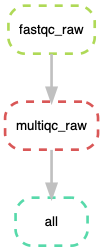

# Workflow Management using Snakemake

## Objectives

+ Identify cases where workflow managers are helpful for automation
+ Understand the components of a Snakefile: rules, inputs, outputs, and actions.
+ Write and run a Snakefile.

## Getting started

Start up a Jetstream m1.medium or larger
[as per Jetstream startup instructions](jetstream/boot.html).

---

You should now be logged into your Jetstream computer!  You should see
something like this

```
diblynn@js-17-71:~$
```

Make sure you're in your home directory:

```
cd ~
```

Install `snakemake` using conda. 

```
conda install -y -c bioconda snakemake-minimal
```

Type the following in your terminal to display a link to Rstudio web-server for your instance’s $(hostname)

```
echo http://$(hostname):8787/
```
click on the link generated to open Rstudio in your browser and login with your room's jetstream username and password. We’re mostly going to work in the file editor and the terminal of Rstudio; to get started, open the terminal, and execute following to to get a shorter terminal prompt.

```
PS1='$ '
```

## Rationale


**RNAseq & Variant Calling Workflow Steps**


## Introduction to Workflow Management

a workflow management system, consists of a text-based workflow specification language and a scalable execution environment, that allows the parallelized execution of workflows on workstations, compute servers and clusters without modification of the workflow definition.

## Automation with BASH


In both our RNA-seq workflow and our mapping and variant calling workflow, we 
performed many steps. We performed steps like quality control and analysis using
`fastqc` and `trimmomatic`. We performed these steps on 6 files using for loops.

In our last lesson, we automated these steps using a bash script. We put all of 
our commands into one file so that we only had to run one command to orchestrate
our quality control workflow. Bash scripting for automation is really powerful!

Let's revisit our bash script for running and organizing our fastqc results:

```
set -e
cd ~/data/

echo "Running FastQC ..."
fastqc *.fastq.gz

mkdir -p ~/fastqc_untrimmed

echo "Saving FastQC results..."
mv *.zip ~/fastqc_untrimmed/
mv *.html ~/fastqc_untrimmed/

cd ~/fastqc_untrimmed_reads/

echo "Unzipping..."
for filename in *.zip
do
    unzip $filename
done

echo "Saving summary..."
cat */summary.txt > ~/fastqc_summaries.txt
```

We can run it using this command:

```
bash read_qc.sh
```

Oh crap! We realize just after we've finished `Running FastQC` that we wanted 
to move our summary file to a subdirectory! Quick, press `ctrl - C` and cancel
the run!

Even if we made this change though, we're in a bit of a pickle. We want to
re-start our script that automates the runs and the file movements for us, but
we already ran the first part of our file! Let's add comment characters to the
lines we know already ran and then re-run the script:

```
set -e
cd ~/data/

#echo "Running FastQC ..."
#fastqc *.fastq.gz

#mkdir -p ~/fastqc_untrimmed

echo "Saving FastQC results..."
mv *.zip ~/fastqc_untrimmed/
mv *.html ~/fastqc_untrimmed/

cd ~/fastqc_untrimmed_reads/

echo "Unzipping..."
for filename in *.zip
do
    unzip $filename
done

echo "Saving summary..."
cat */summary.txt > ~/fastqc_summaries.txt
```

Now we can re-run the script:

```
bash read_qc.sh 
```

This (maybe) worked out ok this time. However, it's hard to be sure we know 
where we stopped our command. For this reason and many others, we use workflow
managers to keep track of the things that have and haven't run yet! 

We'll be using snakemake for automation. 

## Introduction to Snakemake


What is Snakemake and why are we using it?

The Snakemake workflow management system is a tool to create reproducible and 
scalable data analyses. It orchestrates and keeps track of all the different
steps of workflows that have been run so you don't have to! It has a lot of 
wonderful features that can be invoked for different applications, making it
very flexible while maintaining human interpretability.  

There are many different tools that researchers use to automate computational
workflows. We selected snakemake for the following reasons:

+ It was written by a bioinformatician for bioinformatics workflows.
+ It’s free, open-source, and conda-installable
+ Snakemake works cross-platform (Windows, MacOS, Linux) and is compatible with 
all HPC schedulers. It works on laptops, the cloud, and clusters without
modification to the main workflow (as long as you have enough compute 
resources!).
+ Snakemake is written using Python, but supports bash and R code as well.
+ Anything that you can do in Python, you can do with Snakemake (since you can 
pretty much execute arbitrary Python code anywhere).

Our goal is to automate our example workflow using snakemake! 

## Starting with Snakemake

Snakemake workflows are built around **rules**. Let's make a rule to run `fastqc`
on one of our samples below. We'll put this rule in a file called `Snakefile`.

```
rule fastqc_raw:
    input: "data/ERR458493.fastq.gz"
    output: 
        "data/ERR458493_fastqc.html",
        "data/ERR458493_fastqc.zip"
    shell:'''
    fastqc -o data {input}
    '''
```

Let's try and run our Snakefile! Return to the command line and run `snakemake`.

```
snakemake
```

You should see output that starts like this:

```
Building DAG of jobs...
Using shell: /bin/bash
Provided cores: 1
Rules claiming more threads will be scaled down.
Job counts:
	count	jobs
	1	fastqc_raw
	1

[Tue Jul  2 19:10:26 2019]
rule fastqc_raw:
    input: data/ERR458493.fastq.gz
    output: data/ERR458493_fastqc.html, data/ERR458493_fastqc.zip
    jobid: 0

```

Let's check that the output file is there:

```
ls data/*fastqc*
```

Yay! Snakemake ran the thing!

We can also use better organization. Let's **specify a different output folder** for
our fastqc results

```
rule fastqc_raw:
    input: "data/ERR458493.fastq.gz"
    output: 
        "fastqc_raw/ERR458493_fastqc.html",
        "fastqc_raw/ERR458493_fastqc.zip"
    shell:'''
    fastqc -o fastqc_raw {input}
    '''
```

If we look in our directory, we should now see a `fastqc_raw` directory, even
though we didn't create it:

```
ls
```

Snakemake created this directory for us. We can look inside it to see if it 
really ran our command:

```
ls fastqc_raw
```

## Creating a pipeline with snakemake

We told snakemake to do something, and it did it. Let's add another rule to our
Snakefile telling snakemake to do something else. This time, we'll unzip the 
zipped fastc files.  

```
rule fastqc_raw:
    input: "data/ERR458493.fastq.gz"
    output: 
        "fastqc_raw/ERR458493_fastqc.html",
        "fastqc_raw/ERR458493_fastqc.zip"
    shell:'''
    fastqc -o fastqc_raw {input}
    '''

rule unzip_fastqc_raw:
    input: "fastqc_raw/ERR458493_fastqc.zip"
    output: "fastqc_raw/ERR458493_fastqc/summary.txt"
    shell:'''
    unzip -d fastqc_raw/ {input}
    '''
```

We see output like this:

```
Building DAG of jobs...
Nothing to be done.
Complete log: /Users/tr/2019_angus/.snakemake/log/2019-07-02T191640.002744.snakemake.log
```

However, when we look at the output directory `fastqc_raw`, we see that our file
was not unzipped! Bad Snakemake! Bad!! 

Snakemake looks for a `rule all` in a file as the final file it needs to 
produce in a workflow. Once this file is defined, it will go back through all 
other rules looking for which ordered sequence of rules will produce all of the 
files necessary to get the final file(s) specified in `rule all`. For this point
in our workflow, this is our fastqc sample directory.. Let's add a rule all. 

```
rule all:
    input:
        "fastqc_raw/ERR458493_fastqc/summary.txt"

rule fastqc_raw:
    input: "data/ERR458493.fastq.gz"
    output: 
        "fastqc_raw/ERR458493_fastqc.html",
        "fastqc_raw/ERR458493_fastqc.zip"
    shell:'''
    fastqc -o fastqc_raw {input}
    '''

rule unzip_fastqc_raw:
    input: "fastqc_raw/ERR458493_fastqc.zip"
    output: "fastqc_raw/ERR458493_fastqc/summary.txt"
    shell:'''
    unzip -d fastqc_raw/ {input}
    '''
```

And it worked! Now we see output like this:

```
The flag 'directory' used in rule all is only valid for outputs, not inputs.
Building DAG of jobs...
Using shell: /bin/bash
Provided cores: 1
Rules claiming more threads will be scaled down.
Job counts:
	count	jobs
	1	all
	1	unzip_fastqc_raw
	2
```

Snakemake now has two processes it's keeping track of. 



## Using Snakemake to process multiple files

So far we've been using snakemake to process one sample. However, we have 6! 
Snakemake is can be flexibly extended to more samples using wildcards. 

We already saw wildcards previously. 

When we specified the output file path with `{input}`, `{input}` was a
wildcard. The wildcard is equivalent to the value we specified for `{output}`.

```
rule unzip_fastqc_raw:
    input: "fastqc_raw/ERR458493_fastqc.zip"
    output: "fastqc_raw/ERR458493_fastqc/summary.txt"
    shell:'''
    unzip -d fastqc_raw/ {input}
    '''
```

We can create our own wildcard too. This is really handy for running our
workflow on all of our samples.  

```
SAMPLES=['ERR458493', 'ERR458494', 'ERR458495', 'ERR458500', 'ERR458501', 
'ERR458502']

rule all:
    input:
        expand("fastqc_raw/{sample}_fastqc/summary.txt", sample = SAMPLES)

rule fastqc_raw:
    input: "data/{sample}.fastq.gz"
    output: 
        "fastqc_raw/{sample}_fastqc.html",
        "fastqc_raw/{sample}_fastqc.zip"
    shell:'''
    fastqc -o fastqc_raw {input}
    '''

rule unzip_fastqc_raw:
    input: "fastqc_raw/{sample}_fastqc.zip"
    output: "fastqc_raw/{sample}_fastqc/summary.txt"
    shell:'''
    unzip -d fastqc_raw/ {input}
    '''
```

And we have now run these rules for each of our samples!


## Snakemake Additional Features

# dry-run, print shell commands and reason for execution

```
snakemake -n –p -r
```
# visualize the DAG of jobs using the Graphviz dot command

```
snakemake --dag | dot -Tsvg > dag.svg
```
# execute the workflow with 8 cores

```
snakemake --cores 8
```
# run the workflow on a SLURM cluster

```
snakemake --cluster-config cluster.yml --cluster \ "sbatch -A {cluster.account} -t {cluster.time}"
```
# Visualize entire workflow diagram

```
snakemake --dag | dot -Tpng > dag.png
```
The DAG png file should look something as shown above.

### Snakemake Report

Snakemake can automatically generate detailed self-contained HTML reports that encompass runtime statistics, provenance information, workflow topology and results.

- To create the report simply run

```
snakemake --report report.html
```
View sample report here(xyz)

### Specifying software required for a rule

**You can specify software on a per-rule basis! This is really helpful when you have incompatible software requirements for different rules, or want to run on a cluster, or just want to pin your snakemake workflow to a specific version.**

For example, if you create a file `env_fastqc.yml` with the following content,
```
channels:
  - bioconda
  - defaults
  - conda-forge
dependencies:
  - fastqc==0.11.8
```

and then change the fastqc rule to look like this:

```python
rule fastqc_raw:
    input: "data/{sample}.fastq.gz"
    output: 
        "fastqc_raw/{sample}_fastqc.html",
        "fastqc_raw/{sample}_fastqc.zip"
    conda:
    	"env_fastqc.yml"
    shell:'''
    fastqc -o fastqc_raw {input}
    '''
```

you can now run snakemake like so,

```bash
$ snakemake --use-conda
```
**and for that rule, snakemake will install just that software, with the specified version.**

**This aids in reproducibility, in addition to the practical advantages of isolating software installs from each other.**
