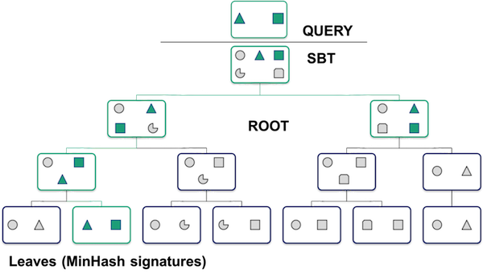

# K-mers, k-mer specificity, and comparing samples with k-mer Jaccard distance. (2018)


[Create / log into](jetstream/boot.html) an m1.medium Jetstream instance. 
A sourmash tutorial
---


## Objectives

1. Discuss the power of k-mers 
2. Compare reads to assemblies 
3. Compare datasets and build a tree
4. Determine what's in a metagenome by classifying reads into taxa 

## K-mers!

K-mers are a fairly simple concept that turn out to be tremendously powerful.

A "k-mer" is a word of DNA that is k long:

```
ATTG - a 4-mer
ATGGAC - a 6-mer
```

Typically we extract k-mers from genomic assemblies or read data sets by running a k-length window across all of the reads and sequences -- e.g. given a sequence of length 16, you could extract 11 k-mers of length six from it like so:

```
AGGATGAGACAGATAG
```
becomes the following set of 6-mers:
```
AGGATG
 GGATGA
  GATGAG
   ATGAGA
    TGAGAC
     GAGACA
      AGACAG
       GACAGA
        ACAGAT
         CAGATA
          AGATAG
```

k-mers are most useful when they're *long*, because then they're *specific*. That is, if you have a 31-mer taken from a human genome, it's pretty unlikely that another genome has that exact 31-mer in it.  (You can calculate the probability if you assume genomes are random: there are 4<sup>31</sup> possible 31-mers, and 4<sup>31</sup> = 4,611,686,018,427,387,904\.  So, you know, a lot.)

The important concept here is that **long k-mers are species specific**. We'll go into a bit more detail later.

## K-mers and assembly graphs

One of the three major ways that genome assembly works is by taking reads, breaking them into
k-mers, and then "walking" from one k-mer to the next to bridge between reads.  To see how this works, let's take the 16-base sequence above, and add another overlapping sequence:

```
AGGATGAGACAGATAG
    TGAGACAGATAGGATTGC
```

One way to assemble these together is to break them down into k-mers -- 

becomes the following set of 6-mers:
```
AGGATG
 GGATGA
  GATGAG
   ATGAGA
    TGAGAC
     GAGACA
      AGACAG
       GACAGA
        ACAGAT
         CAGATA
          AGATAG -> off the end of the first sequence
           GATAGG <- beginning of the second sequence
            ATAGGA
             TAGGAT
              AGGATT
               GGATTG
                GATTGC
```

and if you walk from one 6-mer to the next based on 5-mer overlap, you get the assembled sequence:

```
AGGATGAGACAGATAGGATTGC
```

Graphs of many k-mers together are called De Bruijn graphs, and assemblers like MEGAHIT and SOAPdenovo are De Bruijn graph assemblers - they use k-mers underneath.

## Why k-mers, though? Why not just work with the full read sequences?

Computers *love* k-mers because there's no ambiguity in matching them. You either have an exact match, or you don't.  And computers love that sort of thing!

Basically, it's really easy for a computer to tell if two reads share a k-mer, and it's pretty easy for a computer to store all the k-mers that it sees in a pile of reads or in a genome.

## Long k-mers are species specific

So, we've said long k-mers (say, k=31 or longer) are pretty species specific. Is that really true?

Yes! Check out this figure from the [MetaPalette paper](http://msystems.asm.org/content/1/3/e00020-16):


here, the Koslicki and Falush show that k-mer similarity works to group microbes by genus, at k=40\. If you go longer (say k=50) then you get only very little similarity between different species.

## Using k-mers to compare samples against each other

So, one thing you can do is use k-mers to compare genomes to genomes, or read data sets to read data sets: data sets that have a lot of similarity probably are similar or even the same genome.

One metric you can use for this comparisons is the Jaccard distance, which is calculated by asking how many k-mers are *shared* between two samples vs how many k-mers in total are in the combined samples.

```
only k-mers in both samples
----------------------------
all k-mers in either or both samples
```

A Jaccard distance of 1 means the samples are identical; a Jaccard distance of 0 means the samples are completely different.

This is a great measure and it can be used to search databases and cluster unknown genomes and all sorts of other things!  The only real problem with it is that there are a *lot* of k-mers in a genome -- a 5 Mbp genome (like E. coli) has 5 m k-mers!

About two years ago, [Ondov et al. (2016)](https://genomebiology.biomedcentral.com/articles/10.1186/s13059-016-0997-x) showed that [MinHash approaches](https://en.wikipedia.org/wiki/MinHash) could be used to estimate Jaccard distance using only a small fraction (1 in 10,000 or so) of all the k-mers.

The basic idea behind MinHash is that you pick a small subset of k-mers to look at, and you use those as a proxy for *all* the k-mers.  The trick is that you pick the k-mers randomly but consistently: so if a chosen k-mer is present in two data sets of interest, it will be picked in both. This is done using a clever trick that we can try to explain to you in class - but either way, trust us, it works!

We have implemented a MinHash approach in our [sourmash software](https://github.com/dib-lab/sourmash/), which can do some nice things with samples.  We'll show you some of these things next!

## Installing sourmash

To install sourmash, run:

```
conda install -y sourmash
```

Now, create a local software install and populate it with Jupyter and other dependencies:


The second command downloads a database that we'll use for taxonomic classification.You can find all of our available databases [here](https://sourmash.readthedocs.io/en/latest/databases.html)


## Generate a signature for Illumina reads

Download some reads and a reference genome:

```
mkdir ~/data
cd ~/data
curl -L https://osf.io/frdz5/download -o ecoli_ref-5m.fastq.gz 
curl -L https://osf.io/963dg/download -o ecoliMG1655.fa.gz 
```
[](_static/Sourmash_flow_diagrams_QC.png)


[](_static/Sourmash_flow_diagrams_compute.png)

Compute a scaled MinHash signature from our reads:

```
mkdir ~/sourmash
cd ~/sourmash

sourmash compute --scaled 2000 ~/data/ecoli_ref-5m.fastq.gz -o ecoli-reads.sig -k 31
```

## Compare reads to assemblies

Use case: how much of the read content is contained in the reference genome?

Build a signature for an E. coli genome:

```
sourmash compute --scaled 2000 -k 31 ~/data/ecoliMG1655.fa.gz -o ecoli-genome.sig
```

and now evaluate *containment*, that is, what fraction of the read content is
contained in the genome:
[](_static/Sourmash_flow_diagrams_search.png)

```
sourmash search -k 31 ecoli-reads.sig ecoli-genome.sig --containment
```

and you should see:

```
loaded query: /home/diblions/data/ecoli_ref-... (k=31, DNA)
loaded 1 signatures.

1 matches:
similarity   match
----------   -----
  9.7%       /home/diblions/data/ecoliMG1655.fa.gz
```

Why are only 10% or so of our k-mers from the reads in the genome!?
Any ideas?

Try the reverse - why is it bigger?

```
sourmash search -k 31 ecoli-genome.sig ecoli-reads.sig --containment
```

(...but 100% of our k-mers from the genome are in the reads!?)


## Make and search a database quickly.

Suppose that we have a collection of signatures (made with `sourmash
compute` as above) and we want to search it with our newly assembled
genome (or the reads, even!). How would we do that?

Let's grab a sample collection of 50 E. coli genomes and unpack it --

```
mkdir ecoli_many_sigs
cd ecoli_many_sigs

curl -O -L https://github.com/dib-lab/sourmash/raw/master/data/eschericia-sigs.tar.gz

tar xzf eschericia-sigs.tar.gz
rm eschericia-sigs.tar.gz

cd ../
```

This will produce 50 files named `ecoli-N.sig` in the `ecoli_many_sigs` --

```
ls ecoli_many_sigs
```

Let's turn this into an easily-searchable database with `sourmash index` --

```
sourmash index -k 31 ecolidb ecoli_many_sigs/*.sig
```
What does the database look like and how does the search work?



One point to make with this is that the search can quickly narrow down
which signatures match your query, without losing any matches.  It's a
clever example of how computer scientists can actually make life
better :).

----

And now we can search!

```
sourmash search ecoli-genome.sig ecolidb.sbt.json -n 20
```

You should see output like this:

```
# running sourmash subcommand: search
select query k=31 automatically.
loaded query: /home/tx160085/data/ecoliMG165... (k=31, DNA)
loaded SBT ecolidb.sbt.json
Searching SBT ecolidb.sbt.json
49 matches; showing first 20:
similarity   match
----------   -----
 75.4%       NZ_JMGW01000001.1 Escherichia coli 1-176-05_S4_C2 e117605...
 72.2%       NZ_GG774190.1 Escherichia coli MS 196-1 Scfld2538, whole ...
 71.4%       NZ_JMGU01000001.1 Escherichia coli 2-011-08_S3_C2 e201108...
 70.1%       NZ_JHRU01000001.1 Escherichia coli strain 100854 100854_1...
 69.0%       NZ_JH659569.1 Escherichia coli M919 supercont2.1, whole g...
 64.9%       NZ_JNLZ01000001.1 Escherichia coli 3-105-05_S1_C1 e310505...
 63.0%       NZ_MOJK01000001.1 Escherichia coli strain 469 Cleandata-B...
 62.9%       NZ_MOGK01000001.1 Escherichia coli strain 676 BN4_676_1_(...
 62.0%       NZ_JHDG01000001.1 Escherichia coli 1-176-05_S3_C1 e117605...
 59.9%       NZ_MIWF01000001.1 Escherichia coli strain AF7759-1 contig...
 52.7%       NZ_KE700241.1 Escherichia coli HVH 147 (4-5893887) acYxy-...
 51.7%       NZ_APWY01000001.1 Escherichia coli 178200 gec178200.conti...
 49.3%       NZ_LVOV01000001.1 Escherichia coli strain swine72 swine72...
 49.3%       NZ_MIWP01000001.1 Escherichia coli strain K6412 contig_00...
 49.0%       NZ_LQWB01000001.1 Escherichia coli strain GN03624 GCID_EC...
 48.9%       NZ_JHGJ01000001.1 Escherichia coli O45:H2 str. 2009C-4780...
 48.1%       NZ_CP011331.1 Escherichia coli O104:H4 str. C227-11, comp...
 47.7%       NZ_JHNB01000001.1 Escherichia coli O103:H25 str. 2010C-45...
 47.7%       NZ_JHRE01000001.1 Escherichia coli strain 302014 302014_1...
 47.6%       NZ_JHHE01000001.1 Escherichia coli O103:H2 str. 2009C-327...

```

identifying what genome is in the signature. Some pretty good matches but nothing above %75. Why? What are some things we should think about when we're doing taxonomic classification? 

## Compare many signatures and build a tree.

Adjust plotting (this is a bug in sourmash :) --
```
echo 'backend : Agg' > matplotlibrc
```

Compare all the things:

[](_static/Sourmash_flow_diagrams_compare.png)

```
sourmash compare ecoli_many_sigs/* -o ecoli_cmp
```

and then plot:

```
sourmash plot --pdf --labels ecoli_cmp
```

which will produce a file `ecoli_cmp.matrix.pdf` and `ecoli_cmp.dendro.pdf`
which you can then download via FileZilla and view on your local computer.

Here's a PNG version:

[](_static/ecoli_cmp.matrix.png)

## What's in my metagenome?

First, let's download and upack the database we'll use for classification
```
cd ~/sourmash
curl -L https://osf.io/zskb9/download -o genbank-k31.lca.json.gz 
gunzip genbank-k31.lca.json.gz
```
This database a GenBank index of all
the microbial genomes
-- this one contains sketches of all 87,000 microbial genomes (including viral and fungal). See
[available sourmash databases](http://sourmash.rtfd.io/en/latest/databases.html)
for more information.

After this database is unpacked, it produces a file
`genbank-k31.lca.json`.

Next, run the 'lca gather' command to see what's in your ecoli genome --
```
sourmash lca gather ecoli-genome.sig genbank-k31.lca.json
```

and you should get:

```
loaded 1 LCA databases. ksize=31, scaled=10000
loaded query: /home/diblions/data/ecoliMG165... (k=31)

overlap     p_query p_match 
---------   ------- --------
4.9 Mbp     100.0%    2.3%      Escherichia coli

Query is completely assigned.
```

In this case, the output is kind of boring because this is a single
genome.  But! You can use this on metagenomes (assembled and
unassembled) as well; you've just got to make the signature files.

To see this in action, here is gather running on a signature generated
from some sequences that assemble (but don't align to known genomes)
from the
[Shakya et al. 2013 mock metagenome paper](https://www.ncbi.nlm.nih.gov/pubmed/23387867).

```
wget https://github.com/dib-lab/sourmash/raw/master/doc/_static/shakya-unaligned-contigs.sig
sourmash lca gather shakya-unaligned-contigs.sig genbank-k31.lca.json
```

This should yield:
```
loaded 1 LCA databases. ksize=31, scaled=10000
loaded query: mqc500.QC.AMBIGUOUS.99.unalign... (k=31)

overlap     p_query p_match 
---------   ------- --------
1.8 Mbp      14.6%    9.1%      Fusobacterium nucleatum
1.0 Mbp       7.8%   16.3%      Proteiniclasticum ruminis
1.0 Mbp       7.7%   25.9%      Haloferax volcanii
0.9 Mbp       7.4%   11.8%      Nostoc sp. PCC 7120
0.9 Mbp       7.0%    5.8%      Shewanella baltica
0.8 Mbp       6.0%    8.6%      Desulfovibrio vulgaris
0.6 Mbp       4.9%   12.6%      Thermus thermophilus
0.6 Mbp       4.4%   11.2%      Ruegeria pomeroyi
480.0 kbp     3.8%    7.6%      Herpetosiphon aurantiacus
410.0 kbp     3.3%   10.5%      Sulfitobacter sp. NAS-14.1
150.0 kbp     1.2%    4.5%      Deinococcus radiodurans (** 1 equal matches)
150.0 kbp     1.2%    8.2%      Thermotoga sp. RQ2
140.0 kbp     1.1%    4.1%      Sulfitobacter sp. EE-36
130.0 kbp     1.0%    0.7%      Streptococcus agalactiae (** 1 equal matches)
100.0 kbp     0.8%    0.3%      Salinispora arenicola (** 1 equal matches)
100.0 kbp     0.8%    4.2%      Fusobacterium sp. OBRC1
60.0 kbp      0.5%    0.7%      Paraburkholderia xenovorans
50.0 kbp      0.4%    3.2%      Methanocaldococcus jannaschii (** 2 equal matches)
50.0 kbp      0.4%    0.3%      Bacteroides vulgatus (** 1 equal matches)
50.0 kbp      0.4%    2.6%      Sulfurihydrogenibium sp. YO3AOP1
30.0 kbp      0.2%    0.7%      Fusobacterium hwasookii (** 3 equal matches)
30.0 kbp      0.2%    0.0%      Pseudomonas aeruginosa (** 2 equal matches)
30.0 kbp      0.2%    1.6%      Persephonella marina (** 1 equal matches)
30.0 kbp      0.2%    0.4%      Zymomonas mobilis
20.0 kbp      0.2%    1.1%      Sulfurihydrogenibium yellowstonense (** 6 equal matches)
20.0 kbp      0.2%    0.5%      Ruminiclostridium thermocellum (** 5 equal matches)
20.0 kbp      0.2%    0.1%      Streptococcus parasanguinis (** 4 equal matches)
20.0 kbp      0.2%    0.8%      Fusobacterium sp. HMSC064B11 (** 2 equal matches)
20.0 kbp      0.2%    0.4%      Chlorobium phaeobacteroides (** 1 equal matches)
20.0 kbp      0.2%    0.7%      Caldicellulosiruptor bescii
10.0 kbp      0.1%    0.0%      Achromobacter xylosoxidans (** 53 equal matches)
10.0 kbp      0.1%    0.2%      Geobacter sulfurreducens (** 17 equal matches)
10.0 kbp      0.1%    0.5%      Fusobacterium sp. HMSC065F01 (** 15 equal matches)
10.0 kbp      0.1%    0.3%      Nitrosomonas europaea (** 14 equal matches)
10.0 kbp      0.1%    0.5%      Wolinella succinogenes (** 13 equal matches)
10.0 kbp      0.1%    0.5%      Thermotoga neapolitana (** 12 equal matches)
10.0 kbp      0.1%    0.5%      Thermus amyloliquefaciens (** 10 equal matches)
10.0 kbp      0.1%    0.1%      Desulfovibrio desulfuricans (** 9 equal matches)
10.0 kbp      0.1%    0.4%      Fusobacterium sp. CM22 (** 8 equal matches)
10.0 kbp      0.1%    0.2%      Desulfovibrio piger (** 7 equal matches)
10.0 kbp      0.1%    0.5%      Thermus kawarayensis (** 6 equal matches)
10.0 kbp      0.1%    0.5%      Pyrococcus furiosus (** 5 equal matches)
10.0 kbp      0.1%    0.5%      Aciduliprofundum boonei (** 4 equal matches)
10.0 kbp      0.1%    0.2%      Desulfovibrio sp. A2 (** 3 equal matches)
10.0 kbp      0.1%    0.3%      Desulfocurvus vexinensis (** 2 equal matches)
10.0 kbp      0.1%    0.0%      Enterococcus faecalis

22.1% (2.8 Mbp) of hashes have no assignment.

``` 

It is straightforward to build your own databases for use with
`search` and `lca gather`; this is of interest if you have dozens or
hundreds of sequencing data sets in your group. Ping us if you want us
to write that up.

## Final thoughts on sourmash

There are many tools like Kraken and Kaiju that can do taxonomic
classification of individual reads from metagenomes; these seem to
perform well (albeit with high false positive rates) in situations
where you don't necessarily have the genome sequences that are in the
metagenome.  Sourmash, by contrast, can estimate which known genomes are
actually present, so that you can extract them and map/align to them.
It seems to have a very low false positive rate and is quite sensitive
to strains.

Above, we've shown you a few things that you can use sourmash for.  Here
is a (non-exclusive) list of other uses that we've been thinking about --

* detect contamination in sequencing data;

* index and search private sequencing collections;

* search all of SRA for overlaps in metagenomes;

Chat with Luiz, Phil, or Titus if you are interested in these use cases!

</pre>
