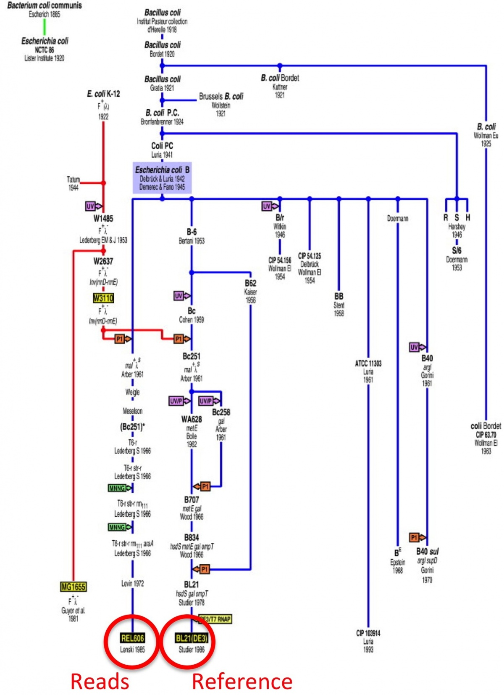

Variant calling
###############

The goal of this tutorial is to show you the basics of variant calling
using `Samtools <http://www.htslib.org/>`__.

We're going to be looking at variation in laboratory grown strains of Escherichia coli. We have reads from B strain REL606 and we'll be mapping it to a reference genome from BL21(DE3). This is a different lab strain, and there's an interesting paper where they trace the origin and transfer of all the different E. coli strains between scientisits through the decades.

Citation: `Tracing Ancestors and Relatives of Escherichia coli B, and the Derivation of B Strains REL606 and BL21(DE3)
<http://www.sciencedirect.com/science/article/pii/S0022283609011395>`__
Journal of Molecular Biology, Volume 394, Issue 4, 11 December 2009, Pages 634–643

Booting an Amazon AMI
~~~~~~~~~~~~~~~~~~~~~

Start up an Amazon computer (m1.large or m1.xlarge) using AMI
ami-7607d01e (see :doc:`amazon/start-up-an-ec2-instance` and
:doc:`amazon/starting-up-a-custom-ami`).

Log in `with Windows <amazon/log-in-with-ssh-win.html>`__ or
`from Mac OS X <amazon/log-in-with-ssh-mac.html>`__.

Install software
~~~~~~~~~~~~~~~~

Log into your instance. Install ruby and git, then install linuxbrew.
::
   sudo apt-get install ruby git
   ruby -e "$(curl -fsSL https://raw.githubusercontent.com/Linuxbrew/install/master/install)"
   export PATH="/home/ubuntu/.linuxbrew/bin:$PATH"
   export MANPATH="/home/ubuntu/.linuxbrew/share/man:$MANPATHe
   export INFOPATH="/home/ubuntu/.linuxbrew/share/info:$INFOPATH"
   sudo apt-get update
   sudo apt-get install build-essential
   brew tap homebrew/science

Now we can install anything available from linuxbrew science
::
   brew info bcftools
   brew install samtools
   brew install zlib
   brew install bcftools 
   brew install bwa

See what is installed:
::
   brew list

Download data
~~~~~~~~~~~~~
Links to learn more about the data:

* `Reference Genome 
  <http://www.ncbi.nlm.nih.gov/nuccore/NC_012971>`_
* `Reads
  <http://www.ebi.ac.uk/ena/data/view/SRR098042>`_

Download the reference genome and the resequencing reads
::
   curl "http://eutils.ncbi.nlm.nih.gov/entrez/eutils/efetch.fcgi?db=nuccore&id=NC_012971&rettype=fasta&retmode=text" > Ecoli_BL21.fasta
   curl -O ftp://ftp.sra.ebi.ac.uk/vol1/fastq/SRR098/SRR098038/SRR098038.fastq.gz

Note, this last URL is the "Fastq files (FTP)" link from the EBI page. Its compressed, lets decompress
::
   gunzip SRR098038.fastq.gz

If it doest work try
::
  curl -O ftp://ftp.ddbj.nig.ac.jp/ddbj_database/dra/fastq/SRA026/SRA026813/SRX040675/SRR098038.fastq.bz2

Read mapping
~~~~~~~~~~~~~~

Create the BWA index
::
   bwa index Ecoli_BL21.fasta 

Now, do the mapping of the raw reads to the reference genome
::
   bwa aln Ecoli_BL21.fasta SRR098038.fastq > SRR098038.sai

Make a SAM file (this would be done with 'sampe' if these were paired-end reads)
::
   bwa samse Ecoli_BL21.fasta SRR098038.sai SRR098038.fastq > SRR098038.sam

A sam file contains all of the information about where each read hits on the reference.  Links for more info:

* `SAM the file format 
  <https://samtools.github.io/hts-specs/SAMv1.pdf>`_

* `Samtools the software 
  <http://www.htslib.org/doc/samtools-1.3.html>`_

Next, index the reference genome with samtools
::
   samtools faidx Ecoli_BL21.fasta

Convert the SAM into a BAM file
::
   samtools view -bS SRR098038.sam > SRR098038.bam

Sort the BAM file
::
   samtools sort SRR098038.bam > SRR098038.sorted.bam

And index the sorted BAM file
::
   samtools index SRR098038.sorted.bam

Visualizing alignments
~~~~~~~~~~~~~~~~~~~~~~

At this point you can visualize with samtools tview. Other visualization software:
* `Tablet <http://bioinf.scri.ac.uk/tablet/>`__.
* IGV

'samtools tview' is a text interface that you use from the command line; run it like so::

   samtools tview SRR098038.sorted.bam Ecoli_BL21.fasta

The '.'s are places where the reads align perfectly in the forward direction,
and the ','s are places where the reads align perfectly in the reverse
direction.  Mismatches are indicated as A, T, C, G, etc.

You can scroll around using left and right arrows; to go to a specific
coordinate, use 'g' and then type in the contig name and the position.
For example, type 'g' and then 'gi|387825439|ref|NC_012971.2|:553093<ENTER>' to go to position 553093 in the BAM file. (This name is taken from the fasta reference file, you could change to something more reasonable).

Use 'q' to quit.

For the `Tablet viewer <http://bioinf.scri.ac.uk/tablet/>`__, click on
the link and get it installed on your local computer.  Then, start it
up as an application.  To open your alignments in Tablet, you'll need
three files on your local computer: ``Ecoli_BL21.fasta``, ``SRR098042.sorted.bam``,
and ``SRR098042.sorted.bam.bai``.  You can copy them over using Dropbox,
for example.

Statistics of alignments
~~~~~~~~~~~~~~~~~~~~~~~~

This command
::

   samtools view -c -f 4 SRR098038.bam

will count how many reads DID NOT align to the reference (214518).

This command
::

   samtools view -c -F 4 SRR098038.bam

will count how many reads DID align to the reference (6832113).

And this command
::

   wc -l SRR098038.fastq

will tell you how many lines there are in the FASTQ file (28186524).
Reminder: there are four lines for each sequence.

There is another package, Picard Tools, that can give you more in depth information. Lets install with linuxbrew
::
	brew install picard-tools

And use the particular tool CollectAlignmentSummaryMetrics
::
	picard CollectAlignmentSummaryMetrics R=Ecoli_BL21.fasta I=SRR098038.sorted.bam O=statistics.txt

`More picard tools stuff here
<https://broadinstitute.github.io/picard/>`_

Calling SNPs
~~~~~~~~~~~~

You can use samtools and bcftools to call SNPs. They have `great documentation of a standard workflow for calling SNPs <http://www.htslib.org/workflow/#mapping_to_variant>`_, you should read more about it. We're going to do a simplified and updated version here.

Start with mpileup and pipe the results to bcftools
::
   samtools mpileup -uf Ecoli_BL21.fasta SRR098038.sorted.bam | bcftools call -vmO z -o SRR098038.vcf.gz --ploidy 1 --threads 2

You can check out the VCF file by using 'tail' to look at the bottom
::
   tail SRR098038.vcf

Each variant call line consists of the chromosome name (for E. coli
REL606, there's only one chromosome); the position within the
reference; an ID (here always '.'); the reference call; the variant
call; and a bunch of additional information about
::
   samtools tview SRR098038.sorted.bam Ecoli_BL21.fasta

Again, you can use 'samtools tview' and then type (for example) 'g'
'rel606:4616538' to go visit one of the positions.  The format for the
address to go to with 'g' is 'chr:position'.
::
	gi|387825439|ref|NC_012971.2|:4558366

You can read more about `the VCF file format here <https://vcftools.github.io/specs.html>`__.

Questions/discussion items
~~~~~~~~~~~~~~~~~~~~~~~~~~

Why so many steps?

