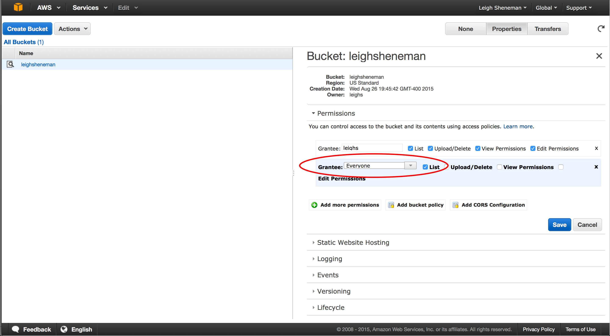

==================================
Achieving Reproducibility with AWS
==================================

Introduction and goals
======================
A typical bioinformatics pipeline consists of several independent software packages and datasets. As scientists we have a responsibility to produce results that reviewers and our peers can reproduce.

Amazon offers a number of services that make sharing our working environment easy. Here we will walk through the using three of theses services.

:author: Leigh Sheneman, Michigan State University
:date: Aug 27, 2015

.. contents::

Getting Started
===============
For this tutorial we need to set up an Amazon EC-2 instance, see :doc:`amazon/start-up-an-ec2-instance`. 

Switching to root
~~~~~~~~~~~~~~~~~

Start by making sure you're the superuser, root::

   sudo bash

Installing the software on the machine
~~~~~~~~~~~~~~~~~~~~~~~~~~~~~~~~~~~~~~

The first thing you want to do is to update the instance operating system and install software that is required for your pipeline. 

For the our purposes I am going to borrow a set of software from the The Eel Pond mRNAseq Protocol by C. Titus Brown, et al. ( https://khmer-protocols.readthedocs.org/ )

Copy and paste the following two commands::

   apt-get update
   apt-get -y install screen git curl gcc make g++ python-dev unzip \
           default-jre pkg-config libncurses5-dev r-base-core \
           r-cran-gplots python-matplotlib sysstat samtools python-pip

Sharing the OS Configuration
============================

Sometimes simply being on a different brand or model of computer then the original authors of a paper can often cause a pipeline to fail. Amazon gives users a way to save the current state of an instance so that you can come back to it or even share it using custom built AMIs.

The following series of screen shots will take you through creating a custom AMI.

In the instances group:

In the AMI group:

After the AMI is public, it takes a little while for it to be visible to all users. We will check back on this a little later on.

Data Sharing
============

Now a custom AMI has been setup for the project, distribution of the data can be addressed. Amazon provides two excellent ways to address this: snapshots and simple storage service.

Snapshots
~~~~~~~~~

Snapshots are very similar to AMI’s in that the data is stored on EC2. They can be shared between users are publicly. 

The following steps can be preformed in the snapshot portion of the EC2 dashboard.

Once we have the volume attached, we can download some data to it. To mount the drive and download sample data (again borrowed from The Eel Pond Protocol), run:: 

	sudo bash
	mkfs -t ext4 /dev/xvdf
	mkdir /data
	mount /dev/xvdf /data
	cd /data
	curl -O http://athyra.idyll.org/~t/mrnaseq-subset.tar
	tar xvf mrnaseq-subset.tar

The process for making the snapshot public is the same as we did with AMI. This too will take a bit to become visible. 

In the meantime, the AMI should now be visible to the public. Take a moment to see if you can find your neighbor’s AMI! 

Amazon S3
~~~~~~~~~

At this point we have made both the OS configuration and the data available to our fellow EC-2 users. However, we may have peers who prefer to run your experiment in an external cluster. GitHub is great for small datasets, but what is available for larger files?

There are many options to share files across the internet, and AWS offers another convenient way to make sure no one goes with out data! The service, S3, allows users to upload files that can be accessed via command line, ftp or web console. 

The following steps are to be performed by clicking the Services  S3 link on the Amazon header.

To access the code, you can go to any computer with wget installed and type::

	wget http://s3.amazonaws.com/leighsheneman/evalPhi5.sh

By combining these three options with well written scripts, we now have a reliable way to ensure reproducibility across the globe. For my own workflow, I strive to minimize user error by automating as many scripts as possible. This allows even a novice user to run replicates of my research. 

